**宜立方商城**

**第二天**

课程计划
========

第二天：商品列表功能实现

1.  服务中间件dubbo

2.  工程改造为基于soa架构

3.  商品列表查询功能实现。

将工程改造为SOA架构
===================

分析
----

由于宜立方商城是基于soa的架构，表现层和服务层是不同的工程。所以要实现商品列表查询需要两个系统之间进行通信。

如何实现远程通信？

1、Webservice：效率不高基于soap协议。项目中不推荐使用。

2、使用restful形式的服务：http+json。很多项目中应用。如果服务太多，服务之间调用关系混乱，需要治疗服务。

3、使用dubbo。使用rpc协议进行远程调用，直接使用socket通信。传输效率高，并且可以统计出系统之间的调用关系、调用次数。

dubbo
-----

### 什么是dubbo

随着互联网的发展，网站应用的规模不断扩大，常规的垂直应用架构已无法应对，分布式服务架构以及流动计算架构势在必行，亟需一个治理系统确保架构有条不紊的演进。

-   **单一应用架构**

    -   当网站流量很小时，只需一个应用，将所有功能都部署在一起，以减少部署节点和成本。

    -   此时，用于简化增删改查工作量的 **数据访问框架(ORM)** 是关键。

-   **垂直应用架构**

    -   当访问量逐渐增大，单一应用增加机器带来的加速度越来越小，将应用拆成互不相干的几个应用，以提升效率。

    -   此时，用于加速前端页面开发的 **Web框架(MVC)** 是关键。

-   **分布式服务架构**

    -   当垂直应用越来越多，应用之间交互不可避免，将核心业务抽取出来，作为独立的服务，逐渐形成稳定的服务中心，使前端应用能更快速的响应多变的市场需求。

    -   此时，用于提高业务复用及整合的 **分布式服务框架(RPC)** 是关键。

-   **流动计算架构**

    -   当服务越来越多，容量的评估，小服务资源的浪费等问题逐渐显现，此时需增加一个调度中心基于访问压力实时管理集群容量，提高集群利用率。

    -   此时，用于提高机器利用率的 **资源调度和治理中心(SOA)** 是关键。

Dubbo就是**资源调度和治理中心的管理工具。**

### Dubbo的架构

**节点角色说明：**

-   **Provider:** 暴露服务的服务提供方。

-   **Consumer:** 调用远程服务的服务消费方。

-   **Registry:** 服务注册与发现的注册中心。

-   **Monitor:** 统计服务的调用次调和调用时间的监控中心。

-   **Container:** 服务运行容器。

**调用关系说明：**

-   0. 服务容器负责启动，加载，运行服务提供者。

-   1. 服务提供者在启动时，向注册中心注册自己提供的服务。

-   2. 服务消费者在启动时，向注册中心订阅自己所需的服务。

-   3.
    注册中心返回服务提供者地址列表给消费者，如果有变更，注册中心将基于长连接推送变更数据给消费者。

-   4.
    服务消费者，从提供者地址列表中，基于软负载均衡算法，选一台提供者进行调用，如果调用失败，再选另一台调用。

-   5.
    服务消费者和提供者，在内存中累计调用次数和调用时间，定时每分钟发送一次统计数据到监控中心。

### 使用方法

Dubbo采用全Spring配置方式，透明化接入应用，对应用没有任何API侵入，只需用Spring加载Dubbo的配置即可，Dubbo基于Spring的Schema扩展进行加载。

**单一工程中spring的配置**

| \<bean id="xxxService" class="com.xxx.XxxServiceImpl" /\> \<bean id="xxxAction" class="com.xxx.XxxAction"\> \<property name="xxxService" ref="xxxService" /\> \</bean\> |
|-------------------------------------------------------------------------------------------------------------------------------------------------------------------------|

**远程服务：**

在本地服务的基础上，只需做简单配置，即可完成远程化：

将上面的local.xml配置拆分成两份，将服务定义部分放在服务提供方remote-provider.xml，将服务引用部分放在服务消费方remote-consumer.xml。

并在提供方增加暴露服务配置\<dubbo:service\>，在消费方增加引用服务配置\<dubbo:reference\>。

发布服务：

| \<!-- 和本地服务一样实现远程服务 --\> \<bean id="xxxService" class="com.xxx.XxxServiceImpl" /\> \<!-- 增加暴露远程服务配置 --\> \<dubbo:service interface="com.xxx.XxxService" ref="xxxService" /\> |
|-----------------------------------------------------------------------------------------------------------------------------------------------------------------------------------------------------|

接口一定要相同

调用服务：

| \<!-- 增加引用远程服务配置 --\> \<dubbo:reference id="xxxService" interface="com.xxx.XxxService" /\> \<!-- 和本地服务一样使用远程服务 --\> \<bean id="xxxAction" class="com.xxx.XxxAction"\> \<property name="xxxService" ref="xxxService" /\> \</bean\> |
|----------------------------------------------------------------------------------------------------------------------------------------------------------------------------------------------------------------------------------------------------------|

注册中心
--------

### Zookeeper介绍

官方推荐使用zookeeper注册中心。

注册中心负责服务地址的注册与查找，相当于目录服务，服务提供者和消费者只在启动时与注册中心交互，注册中心不转发请求，压力较小。使用dubbo-2.3.3以上版本，建议使用zookeeper注册中心。

Zookeeper是Apacahe
Hadoop的子项目，是一个树型的目录服务，支持变更推送，适合作为Dubbo服务的注册中心，工业强度较高，可用于生产环境，并推荐使用

Zookeeper：

1.  可以作为集群的管理工具使用。

2.  可以集中管理配置文件。

### Zookeeper的安装

安装环境：

Linux：centos6.4

Jdk:1.7以上版本

Zookeeper是java开发的可以运行在windows、linux环境。需要先安装jdk。

安装步骤：

第一步：安装jdk

第二步：把zookeeper的压缩包上传到linux系统。

第三步：解压缩压缩包

tar -zxvf zookeeper-3.4.6.tar.gz

第四步：进入zookeeper-3.4.6目录，创建data文件夹。

\---------:将data目录复制拿出来 （cd data -\> pwd(查看当前目录) 复制目录便于修改
zoo.cfg中的dataDir属性）

第五步：（进入conf目录）把zoo_sample.cfg改名为zoo.cfg ？？？？？？

[root\@localhost conf]\# mv zoo_sample.cfg zoo.cfg

\--------：改名之后编辑 vim zoo.cfg （进入后按键i 进入编辑模式 编辑完成后按键
esc退出编辑模式 ：wq 保存并退出(q! 退出不保存) ）

第六步：修改data属性：dataDir=/root/zookeeper-3.4.6/data

第七步：启动zookeeper

[root\@localhost bin]\# ./zkServer.sh start

JMX enabled by default

Using config: /usr/local/zookeeper-3.4.6/bin/../conf/zoo.cfg

Mode: standalone

[root\@localhost bin]\# ./zkServer.sh status（查看当前状态）

JMX enabled by default

Using config: /usr/local/zookeeper-3.4.6/bin/../conf/zoo.cfg

Mode: standalone（启动成功）
如果不能成功启动zookeeper，需要删除data目录下的zookeeper_server.pid文件。

关闭：[root\@localhost bin]\# ./zkServer.sh stop

查看状态：[root\@localhost bin]\# ./zkServer.sh status

**注意：需要关闭防火墙。**

service iptables stop

永久关闭修改配置开机不启动防火墙：

chkconfig iptables off

如果不能成功启动zookeeper，需要删除data目录下的zookeeper_server.pid文件。

工程改造
--------

### 拆分工程

1）将表现层工程独立出来：

e3-manager-web

2）将原来的e3-manager改为如下结构

e3-manager

\|--e3-manager-dao

\|--e3-manager-interface

\|--e3-manager-pojo

\|--e3-manager-service（打包方式改为war）

### 服务层工程

第一步：把e3-manager的pom文件中删除e3-manager-web模块。

第二步：把e3-manager-web文件夹移动到e3-manager同一级目录。

第三步：e3-manager-service的pom文件修改打包方式

\<packaging\>war\</packaging\>

第四步：在e3-manager-service工程中添加web.xml文件

第五步：把e3-manager-web的配置文件复制到e3-manager-service中。

>   删除springmvc.xml

第六步：web.xml 中只配置spring容器。删除前端控制器

第七步：发布服务

1.  在e3-manager-Service工程中添加dubbo依赖的jar包。

| \<!-- *dubbo*相关 --\> \<dependency\> \<groupId\>com.alibaba\</groupId\> \<artifactId\>*dubbo*\</artifactId\> \<exclusions\> \<exclusion\> \<groupId\>org.springframework\</groupId\> \<artifactId\>spring\</artifactId\> \</exclusion\> \<exclusion\> \<groupId\>org.jboss.netty\</groupId\> \<artifactId\>*netty*\</artifactId\> \</exclusion\> \</exclusions\> \</dependency\> \<dependency\> \<groupId\>org.apache.zookeeper\</groupId\> \<artifactId\>*zookeeper*\</artifactId\> \</dependency\> \<dependency\> \<groupId\>com.github.sgroschupf\</groupId\> \<artifactId\>*zkclient*\</artifactId\> \</dependency\> |
|---------------------------------------------------------------------------------------------------------------------------------------------------------------------------------------------------------------------------------------------------------------------------------------------------------------------------------------------------------------------------------------------------------------------------------------------------------------------------------------------------------------------------------------------------------------------------------------------------------------------------|

2.  在spring的配置文件中添加dubbo的约束，然后使用dubbo:service发布服务。（自己配置spring约束
    不配置约束项目将会报错 double连接网络也是找不到的 配置约束的方法

1.首先window--\>preference--\>搜索 xml catalog ,点击进入--\>点击add--\>点击File
system找到自己xsd约束文件 springday02中有详细图解 ）

| \<?xml version=*"1.0"* encoding=*"UTF-8"*?\> \<beans xmlns=*"http://www.springframework.org/schema/beans"* xmlns:context=*"http://www.springframework.org/schema/context"* xmlns:p=*"http://www.springframework.org/schema/p"* xmlns:aop=*"http://www.springframework.org/schema/aop"* xmlns:tx=*"http://www.springframework.org/schema/tx"* xmlns:dubbo=*"http://code.alibabatech.com/schema/dubbo"* xmlns:xsi=*"http://www.w3.org/2001/XMLSchema-instance"* xsi:schemaLocation=*"http://www.springframework.org/schema/beans http://www.springframework.org/schema/beans/spring-beans-4.2.xsd http://www.springframework.org/schema/context http://www.springframework.org/schema/context/spring-context-4.2.xsd http://www.springframework.org/schema/aop http://www.springframework.org/schema/aop/spring-aop-4.2.xsd http://www.springframework.org/schema/tx http://www.springframework.org/schema/tx/spring-tx-4.2.xsd http://code.alibabatech.com/schema/dubbo http://code.alibabatech.com/schema/dubbo/dubbo.xsd http://www.springframework.org/schema/util http://www.springframework.org/schema/util/spring-util-4.2.xsd"*\> *\<!*-- 配置包扫描器 --\> \<context:component-scan base-package="cn.e3mall.service"/\> \<!-- 使用dubbo发布服务 --\> \<!-- 提供方应用信息，用于计算依赖关系 address：本机地址（dubbo配置的地址 就是Linux虚拟机的IP地址） --\> \<dubbo:application name="e3-manager" /\> \<dubbo:registry protocol="zookeeper" address="192.168.19.128:2181" /\> \<!-- 用dubbo协议在20880端口暴露服务 --\> \<dubbo:protocol name="dubbo" port="20880" /\> \<!-- 声明需要暴露的服务接口 --\> \<dubbo:service interface="cn.e3mall.service.ItemService" ref="itemServiceImpl" timeout="600000"/\> *\<!--* \<!-- 使用*dubbo*发布服务 --\> \<!-- 提供方应用信息，用于计算依赖关系 这种方法是集群 的配置方法--\> \<dubbo:application name=*"e3-manager"* /\> \<dubbo:registry protocol="*zookeeper*" address="192.168.25.154:2181,192.168.25.154:2182,192.168.25.154:2183" /\> \<!-- 用*dubbo*协议在20880端口暴露服务 --\> \<dubbo:protocol name=*"dubbo"* port=*"20880"* /\> \<!-- 声明需要暴露的服务接口 --\> \<dubbo:service interface=*"cn.e3mall.service.ItemService"* ref=*"itemServiceImpl"* /\> *--\>* \</beans\> |
|--------------------------------------------------------------------------------------------------------------------------------------------------------------------------------------------------------------------------------------------------------------------------------------------------------------------------------------------------------------------------------------------------------------------------------------------------------------------------------------------------------------------------------------------------------------------------------------------------------------------------------------------------------------------------------------------------------------------------------------------------------------------------------------------------------------------------------------------------------------------------------------------------------------------------------------------------------------------------------------------------------------------------------------------------------------------------------------------------------------------------------------------------------------------------------------------------------------------------------------------------------------------------------------------------------------------------------------------------------------------------------------------------------------------------------------------------------------------------------------------------------------------------------------------------------------------------------------------------------------------------------------------------------------------------------------------------------------------------------------------------------------------------------------------------------------------------------------------------------------------------------------------------------------------------------------------------------------------------------------------------------------------------------------------------------------------------------------------------------------------------------------------------------------------------------------------------------------------------------------------|

### 表现层工程

改造e3-manager-web工程。

第一步：删除mybatis、和spring的配置文件。只保留springmvc.xml

第二步：修改e3-manager-web的pom文件，

1.  修改parent为e3-parent

2.  添加spring和springmvc的jar包的依赖

3.  删除e3-mangager-service的依赖

4.  添加dubbo的依赖

| \<!-- *dubbo*相关 --\> \<dependency\> \<groupId\>com.alibaba\</groupId\> \<artifactId\>*dubbo*\</artifactId\> \<exclusions\> \<exclusion\> \<groupId\>org.springframework\</groupId\> \<artifactId\>spring\</artifactId\> \</exclusion\> \<exclusion\> \<groupId\>org.jboss.netty\</groupId\> \<artifactId\>*netty*\</artifactId\> \</exclusion\> \</exclusions\> \</dependency\> \<dependency\> \<groupId\>org.apache.zookeeper\</groupId\> \<artifactId\>*zookeeper*\</artifactId\> \</dependency\> \<dependency\> \<groupId\>com.github.sgroschupf\</groupId\> \<artifactId\>*zkclient*\</artifactId\> \</dependency\> |
|---------------------------------------------------------------------------------------------------------------------------------------------------------------------------------------------------------------------------------------------------------------------------------------------------------------------------------------------------------------------------------------------------------------------------------------------------------------------------------------------------------------------------------------------------------------------------------------------------------------------------|

5、e3-mangager-web添加对e3-manager-Interface的依赖。

第三步：修改springmvc.xml，在springmvc的配置文件中添加服务的引用。

| \<?xml version=*"1.0"* encoding=*"UTF-8"*?\> \<beans xmlns=*"http://www.springframework.org/schema/beans"* xmlns:xsi=*"http://www.w3.org/2001/XMLSchema-instance"* xmlns:p=*"http://www.springframework.org/schema/p"* xmlns:context=*"http://www.springframework.org/schema/context"* xmlns:dubbo=*"http://code.alibabatech.com/schema/dubbo"* xmlns:mvc=*"http://www.springframework.org/schema/mvc"* xsi:schemaLocation=*"http://www.springframework.org/schema/beans http://www.springframework.org/schema/beans/spring-beans-4.2.xsd http://www.springframework.org/schema/mvc http://www.springframework.org/schema/mvc/spring-mvc-4.2.xsd http://code.alibabatech.com/schema/dubbo http://code.alibabatech.com/schema/dubbo/dubbo.xsd http://www.springframework.org/schema/context http://www.springframework.org/schema/context/spring-context-4.2.xsd"*\> \<context:component-scan base-package=*"cn.e3mall.controller"* /\> \<mvc:annotation-driven /\> \<bean class=*"org.springframework.web.servlet.view.InternalResourceViewResolver"*\> \<property name=*"prefix"* value=*"/WEB-INF/jsp/"* /\> \<property name=*"suffix"* value=*".jsp"* /\> \</bean\> \<context:component-scan base-package=*"cn.e3mall.controller"* /\> \<mvc:annotation-driven /\> \<bean class=*"org.springframework.web.servlet.view.InternalResourceViewResolver"*\> \<property name=*"prefix"* value=*"/WEB-INF/jsp/"* /\> \<property name=*"suffix"* value=*".jsp"* /\> \</bean\> \<!-- 配置资源映射 --\> \<mvc:resources location=*"/css/"* mapping=*"/css/\*\*"*/\> \<mvc:resources location=*"/js/"* mapping=*"/js/\*\*"*/\> \<!-- 引用*dubbo*服务 --\> \<dubbo:application name=*"e3-manager-web"*\>\</dubbo:application\> \<dubbo:registry protocol=*"zookeeper"* address=*"192.168.19.128:2181"*/\> \<dubbo:reference interface=*"cn.e3mall.service.ItemService"* id=*"itemService"* /\> \<!-- /\*\*\*\*\*\*\*\*\*\*\*\*\*\*\*\*\*\*\*\*\*\*\*\*\*\*\*\*\*\*\*\*\*\*\*\*\*\*\*\*\*\*\*\*\*\*\*\*\*\*/--\> \<!-- 引用*dubbo*服务 --\> \<dubbo:application name=*"e3-manager-web"*/\> \<!-- 连接注册中心 --\> \<dubbo:registry protocol="*zookeeper*" address="192.168.25.154:2181,192.168.25.154:2182,192.168.25.154:2183"/\> \<dubbo:reference interface=*"cn.e3mall.service.ItemService"* id=*"itemService"* /\> \</beans\> |
|----------------------------------------------------------------------------------------------------------------------------------------------------------------------------------------------------------------------------------------------------------------------------------------------------------------------------------------------------------------------------------------------------------------------------------------------------------------------------------------------------------------------------------------------------------------------------------------------------------------------------------------------------------------------------------------------------------------------------------------------------------------------------------------------------------------------------------------------------------------------------------------------------------------------------------------------------------------------------------------------------------------------------------------------------------------------------------------------------------------------------------------------------------------------------------------------------------------------------------------------------------------------------------------------------------------------------------------------------------------------------------------------------------------------------------------------------------------------------------------------------------------------------------------------------------------------------------------------------------------------------------------------------------------------------------------------------------------------------------------------------------------------------------------------------------------------------------------------------------------------------------------------------------------------------------------------------------------------------------------------------------------------------------------------------------------------------------------------------------------------------------------------------------------------------------------------------------------------------------------------------------------------------------------------------------------------------|

第四步：在e3-manager-web工程中添加tomcat插件配置。

| \<build\> \<plugins\> \<!-- 配置*Tomcat*插件 --\> \<plugin\> \<groupId\>org.apache.tomcat.maven\</groupId\> \<artifactId\>tomcat7-*maven*-*plugin*\</artifactId\> \<configuration\> \<path\>/\</path\> \<port\>8081\</port\> \</configuration\> \</plugin\> \</plugins\> \</build\> |
|-------------------------------------------------------------------------------------------------------------------------------------------------------------------------------------------------------------------------------------------------------------------------------------|

Dubbo监控中心
-------------

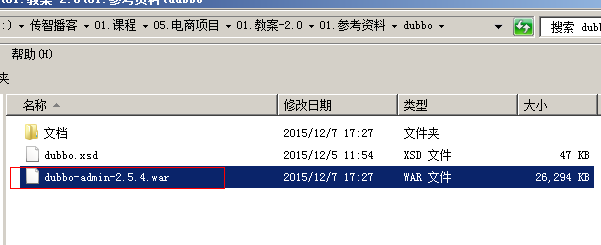

需要安装tomcat，然后部署监控中心即可。

1、部署监控中心：

[root\@localhost \~]\# cp dubbo-admin-2.5.4.war
apache-tomcat-7.0.47/webapps/dubbo-admin.war

1.  启动tomcat

2.  访问http://192.168.25.167:8080/dubbo-admin/

用户名：root

密码：root

如果监控中心和注册中心在同一台服务器上，可以不需要任何配置。

如果不在同一台服务器，需要修改配置文件：

/root/apache-tomcat-7.0.47/webapps/dubbo-admin/WEB-INF/dubbo.properties

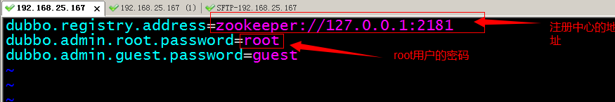

商品列表查询
============

展示后台首页
------------

### 功能分析

请求的url：/

参数：无

返回值：逻辑视图String

### Controller

| \@Controller **public class** PageController { \@RequestMapping("/") **public** String showIndex() { **return** "index"; } \@RequestMapping("/{page}") **public** String showPage(\@PathVariable String page) { **return** page; } } |
|--------------------------------------------------------------------------------------------------------------------------------------------------------------------------------------------------------------------------------------|

功能分析
--------

### 整合静态页面

静态页面位置：02.第二天（三大框架整合，后台系统搭建）\\01.参考资料\\后台管理系统静态页面

**使用方法:**

把静态页面添加到e3-manager-web工程中的WEB-INF下：

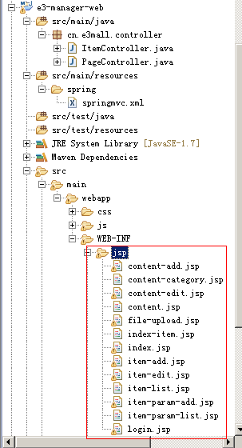

由于在web.xml中定义的url拦截形式为“/”表示拦截所有的url请求，包括静态资源例如css、js等。所以需要在springmvc.xml中添加资源映射标签：(重要！不然访问的首页没有样式)

| \<mvc:resources location=*"/WEB-INF/js/"* mapping=*"/js/\*\*"*/\> \<mvc:resources location=*"/WEB-INF/css/"* mapping=*"/css/\*\*"*/\> |
|---------------------------------------------------------------------------------------------------------------------------------------|

### 商品列表页面

开始的时候会只有左边的根目录 写controller层的时候有技巧

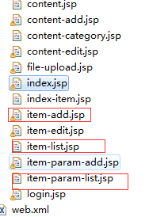

| \<li\> \<span\>商品管理\</span\> \<ul\> \<li *data-options*=*"attributes:{'url':'item-add'}"*\>新增商品\</li\> \<li *data-options*=*"attributes:{'url':'item-list'}"*\>查询商品\</li\> \<li *data-options*=*"attributes:{'url':'item-param-list'}"*\>规格参数\</li\> \</ul\> \</li\> |
|--------------------------------------------------------------------------------------------------------------------------------------------------------------------------------------------------------------------------------------------------------------------------------------|

\@RequestMapping("/{page}")//从URL中取出page参数

**public** String showPage(\@PathVariable String page) {//响应的是逻辑视图所以用
string 从路径中取出

**return** page; 响应谁就返回请求的jsp

}

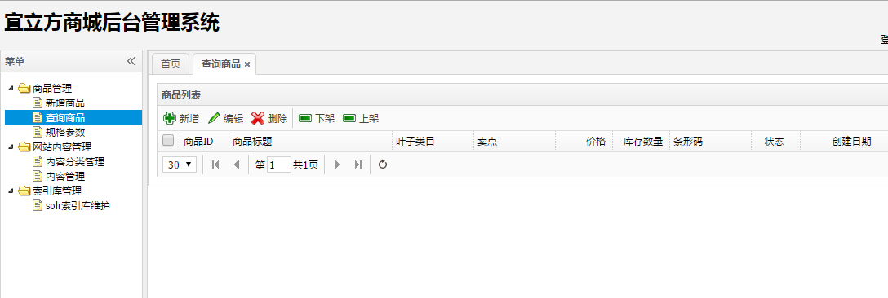

**对应的jsp为**：

item-list.jsp

**请求的url：**

/item/list

**请求的参数：**

page=1&rows=30 page：当前的页码 rows：每页显示的记录数

**响应的json数据格式：**

Easyui中datagrid控件要求的数据格式为：

{total:”2”,rows:[{“id”:”1”,”name”:”张三”},{“id”:”2”,”name”:”李四”}]}

Total：查询结果一共查询了多少条数据 rows：当前页中显示的结果集

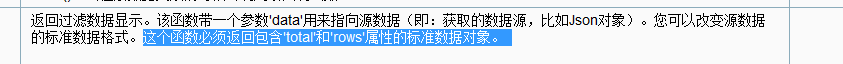

### 响应的json数据格式EasyUIResult

| **public class** EasyUIDataGridResult { **private** Integer total; **private** List\<?\> rows;//有可能是商品列表也有可能是用户列表所以就不加泛型 **private** List rows； **public** EasyUIResult(Integer total, List\<?\> rows) { **this**.total = total; **this**.rows = rows; } **public** EasyUIResult(Long total, List\<?\> rows) { **this**.total = total.intValue(); **this**.rows = rows; } **public** Integer getTotal() { **return** total; } **public void** setTotal(Integer total) { **this**.total = total; } **public** List\<?\> getRows() { **return** rows; } **public void** setRows(List\<?\> rows) { **this**.rows = rows; } } |
|----------------------------------------------------------------------------------------------------------------------------------------------------------------------------------------------------------------------------------------------------------------------------------------------------------------------------------------------------------------------------------------------------------------------------------------------------------------------------------------------------------------------------------------------------------------------------------------------------------------------------------------------------|

### 分页处理

逆向工程生成的代码是不支持分页处理的，如果想进行分页需要自己编写mapper，这样就失去逆向工程的意义了。为了提高开发效率可以使用mybatis的分页插件PageHelper。

分页插件PageHelper(逆向工程产生的Mapper.Xml不支持分页 所以提供了一个分页助手)
-----------------------------------------------------------------------------

### Mybatis分页插件 - PageHelper说明

如果你也在用Mybatis，建议尝试该分页插件，这个一定是最方便使用的分页插件。

该插件目前支持Oracle,Mysql,MariaDB,SQLite,Hsqldb,PostgreSQL六种数据库分页。

### 使用方法

第一步：把PageHelper依赖的jar包添加到工程中。官方提供的代码对逆向工程支持的不好(如果使用官方的只要分页的时候就会报错)，使用老师提供的参考资料中的pagehelper-fix。

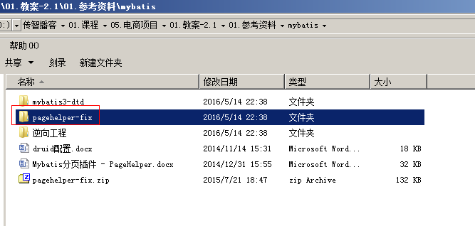

第二步：在Mybatis配置xml中配置拦截器插件（sqlmapconfig.xml）:

\<plugins\>

\<!--1.配置拦截器 com.github.pagehelper为PageHelper类所在包名 --\>

\<plugin interceptor="com.github.pagehelper.PageHelper"\>

\<!-- 2.配置方言 设置数据库类型
Oracle,Mysql,MariaDB,SQLite,Hsqldb,PostgreSQL六种数据库 --\>

\<property name="dialect" value="mysql"/\>

\</plugin\>

\</plugins\>

第二步：在代码中使用

1、设置分页信息：

//获取第1页，10条内容，默认查询总数count

PageHelper.startPage(1, 10);

//紧跟着的第一个select方法会被分页

List\<Country\> list = countryMapper.selectIf(1);

2、取分页信息

//分页后，实际返回的结果list类型是Page\<E\>，如果想取出分页信息，需要强制转换为Page\<E\>，

Page\<Country\> listCountry = (Page\<Country\>)list;

listCountry.getTotal();

1.  取分页信息的第二种方法

//获取第1页，10条内容，默认查询总数count

PageHelper.startPage(1, 10);

List\<Country\> list = countryMapper.selectAll();

//用PageInfo对结果进行包装

PageInfo page = new PageInfo(list);

//测试PageInfo全部属性

//PageInfo包含了非常全面的分页属性

assertEquals(1, page.getPageNum());

assertEquals(10, page.getPageSize());

assertEquals(1, page.getStartRow());

assertEquals(10, page.getEndRow());

assertEquals(183, page.getTotal());

assertEquals(19, page.getPages());

assertEquals(1, page.getFirstPage());

assertEquals(8, page.getLastPage());

assertEquals(true, page.isFirstPage());

assertEquals(false, page.isLastPage());

assertEquals(false, page.isHasPreviousPage());

assertEquals(true, page.isHasNextPage());

### 分页测试

| **public class** PageHelperTest { \@Test **public void** testPageHelper() **throws** Exception { //初始化spring容器 ApplicationContext *applicationContext* = **new** ClassPathXmlApplicationContext("classpath:spring/applicationContext-dao.xml"); //从容器中获得*Mapper*代理对象 TbItemMapper itemMapper = applicationContext.getBean(TbItemMapper.**class**); //执行*sql*语句之前设置分页信息使用PageHelper的startPage方法。 PageHelper.*startPage*(1, 10); //执行查询 TbItemExample example = **new** TbItemExample(); List\<TbItem\> list = itemMapper.selectByExample(example); //取分页信息，PageInfo。1、总记录数2、总页数 。当前页码 PageInfo\<TbItem\> pageInfo = **new** PageInfo\<\>(list); System.*out*.println(pageInfo.getTotal());//1、总记录数 System.*out*.println(pageInfo.getPages());//2、总页数 System.*out*.println(list.size());//3.当前页有多少条 //打印结果 934 94 10 } } |
|------------------------------------------------------------------------------------------------------------------------------------------------------------------------------------------------------------------------------------------------------------------------------------------------------------------------------------------------------------------------------------------------------------------------------------------------------------------------------------------------------------------------------------------------------------------------------------------------------------------------------------------------------------------------------------------------------------------------------------------------------------------------------------------------------------------------------------------------------------------------------------------------------|

分页搞定以后就不用写dao了

Service层
---------

参数：int page ，int rows

业务逻辑：查询所有商品列表，要进行分页处理。

返回值：EasyUIDataGridResult

| \@Override **public** EasyUIDataGridResult getItemList(**int** page, **int** rows) { //设置分页信息 PageHelper.*startPage*(page, rows); //执行查询 TbItemExample example = **new** TbItemExample(); List\<TbItem\> list = itemMapper.selectByExample(example); //取分页信息 PageInfo\<TbItem\> pageInfo = **new** PageInfo\<\>(list); //创建返回结果对象 EasyUIDataGridResult result = **new** EasyUIDataGridResult(); result.setTotal(pageInfo.getTotal()); result.setRows(list); **return** result; } |
|---------------------------------------------------------------------------------------------------------------------------------------------------------------------------------------------------------------------------------------------------------------------------------------------------------------------------------------------------------------------------------------------------------------------------------------------------------------------------------------------------------|

### 发布服务

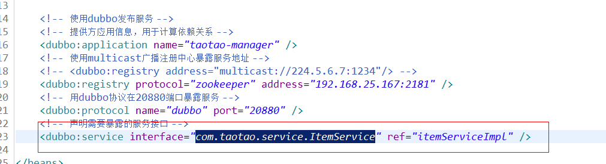

表现层
------

引用服务：

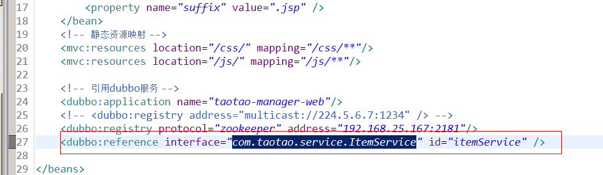

1、初始化表格请求的url：/item/list

2、Datagrid默认请求参数：

1.  page：当前的页码，从1开始。

2.  rows：每页显示的记录数。

3.  响应的数据：json数据。EasyUIDataGridResult

| \@RequestMapping("/item/list") \@ResponseBody **public** EasyUIDataGridResult getItemList(Integer page, Integer rows) { EasyUIDataGridResult result = itemService.getItemList(page, rows); **return** result; } |
|-----------------------------------------------------------------------------------------------------------------------------------------------------------------------------------------------------------------|

可以设置服务超时时间：

服务调用超时时间默认1秒，

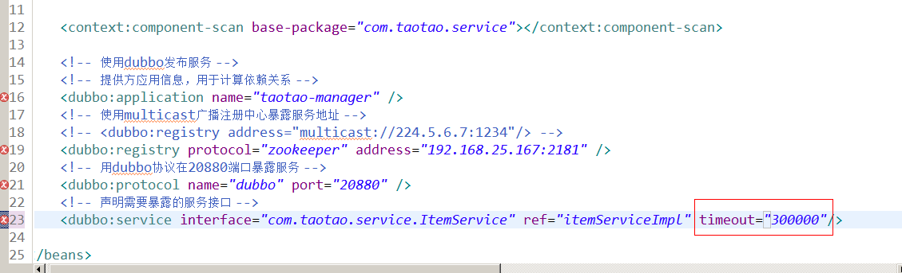

Debug设置源代码：

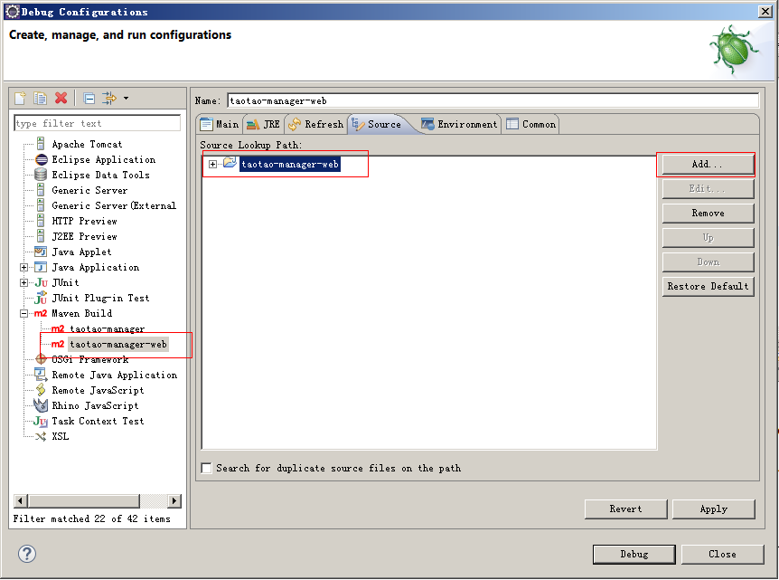

安装maven工程跳过测试
---------------------

clean install -DskipTests
