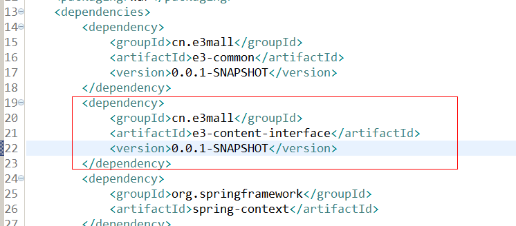
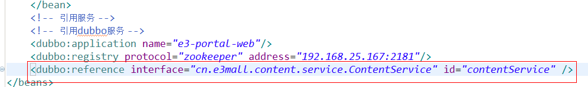
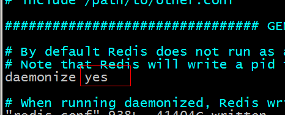
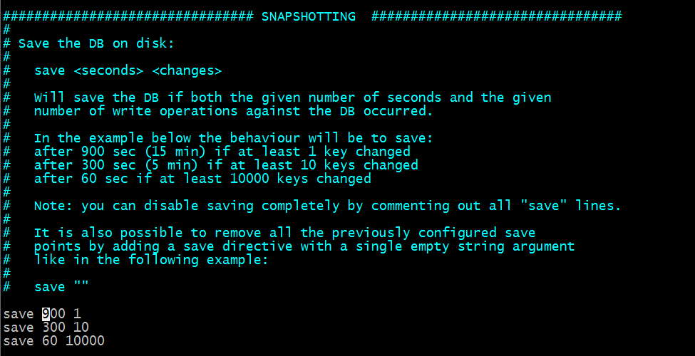
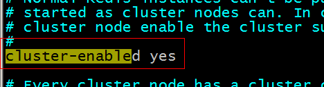

**宜立方商城**

**第六天**

1.课程计划
========

1.  首页轮播图展示

2.  Redis服务器搭建

3.  向业务逻辑中添加缓存。

4.  使用redis做缓存

5.  缓存同步。

6.  Solr服务器安装

2.首页轮播图动态展示
==================

2.1.功能分析
--------

根据分类id查询内容列表，把内容展示到首页。  
  
内容分类id需要是固定的。可以配置到属性文件中。  
  
展示首页之前，先查询内容列表，然后展示到首页。  
  
2.2.Dao层  
-----  

单表查询。可以使用逆向工程。  

2.3.Service层  
---------  
参数：内容分类id  
返回值：List\<TbContent\>  
业务逻辑：  
根据分类id查询内容列表。
```java
@Override
	public List<TbContent> getContentList(long cid) {
		//根据分类id查询内容列表
		//设置查询条件
		TbContentExample example = new TbContentExample();
		Criteria criteria = example.createCriteria();
		criteria.andCategoryIdEqualTo(cid);
		//执行查询
		List<TbContent> list = contentMapper.selectByExample(example);
		return list;
	}
```
     
     
需要把接口安装到本地仓库。

2.4.表现层
------

引用服务：



Springmvc.xml中添加引用：



需要在展示首页的Controller中添加业务逻辑。

#### 3.Redis的安装
===========

3.1.Redis的安装
-----------

Redis是c语言开发的。

安装redis需要c语言的编译环境。如果没有gcc需要在线安装。yum install gcc-c++

安装步骤：

第一步：redis的源码包上传到linux系统。

第二步：解压缩redis。

第三步：编译。进入redis源码目录。make

第四步：安装。make install PREFIX=/usr/local/redis

PREFIX参数指定redis的安装目录。一般软件安装到/usr目录下

3.2.连接redis
---------

**3.2.1.redis的启动：**

前端启动：在redis的安装目录下直接启动redis-server

[root\@localhost bin]\# ./redis-server (ctrl+退出) 是前端启动

后台启动：（后端启动）

把/root/redis-3.0.0/redis.conf复制到/usr/local/redis/bin目录下

[root\@localhost redis-3.0.0]\# cp redis.conf /usr/local/redis/bin/

修改配置文件：[root\@localhost bin] vim redis.conf



[root\@localhost bin]\# ./redis-server redis.conf

查看redis进程：

[root\@localhost bin]\# ps aux\|grep redis

root 5190 0.1 0.3 33936 1712 ? Ssl 18:23 0:00 ./redis-server \*:6379

root 5196 0.0 0.1 4356 728 pts/0 S+ 18:24 0:00 grep redis

[root\@localhost bin]\#

3.2.2.Redis-cli

[root\@localhost bin]\# ./redis-cli

默认连接localhost运行在6379端口的redis服务。

[root\@localhost bin]\# ./redis-cli -h 192.168.25.153 -p 6379（连接远程的机器）

\-h：连接的服务器的地址

\-p：服务的端口号

ping健康检查 pong代表正常

关闭redis：[root\@localhost bin]\# ./redis-cli shutdown

3.3.Redis五种数据类型
-----------------

**String：key-value（做缓存）**

Redis中所有的数据都是字符串。命令不区分大小写，key是区分大小写的。Redis是单线程的。Redis中不适合保存内容大的数据。

get（取值）、set（存值）、（set str1 abc --\>ok get str1--\>”abc”）

incr：加一（生成id） 自增长

Decr：减一

**Hash：key-fields-values（做缓存）**

相当于一个key对于一个map，map中还有key-value

使用hash对key进行归类。

Hset：向hash中添加内容

Hget：从hash中取内容

List：有顺序可重复

192.168.25.153:6379\> lpush list1 a b c d

(integer) 4

192.168.25.153:6379\> lrange list1 0 -1

1) "d"

2) "c"

3) "b"

4) "a"

192.168.25.153:6379\> rpush list1 1 2 3 4

(integer) 8

192.168.25.153:6379\> lrange list1 0 -1

1) "d"

2) "c"

3) "b"

4) "a"

5) "1"

6) "2"

7) "3"

8) "4"

192.168.25.153:6379\>

192.168.25.153:6379\> lpop list1

"d"

192.168.25.153:6379\> lrange list1 0 -1

1) "c"

2) "b"

3) "a"

4) "1"

5) "2"

6) "3"

7) "4"

192.168.25.153:6379\> rpop list1

"4"

192.168.25.153:6379\> lrange list1 0 -1

1) "c"

2) "b"

3) "a"

4) "1"

5) "2"

6) "3"

192.168.25.153:6379\>

**Set：元素无顺序，不能重复**

192.168.25.153:6379\> sadd set1 a b c c c d

(integer) 4

192.168.25.153:6379\> smembers set1

1) "b"

2) "c"

3) "d"

4) "a"

192.168.25.153:6379\> srem set1 a

(integer) 1

192.168.25.153:6379\> smembers set1

1) "b"

2) "c"

3) "d"

192.168.25.153:6379\>

还有集合运算命令，自学。

**SortedSet（zset）：有顺序，不能重复**

192.168.25.153:6379\> zadd zset1 2 a 5 b 1 c 6 d

(integer) 4

192.168.25.153:6379\> zrange zset1 0 -1

1) "c"

2) "a"

3) "b"

4) "d"

192.168.25.153:6379\> zrem zset1 a

(integer) 1

192.168.25.153:6379\> zrange zset1 0 -1

1) "c"

2) "b"

3) "d"

192.168.25.153:6379\> zrevrange zset1 0 -1

1) "d"

2) "b"

3) "c"

192.168.25.153:6379\> zrange zset1 0 -1 withscores

1) "c"

2) "1"

3) "b"

4) "5"

5) "d"

6) "6"

192.168.25.153:6379\> zrevrange zset1 0 -1 withscores

1) "d"

2) "6"

3) "b"

4) "5"

5) "c"

6) "1"

192.168.25.153:6379\>

3.4.Key命令
-------

设置key的过期时间。

Expire key second：设置key的过期时间（应用场景电商活动）

Ttl key：查看key的有效期

Persist key：清除key的过期时间。Key持久化（留在key 让其持久化）。

192.168.25.153:6379\> expire Hello 100

(integer) 1

192.168.25.153:6379\> ttl Hello

(integer) 77

4.Redis的持久化方案
=================

Redis的所有数据都是保存到内存中的。

**1.RDB：** 快照形式，定期把内存中当前时刻的数据保存到磁盘。Redis默认支持的持久化方案。

**2.AOF：** 原理是将Reids的操作日志以追加的方式写入文件中。数据库恢复时把所有的命令执行一遍即可。

在redis.conf配置文件中配置。（将 appendonly no 改成yes就是开启了
rdb和aof可以同（第二种形式）：append only
file。把所有对redis数据库操作的命令，增删改操作时开启）

Rdb：



Aof的配置：


两种持久化方案同时开启使用aof文件来恢复数据库。

5.Redis集群的搭建
===============

5.1.redis-cluster架构图
-------------------


redis-cluster投票:容错

 


架构细节:

(1)所有的redis节点彼此互联(PING-PONG机制),内部使用二进制协议优化传输速度和带宽.

(2)节点的fail是通过集群中超过半数的节点检测失效时才生效.（至少3个节点）

(3)客户端与redis节点直连,不需要中间proxy层.客户端不需要连接集群所有节点,连接集群中任何一个可用节点即可

(4)redis-cluster把所有的物理节点映射到[0-16383]slot上,cluster
负责维护node\<-\>slot\<-\>value

Redis 集群中内置了 16384 个哈希槽，当需要在 Redis 集群中放置一个 key-value
时，redis 先对 key 使用 crc16 算法算出一个结果，然后把结果对 16384
求余数，这样每个 key 都会对应一个编号在 0-16383 之间的哈希槽，redis
会根据节点数量大致均等的将哈希槽映射到不同的节点

5.2.Redis集群的搭建
---------------

Redis集群中至少应该有三个节点。要保证集群的高可用，需要每个节点有一个备份机。

Redis集群至少需要6台服务器。

搭建伪分布式。可以使用一台虚拟机运行6个redis实例。需要修改redis的端口号（port）7001-7006

视屏里有讲怎么搭建6个（在redis.conf中 打开注释cluster-enabled yes 复制6个redis
修改port端口 打开注释）

**5.2.1集群搭建环境**

1、使用ruby脚本搭建集群。需要ruby的运行环境。

安装ruby

yum install ruby

yum install rubygems

1.  安装ruby脚本运行使用的包。

[root\@localhost \~]\# gem install redis-3.0.0.gem

Successfully installed redis-3.0.0

1 gem installed

Installing ri documentation for redis-3.0.0...

Installing RDoc documentation for redis-3.0.0...

[root\@localhost \~]\#

[root\@localhost \~]\# cd redis-3.0.0/src

[root\@localhost src]\# ll \*.rb

\-rwxrwxr-x. 1 root root 48141 Apr 1 2015 redis-trib.rb

**5.2.2.搭建步骤**

需要6台redis服务器。搭建伪分布式。

需要6个redis实例。

需要运行在不同的端口（port）7001-7006

第一步：创建6个redis实例，每个实例运行在不同的端口。需要修改redis.conf配置文件。配置文件中还需要把cluster-enabled
yes前的注释去掉。



第二步：启动每个redis实例。./start-all.sh(打开所有 内部已经配置好) ps aux\|greep
redis（查看状态）

第三步：使用ruby脚本搭建集群。

| ./redis-trib.rb create --replicas 1 192.168.25.162:7001 192.168.25.162:7002 192.168.25.162:7003 192.168.25.162:7004 192.168.25.162:7005 192.168.25.162:7006（注意端口162） |
|----------------------------------------------------------------------------------------------------------------------------------------------------------------------------|


创建关闭集群的脚本：

[root\@localhost redis-cluster]\# vim shutdow-all.sh

redis01/redis-cli -p 7001 shutdown

redis01/redis-cli -p 7002 shutdown

redis01/redis-cli -p 7003 shutdown

redis01/redis-cli -p 7004 shutdown

redis01/redis-cli -p 7005 shutdown

redis01/redis-cli -p 7006 shutdown

[root\@localhost redis-cluster]\# chmod u+x shutdow-all.sh

| [root\@localhost redis-cluster]\# ./redis-trib.rb create --replicas 1 192.168.25.162:7001 192.168.25.162:7002 192.168.25.162:7003 192.168.25.162:7004 192.168.25.162:7005 192.168.25.162:7006 \>\>\> Creating cluster Connecting to node 192.168.25.153:7001: OK Connecting to node 192.168.25.153:7002: OK Connecting to node 192.168.25.153:7003: OK Connecting to node 192.168.25.153:7004: OK Connecting to node 192.168.25.153:7005: OK Connecting to node 192.168.25.153:7006: OK \>\>\> Performing hash slots allocation on 6 nodes... Using 3 masters: 192.168.25.153:7001 192.168.25.153:7002 192.168.25.153:7003 Adding replica 192.168.25.153:7004 to 192.168.25.153:7001 Adding replica 192.168.25.153:7005 to 192.168.25.153:7002 Adding replica 192.168.25.153:7006 to 192.168.25.153:7003 M: 2e48ae301e9c32b04a7d4d92e15e98e78de8c1f3 192.168.25.153:7001 slots:0-5460 (5461 slots) master M: 8cd93a9a943b4ef851af6a03edd699a6061ace01 192.168.25.153:7002 slots:5461-10922 (5462 slots) master M: 2935007902d83f20b1253d7f43dae32aab9744e6 192.168.25.153:7003 slots:10923-16383 (5461 slots) master S: 74f9d9706f848471583929fc8bbde3c8e99e211b 192.168.25.153:7004 replicates 2e48ae301e9c32b04a7d4d92e15e98e78de8c1f3 S: 42cc9e25ebb19dda92591364c1df4b3a518b795b 192.168.25.153:7005 replicates 8cd93a9a943b4ef851af6a03edd699a6061ace01 S: 8b1b11d509d29659c2831e7a9f6469c060dfcd39 192.168.25.153:7006 replicates 2935007902d83f20b1253d7f43dae32aab9744e6 Can I set the above configuration? (type 'yes' to accept): yes \>\>\> Nodes configuration updated \>\>\> Assign a different config epoch to each node \>\>\> Sending CLUSTER MEET messages to join the cluster Waiting for the cluster to join..... \>\>\> Performing Cluster Check (using node 192.168.25.153:7001) M: 2e48ae301e9c32b04a7d4d92e15e98e78de8c1f3 192.168.25.153:7001 slots:0-5460 (5461 slots) master M: 8cd93a9a943b4ef851af6a03edd699a6061ace01 192.168.25.153:7002 slots:5461-10922 (5462 slots) master M: 2935007902d83f20b1253d7f43dae32aab9744e6 192.168.25.153:7003 slots:10923-16383 (5461 slots) master M: 74f9d9706f848471583929fc8bbde3c8e99e211b 192.168.25.153:7004 slots: (0 slots) master replicates 2e48ae301e9c32b04a7d4d92e15e98e78de8c1f3 M: 42cc9e25ebb19dda92591364c1df4b3a518b795b 192.168.25.153:7005 slots: (0 slots) master replicates 8cd93a9a943b4ef851af6a03edd699a6061ace01 M: 8b1b11d509d29659c2831e7a9f6469c060dfcd39 192.168.25.153:7006 slots: (0 slots) master replicates 2935007902d83f20b1253d7f43dae32aab9744e6 [OK] All nodes agree about slots configuration. \>\>\> Check for open slots... \>\>\> Check slots coverage... [OK] All 16384 slots covered. [root\@localhost redis-cluster]\# |
|-------------------------------------------------------------------------------------------------------------------------------------------------------------------------------------------------------------------------------------------------------------------------------------------------------------------------------------------------------------------------------------------------------------------------------------------------------------------------------------------------------------------------------------------------------------------------------------------------------------------------------------------------------------------------------------------------------------------------------------------------------------------------------------------------------------------------------------------------------------------------------------------------------------------------------------------------------------------------------------------------------------------------------------------------------------------------------------------------------------------------------------------------------------------------------------------------------------------------------------------------------------------------------------------------------------------------------------------------------------------------------------------------------------------------------------------------------------------------------------------------------------------------------------------------------------------------------------------------------------------------------------------------------------------------------------------------------------------------------------------------------------------------------------------------------------------------------------------------------------------------------------------------------------------------------------------------------------------------------------------------------------------------------------------------------------------------------------------------------------------------------------------------------------------------------------------------------------------------------------------------------------------------------------------------------------------------------------------------------------------------------------------------------------------------------------------------------------------------------------------------------------------------------------------------------------------------------------------------------------------------------------------------------------------------------------------------------------------------------------|


5.3.集群的使用方法
--------------

Redis-cli连接集群。

[root\@localhost redis-cluster]\# redis01/redis-cli -p 7002 -c

\-c：代表连接的是redis集群

6.Jedis
=====

需要把jedis依赖的jar包添加到工程中。Maven工程中需要把jedis的坐标添加到依赖。

推荐添加到服务层。E3-content-Service工程中。

6.1.连接单机版
----------

第一步：创建一个Jedis对象。需要指定服务端的ip及端口。

第二步：使用Jedis对象操作数据库，每个redis命令对应一个方法。

第三步：打印结果。

第四步：关闭Jedis
```java
@Test
	public void testJedis() throws Exception {
		// 第一步：创建一个Jedis对象。需要指定服务端的ip及端口。
		Jedis jedis = new Jedis("192.168.25.153", 6379);
		// 第二步：使用Jedis对象操作数据库，每个redis命令对应一个方法。
		String result = jedis.get("hello");
		// 第三步：打印结果。
		System.out.println(result);
		// 第四步：关闭Jedis
		jedis.close();
	}

```
6.2.连接单机版使用连接池
--------------------

第一步：创建一个JedisPool对象。需要指定服务端的ip及端口。

第二步：从JedisPool中获得Jedis对象。

第三步：使用Jedis操作redis服务器。

第四步：操作完毕后关闭jedis对象，连接池回收资源。

第五步：关闭JedisPool对象。

```java
@Test
	public void testJedisPool() throws Exception {
		// 第一步：创建一个JedisPool对象。需要指定服务端的ip及端口。
		JedisPool jedisPool = new JedisPool("192.168.25.153", 6379);
		// 第二步：从JedisPool中获得Jedis对象。
		Jedis jedis = jedisPool.getResource();
		// 第三步：使用Jedis操作redis服务器。
		jedis.set("jedis", "test");
		String result = jedis.get("jedis");
		System.out.println(result);
		// 第四步：操作完毕后关闭jedis对象，连接池回收资源。
		jedis.close();
		// 第五步：关闭JedisPool对象。
		jedisPool.close();
	}

```
6.3.连接集群版
----------

第一步：使用JedisCluster对象。需要一个Set\<HostAndPort\>参数。Redis节点的列表。

第二步：直接使用JedisCluster对象操作redis。在系统中单例存在。

第三步：打印结果

第四步：系统关闭前，关闭JedisCluster对象。
```java
@Test
	public void testJedisCluster() throws Exception {
		// 第一步：使用JedisCluster对象。需要一个Set<HostAndPort>参数。Redis节点的列表。
		Set<HostAndPort> nodes = new HashSet<>();
		nodes.add(new HostAndPort("192.168.25.162", 7001));
		nodes.add(new HostAndPort("192.168.25.162", 7002));
		nodes.add(new HostAndPort("192.168.25.162", 7003));
		nodes.add(new HostAndPort("192.168.25.162", 7004));
		nodes.add(new HostAndPort("192.168.25.162", 7005));
		nodes.add(new HostAndPort("192.168.25.162", 7006));
		JedisCluster jedisCluster = new JedisCluster(nodes);
		// 第二步：直接使用JedisCluster对象操作redis。在系统中单例存在。
		jedisCluster.set("hello", "100");
		String result = jedisCluster.get("hello");
		// 第三步：打印结果
		System.out.println(result);
		// 第四步：系统关闭前，关闭JedisCluster对象。
		jedisCluster.close();
	}

```
7.向业务逻辑中添加缓存
====================

7.1.接口封装
--------

常用的操作redis的方法提取出一个接口，分别对应单机版和集群版创建两个实现类。

**7.1.2.接口定义**

```java
public interface JedisClient {

	String set(String key, String value);
	String get(String key);
	Boolean exists(String key);
	Long expire(String key, int seconds);
	Long ttl(String key);
	Long incr(String key);
	Long hset(String key, String field, String value);
	String hget(String key, String field);
	Long hdel(String key, String... field);
}

```

**7.1.2.单机版实现类**
```java
public class JedisClientPool implements JedisClient {
	
	@Autowired
	private JedisPool jedisPool;

	@Override
	public String set(String key, String value) {
		Jedis jedis = jedisPool.getResource();
		String result = jedis.set(key, value);
		jedis.close();
		return result;
	}

	@Override
	public String get(String key) {
		Jedis jedis = jedisPool.getResource();
		String result = jedis.get(key);
		jedis.close();
		return result;
	}

	@Override
	public Boolean exists(String key) {
		Jedis jedis = jedisPool.getResource();
		Boolean result = jedis.exists(key);
		jedis.close();
		return result;
	}

	@Override
	public Long expire(String key, int seconds) {
		Jedis jedis = jedisPool.getResource();
		Long result = jedis.expire(key, seconds);
		jedis.close();
		return result;
	}

	@Override
	public Long ttl(String key) {
		Jedis jedis = jedisPool.getResource();
		Long result = jedis.ttl(key);
		jedis.close();
		return result;
	}

	@Override
	public Long incr(String key) {
		Jedis jedis = jedisPool.getResource();
		Long result = jedis.incr(key);
		jedis.close();
		return result;
	}

	@Override
	public Long hset(String key, String field, String value) {
		Jedis jedis = jedisPool.getResource();
		Long result = jedis.hset(key, field, value);
		jedis.close();
		return result;
	}

	@Override
	public String hget(String key, String field) {
		Jedis jedis = jedisPool.getResource();
		String result = jedis.hget(key, field);
		jedis.close();
		return result;
	}

	@Override
	public Long hdel(String key, String... field) {
		Jedis jedis = jedisPool.getResource();
		Long result = jedis.hdel(key, field);
		jedis.close();
		return result;
	}

}

```
配置：applicationContext-redis.xml
```java
<?xml version="1.0" encoding="UTF-8"?>
<beans xmlns="http://www.springframework.org/schema/beans"
	xmlns:context="http://www.springframework.org/schema/context" xmlns:p="http://www.springframework.org/schema/p"
	xmlns:aop="http://www.springframework.org/schema/aop" xmlns:tx="http://www.springframework.org/schema/tx"
	xmlns:xsi="http://www.w3.org/2001/XMLSchema-instance"
	xsi:schemaLocation="http://www.springframework.org/schema/beans http://www.springframework.org/schema/beans/spring-beans4.2.xsd
	http://www.springframework.org/schema/context http://www.springframework.org/schema/context/spring-context4.2.xsd
	http://www.springframework.org/schema/aop http://www.springframework.org/schema/aop/spring-aop4.2.xsd http://www.springframework.org/schema/tx http://www.springframework.org/schema/tx/spring-tx4.2.xsd
	http://www.springframework.org/schema/util http://www.springframework.org/schema/util/spring-util4.2.xsd">

	<!-- 配置单机版的连接 -->
	<bean id="jedisPool" class="redis.clients.jedis.JedisPool">
		<constructor-arg name="host" value="192.168.25.162"></constructor-arg>
		<constructor-arg name="port" value="6379"></constructor-arg>
	</bean>
	<bean id="jedisClientPool" class="cn.e3mall.jedis.JedisClientPool"/>
	
</beans>

```
**7.1.3.集群版实现类**

```java
package cn.e3mall.jedis;

import org.springframework.beans.factory.annotation.Autowired;

import redis.clients.jedis.JedisCluster;

public class JedisClientCluster implements JedisClient {
	
	@Autowired
	private JedisCluster jedisCluster;

	@Override
	public String set(String key, String value) {
		return jedisCluster.set(key, value);
	}

	@Override
	public String get(String key) {
		return jedisCluster.get(key);
	}

	@Override
	public Boolean exists(String key) {
		return jedisCluster.exists(key);
	}

	@Override
	public Long expire(String key, int seconds) {
		return jedisCluster.expire(key, seconds);
	}

	@Override
	public Long ttl(String key) {
		return jedisCluster.ttl(key);
	}

	@Override
	public Long incr(String key) {
		return jedisCluster.incr(key);
	}

	@Override
	public Long hset(String key, String field, String value) {
		return jedisCluster.hset(key, field, value);
	}

	@Override
	public String hget(String key, String field) {
		return jedisCluster.hget(key, field);
	}

	@Override
	public Long hdel(String key, String... field) {
		return jedisCluster.hdel(key, field);
	}

}


```
**Spring的配置：**

```java
<!-- 集群版的配置 -->
	<bean id="jedisCluster" class="redis.clients.jedis.JedisCluster">
		<constructor-arg>
			<set>
				<bean class="redis.clients.jedis.HostAndPort">
					<constructor-arg name="host" value="192.168.25.162"></constructor-arg>
					<constructor-arg name="port" value="7001"></constructor-arg>
				</bean>
				<bean class="redis.clients.jedis.HostAndPort">
					<constructor-arg name="host" value="192.168.25.162"></constructor-arg>
					<constructor-arg name="port" value="7002"></constructor-arg>
				</bean>
				<bean class="redis.clients.jedis.HostAndPort">
					<constructor-arg name="host" value="192.168.25.162"></constructor-arg>
					<constructor-arg name="port" value="7003"></constructor-arg>
				</bean>
				<bean class="redis.clients.jedis.HostAndPort">
					<constructor-arg name="host" value="192.168.25.162"></constructor-arg>
					<constructor-arg name="port" value="7004"></constructor-arg>
				</bean>
				<bean class="redis.clients.jedis.HostAndPort">
					<constructor-arg name="host" value="192.168.25.162"></constructor-arg>
					<constructor-arg name="port" value="7005"></constructor-arg>
				</bean>
				<bean class="redis.clients.jedis.HostAndPort">
					<constructor-arg name="host" value="192.168.25.162"></constructor-arg>
					<constructor-arg name="port" value="7006"></constructor-arg>
				</bean>
			</set>
		</constructor-arg>
	</bean>
	<bean id="jedisClientCluster" class="cn.e3mall.jedis.JedisClientCluster"/>

```
注意：单机版和集群版不能共存，使用单机版时注释集群版的配置。使用集群版，把单机版注释。

7.2.封装代码测试
------------
```java
@Test
	public void testJedisClient() throws Exception {
		//初始化Spring容器
		ApplicationContext applicationContext = new ClassPathXmlApplicationContext("classpath:spring/applicationContext-redis.xml");
		//从容器中获得JedisClient对象
		JedisClient jedisClient = applicationContext.getBean(JedisClient.class);
		jedisClient.set("first", "100");
		String result = jedisClient.get("first");
		System.out.println(result);
		
				
	}

```

7.3.添加缓存
--------

**7.3.1功能分析**

查询内容列表时添加缓存。

1.  查询数据库之前先查询缓存。

2.  查询到结果，直接响应结果。

3.  查询不到，缓存中没有需要查询数据库。

4.  把查询结果添加到缓存中。

5.  返回结果。

向redis中添加缓存：

Key：cid

Value：内容列表。需要把java对象转换成json。

使用hash对key进行归类。

HASH_KEY:HASH

\|--KEY:VALUE

\|--KEY:VALUE

\|--KEY:VALUE

\|--KEY:VALUE

**注意：添加缓存不能影响正常业务逻辑。(try catch 不会影响业务逻辑)**

### 代码实现

```java
@Override
	public List<TbContent> getContentList(long cid) {
		//查询缓存
		try {
			String json = jedisClient.hget(CONTENT_KEY, cid + "");//将cid转化成字符串
			//判断json是否为空
			if (StringUtils.isNotBlank(json)) {//如果json数据不为空
				//把json转换成list
				List<TbContent> list = JsonUtils.jsonToList(json, TbContent.class);
				return list;
			}
		} catch (Exception e) {
			e.printStackTrace();
		}
		//根据cid查询内容列表
		TbContentExample example = new TbContentExample();
		//设置查询条件
		Criteria criteria = example.createCriteria();
		criteria.andCategoryIdEqualTo(cid);
		//执行查询
		List<TbContent> list = contentMapper.selectByExample(example);
		//向缓存中添加数据
		try {
			jedisClient.hset(CONTENT_KEY, cid + "", JsonUtils.objectToJson(list));
		} catch (Exception e) {
			e.printStackTrace();
		}
		return list;
	}

```
缓存同步
--------

对内容信息做增删改操作后只需要把对应缓存删除即可。

可以根据cid删除。
```java
@Override
	public E3Result addContent(TbContent content) {
		//补全属性
		content.setCreated(new Date());
		content.setUpdated(new Date());
		//插入数据
		contentMapper.insert(content);
		//缓存同步
		jedisClient.hdel(CONTENT_KEY, content.getCategoryId().toString());
		
		return E3Result.ok();
	}

```


#### Redis 如何保持和MySQL数据一致 

**1. MySQL持久化数据,Redis只读数据**

redis在启动之后，从数据库加载数据。

读请求：

不要求强一致性的读请求，走redis，要求强一致性的直接从mysql读取

写请求：

数据首先都写到数据库，之后更新redis（先写redis再写mysql，如果写入失败事务回滚会造成redis中存在脏数据）

**2.MySQL和Redis处理不同的数据类型**

MySQL处理实时性数据，例如金融数据、交易数据

Redis处理实时性要求不高的数据，例如网站最热贴排行榜，好友列表等

在并发不高的情况下，读操作优先读取redis，不存在的话就去访问MySQL，并把读到的数据写回Redis中；写操作的话，直接写MySQL，成功后再写入Redis(可以在MySQL端定义CRUD触发器，在触发CRUD操作后写数据到Redis，也可以在Redis端解析binlog，再做相应的操作)

在并发高的情况下，读操作和上面一样，写操作是异步写，写入Redis后直接返回，然后定期写入MySQL

**几个例子：**

1.当更新数据时，如更新某商品的库存，当前商品的库存是100，现在要更新为99，先更新数据库更改成99，然后删除缓存，发现删除缓存失败了，这意味着数据库存的是99，而缓存是100，这导致数据库和缓存不一致。

解决方法： 
这种情况应该是先删除缓存，然后在更新数据库，如果删除缓存失败，那就不要更新数据库，如果说删除缓存成功，而更新数据库失败，那查询的时候只是从数据库里查了旧的数据而已，这样就能保持数据库与缓存的一致性。

2.在高并发的情况下，如果当删除完缓存的时候，这时去更新数据库，但还没有更新完，另外一个请求来查询数据，发现缓存里没有，就去数据库里查，还是以上面商品库存为例，如果数据库中产品的库存是100，那么查询到的库存是100，然后插入缓存，插入完缓存后，原来那个更新数据库的线程把数据库更新为了99，导致数据库与缓存不一致的情况

解决方法： 
遇到这种情况，可以用队列的去解决这个问，创建几个队列，如20个，根据商品的ID去做hash值，然后对队列个数取摸，当有数据更新请求时，先把它丢到队列里去，当更新完后在从队列里去除，如果在更新的过程中，遇到以上场景，先去缓存里看下有没有数据，如果没有，可以先去队列里看是否有相同商品ID在做更新，如果有也把查询的请求发送到队列里去，然后同步等待缓存更新完成。 
这里有一个优化点，如果发现队列里有一个查询请求了，那么就不要放新的查询操作进去了，用一个while（true）循环去查询缓存，循环个200MS左右，如果缓存里还没有则直接取数据库的旧数据，一般情况下是可以取到的。

**在高并发下解决场景二要注意的问题：

**（1）读请求时长阻塞**

由于读请求进行了非常轻度的异步化，所以一定要注意读超时的问题，每个读请求必须在超时间内返回，该解决方案最大的风险在于可能数据更新很频繁，导致队列中挤压了大量的更新操作在里面，然后读请求会发生大量的超时，最后导致大量的请求直接走数据库，像遇到这种情况，一般要做好足够的压力测试，如果压力过大，需要根据实际情况添加机器。

**（2）请求并发量过高**

这里还是要做好压力测试，多模拟真实场景，并发量在最高的时候QPS多少，扛不住就要多加机器，还有就是做好读写比例是多少

**（3）多服务实例部署的请求路由**

可能这个服务部署了多个实例，那么必须保证说，执行数据更新操作，以及执行缓存更新操作的请求，都通过nginx服务器路由到相同的服务实例上

**（4）热点商品的路由问题，导致请求的倾斜**

某些商品的读请求特别高，全部打到了相同的机器的相同丢列里了，可能造成某台服务器压力过大，因为只有在商品数据更新的时候才会清空缓存，然后才会导致读写并发，所以更新频率不是太高的话，这个问题的影响并不是很大，但是确实有可能某些服务器的负载会高一些。


