**day11_jsp**

一、jsp概述
===========

JSP全称是Java Server
Pages，它和servle技术一样，都是SUN公司定义的一种用于开发动态web资源的技术。JSP实际上就是Servlet。

jsp = html + java

html:静态内容

servlet：服务器端的小应用程序。适合编写java逻辑代码，如果编写网页内容--苦逼。

jsp:适合编写输出动态内容，但不适合编写java逻辑。

二、jsp的原理
=============

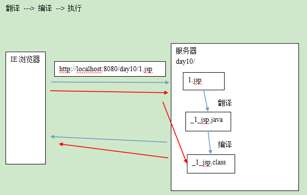

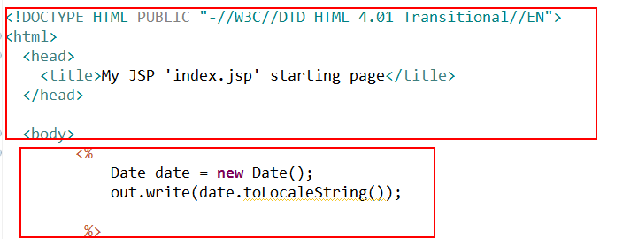

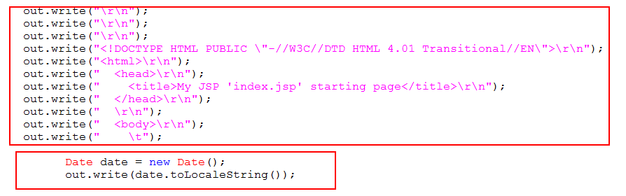

三、jsp的最佳实践
=================

Servlet：控制器。重点编写java代码逻辑 （获取表单数据、处理业务逻辑、分发转向）

JSP：代码显示模板。重点在于显示数据

四、jsp的基本语法
=================

1、JSP模版元素

网页的静态内容。如：html标签和文本。

2、JSP的脚本

2.1、小脚本 \<% java代码 %\>

2.1、表达式 \<%= 2+3 %\> 等价于out.print(2+3);

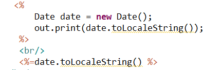

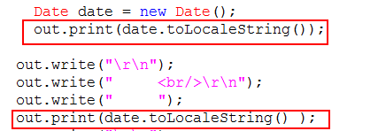

2.3、声明 \<%! %\> 表示在类中定义全局成员，和静态块。

3、JSP注释

JSP注释：\<%-- 被注释的内容 --%\> 特点：安全，省流量

网页注释：\<!-- 网页注释 --\> 特点：不安全，费流量

4、3指令

5、6动作

6、9内置对象\*\*\*\*\*

五、jsp的3个指令
================

JSP指令（directive）是为JSP引擎而设计的，它们并不直接产生任何可见输出，而只是告诉引擎如何处理JSP页面中的其余部分。

在JSP 2.0规范中共定义了三个指令：

page指令

Include指令

taglib指令

语法：

>   \<%\@ 指令名称 属性1=“属性值1” 属性2=“属性值2”。。。%\>

>   或者：

>   \<%\@ 指令名称 属性1=“属性值1”%\>

>   \<%\@ 指令名称 属性2=“属性值2”%\>

如：\<%\@ page language="java" import="java.util.\*" pageEncoding="UTF-8"%\>

\<%\@ page language="java" %\>

\<%\@ page import="java.util.\*" %\>

1、page:
--------

作用：用于定义JSP页面的各种属性

属性：

>   1.1、 import 和java代码中的import是一样的

>   \<%\@ page import="java.util.Date,java.util.List"%\>

>   或者：

>   \<%\@ page import="java.util.Date"%\>

>   \<%\@ page import="java.util.List"%\>

>   JSP会自动导入以下的包：

>   import java.lang.\*;

>   import javax.servlet.\*;

>   import javax.servlet.http.\*;

>   import javax.servlet.jsp.\*;

>   1.2、 session: 是否会自动创建session对象。默认值是true;

>   1.3、 buffer:
>   JSP中有javax.servlet.jsp.JspWriter输出字符流。设置。输出数据的缓存大小，默认是8kb.

>   1.4 errorPage: 如果页面中有错误，则跳转到指定的资源。

>   errorPage="/uri" 如果写“/”则代表当前应用的目录下，绝对路径。

>   如果不写“/”则代表相对路径。

1.5、 isErrorPage: 是否创建throwable对象。默认是false;

>   1.6、 contextType: 等同于response.setContextType("text/html;charset=utf-8");

>   1.7、 pageEncoding: 告诉JSP引擎要翻译的文件使用的编码。

>   1.8、 isELIgnored: 是否支持EL表达式。 默认是false

>   \<%\@ page pageEncoding="gbk" %\>

2、include:
-----------

静态包含：把其它资源包含到当前页面中。

>   \<%\@ include file="/include/header.jsp" %\>

动态包含：

>   \<jsp:include page="/include/header.jsp"\>\</jsp:include\>

两者的区别：翻译的时间段不同

>   前者：在翻译时就把两个文件合并

>   后者：不会合并文件，当代码执行到include时，才包含另一个文件的内容。

原则：能用静的就不用动的。

3、taglib
---------

作用：在JSP页面中导入JSTL标签库。替换jsp中的java代码片段。

\<%\@ taglib uri="http://java.sun.com/jsp/jstl/core" prefix="c" %\>

六、jsp的6个动作
================

使用标签的形式来表示一段java代码。

如： \<jsp:include page="2.jsp"\>\</jsp:include\>

\<jsp:include \> 动态包含

\<jsp:forward\> 请求转发

\<jsp:param\> 设置请求参数

\<jsp:useBean\> 创建一个对象

\<jsp:setProperty\> 给指定的对象属性赋值

\<jsp:getProperty\> 取出指定对象的属性值

七、jsp的9个内置对象
====================

指在JSP的\<%=%\> 和\<% %\>中可以直接使用的对象

| 对象名      | 类型                                   | 说明                               |
|-------------|----------------------------------------|------------------------------------|
| request     | javax.servlet.http.HttpServletRequest  |                                    |
| response    | javax.servlet.http.HttpServletResponse |                                    |
| session     | javax.servlet.http.HttpSession         | 由session="true"开关               |
| application | javax.servlet.ServletContext           |                                    |
| exception   | java.lang.Throwable                    | 由isErrorPage="false"开关          |
| page        | java.lang.Object当前对象this           | 当前servlet实例                    |
| config      | javax.servlet.ServletConfig            |                                    |
| out         | javax.servlet.jsp.JspWriter            | 字符输出流，相当于 printWriter对象 |
| pageContext | javax.servlet.jsp.PageContext          |                                    |

pageContext(重要)

1、本身也是一个域对象：它可以操作其它三个域对象（request session
application）的数据

>   void setAttribute(String name,Object o);

>   Object getAttribute(String name);

>   void removeAttribute(String name);

>   操作其它域对象的方法

>   void setAttribute(String name,Object o，int Scope);

>   Object getAttribute(String name,int Scope);

>   void removeAttribute(String name,int Scope);

scpoe的值：

>   PageContext.PAGE_SCOPE

>   PageContext.REQUEST_SCOPE

>   PageContext.SESSION_SCOPE

>   PageContext.APPLICATION_SCOPE

>   findAttribute(String name); 自动从page request session
>   application依次查找，找到了就取值，结束查找。

2、它可以创建其它的8个隐式对象

>   在普通类中可以通过PageContext获取其他JSP隐式对象。自定义标签时就使用。

3、提供了的简易方法

>   pageContext.forward("2.jsp");

pageContext.include("2.jsp");

八、四大域对象：实际开发
========================

PageContext : pageConext 存放的数据在当前页面有效。开发时使用较少。

ServletRequest: request 存放的数据在一次请求（转发）内有效。使用非常多。

HttpSession: session
存放的数据在一次会话中有效。使用的比较多。如：存放用户的登录信息，购物车功能。

ServletContext: application
存放的数据在整个应用范围内都有效。因为范围太大，应尽量少用。

九、EL表达式
============

1、EL概述和基本语法 
--------------------

EL表达式：expression language 表达式语言

要简化jsp中java代码开发。

它不是一种开发语言，是jsp中**获取数据**的一种规范

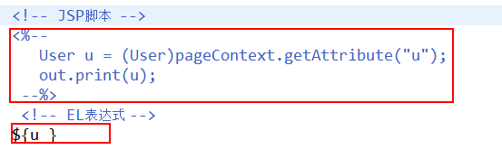

2、EL的具体功能 
----------------

### a、获取数据

>   EL表达式只能获取存在4个作用域中的数据

>   \${u} 原理： pageContext.findAttribute("u");

>   url?name=tom \${param.name}

>   EL获取对于null这样的数据，在页面中表现为空字符串

>   \${u.name} == u.getName()方法

>   点（.） 运算符相当于调了getter方法，点后页面跟的是属性名。

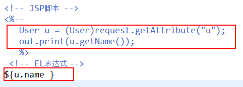

>   属性导航

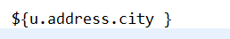

>   []运算符：点能做的，它也能做; 它能做的，点不一定能做

>   \${student.name}== \${student['name']} == \${student["name"]}

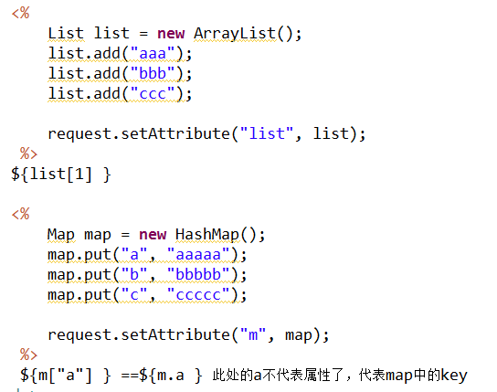

### b、运算

>   empty

>   判断null，空字符串和没有元素的集合(即使集合对象本身不为null)都返回true

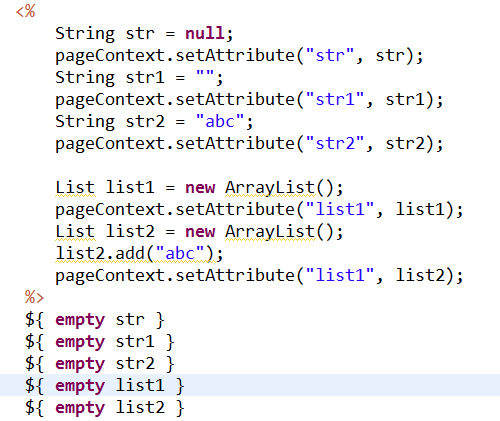

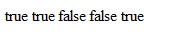

>   三元运算符

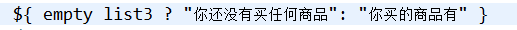

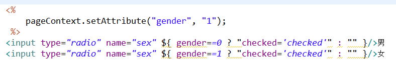

### c、隐式对象：11个

| EL隐式对象引用名称 | 类型                             | JSP内置对象名称 | 说明                                 |
|--------------------|----------------------------------|-----------------|--------------------------------------|
| pageContext        | javax.servlet.jsp.PageContext    | pageContext     | 一样的                               |
| pageScope          | java.util.Map\<String,Object\>   | 没有对应的      | pageContext范围中存放的数据,页面范围 |
| requestScope       | java.util.Map\<String,Object\>   | 没有对应的      | 请求范围数据                         |
| sessionScope       | java.util.Map\<String,Object\>   | 没有对应的      | 会话范围数据                         |
| applicationScope   | java.util.Map\<String,Object\>   | 没有对应的      | 应用范围数据                         |
| param              | java.util.Map\<String,String\>   | 没有对应的      | 一个请求参数                         |
| paramValues        | java.util.Map\<String,String[]\> | 没有对应的      | 重名请求参数                         |
| header             | java.util.Map\<String,String\>   | 没有对应的      | 一个请求消息头                       |
| headerValues       | java.util.Map\<String,String[]\> | 没有对应的      | 重名请求消息头                       |
| initParam          | java.util.Map\<String,String\>   | 没有对应的      | web.xml中全局参数                    |
| cookie             | java.util.Map\<String,Cookie\>   | 没有对应的      | key:cookie对象的name值               |

十、JSTL
========

1、什么是JSTL
-------------

>   JSTL（JavaServerPages Standard Tag Library）JSP标准标签库

2、JSTL的作用
-------------

>   使用JSTL实现JSP页面中逻辑处理。如判断、循环等。

3、使用JSTL
-----------

1）在JSP页面添加taglib指令

2）使用JSTL标签

4、常用标签介绍

核心标签库：

>   \> **通用标签**: set、 out、 remove

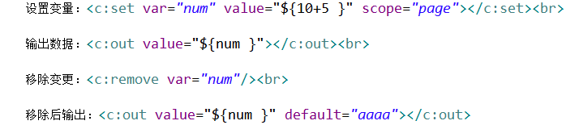

>   \> **条件标签**：if choose

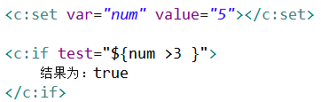

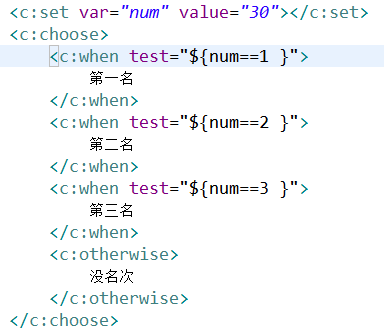

>   \> **迭带标签**：foreach

>   普通循环

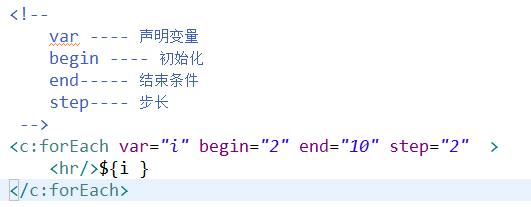

>   迭带器

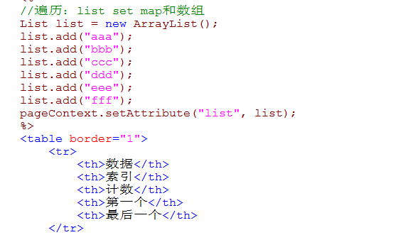

>   for(类型 变量名：数组或集合)

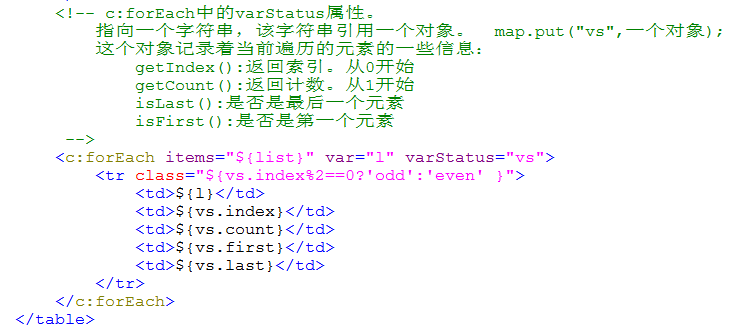

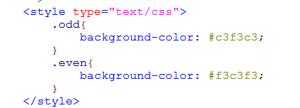

>   c:forEach中的varStatus属性。

>   指向一个字符串，该字符串引用一个对象。 map.put("vs",一个对象);

>   这个对象记录着当前遍历的元素的一些信息：

>   getIndex():返回索引。从0开始

>   getCount():返回计数。从1开始

>   isLast():是否是最后一个元素

>   isFirst():是否是第一个元素
