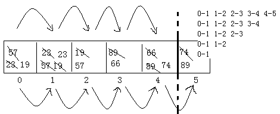
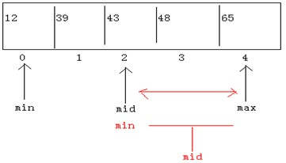
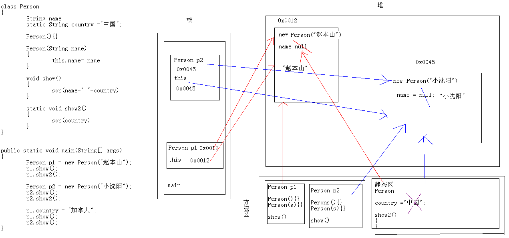
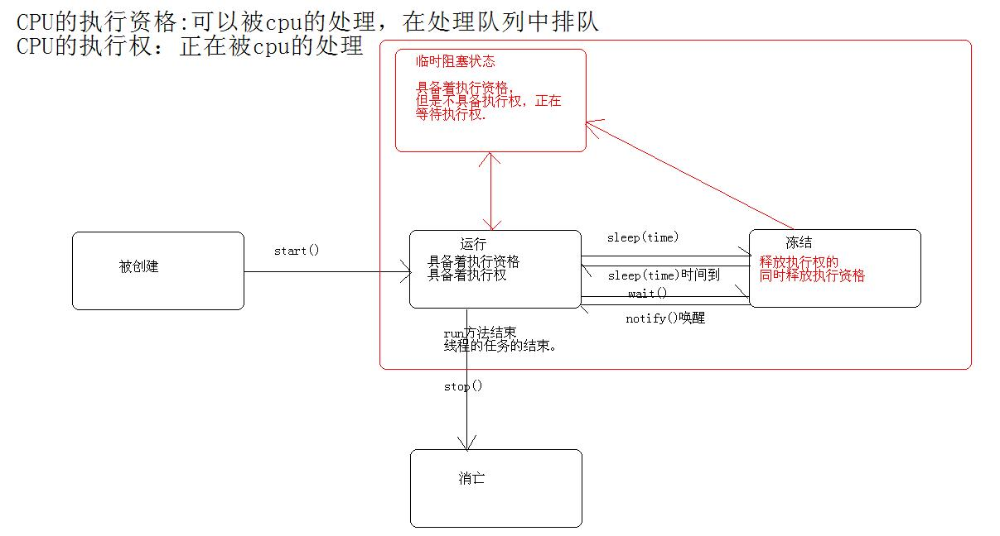
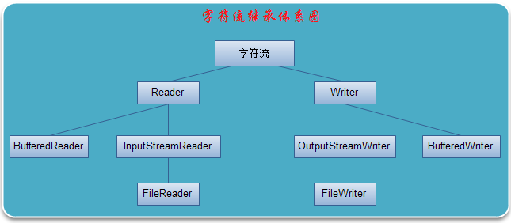
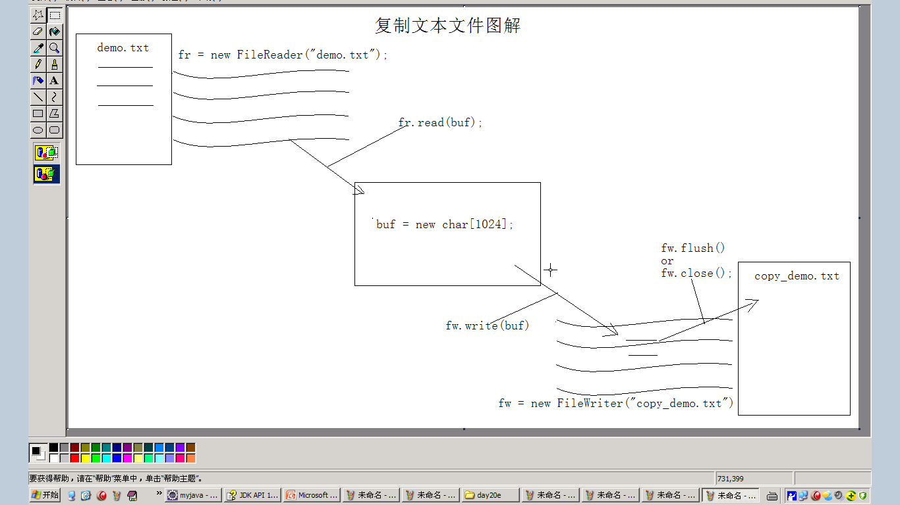

Day01 常见DOS命令和环境变量的配置
=================================

学习方法：

**每天要做的事——笔记、作业、代码**

**知识点的学习——A：是什么？**

>   **B：有什么特点？**

>   **C：如何使用？**

>   **D：什么时候使用？**

>   **E：能讲给别人听么？**

一、学习的前提
--------------

(1)目标要明确

(2)兴趣是最好的老师

(3)自信是成功的法宝

(4)要求和建议

A：写总结，记笔记，写注释。

B：多交流

C：勤练习：敲--狂敲(学习的捷径 不走弯路，就是捷径)

二、计算机基础知识
------------------

(1)计算机

(2)计算机硬件

(3)计算机软件

(4)软件开发

(5)**人机交互**

A：图形化界面

B：DOS命令行

(6)如何打开控制台--DOS命令行窗口

A：开始--程序--附件--命令提示符

B：开始--运行--cmd--回车(Enter)

C：Win+R--cmd--回车(Enter)

(7)**常用的DOS命令**

A：盘符的切换

\*\*D:回车

B：进入目录

\*\*cd aaa

\*\*cd c:\\aaa\\bbb

C：回退目录

\*\*cd... 返回上一级目录

\*\*cd\\ 返回根目录

D：删除文件

\*\*del a.txt

\*\*del \*.txt 删除所有以.txt结尾的文件

E：清屏

\*\*cls

F：退出DOS窗口

\*\*exit

了解:dir,md,rd

(8)键盘的布局及常用的文本快捷键

A：熟悉以下几个键

\*\*Tab

\*\*Shift

\*\*Ctrl

\*\*Win

\*\*Alt

\*\*空格

\*\*Enter

\*\*上下左右键

三、Java语言
------------

### 1、计算机语言

A：语言 人与人交流的一种方式

B：计算机语言 人与计算机交流的一种方式

### 2、Java语言的概述

SUN(Stanford University Network)1995年推出的一门高级编程语言。

是一种面向Internet的编程语言。Java之父--James Gosling（詹姆斯·高斯林）。

### 3、Java语言的三种技术架构

A：JavaSE(J2SE)标准版

B：JavaEE(J2EE)企业版

C：JavaME(J2ME)小型版

\*\*3G(Android)

### 4、Java语言的跨平台性

>   ——Java Virtual Machine

A：小霸王游戏机(模拟器)

B：Java语言之所以能够跨平台，因为JVM的存在。不同的操作系统有对应版本的jvm，Java只要有虚拟机就能运行。

JVM用于保证Java语言的跨平台。

### 5、JDK、JRE

>   **——Java Development Kit Java Runtime Environment**

A：JRE() 运行环境

\*\***包含JVM+java核心类库**

B：JDK() 开发工具包

\*\***包含JRE+Tools**

### 6、JDK的下载

A：官网

\*\*www.oracle.com

\*\*java.sun.com

B：百度或者谷歌

\*\*概念性的东西用百度

\*\***技术性的东西用谷歌**

C：从老师这直接拷贝

### 7、JDK的安装与卸载

A：卸载

\*\*开始--设置--控制面板--添加与删除程序

\*\*360管理软件

B：安装注意事项

\*\*安装的目录不能有空格等非法字符，也不能带有中文。

\*\*jre可以安装，也可以不安装。

### 8、环境变量的配置

A：环境变量

就像一个指向灯。当前执行的程序在当前目录下如果不存在，windows系统会在系统中已有的一个名为path的环境变量指定的目录中查找。如果还没有找到，就出现以上的错误提示。(exe,bat)

B：临时配置方式：通过dos命令中set命令完成

\*\*set ：用于查看本机的所有环境变量的信息。

\*\*set 变量名 ：查看具体一个环境变量的值。

\*\*set 变量名= ：清空一个环境变量的值。

\*\*set 变量名=具体值 ：给指定变量定义具体值。

想要在原有环境变量值基础上添加新值呢？

首先，通过%变量名%操作符获取到原有环境变量的值。

然后加上新值后在定义给该变量名即可

举例：给path环境变量加入新值

set path=新值;%path%

**注意：如果使用start开启新的DOS窗口，那么临时配置依然有效。**

C：永久配置

\*\*如何找到环境变量：

\*\*\*我的电脑--右键属性--高级--环境变量--系统变量

\*\*\*新建JAVA_HOME

\*\*\*\*变量名 JAVA_HOME

\*\*\*\*变量值 D:\\develop\\Java\\jdk1.6.0_30(JDK的安装目录)

\*\*\*编辑Path

\*\*\*\*变量名 Path

\*\*\*\*变量值 %JAVA_HOME%\\bin;(以前的path)

四、体验Java程序--HelloWorld
----------------------------

### 1、开发工具

A：普通的记事本

B：EditPlus高级记事本

C：Eclipse和MyEclipse这样的IDE(集成开发工具)工具

### 2、开发流程

class Demo{

public static void main(String[] args){

System.out.println("Hello World");

}

}

A：java语言的基本组成部分是类，我们用class关键字来表示。

B：类要被使用，所以给它起个名字Demo。这个名字可以随便起。(不要用中文或者全数字)

C：Exception in thread "main" java.lang.NoSuchMethodError: main

如果这个类想要独立运行，必须有main函数。否则，就会报错。

D：如果想在控制台输出一些内容，那么就是用打印语句

System.out.println("随便写"); //会把()里面的内容输出到控制台

E：用javac命令编译源文件，基本格式

\*\*javac 带后缀名的文件名

F：用java命令运行java字节码文件(class文件)，基本格式

\*\*java 不带后缀名的类名

练习：在控制台输出你中文名字的拼音

编写源代码--javac进行编译--java进行执行。

**注意：如果文件夹选项将文件扩展名隐藏，会出现文件未找到异常**

五、classpath环境变量
---------------------

(1)classpath是我们java的类文件目录的环境变量。

A：执行java Demo命令，就会到classpath中去找Demo.class是否存在。

B：如果你配置了classpath，肯定在classpath中找，如果没有，报错。

C：如果你配置classpath的时候，后面加了分号，这个时候，它首先在classpath下面找，如果没有，在到当前目录下找，再没有，报错。建议：classpath不要加分号。

D：没有配置classpath，那么只在当前路径下找。

**注意：最后面不要加"；"，如果要当前目录，可以这么做——set
classpath=.;E:\\xxxxxx**

六、环境变量path和classpath的作用是什么？
-----------------------------------------

path变量是windows程序文件的目录，作用是指定DOS命令行下命令的路径。举例：在DOS命令行下面执行命令：javac，编译程序时，它会到path变量所指定的路径中查找看是否能找到相应的命令程序。

classpath变量值是java类文件的目录，作用是指定类搜索路径。
JVM就是通过classpath来寻找该类的字节码文件的。

七、关键字
----------

(1)定义：被Java语言赋予了特殊含义的单词

(2)特点：关键字中所有字母都为小写

(3)goto和const虽然从未使用，但也作为Java关键字保留。

八、标识符
----------

### 1、定义

简单说就是起名字。

A：Java 语言中，对各种变量、方法和类等要素命名时使用的字符序列称为标识符。

### 2、标识符的规则

A：由26个英文字母大小写，数 字：0-9 符号：\_ \$ 组成。

B：不能以数字开头。

C：不能与关键字重名。

注意：java语言严格区分大小写。

### 3、Java中的名称规范

见名知意：看见名字知道意思

驼峰命名

A：包 其实就是文件夹

\*\*全部小写 xxx.yyy.zzz

\*\*www.baidu.com com.baidu.www

\*\*www.itcast.cn cn.itcast.www

B：类或者接口

\*\*如果由一个单词组成，首字母大写。例如 Demo

\*\*如果由多个单词组成，每个单词的数字母大写。例如 HelloWorld

C：变量和函数

\*\*如果由一个单词组成，全部小写。例如 name

\*\*如果由多个单词组成，第一个单词的数字母小写，其后每个单词的数字母大写。例如
getAge

\*\*变量名是名称，函数名是动词+名称

D：常量

\*\*如果由一个单词组成，全部大写。例如 MONEY

\*\*如果由多个单词组成，每个单词大学，然后用_连接。例如 BANK_MONEY

Day02 注释 常量 进制 变量 基本数据类型 运算符
=============================================

一、注释
--------

### 1、定义

>   用于对程序进行说明的文字，就可以看成是注释。

### 2、注释的格式

A：单行注释

\*\*举例：//我们好

B：多行注释

>   \*\*举例：

>   /\*

我们都是

好孩子

\*/

C：文档注释

\*\*举例：

>   /\*\*

\@author itcast

\@version V1.0

\*/

### 3、注释的用途

A：解释说明程序，给人看的。

B：用于调试程序。

>   C：用于面试

写一段代码？

a：注释是否完整

b：格式是否良好

**注意**：A-单行可以嵌套单行注释，也可以嵌套多行注释；

B-多行可以嵌套单行注释，不能嵌套多行注释；

C-文档注释可以嵌套单行注释，不能嵌套多行注释。

**小插曲**：写程序的好习惯——

>   **A：明确需求；---要干什么？**

>   **B：寻找思路；---用什么技术进行问题的解决？**

>   **C：细化步骤；---每一步如何进行实现？**

>   **D：编写代码。**

二、常量
--------

(1)在程序的运行过程中，其值是不能改变的量。

(2)常量的分类

A：整数常量 10,-10

B：小数常量 12.5

C：布尔常量 true,false

三、工具的使用
--------------

(1)灵格斯翻译家/金山词霸/有道词典

(2)截图工具(windows7自带截图工具)

(3)EditPlus

A：把EditPlus添加至右键菜单中

\*\*安装时选中

\*\*通过工具--首选项--常规--进行选中

B：如果去掉备份文件(.bak)

\*\*工具--首选项--文件--去掉保存时创建备份文件前面的勾

四、进制转换
------------

(1)进制：简单的说，就是计数的方式。x进制就是逢x进一。

(2)java语言中，对整数有3中表现形式

A：十进制

B：八进制

C：十六进制

(3)进制的由来：进制是由电信号来的。

A：二进制

\*\*逢2进1

\*\*由0,1组成

B：八进制

\*\*逢8进1

\*\*由0-7组成

\*\*用0开头表示八进制

(4)不同进制的数据演示。

(5)进制转换

A：其他进制到十进制

\*\*规律：把系数\*基数的权次幂相加即可。

\*\*系数

\*\*基数

\*\*权

\*\*举例

\*\*\*二进制到十进制：1101 对应 13

\*\*\*八进制到十进制：056 对应 46

\*\*\*十六进制到十进制：0xF4 对应 244

B：十进制到其他进制转换

\*\*规律：除基取余，直到商为0，最后，余数反转就是结果。

\*\*举例

\*\*\*十进制到二进制：60 对应 111100

\*\*\*十进制到八进制：60 对应 074

\*\*\*十进制到十六进制：60 对应 0x3C

\*\*技巧

\*\*\*十进制到八进制

\*\*\*\*十进制--二进制--八进制

\*\*\*\*13 -- 1101 -- 15 (015)

\*\*\*二进制到八进制：

\*\*\*\*从右往左，每三位一组合，左边不够用0补。

\*\*\*\*把组合后的每一位换算成十进制数据。

\*\*\*\*最后，从左往右，把结果进行组合即可。

\*\*\*十进制到十六进制

\*\*\*\*十进制--二进制--十六进制

\*\*\*\*13 -- 1101 -- 13 (0xD)

\*\*\*二进制到十六进制：

\*\*\*\*从右往左，每四位一组合，左边不够用0补。

\*\*\*\*把组合后的每一位换算成十进制数据。

\*\*\*\*最后，从左往右，把结果进行组合即可。

\*\*\*\*对应位上的数据，应该是十六进制的。

五、在计算机内，有符号数有3种表示法：原码、反码和补码。
-------------------------------------------------------

(1)原码

A：所谓原码就是二进制数的有符号表示法，即最高位为符号位，

“0”表示正，“1”表示负，其余位表示数值的大小。

举例： 符号位 数值位

\+7 0 0000111

\-7 1 0000111

B：原码不能直接参加运算，可能会出错。例如数学上，1+(-1)=0，而在二进制中原码

00000001+10000001=10000010，换算成十进制为-2。显然出错了。

在计算机中，数值一律用补码来表示（存储）。

主要原因：使用补码，可以将符号位和其它位统一处理；同时，减法也可按加法来处理。

另外，两个用补码表示的数相加时，如果最高位（符号位）有进位，则进位被舍弃。

(2)反码

A：正数 与原码相同

B：负数 符号位不变，数值位按位取反，0变1,1变0。

举例： 符号位 数值位

\+7 0 0000111

\-7 1 1111000

(3)补码

A：正数 与原码相同

B：负数 反码加1。

举例： 符号位 数值位

\+7 0 0000111

\-7 1 1111001

练习：

例：已知某数X的原码为10110100B，试求X的补码和反码。

例：已知某数X的补码11101110B，试求其原码。

六、变量
--------

(1)在程序的运行过程中，其值是可以改变的量。

A：是内存中的一小块存储区域。

B：用于存储数据。

(2)声明变量的格式：

A：数据类型 变量名 = 初始化值;

\*\*byte b = 10;

\*\*System.out.println(b);

B：数据类型 变量名;

变量名 = 初始化值;

使用变量

\*\*byte b;

\*\*b = 20;

\*\*System.out.println(b);

(3)好处：该空间可以重复使用。

(4)什么时候使用变量呢？当要使用的数据是不确定的时候。

七、数据类型
------------

### 1、分类

A：基本数据类型

B：引用类型(类，接口，数组)

### 2、基本数据类型

4类8种，区别在于他们在内存中的存储空间大小不一样。

A：整数

\*\*字节 byte 占1个字节

\*\*短整型 short 占2个字节

\*\*整型 int 占4个字节

\*\*长整型 long 占8个字节 其后跟L或者l标示

B：浮点数

\*\*单精度 float 占4个字节 其后跟F或者f标示

\*\*双精度 double 占8个字节

C：字符

\*\*char 占2个字节

D：布尔

\*\*boolean 占1个字节 true，false

注意：整型默认是int；浮点型默认是double。

### 3、数据类型的转换

A：数据参与运算

\*\*参与运算的数据类型要一致。

B：转换规则

\*\*布尔型不能参与运算。

整形，字符型，浮点型的数据在混合运算中相互转换，转换时遵循以下原则：

\*\*：容量小的类型默认转换为容量大的数据类型；数据类型按容量大小排序为：

byte,short,char-\>int-\>long-\>float-\>double

byte,short,char之间不会互相转换，他们三者在计算时首先会转换为int类型

\*\*：容量大的数据类型转换为容量小的数据类型时，要加上强制转换符，但可能造成精度降低或溢出；使用时要格外注意。

\*\*：有多种类型的数据混合运算时，系统首先自动的将所有数据转换成容量最大的那一种数据类型，然后再进行计算。

八、运算符
----------

### 1、算数运算符 +,-,\*,/,%,++,- -

A：%

\*\*左边小于右边，结果是左边

\*\*左边等于右边，结果是0

\*\*左边大于右边，结果是余数

\*\*余数的正负，取决于左边的正负

\*\*应用：%2 (结果是0,1)

**B：++,--**

\*\*单独使用，放在操作数前后结果一样。 a++;++a;

\*\*参与操作(运算，赋值，打印)时，放在操作数的前面，数据本身改变，再参与操作。

int a = 12; b = ++a; //a=13,b=13;

\*\*参与操作(运算，赋值，打印)时，放在操作数的后面，数据先进行临时存储，数据本身改变，最后将存储的数据进行赋值。

int a = 12; b = a++; //a=13,b=12;

C：+

\*\*正号

\*\*加法运算符

\*\*字符串连接符

\*\*\*"hello"+'A'+1 结果是helloA1

\*\*\*'A'+1+"hello" 结果是66hello

### 2、赋值运算符 =,+=,-=,\*=,/=，%=

A：int x = 3;//把3赋值给int类型变量x

B：x += 3; //x = x + 3; 把左边和右边相加赋给左边。

C：左边必须是变量。

D：面试题

short s = 2;

s = s + 2;

s += 2; //+= 有一个自动强制转换的过程

哪一行会报错？为什么？

### 3、关系运算符 ==,!=,\>,\>=,\<,\<=

A：比较运算符的结果都是boolean型，也就是要么是true，要么是false。

\*\*System.out.println(3==3); 结果是true

\*\*System.out.println(3!=3); 结果是false

### 4、逻辑运算符 &,\|,\^,!,&&,\|\|

逻辑运算符用于连接boolean类型的表达式

/\*

&运算符：与

左边 右边 结果

true true true

false true false

true false false

false false false

简单的说：有false则false。

\*/

/\*

\^运算符：异或

左边 右边 结果

true true false

false true true

true false true

false false false

简单的说：相同则false，不同则true。

\*/

/\*

&&：短路与

&：与

区别：&&是左边为false了，右边就不操作了。

&左边是false，右边还得继续操作。

\*/

### 5、三元运算符 (?:)

A：(条件表达式)?表达式1：表达式2；

\*\*如果条件表达式为true，运算后的结果是表达式1；

\*\*如果条件表达式为false，运算后的结果是表达式2；

B：表达式：用运算符连接起来的式子就叫表达式

\*\*算术表达式 a+b

\*\*赋值表达式 a+=2;

\*\*关系表达式 (a+b+c) \> (a+b)

\*\*逻辑表达式 (a\<b) \|\| (c\>d);

\*\*三元运算符 100\>200?(300\>200?100:200):200; 结果是：200

C：特点：运算完后，肯定有结果。

### 6、位运算符 &,\|,\^,\~,\>\>,\>\>\>,\<\<

位运算，要求我们先把数据转换成二进制。

A：System.out.println(4 & 3);

B：System.out.println(4 \| 3);

C：System.out.println(4 \^ 3);

\*\*一个数对同一个数异或两次，该数不变。

\*\*应用：加密。

D：System.out.println(\~4);

E：\<\< 就是将左边的操作数在内存中的二进制数据左移右边操作数指定的位数，

右边被移空的部分补0。相当于乘与2的移位数次幂

2\<\<4-----2\*2\^4

F：\>\>
右移稍微复杂一点，如果最高位是0，左边被移空的位就填入0；如果最高位是1，左边被移空的位就填入1。相当于除以2的移位数次幂

G：\>\>\> 无论最高位是1还是0，左边被移空的高位都填入0。

\*\*讲一个应用。通过10进制获取十六进制的数。

\*\*\*1&1=1 0&1=0 发现，任何数和1做位与运算，结果不变。

通过此规律，我们就可以取得任意二进制的多少位

\*\*\*num = num \>\>\> 4;

num & 15

取得倒数第二个四位。

Day03 语句(顺序 选择 判断 循环)
===============================

一、顺序结构
------------

(1)程序从上往下，从左往右依次执行。

二、判断结构(if语句)
--------------------

### 1、第一种格式

if(条件表达式--只有两个结果(true/false)){

执行语句；

}

A：执行流程

首先判断条件表达式，如果值为true，那么就执行if语句所控制的语句体。

如果为false，就不执行语句体。

B：条件表达式无论简单(a\>b)或者复杂((a+b+c)\>(a+b))，其结果是boolean值。true或者false。如果是其他的值，则错误。

**注意问题：**

A：if(条件表达式)其后没有分号。

一般来说，有"{}"就没有"；"，有"；"就没有"{}"

B：if语句所控制的语句如果是一条语句，我们可以不写大括号；

如果控制的是两条以上的语句，必须加大括号。

if语句的控制体没有加大括号是其后跟的一条语句。

建议：永远加上大括号。避免不必要的错误。

### 2、第二种格式

if(条件表达式){

执行语句1；

}else{ //else 否则的意思。

执行语句2；

}

A：执行流程

首先判断条件表达式，如果值为true，那么就执行语句1。

如果为false，就执行语句2。

B：if可以单用，第一种格式。

**有else必须有if。**

C：发现if语句的第二种格式和三元运算符相似。

区别：

(1)三元运算符是if语句的简写形式。

(2)所有的三元运算符都可以用if语句改写。反之不行。

**为什么？**因为三元运算符是一个运算符，计算完后，必有结果。

### 3、第三种格式

if(条件表达式){

执行语句1；

}else if (条件表达式){

执行语句2；

}

……

else{

执行语句n；

}

A：else可以省略，但是不建议。

(1)它是第三种格式的组成部分。

(2)你有可能没有判断完所有的情况，我们就可以使用else来完成特殊情况。

B：执行流程

虽然格式很长，但是，它整体只是一条语句。

不断的判断，只要有满足条件的条件表达式，就执行该判断处控制的语句体，执行完后。语句结束。

当都不满足时候，执行else。

C：if后面必须有条件表达式。

else后面没有条件表达式。

D：if语句的嵌套

if语句里面的语句体还是if语句。

### 4、if的应用

A：给定一个数值，请打印出对应的星期？。

B：一年有四季，每季三个月

春：3,4,5

夏：6,7,8

秋：9,10,11

冬：12,1,2

给定一个月份，输出对应的季节。

C：if语句什么时候使用？

\*\*\*对几个值进行判断的时候

\*\*\*\*

1,2,3,4,5,6,7

if(x==1)

{}

else if(x==2)

{}

...

\*\*\*对结果是boolean类型的进行判断

\*\*\*\*

if(x\>3)

{}

else if(x==3)

{}

else if(x??)

{}

...

\*\*\*对范围进行判断

\*\*\*\*

if(x\>90 && x\<100)

{}

else if(x\>80 && x\<=90)

{}

...

三、选择结构
------------

### 1、基本格式

switch(表达式){

case 取值1:

执行语句；

break；

case 取值2:

执行语句；

break；

…...

default:

执行语句；

break；

}

### 2、针对基本格式的说明

A：switch 用于定义选择结构范围。

表达式：被选择的结果，该表达式只能有四种类型：byte,short,int,char

注意：在JDK5以后，还支持一个叫做枚举的类型(enum);JDK7以后，还支持String类型。

B：case ：被选择的答案

C：break：跳出，结束switch语句。

D：default：默认的意思。当所有的case都不匹配时，执行default里面的内容。相当于if语句中的else。

### 3、switch语句细节

A：switch语句何时结束？

>   a：执行语句遇到break。

b：执行到语句的结尾。

B：最后一个break可不可以不要呢？可以。

中间的break可不可以不要呢？可以。但是结果可能不是想要的。所以一般中间
的break不要省略。

**面试一般考省略中间break的情形**

C：default和case前后顺序有关系吗？

A：执行上--
执行上有关系，先执行所有case，当所有的case都不满足时，再执行default。

B：写法上-- 没有关系 建议按照基本格式写。default放最后。

D：swithc语句中，break省略的情况有没有用呢？有。当多个答案针对同一处理。

### 4、程序的流程：

先判断case的取值

A：如果case取值与表达式匹配，执行该case下的语句，若有break则程序结束，若没有，则程序继续往下执行，此时，不再判断case取值，直至遇到break或者至大括号处，程序结束

B：如果case取值与表达式不匹配，则不执行与之对应的语句，程序继续执行A

C：如果所有的case取值都与表达式不匹配，程序将执行default下的语句

注意：当default语句置于非末尾处并且所有case值都不匹配时，程序执行default语句后，有beak将

结束程序，否则继续向下顺序执行，直至遇到break或者大括号，程序才结束。

**If和switch语句的应用场景**：

**如果是对具体的个数的数值进行判断**

>   **两种皆可，建议使用switch，因为它会将被选答案加载进内存，选择效率会稍高。**

**如果是对区间进行判断,用if**

**如果运算结果是Boolean类型，用if.**

四、循环结构
------------

### 1、while循环的格式

while(条件表达式){

执行语句;

}

A:执行流程：

a：首先判断条件表达式，如果结果为true，就执行while循环控制的语句。否则，不执行循环体。

b：循环体语句执行后，在回到A。知道条件不成立。

Ctrl+C 在DOS窗口中强制结束程序。

B：while(条件表达式)不要加分号，否则结果你理解不了。

C：while所控制的语句是一条的时候，也可以省略大括号，但是不建议。

### 2、do while循环的格式

do{

执行语句;

}while(条件表达式);

A;执行流程：

a：先执行一次循环体。

b：再判断条件表达式。如果值为true，就返回A继续。否则，结束循环。

B:与while的区别：

a：while后面有分号

b：do while循环至少执行一次循环体，while循环有可能一次都不执行。

### 3、for循环的格式

for(初始化表达式;循环条件表达式;循环后操作表达式){

执行语句;(循环体)

}

执行流程：

A：首先进行初始化表达式的执行。

B：其次，循环条件表达式的判断：

如果条件为true，则进循环体执行语句。

如果条件为false，则结束循环。

C：当循环体执行完毕后，就会执行循环后的操作表达式。

在接下来回到B步骤继续，直到结束循环。

D：初始化表达式只执行一次。

循环条件表达式执行一次或多次。

循环后的操作表达式零次或多次。

E；while循环和for循环时等价的。

变量的生命周期不一样。一般来说，只在它所属的{}内有效。

当你定义的初始化变量只为递增而存在，那么就用for循环，效率较高。

当你定义的初始化变量，操作完后，还得继续使用，用while循环。

**for( ; ; ){}//for语句的最简单无限循环格式-----条件表达式默认为true**

**while(true){}//while语句的最简单无限循环格式**

int x = 1;

for(System.out.println("a");x\<3;System.out.println("c")){

>   System.out.println("d");

}

//a d c d c

### 4、循环嵌套

A：外循环执行一次，内循环执行多次。

B：如果是打印形状等，外循环控制行数，内循环控制列数。

C：举例

\*\*打印正三角 内循环的循环条件表达式变化

内循环的循环条件表达式随着外循环的变化而变化。

外：(int x=0;x\<5;x++)

内: (int y=0;y\<=x;y++)

\*\*打印倒三角 内循环的初始化表达式变化

内循环的初始化表达式随着外循环的变化而变化。

外：(int x=0;x\<5;x++)

内: (int y=x;y\<5;y++)

\*\*打印33乘法表

### 5、累加思想与计数器思想

A：通过变量记录每次 变化的结果；通过循环进行累加动作。

B：通过变量记录数据的状态变化，也需通过循环完成。

计数器的条件根据实际情况而定

**注意：一定要注意哪些语句参与循环，哪些语句不参与循环。**

五、continue和break异同
-----------------------

(1)：都有自己的应用范围

A：continue用于循环

B：break用于选择结构和循环结构

单独使用：他们单独使用时，无意义，并且下面不可以有语句，因为执行不到。

(2)：break结束当前所在循环，continue结束本次循环，进入下一次循环。

标号可以改变跳出的循环。但是一般不用

六、变量和语句的引用场景
------------------------

### 1、什么时候使用变量？

\*\* 当我们使用的数据是一个不确定的值的时候

### 2、什么时候使用if语句?

\*\* 当进行判断的数值较多，结果是boolean类型或者是一个范围的时候，我们使用if
语句。if语句相对与switch语句范围更广。

### 3、什么时候使用switch语句?

\*\* 如果用于判断(选择)的数值不多，而且符合byte short int char
这四种类型时我们建 议使用switch语句，虽然if也能够完成，但不及switch语句效率高

### 4、什么时候使用循环语句?

\*\*当要对某些语句执行很多次的时候，我们就要使用循环语句。

while:如果在执行完循环体后还需用到循环语句中的变量时，我们就要使用while语句
除此之外，可以用for替换。

for:
用于控制循环的增量定于在语句中，该变量只在for语句中有效，for语句执行完成后，该变量在内存中被释放。如果仅仅只是定义循环增量，用for更为合适因为while定义的变量在执行完循环体后，还存在于内存中，比较浪费资源

\*\*变量有自己的作用域

break结束当前所在循环，continue结束本次循环，进入下一次循环。

Day04 函数和数组
================

一、函数
--------

### 1、定义：

>   就是完成一个特定功能的一段小程序。

A：以后写代码的时候，就得注意了：

\*\*我们在也不用把所有的代码都放到主函数里面去了。

\*\*主函数只负责调用我们自定义的函数。

B：**函数的格式**：

**修饰符 返回值类型 函数名(参数类型 形式参数1，参数类型 形式参数2，…){**

**执行语句;**

**return 返回值;**

**}**

**说明：**

\*\***修饰符**---- 修饰函数的。现在不用管，后面专门讲。现在统一写为： public
static

>   \*\***返回值类型**----
>   函数本身是具有特定功能的一段独立的小程序，这个功能在运算完或者执行完之后，肯定有结果，那么结果到底是什么类型的呢，我们需要在函数上标示一下。

\*\***函数名**---- 为了方便使用定义好的函数，我们就给它起个名字。

\*\***参数类型**----

\*\*\*形式参数----接受实际参数的变量

\*\*\*实际参数----实际使用的数值

\*\***执行语句**----函数是用于完成一段特定功能的，有可能这段功能需要多条语句执行，这就有了执行语句。

\*\*return---- 就是将执行的结果返回回来的一个关键字。其后跟的是返回的结果。

### 2、特点

A：定义函数可以将功能代码进行封装，便于对该功能进行复用。函数的出现提高了代码的复用性。

B：**自定义函数只有被调用才会被执行。**

C：**函数中只能调用函数，不可以在函数内部定义函数。**因为函数是平级的。

D：被调用时：

\*\*有明确返回类型的函数：

\*\*\*可以单独使用，但是没有意义；

\*\*\*可以赋值给一个和返回类型对应的变量，然后输出变量；

\*\*\***可以直接在输出语句中直接使用；**

\*\*void返回类型的函数：

\*\*只能单独调用。不能用于打印

**注意：返回值类型和参数列表中参数类型没有关系！**

>   **定义功能，功能中需要定义什么就定义什么，不需要的就不要定义。**

### 3、函数的应用

A：如何自定义函数--------两个明确

\*\***明确函数的返回值类型**

\*\***明确参数列表(形参的类型及个数)**

B：两个整数的求和

>   **public class** Sum {

>   **public static void** main(String[] args) {

>   **int** sum = *getSum*(3,4);

>   System.*out*.println(sum);

>   }

>   //返回值类型：int,未知内容：int a,int b

>   **public static int** getSum(**int** a,**int** b){

>   **return** a+b;

>   }

>   }

C：取得两个整数中较大的值

>   **public class** Max {

>   **public static void** main(String[] args) {

>   **int** max = *getMax*(3,5);

>   System.*out*.println(max);

>   }

>   //返回值类型：int,未知内容：int a,int b

>   **public static int** getMax(**int** a,**int** b){

>   **return** a\>b?a:b;

>   }

>   }

D：比较两个整数是否相等

>   **public class** Compare {

>   **public static void** main(String[] args) {

>   **boolean** b = *isEquals*(3, 4);

>   System.*out*.println(b);

>   }

>   //返回值类型：boolean,未知内容：int a,int b

>   **public static boolean** isEquals(**int** a,**int** b){

>   **return** a==b;

>   }

>   }

E：取得三个整数中较大的值

>   **public class** Max {

>   **public static void** main(String[] args) {

>   **int** max = *getMax*(3,5,7);

>   System.*out*.println(max);

>   }

>   //返回值类型：int,未知内容：int a,int b，int c

>   **public static int** getMax(**int** a,**int** b,**int** c){

>   **int** temp=a\>b?a:b;

>   **int** max =temp\>c?temp:c;

>   **return** max;

>   }

>   }

F：打印nn乘法表

>   **public class** NnChengFaBiao {

>   **public static void** main(String[] args) {

>   *printNnchengfabiao*(6);

>   }

>   //返回值类型：void,未知内容：int n

>   **public static void** printNnchengfabiao(**int** n){

>   **for**(**int** x=1;x\<=n;x++){

>   **for**(**int** y =1;y\<=x;y++){

>   System.*out*.print(y+"\*"+x+"="+x\*y+"\\t");

>   }

>   System.*out*.println();

>   }

>   }

>   }

4.函数的重载

A：在同一个类中，允许存在一个以上的同名函数，只要它们的**参数个数或者参数类型不同**即可。

B：函数的功能一样，仅仅是参与运算的未知内容不同时，

可以定义多个函数，却使用统一函数名称，这样方便阅读。

在调用时，虚拟机通过参数列表的不同来区分同名函数。

C：好处：方便阅读，优化了程序设计。

特点：**与返回值类型无关**。

D：我们以后如何判断几个函数是否是重载的呢？

\*\***函数名相同**

\*\***参数列表不同(个数和类型)**

二、数组
--------

### 1.数组的定义

存储的是同一种数据类型的数据的集合，它是一个容器。

### 2.数组的格式(一维数组)

第一种格式：

**元素类型[] 数组名 = new 元素类型[元素个数或数组长度];**

示例：int[] arr = new int[5];

>   \*\*左边：

>   int 表示数组中元素的数据类型

>   [] 表示数组

>   arr 数组的名字

>   简单说：定义了一个int类型的数组，名称是arr。

>   \*\*右边：

>   new 创建一个实体

>   实体：存储一个数的东西叫变量。存到多个数据的东西叫实体。

>   new：class是用来定义一个类的，new是用来创建一个实体的。

>   int 表示数组中元素的数据类型

>   [] 表示数组

>   5 表示此数组中有5个元素

>   简单说：创建一个int类型的数组实体，该实体中可以存储5个int类型的元素。

第二种格式：

**元素类型[] 数组名 = new 元素类型[]{元素1，元素2，……};**

示例：int[] arr = new int[]{3,5,1,7};

>   int[] arr = {3,5,1,7};

**Tips：当明确数组元素时，建议使用第二种比较方便**

注意：定义数组时，**不要忘记指定数组的长度和名称；在指定了数组长度的同时，不可列出其元素内容**，因为可能出现元素类型与数组定义类型不一致。[
]可以放在数组名的左边，也可以放在右边。

### 3.内存图

java语言又把它所用到的内存分为了5个区域：

### 4.操作数据可能遇到的问题

A: **数组角标越界异常 ArrayIndexOutOfBoundsException**(**程序运行的时候发生**)

访问到了数组的最后一个元素后，你还在继续访问,此时就会出现此问题。

B: **空指针异常 NullPointerException**(**程序运行的时候发生**)

一个引用变量已经不再指向对内存的地址。这个时候，你还在使用这个引用。

### 5.数组的常见操作

A：操作数组，肯定离不开角标。--------**角标思想**

B：遍历数组

>   **public class** BianLi {

>   **public static void** main(String[] args) {

>   **int**[] arr={23,45,12,27,44,99};

>   *printArray*(arr);

>   }

>   //遍历数组

>   **public static void** printArray(**int**[] arr){

>   System.*out*.print("[");

>   **for**(**int** x =0;x\<arr.length;x++){

>   **if**(x!=arr.length-1){

>   System.*out*.print(arr[x]+",");

>   }**else**{

>   System.*out*.print(arr[x]+"]");

>   }

>   }

>   System.*out*.println();

>   }

>   }

C：获取最值

>   思路：将数组的第一个元素定义为最大值，然后依次和其他元素进行比较，如果其他元素比标记的最大值还大，就进行重新标记，最后将最大值的标记返回即可。

>   //获取最大值

**public static int** getMax(**int**[] arr){

**int** max = arr[0];

**for**(**int** x =0;x\<arr.length;x++){

**if**(arr[x]\>max){

max=arr[x];

}

}

**return** max;

}

D：互换位置

**private static void** swap(**int**[] arr, **int** x, **int** y) {

**int** temp =arr[x];

arr[x]=arr[y];

arr[y]=temp;

>   }

E：选择排序

>   原理：先从0角标位置元素与其他位置元素(自己除外)进行依次比较，每次比较完后，最小值出现在最左边，并将起始位置后移一个角标位，直至次尾角标位。

>   **public static void** selectSort(**int**[] arr){

>   //最后一个元素不需要参与比较，所以arr.length-1

>   **for**(**int** x =0;x\<arr.length-1;x++){

>   **for**(**int** y=x+1;y\<arr.length;y++){

>   **if**(arr[x]\>arr[y]){

>   *swap*(arr,x,y);

>   }

>   }

>   }

>   }

>   F：冒泡排序

原理：相邻的元素，两两相比，大的后移。每次比较完后，最大值出现在右边。

**public static void** bubbleSort(**int**[] arr){

**for**(**int** x =0;x\<arr.length-1;x++){

**for**(**int** y=0;y\<arr.length-1-x;y++){

**if**(arr[y]\>arr[y+1]){

*swap*(arr,y,y+1);

}

}

}

>   }

### 6.基本数据类型和引用类型传递的异同。

A：**在java中只有值传递**

引用传递的时候，传递的是地址值。

B：基本数据类型传递过去后，形参改变对实参没有影响。

引用类型传递过去后，形参改变直接影响实参。

Day05 数组的应用 二维数组
=========================

一、查找
--------

### 1、数组无序

/\*

需求：在数组中查找指定的数据,并返回其角标

明确：返回类型 int

未知内容 数组未知 int[] arr，给定的元素 int a

\*/

>   **public class** Search {

>   **public static void** main(String[] args) {

>   **int**[] arr={21,15,77,23,56,33,28};

>   **int** x = *getIndex*(arr,33);

>   System.*out*.println(x);

>   }

>   **public static int** getIndex(**int**[] arr, **int** i) {

>   **int** mark=-1;//标记避免break和return语句在一起

>   **for**(**int** x=0;x\<arr.length;x++){

>   **if**(arr[x]==i){

>   mark=x;

>   **break**;

>   }

>   }

>   **return** mark;

>   }

>   }

### 2、数组有序

**当数组有序时**，我们可以选择使用折半查找来提高查找效率

注意：不能对无序的数组先排序，后用二分查找做查找操作。

**package** cn.itcast.test;

/\*我们可以这么思考：

\*定义三个角标：*min*=0;max=arr.length-1;mid=(*min*+max)/2;给定一个要查找的数*num*

\*我们首先判断*num*和mid相等么？不相等，分两种情况：

\* *num*\<mid,*min*=0,max=mid-1;

\* *num*\>mid,*min*=mid+1,max=arr.length-1;

\* \*/

**public class** Search {

**public static void** main(String[] args) {

**int**[] arr={12,23,25,77,82,91};

**int** index=*binarySearch*(arr,77);

System.*out*.println(index);

}

**public static int** binarySearch(**int**[] arr,**int** num){

**int** min=0;

**int** max=arr.length-1;

**int** mid=(min+max)/2;

**while**(num!=arr[mid]){

**if**(num\<arr[mid]){

max=mid-1;

}**else**{

min=mid+1;

}

mid=(max+min)/2;

**if**(min\>max){

**return** -1;

}

}

**return** mid;

}

### 3、十进制到十六进制的转换(查表法)

**public class** Trans {

**public static void** main(String[] args) {

*trans*(60);

}

**public static void** trans(**int** num){

**char**[] chs = {'0','1','2','3','4','5','6','7','8','9',

>   'A','B','C','D','E','F'};

**char**[] arr = **new char**[8];//一个int占32位，16进制每4位为一组

**int** pos = arr.length;//定义容器存储的起始角标(最后一个)

**while**(num!=0){

**int** temp = num\&15;//获取最低四位

arr[--pos]=chs[temp];//倒着存储

num = num\>\>\>4;

}

//正着输出，此处pos为开始位置角标

**for**(**int** x = pos;x\<arr.length;x++){

System.*out*.print(arr[x]);

}

}

}

查表法：容器和对应关系。

**什么时候使用查表法呢？**

当在分析问题中存在映射关系，可以使用查表法。

对于映射关系，如果对应的一方是有序的编号，比如数组的角标。这时可以使用数组作为这个关系的容器将多个对应关系进行存储。

**public static String getWeek(int num){**

**if(num\>7\|\|num\<0){**

**System.out.println(num+"对应的星期不存在！");**

**}**

**String[] weeks = {"星期一","星期二","星期三","星期四","星期五","
星期六","星期日"};**

**return weeks[--num];**

**}**

二、二维数组
------------

### 1、第一种格式

**int[][] arr = new int[3][2];**

定义了名称为arr的二维数组

二维数组中有3个一维数组

每一个一维数组中有2个元素

一维数组的名称分别为arr[0], arr[1], arr[2]

给第一个一维数组1脚标位赋值为78写法是：arr[0][1] = 78;

### 2、第二种格式

**int[][] arr = new int[3][];**

二维数组中有3个一维数组

每个一维数组都是默认初始化值null----**引用类型的初始化值为Null**

可以对这个三个一维数组分别进行初始化

arr[0] = new int[3];

arr[1] = new int[1];

arr[2] = new int[2];

### 3、第三种格式

**int[][] arr = {{3,8,2},{2,7},{9,0,1,6}};**

定义一个名称为arr的二维数组

二维数组中的有三个一维数组

每一个一维数组中具体元素也都已初始化

第一个一维数组 arr[0] = {3,8,2};

第二个一维数组 arr[1] = {2,7};

第三个一维数组 arr[2] = {9,0,1,6};

第三个一维数组的长度表示方式：arr[2].length;

### 4、二维的操作

-   **遍历**

>   **二维数组，就像一个矩阵，大圈套小圈，因此用循环嵌套即可**

**public class** ArrayDemo {

**public static void** main(String[] args) {

**int**[][] arr = {{60,12,23},{0,50,69},{98,120},

>   {111,222,333}};

*printArray*(arr);

}

**public static void** printArray(**int**[][] arr){

**for**(**int** x = 0;x\<arr.length;x++){

**for**(**int** y = 0;y\<arr[x].length;y++){

System.*out*.println(arr[x][y]+" ");

}

System.*out*.println();

}

}

}

-   **应用**

/\*

一年有四季，每季度3个月。

假如你是干销售的。每个月都有销售额。按季度组合。

单位：万

第一季度 {60,12,23}

第二季度 {0,50,69}

第三季度 {98,120} //9月份没来

第四季度 {111,222,333}

求一年的销售总额。给你算奖金，奖金是销售额的1%。

\*/

**public class** ArrayTest {

**public static void** main(String[] args) {

**int**[][] arr={{60,12,23},{0,50,69},{98,120},

>   {111,222,333}};

**double** money = *getMoney*(arr);

System.*out*.println("你今年的奖金是："+money);

}

**public static double** getMoney(**int**[][] arr){

**int** sum = 0;

**for**(**int** x = 0;x\<arr.length;x++){

**for**(**int** y = 0;y\<arr[x].length;y++){

sum+=arr[x][y];

}

}

**return** sum\*0.01;

}

}

Day06 面向对象思想 类与对象 
============================

一、面向对象思想
----------------

### 1、面向对象与面向过程区别和联系。

A：区别：

\*\*面向过程关注执行过程，这个时候我们是执行者。

\*\*面向对象关注的是最终功能，这个时候我们是指挥者。

B：联系：.

\*\*面向对象是基于面向过程的。

### 2、面向对象

A：面向对象思想的特点。

\*\*是符合人们思考习惯的一种思想。

\*\*\*编程思想就是来源于生活。

\*\*将复杂的问题简单化了。

\*\*把我们从执行者变成了指挥者。

B：举例

\*\*我去面试，boss调用了我的写程序的功能，不需要自己去做。

\*\*找女朋友洗衣服、做饭。

C：请给我解释面向对象的思想。

\*\*先说特点

\*\*举例说明这些特点

### 3、面向对象思考问题的方式

找对象，完成功能。

如果对象不存在，自己就造一个对象。

### 4、面向对象的三大特性

A：封装

B：继承

C：多态

此外面向对象还有个一个特性-------\>抽象！

二、类与对象
------------

### 1、类 

>   是对现实世界事务的抽象。

A：类就是一类事物的抽象。

### 2、对象 

>   是该类事物具体的存在个体。

### 3、如何描述一个类

A：现实生活中我们用属性和行为来描述一个事物。

B：这个时候我们就可以用属性和行为来描述一个类

那么，他们在类中分别对应什么呢？

\*\*属性 -- 成员变量 (属性)---------------\>整个类中有效

\*\*行为 -- 成员方法 (函数，功能)------\>整个类中有效

### 4、自定义类的分析过程

A：分析：

\*\*首先分析这个类是个什么样的事物

\*\*其次你就应该该事物具有哪些属性和行为

\*\*把这个事物的属性和行为对应成我们类的成员变量和成员方法。

B：自定义一个电脑类

\*\*属性 颜色，品牌，重量

\*\*行为 开机，关机，上网

对应成类

//自定义电脑类

class Computer

{

String color;//颜色

String type;//品牌

double weight;//重量

public void start(){}//开机

public void stop(){}//关机

public void online(){}//上网

}

### 5、对象的创建和使用及对象的内存图

A：对象的创建

Student s = new Student();//创建一个Student的对象,并把它赋给了Student类型的s。

B：使用对象

如果你想使用类中的方法和属性，你必须通过类的实例(对象)来调用。

调用方式：

对象名.属性;

对象名.方法名(参数列表);

三、成员变量和局部变量的区别
----------------------------

### 1、作用范围

成员变量作用于整个类。

局部变量只作用于它所属的范围(函数，语句);

### 2、生命周期&位置

成员变量存储在堆内存中，是属于对象的，随着对象的存在而存在，随着对象的消失而消失。

局部变量存储在栈内存中，是属性它所属范围的，使用完立即被释放。

### 3、初始值

**成员变量都有默认初始化值。**

\*\*整型 0

\*\*浮点型 0.0

\*\*字符型 '\\u0000' 空字符

\*\*布尔型 false

\*\*字符串 null

**局部变量没有默认值，要想使用，必须遵循：**

先定义(声明)，再赋值，最后使用。

四、匿名对象(为了简化书写)
--------------------------

### 1、概念

>   没有名字的对象。是对象的一种简写形式。

### 2、什么时候用？

A：该对象只执行一次方法的调用。多次调用必须起名字！

\*\*new Car().start();

B：可以作为实际参数传递

\*\*public static void method(Car c){}

\*\*method(new Car());

五、封装
--------

### 1、概念

把实现细节隐藏，提供公共的访问方法。

任何对象或者系统都应该有一个明确的边界，边界内部的改变对外部没有影响，在java中，类包含了数据和方法，将数据放到一个类中就构成了封装。他将变化的进行了隔离，这样大大的提高了程序的安全性，由于他提供了公共访问方式，我们只需要调用它的功能即可，这样就提高了代码的复用性(只关注功能不用在意具体实现)，自然而然就方便使用了。我们只需要将类中的成员变量私有(在变量名前加private即可)，并提供相对应的set和get方法。
机箱和主板的例子。

私有只是封装的一种体现，隐藏才算是封装。

### 2、好处

A：将变化隔离。

B：便于使用。

C：提高重用性。

D：提高安全性。

### 3、private关键字

A：private

\*\*私有的

B：特点

\*\*是一个权限修饰符。

\*\*可以修饰成员，被修饰的成员**只能在本类中访问**。

C：一般用法

\*\*一般用于将成员变量私有，提供公共的get,set方法进行访问。

自定义类 一般格式：

class Student{

private String name;

public void setName(String n){

name = n;

}

public String getName(){

return name;

}

}

注意：set方法可用于对成员变量进行赋值。

六、构造方法
------------

### 1、用途

创建对象，并进行初始化动作。

### 2、特点

A：**构造方法名和类名相同**

B：**没有返回类型**

>   **C：没有返回值**

运行特点：对象创建时被调用。

### 3、构造方法与成员方法的区别

A：格式区别

构造方法要求：方法名与类名相同，没有返回类型。

成员方法要求：记住函数的定义格式。

B：用途

构造方法用于创建对象，并初始化值。

成员方法用于完成一个功能。

C：什么时候被调用

构造方法一new就被调用。

成员方法时通过对象名来调用。

你想创建对象必须使用构造方法。

你想使用功能必须通过对象名来调用。

你想使用一个功能：首先创建对象，然后使用对象的功能。

### 4、构造重载

A：构造方法名相同，参数不同。

B：构造方法的注意事项

\*\*自定义类中如果没有构造方法，系统会默认给出一个无参构造方法。

\*\*如果你给定了构造方法，系统将不再提供无参构造方法了。

\*\*\*如果给定的有无参构造方法，你可以继续使用无参构造方法来创建对象。

\*\*\*如果没有无参构造方法，你可以不使用。否则，就会报错。

\*\*建议：每次我们都手动给出无参构造方法。

**注意：带参构造方法也可以对成员变量进行赋值。**

七、this关键字
--------------

### 1、概念 

代表本类对象的一个引用

A：**方法被哪个对象调用，该方法内的this就代表哪个对象。**

### 2、使用场景

A：**局部变量隐藏成员变量**

class Student{

private String name;

/\*

public void setName(String n){

name = n;

}

\*/

public void setName(String name){

this.name = name;

}

public String getName(){

return name;

}

}

Student s = new Student();

s.setName("张三");

String str = s.getName();

System.out.println(str);

System.out.println(s.getName());

B：**构造方法中使用this**

class Student{

private String name;

private int age;

Student(){}

Student(String name){

this.name = name;

}

Student(int age){

this.age = age;

}

Student(String name,int age){

//this(name);//代表就是调用构造方法----**构造方法中的调用方式**

this.name = name;

this.age = age;

}

}

C：**比较年龄**

public boolean compare(Person p){

return this.age==p.age;

//return this.getAge()==p.getAge();//是可以的。

}

### 3、内存图看懂

### 4、自定义类

我们后面在自定义类的时候：

1：给属性赋值有几种方式

定义的时候给属性。

A：set赋值 开发都用set。

B：构造方法

2：提供一个无参构造

//自定义一个学生类

class Student{

private int age;//姓名

private String name;//年龄

Student(){}

public void setAge(int age){

this.age = age;

}

public int getAge(){

return age; //return this.age;

}

public void setName(String name){

this.name = name;

}

public void getName(){

return name;

}

}

Day07 代码块 static 主方法 帮助文档 单例
========================================

一、代码块
----------

### 1．定义

>   它是由一对{}括起来的代码。

### 2、分类及详述

**A：局部代码块：**用在局部，可以及时释放内存，提到效率。

**B：构造代码块：**每个构造方法运行时都会自动调用构造代码块。可以对所有对象初始化。

**C：静态代码块：**随着类的加载而执行，而且只执行一次，优先与主方法。

假如我们有一个Person对象。请问Person p = new Person();在内存中到底做了什么呢？

步骤

A：把Preson.class文件加载进内存。

B：在栈内存空间开辟一个小空间，存储p变量。

C：在堆内存中开辟空间。创建对象。

D：对对象中的成员变量进行默认初始化。

E：执行构造代码块，如果没有构造代码块，就不执行。

F：对对象中的成员变量进行赋值。

G：把对象构造初始化完毕。

H：将对象在堆内存的首地址赋给栈内存变量p。

二、static
----------

### 1.概念

>   静态的意思，用于修饰成员。

### 2.特点

>   随着类的加载而加载

>   优先于对象存在

>   被所有对象所共享

>   可以直接被类名调用

### 3.注意事项

A：静态成员只能访问静态成员。

B：静态方法中不能有this，super关键字。

C：主函数是静态的 单讲。

### 4.静态变量(static修饰的成员变量)和非静态变量的区别

A：静态变量随着类的加载而加载，随着类的消失而消失。生命周期最长。

非静态变量随着对象的创建而存在，随着对象的消失而消失。

>   B：静态变量和类相关，是所属于类的，可以直接被类名调用，也可以被对象名调用。也称为类变量。

>   非静态变量和对象相关，是所属于对象的，只能被对象名调用。称为实例(对象)变量。

C：静态变量存储于方法区中的静态区。

非静态变量存储于对象的区域，在堆内存中。

D：静态变量的数据被所有的对象共享。

非静态变量是每个对象特有的数据。

### 5.内存图

看懂内存图即可。

### 6.什么时候用

分析问题时：

当这个内容是所有对象所共享的时候，我们就把它定义为static修饰的。

当这个内容是每个对象所特有的时候，就把它定义为非static修饰的。

写代码的时候，你可以考虑：

某个成员方法访问了对象所共享的内容。或者说，访问了静态成员。那么，该方法
就必须定义为static修饰的。访问了特有的属性，就不能被静态修饰。

>   简单说：如果函数中访问了成员变量，不能静态，否则可以静态化，直接被类名调用即可。

三、主方法
----------

**public static void main(String[] args){ }**

(1)：public 公共的权限修饰符。

(2)：static 静态的。

(3)：void 返回类型是空的。

(4)：main jvm的入口。

(5)：String[] args

字符串数组元素的值是什么？

A：args中有没有元素呢？就是判断长度是否为0。

B：长度为0，有用吗？干什么啊？没用，但是我们可以给args赋值。

C：我们还可以给args赋值

java MainDemo hello world itcast

四、制作帮助文档
----------------

1.类中的内容加入文档注释。

2.如果制作呢：

**javadoc -d arrayTool** -author -version ArrayTool.java

javadoc 是解析文档注释并生成说明书的工具的名字

\-d arrayTool :-d后面跟的是目录

\-author -version: 提取author,version。

ArrayTool.java 文件名

3.出现问题

正在创建目标目录： "arrayTool\\"

正在装入源文件 ArrayTool.java...

正在构造 Javadoc 信息...

javadoc: 错误 - 找不到可以文档化的公共或受保护的类。

1 错误

如何解决呢？把class前面加个权限修饰符public

五、单例设计模式
----------------

### 1、设计模式

是一种编程思想，解决问题的一种行之有效的思想。java中有23种设计模式。Gof设计模式。

### 2、单例设计模式

>   \----源于建筑行业

A：**保证对象在内存中只有一个。**

B：**如何保证？**

\*\*不能让其他类来创建对象。

\*\*本类中要创建一个本类对象。

\*\*对外提供公共的访问。

C：**步骤** 我们的类是Student

\*\*private Student(){}

\*\*Student s = new Student();

\*\*public Student getInstance(){return s;}

**什么时候使用呢？配置文件**

### 3、单例的两种方式

第一种方式：饿汉式

class Teacher{

//本类创建一个对象

private static Teacher t = new Teacher();

//为了保证其他类不能够创建对象

private Teacher(){}

//为了外界能够通过类名直接调用

public static Teacher getInstance(){

return t;

}

}

Teacher t1 = Teacher.getInstance();

Teacher t2 = Teacher.getInstance();

第二种方式：懒汉式

class Teacher{

//本类创建一个对象

private static Teacher t = null;

//为了保证其他类不能够创建对象

private Teacher(){}

//为了外界能够通过类名直接调用

public static Teacher getInstance(){

if(t==null){

>   Synchronized(Teacher.class){

if(t==null){

>   t = new Teacher();

>   }

>   }

}

return t;

}

}

Teacher t1 = Teacher.getInstance();

Teacher t2 = Teacher.getInstance();

**注意：开发一般用饿汉式。第二种在多线程的时候，会有安全隐患。**

**面试一般考懒汉式(延迟加载)**

**工具类：构造私有，方法静态。直接使用类名调用，工具类一般没有访问数据，创建对象没啥意义。**

Day08 继承 final 抽象类 
========================

一、继承
--------

### 1、概述

多个类中存在相同属性和行为时，将这些相同的内容抽取到单独一个类中，那么多个类无需再定义这些属性和行为，只要继那个类即可。多个类可以称为子类，单独这个类称为父类或者超类。子类可以直接访问父类中的非私有的属性和行为。

### 2、特点

A：Java只支持单继承，不支持多继承(**子类调用父类方法的不确定性**)。但是它支持多层继承(**接口与接口之间可以存在多继承**)

B：父类有的，子类也有，而且子类可以改变(更改父类的属性值，重写父类的成员方法)，父类没有的子类也可以进行增加。

C：父类的属性和方法可以被继承，**但是构造方法不能被继承**，子类的构造方法隐式的调用父类的无参构造方法，当父类没有无参构造方法时，子类需要使用super来显示的调用父类的构造方法。

### 3、举例

>   \-------学生类继承了人类，拥有了人类的成员变量(name和age)和成员方法(eat和sleep方法)

class Person{

String name;

int age;

Person(){}

public void sleep(){

System.out.println("睡觉");

}

public void eat(){

System.out.println("吃饭");

}

}

class Student extends Person{//学生继承人类

String sid;//学号

public void study(){

System.out.println("我宁愿做一头快乐的猪");

}

}

### 4、研究继承后 Fu和Zi的关系。

**A：成员变量**

\*\*子类直接继承了本身没有的成员变量。

\*\*当子类中有和父类同名的成员变量时。在方法中打印的是子类自己的。

\*\*当子类方法中有局部变量和成员变量同名，在方法中打印的是局部变量。

也就是说：先在局部范围找，其次在本类中找，最后在父类中找。如果找到，立马输出。

如果找不到，就报错。

**B：成员方法**

\*\*父类中的方法和子类中没有同名的情况。子类就把父类的方法直接继承过来使用。

\*\*子类中存在了和父类同名的方法时，子类就会去调用子类中的方法。而且这种现象

在java中称为重写(override)，复写，覆盖。

**重载(overload)与重写(override)的区别：**

重载(overload)：

\*\*在同一个类中。

\*\*方法名相同，参数列表不同。

重写(override)

\*\*存在于子父类当中。

\*\*方法的声明一致。(名称和参数)

\*\*子类的访问权限不能低于父类的访问权限。

简单说：用子类对象调用方法时，首先子子类中找，其次在父类中找。如果找到，会直接操作。如果找不到，就报错。

**父类静态方法只能被子类静态方法重写**。(一般不会出现这种情况，静态属于类不再属于对象)

**注意：**

\*\*父类中的私有方法不可以被覆盖。

\*\*在子类覆盖方法中，要想继续使用被覆盖的父类方法可以通过super.方法名获取。

格式：super.方法名();

>   **This代表本类对象的引用。**

>   **Super代表父类所属的空间，并不是一个对象。**

**C：构造方法**

\*\*子类中所有的构造函数默认都会访问父类中空参数的构造函数

\*\*因为每一个构造函数的第一行都有一条默认的语句super();

this() 代表本类的无参构造

super() 代表父类的无参构造

\*\*当父类中没有空参数的构造函数时，子类的构造函数必须通过this或者super语句指定要访问的构造函数。

**为什么子类的构造函数都要去默认访问父类的构造函数？**

>   因为子类继承了父类，可以访问父类中的已有的一些属性，在子类进行实例化的时候必须要为父类中的属性进行分配空间，并要进行初始化，所以必须要访问一次父类的构造函数，看看父类是如何对其属性进行初始化的，所以子类要实例化对象时，必须要先看父类的初始化过程。

>   **结论：父类的构造函数，既可以给本类对象初始化，也可以给子类对象初始化。**

### 5、什么时候使用继承？

A：当某个事物是另一个事物的一种的时候，就用继承。

B：如何判断一个事物是另一个事物的一种？

对于A类和B类。

我们可以假设它们存在着继承关系。比如：A extends B

如果A是B的一种，那么继承成立。他们就具有继承关系。否则，继承关系不成立。

二、final
---------

### 1、final定义

最终的意思。

### 2、使用场景及特点

可以用于修饰类，修饰成员变量，成员方法。

A：final修饰的类不能被继承。

B：fainl修饰的成员方法不能被重写。

C：final修饰的成员变量是一个常量。

### 3、和变量声明的区别

>   final double PI = 3.14;

A：多了一个关键字修饰。

B：变量名大写。

C：值不能被改变。

**注意**：用final修饰的变量必须先**赋初始值**再操作，否则编译失败。

三、抽象类
----------

### 1、概述

\*\*抽象就是从多个事物中将共性的，本质的内容抽取出来。

\*\*Java中可以定义没有方法体的方法，该方法的具体实现由子类完成，该方法称为抽象方法，包含抽象方法的类就是抽象类。

\*\*多个对象都具备相同的功能，但是功能具体内容有所不同，那么在抽取过程中，只抽取了功能定义，并未抽取功能主体，

那么只有功能声明，没有功能主体的方法称为抽象方法。

### 2、特点

\*\*抽象类和抽象方法都必须用abstract关键字修饰。

\*\*抽象方法一定要在抽象类中。

\*\*一个类继承了抽象类：

要么该类实现抽象类中的所有抽象方法。

要么该类实现部分抽象方法或者根本不实现任何抽象方法，这个时候需要把自身定义为抽象类。

\*\*抽象类不能够被实例化。也就是说不可以通过new关键字创建对象。

**为什么抽象类不能被实例化？**

因为抽象类中有抽象方法，你创建对象后，别人调用抽象方法是没有任何意义的。

\*\*有人说：因为抽象类没有构造方法是错误的。

那么抽象类的构造有意义吗？有。

抽象类本身是一个类，所有它有构造方法。它不能实例化不代表它的构造方法没有意义。它可以**用于为子类对象进行实例化**。

### 3、应用

雇员示例

需求：公司中程序员有姓名，工号，薪水，工作内容。

项目经理除了有姓名，工号，薪水，还有奖金，工作内容。对给出需求进行数据建模。

数据建模：就是把我们给出的事物描述出来。说白了就是把类给设计出来。

我想让项目经理继承程序员。

这是时候，我们说项目经理的是程序员的一种，发现可以。

但是呢，分析又有小问题了：项目经理的工作内容和程序员不一样。

不管怎么说：程序员和经理都是公司的员工。

所以，我们分析出一个员工类，来描述共性的内容。

然后把程序员和经理具体的描述下。

代码：

abstract class Employee{

String name;//姓名

String id;//工号

double salary;//薪水

Employee(){}

Employee(String name,String id,double salary){

>   this.name = name;

>   this.id = id;

>   this.salary = salary;

}

abstract void work();//工作内容

abstract void showInfo();//个人信息

}

class Worker extends Employee{

Worker(){}

Worker(String name,String id,double salary){

>   super(name,id,salary);

}

void work(){

>   System.out.println("好好学习，天天向上");

}

void showInfo(){

>   System.out.println(name+" "+id+" "+salary);

}

}

class Manager extends Employee{

double bonus;//奖金

Manager(){}

Manager(String name,String id,double salary,double bonus){

super(name,id,salary);

this.bonus = bonus;

}

void work(){

System.out.println("想怎么着能让你更大的能量(更累,累并快乐着)");

}

void showInfo(){

System.out.println(name+" "+id+" "+salary+" "+bonus);

}

}

class AbstractDemo5 {

public static void main(String[] args) {

Worker w = new Worker("慈禧","cixi888",10000);

w.work();

w.showInfo();

Manager m = new Manager("李莲英","lilianyin250",2000,16000);

m.work();

m.showInfo();

}

}

### 4、细节

**A：抽象类中是否有构造方法？**

\*\*因为抽象类它本身也是一个类，所以它有构造方法。

\*\*虽然它不能够被实例化，但是它的构造方法也是有用的。用于给子类做初始化。

**B：抽象类中可不可以没有抽象方法？**

\*\*可以的。

\*\*有什么用？让类不能够被实例化。在awt里面有体现。

**C：抽象关键字abstract不可以和哪些关键字共存？**

\*\*final 它修饰的方法不能被重写。而这样就和抽象产生了冲突。

\*\*\*final abstract void show(); 这是不行的。

\*\*private 它修饰内容只能在本类中被访问。

\*\*\*private abstract void show(); 这是不行的。

\*\*static 它修饰的内容可以直接被类访问，而访问抽象的内容没有意义。

\*\*\*static abstract void show(); 这是不行的。

Day09 接口 多态 instanceof
==========================

一、接口
--------

### 1、概述

接口是特殊的抽象类，所有的属性都是**公开静态常量(全局常量)**，所有的方法都是**公开抽象方法**而且没有构造方法。

### 2、(思想)特点

\*\*接口是对外暴露的规则。

\*\*接口是程序的功能扩展。

\*\*接口的出现降低耦合性。

\*\*接口可以用来多实现。

类与接口之间是实现关系，而且类可以继承一个类的同时实现多个接口。接口与接口之间可以有继承关系。

### 3、接口的使用

类实现接口的时候，要么全部实现接口中的方法，要么类本身定义为抽象类。接口不能被实例化，所有成员有固定修饰符。

**注意：**

\*如果接口默认的方法是public和abstract，可以省略不写，但是**类在实现接口时，不可省public**；

\*如果接口的返回值不是void，那么类实现该接口时，方法体中必须有return语句；

\*如果接口的返回值是void，大括号内可以没有语句。

\*如果父类实现了某个接口，子类也自然实现了该接口。

### 4、接口和抽象类的区别--------都是不断向上抽取出来的

A：抽象类只能单继承，接口可以多实现。

B：抽象类中可以由非抽象方法。抽象类中可以定义变量和常量。接口中的方法都是抽象的。接口中只能有静态常量。因为接口中的方法都有默认修饰符：public
abstract；接口中的成员变量都有默认修饰符：public static final

C：抽象类中定义的是一个体系的共性功能。接口中通常定义的对象中的扩展功能。

D：接口的出现避免了单继承的局限性。

E：抽象类被继承表示的是：is a 的关系。叫做：xx是yy的一种。
接口被实现表示的是：like a 的关系。叫做：xx像yy一种。

总结：

1）接口不能有构造方法，抽象类可以有。

2）接口不能有方法体，抽象类可以有。

3）接口不能有静态方法，抽象类可以有。

4）在接口中凡是变量必须是public static final，接口中的方法都有默认修饰符：public
abstract而在抽象类中没有要求。

5）abstract 不可以修饰变量

6）一定要实现接口里面的全部方法吗？不一定啊
当抽象类实现接口的时候可以不实现接口里面的方法 留给子类去实现

### 5、举例

学会分析什么时候使用抽象类，什么时候使用接口。

他们代表两种不同的设计思想。

二、多态
--------

### 1、概述

事物的多种形态。它分为静态多态(重载)和动态多态(对象的多态)

### 2、特点

**体现**：多态用在方法的参数上m(A a)可以用A的任何一个子类对象作为参数。

多态用在方法的返回值上A m() m方法返回的可能是A的子类对象。

父类引用或者接口引用执行子类的对象。

**前提**： A：类与类(接口)之间有继承(实现)关系。

B：必须有重写。

C：父类引用指向子类对象。

**多态的成员特点：**

**A：成员变量**

**编译看左边，运行也看左边。**

编译--参考的是引用类型变量所属的类中是否有调用的成员变量，如果有，编译通过，
如果没有，编译失败。

运行--调用的也是引用类型变量所属类中的成员变量。

**B：成员方法-------依赖于对象**

**编译看左边，运行看右边。**

编译--参考的是引用类型变量所属的类中是否有调用的方法，如果有，编译通过，
如果没有，编译失败。

运行--调用的是对象所属类中是否有调用的方法，如果有，运行子类自己的方法；如果没有就调用父类的方法。

函数有一个覆盖的特性。

**C：静态方法------不依赖于对象**

**编译看左边，运行也看左边。**

编译--参考的是引用类型变量所属的类中是否有该方法，如果有，编译通过，如果没有，编译失败。

运行--调用的也是引用类型变量所属类中的方法。

### 3、好处 

提高了代码扩展性，便于后期可维护性。把不同的子类对象都看成是父类的对象，屏蔽子类差异，使得程序更加通用。

### 4、弊端

**只能使用子类中和父类中同名的方法。对于子类特有的方法使用不了。**

### 5、思想

多态可以指挥同种类型一批对象做事情。使我们复杂的问题简单化了。

带士兵打仗，下课吃饭。

### 6、转型向上转型，向下转型 

**对程序进行扩展，或者限定对对象的方法操作时，使用向上转型。当要使用子类的特有方法时，需要向下转型(要做健壮性的判断)。**

向上转型和向下转型需要注意的问题。进去是什么，出来还得是什么。

Animal a = new Dog(); 向上转型 -------把Dog提升为Animal。

a.eat(); 向下转型 --------调用的是Dog的方法。

**ClassCastException:在进行子类特有方法使用时，要进行向下转型，转型前一定要做判断，否则容易发生次异常。增强程序的健壮性！**

三、instanceof关键字
--------------------

它是一个**比较运算符**，返回值类型为boolean。

对引用作强制类型转换，可以用instanceof判断是否兼容，从而避免类型转换异常。

if( a instanceof Dog){

Dog b = (Dog) a;

a.shout();

}

Day10 object
============

一、Object
----------

### 1、概述：

>   Object是所有类的超类，父类。所有的类都直接或在间接继承自Object。

### 2、Object类中的常用方法

\------equals(Object obj)、toString()、getClass()、hashCode()

**A：public boolean equals(Ojbect obj)**

\*\*对对象进行比较，该方法默认比较的是对象的地址。而自定义的对象，比较地址没有什么意义。所有呢，我们自定义的对象，一般都会重写此方法，完成自己想要比较的内容。

class Student

{

private String name;

private int age;

Student(){}

public void setName(String name){

this.name = name;

}

public String getName(){

return name;

}

public void setAge(int age){

this.age = age;

}

public int getAge(){

return age;

}

//**重写equals满足：同名和同年龄的学生是同一个对象。**

**public boolean equals(Object obj)** {//Object obj = new Student();

>   //**为了提高效率**

if(this == obj){

return true;

}

//**为了程序的健壮性**

if(!(obj instanceof Student)){

return false;//**实际开发会抛出一个异常而不return false**

}

Student s = (Student)obj;

if(this.age == s.age && this.name.equals(s.name)){

return true;

}else{

return false;

}

}

}

class ObjectDemo{

public static void main(String[] args){

Student s1 = new Student();

s1.setName("林青霞");

s1.setAge(20);

>   Student s2 = new Student();

s2.setName("林青霞");

s2.setAge(20);

System.out.println(s1.equals(s2));//true;

>   Teacher t = new Teacher();

System.out.println(s1.equals(t));

System.out.println(s1.equals(s1));

}

}

**B：public String toString()**

\*\*将对象按照字符串的格式输出。输出格式：**对象类型\@对象的哈希值**

一般来说，这个值对我们没有任何意义。所以我们会重写此方法。建立自己特有的
字符串表示。

**C：public final Class\<?\> getClass()**

\*\*获取的是对象的字节码文件 反射

**D：public int hashCode()**

\*\*返回该对象的哈希码值。(十进制的)

### 3、注意事项

>   **-------------------- "=="和equals方法究竟有什么区别？**

（单独把一个东西说清楚，然后再说清楚另一个，这样，它们的区别自然就出来了，混在一起说，则很难说清楚）

==操作符专门用来比较两个变量的值是否相等，也就是用于比较变量所对应的内存中所存储的数值是否相同，要比较两个基本类型的数据或两个引用变量是否相等，只能用==操作符。如果一个变量指向的数据是对象类型的，那么，这时候涉及了两块内存，对象本身占用一块内存（堆内存），变量也占用一块内存，例如Objet
obj = new Object();变量obj是一个内存，new
Object()是另一个内存，此时，变量obj所对应的内存中存储的数值就是对象占用的那块内存的首地址。对于指向对象类型的变量，如果要比较两个变量是否指向同一个对象，即要看这两个变量所对应的内存中的数值是否相等，这时候就需要用==操作符进行比较。

equals方法是用于比较两个独立对象的内容是否相同，就好比去比较两个人的长相是否相同，它比较的两个对象是独立的。例如，对于下面的代码：

String a=new String("foo");

String b=new String("foo");

两条new语句创建了两个对象，然后用a,b这两个变量分别指向了其中一个对象，这是两个不同的对象，它们的首地址是不同的，即a和b中存储的数值是不相同的，所以，表达式a==b将返回false，而这两个对象中的内容是相同的，所以，表达式a.equals(b)将返回true。

在实际开发中，我们经常要比较传递进行来的字符串内容是否等，例如，String input =
…;input.equals(“quit”)，许多人稍不注意就使用==进行比较了，这是错误的，随便从网上找几个项目实战的教学视频看看，里面就有大量这样的错误。记住，字符串的比较基本上都是使用equals方法。

如果一个类没有自己定义equals方法，那么它将继承Object类的equals方法，Object类的equals方法的实现代码如下：

boolean equals(Object o){

return this==o;

}

这说明，如果一个类没有自己定义equals方法，它默认的equals方法（从Object
类继承的）就是使用==操作符，也是在比较两个变量指向的对象是否是同一对象，这时候使用equals和使用==会得到同样的结果，如果比较的是两个独立的对象则总返回false。如果你编写的类希望能够比较该类创建的两个实例对象的内容是否相同，那么你必须覆盖equals方法，由你自己写代码来决定在什么情况即可认为两个对象的内容是相同的。

**自学Math类。完成如下作业：**

1：给一个圆，把半径做为属性，求圆的面积。要求使用Math类中一些内容。

import java.util.\*;

class AreaTest{

public static void main(String[] args) {

Scanner sc = new Scanner(System.in);

double a = sc.nextDouble();

final double B =2;

GetArea ga = new GetArea();

System.out.println("半径为"+a+"的圆的面积是："+ga.getArea(a,B));

}

}

class GetArea{

public double getArea(double a,double b){

double s = Math.PI\*Math.pow(a,b);

return s;

}

}

二、内部类 
-----------

### 1、概述

>   \-----在类的内部定义的类，只不过是类的位置发生了变化而已。

### 2、特点

**A：内部类可以直接访问外部类的成员，包括private修饰的。**

>   内部类都持有一个外部类的引用-------**外部类名.this**

**B：外部类要想访问内部类，必须创建对象。**

### 3、在类中的所在位置

**A：成员位置**

class Outer{

private int num = 10;

class Inner(){

void show(){

System.out.println("show");

}

}

void method(){

Inner i = new Inner();

i.show();

}

}

外部：*访问权限不为private*

>   \*\***它可以被private修饰**

class Body{

private class Heart{

//code

}

public Heart getHeart(){

//code

return new Heart();

}

}

\*\***它可以被static修饰,它只能访问外部类中的静态成员**

>   **(***内部类没有外部类的引用***)**

**如果内部类中定义了静态成员，那么内部类必须定义为静态的。**

**B：局部位置**

class Outer{

void method(){

**final int X = 10;**

**class Inner**{

void show(){

System.out.println(X);

}

}

Inner i = new Inner();

i.show();

}

}

\*\*它可以访问外部类的成员，也可以访问局部变量，但是**访问局部的变量必须**

**被final修饰**，其实也就是常量。\<不定义为final，此变量会随着方法的结
束而释放，此时，内部类的引用可能还存在(用父类Object进行接收)，此时
无法访问该变量\>

\*\***它不可以被private或者static修饰。**

### 4、匿名内部类

A：没有名字的**局部的内部类**。

B：**前提**

\*\*内部类可以继承或实现一个外部类或者接口。

C：**格式**

\*\*new 外部类名或者接口名(){覆盖类或者接口中的代码，(也可以自定义内容。)}

D：简单理解：

\*\*就是建立一个带内容的外部类或者接口的子类匿名对象。

举例：

interface Inter{

public abstract void show();

}

class Outer{

void method(){

//第一种：

new Inter(){

public void show(){

System.out.println("show");

}

}.show();

//第二种：**调用多个方法的时候可以采用这种**

Inter i = new Inter(){

public void show(){

System.out.println("show");

}

};

i.show();

}

}

### 5、什么时候使用匿名内部类?

通常在**使用方法是接口类型参数，并该接口中的方法不超过三个时**，可以将匿名内部类作为参数传递。

面试题：自己再分析一次。

interface Inter{

void show();

}

class Outer{

//请补足代码。

static Inter method(){

/\*

class Demo implements Inter{

public void show(){

System.out.println("show");

}

}

\*/

//Inter i = new Demo();

return new Inter(){

public void show(){

System.out.println("show");

}

};

}

}

class InnerClassTest{

Outer.method().show();

}

三、异常
--------

### 1、概述 

程序有可能出现问题,我们把出现的问题就称为异常.

### 2、主函数处理异常的方式

A:主函数手动处理方式的方式.(异常处理机制)

B:采用的是jvm的默认处理机制.

把异常的信息打印输出到控制台.

### 3、异常的体系结构

A：Throwable 异常的超类

\*\*Error

我们不可解决的问题。面对此种问题，我们无能为力。

比如说：类不存在或者内存溢出。

\*\*Exception

在运行时运行出现的一些不正常的状况，这个状况我们通过修改代码，是可以解决的。

举例：骑自行车回家。

走不好的路，车爆胎，是异常。

发洪水，路给冲断了，是错误。

2003年，非典。这个东西来了，是错误。

头疼，感冒了。是异常。

B：通过分析，发现我们要学习异常。

### 4、异常的处理方式

**A:try...catch...finally**

\*\*基本格式

try{

//有可能出现异常的代码

}catch(异常类 名字){

//处理异常的代码

}finally{

//一定会被执行的代码，如释放资源

}

>   \*\*变形格式

try...catch

try...catch...catch...catch...

try...finally

try...catch...finally

try...catch...catch...finally

\*\*finally的特点

它永远都会被执行.

有一个特殊情况:如果在代码中jvm退出系统而来,那么finally就不会被执行.

\*\*面试题

\*\*\*final,finally,finalize区别?

>   final 用于声明属性，方法和类，分别表示属性不可变，方法不可覆盖，类不可继承。
>   内部类要访问局部变量，局部变量必须定义成final类型，例如，一段代码……

>   finally是异常处理语句结构的一部分，表示总是执行。

>   finalize是Object类的一个方法，在垃圾收集器执行的时候会调用被回收对象的此方法，可以覆盖此方法提供垃圾收集时的其他资源回收，例如关闭文件等。JVM不保证此方法总被调用

\*\*\*

try{

System.out.println("aaa");

System.out.println(10/0);//**ArithmeticException**

}catch(Exception e){

System.out.println("bbb");

return;

}finally{

System.out.println("ccc");

}

请问这个程序运行结果?

aaa

bbb

ccc

**B:throws,throw 抛出**

区别:------**一旦执行throw语句，就结束功能！**

\*\*使用位置

throws在方法的声明上使用

throw在方法体内使用

\*\*使用格式

throws后面跟的使用异常的类名

throw后面跟的是对象.格式:throw new 异常类名(参数);

\*\*联系

有throws不一定有throw

有throw一定有throws

**C:两种处理方式用哪种呢?**\<何时使用try,何时使用throw呢?\>

\*\*自己能够处理的就自己处理.

\*\*自己实在处理不了的交给调用者.

### 5、Exception的分类

**A:Exception**

这种类型的异常,如果抛出,在编译的时候就会检查.此类异常需要编写针对性的处
理代码进行处理。

**B:RuntimeException**

这种类型的异常,如果抛出,在编译的时候不检查,运行的时候直接处理.

这种异常必须通过修改代码才能解决.所以,一般针对这种异常,我们不处理，jvm处 理。

### 6、自定义异常

除数不能为负数.

1:继承自Exception或者RuntimeException.**必须的！**

2:在自定义异常里面,提供一个带参构造

class **MyException** extends Exception{

>   MyException(){}

MyExcepiton(String message){

super(message);

}

>   }

>   class Demo{

>   int div(int a,int b)throws RuntimeException{

>   if(b\<0){

>   throw new **MyException**("除数不能为负数！");

>   }

>   }

>   ｝

### 7、异常使用细节

A：我们为什么要使用try…catch语句进行异常处理呢？只有在某个功能上可能出现某种隐患，并且在该功能的声明上进行了描述时，我们才能够使用此种针对性的处理方式。

B：如果一个功能抛出多个异常，那么在调用该功能时，需要有多个catch进行每一个异常的针对性处理，如果多个catch中有父类异常，一定要定义在最下面，否则编译失败。

C：函数内抛出异常，函数上一定要使用thows进行标识，调用者如果调用了该函数，就需要对其进行处理(try或者抛出)，否则编译失败。

Day11 包 常用修饰符 打jar包 测试题
==================================

一、包
------

### 1、概念与用途 

我们可以将包想象成文件夹

常见用途

A：对类进行管理

B：让类有了多层命名空间 cn.itcast.Demo

C：不同包中类之间的访问

### 2、import关键字

import用于导入其他包中的类.

使用的格式：

import 包名.类名;-----------\>单个导入

import 包名.\*;----------------\>多个导入

但是建议使用: 包名.类名;

二、常见修饰符
--------------

### 1、权限修饰符

同一个类中 同一个包中 不同包中的子类中 不同包中

private OK

(default) OK OK

protected OK OK OK

public OK OK OK OK

### 2、其他修饰符

class 构造方法 成员方法 成员变量

private OK OK OK

(default) OK OK OK OK

protected OK OK OK

public OK OK OK OK

final OK OK OK

static OK OK

abstract OK OK

如果class(构造，成员)它能被多个修饰符修饰，那么这多个之间是可以组合使用。但是得注意特殊情况。如abstract

public static final String S = "Hello";

public abstract void show();

public final void show2(){}

### 3、jar包

java中压缩包

方便携带和使用。

set classpath=c:\\my\\haha.jar;.

### 测试题

-   **char型变量中能不能存贮一个中文汉字？为什么？**

答：char型变量是用来存储Unicode编码的字符的，unicode编码字符集中包含了汉字，所以，char型变量中当然可以存储汉字。不过，如果某个特殊的汉字没有被包含在unicode编码字符集中，那么，这个char型变量中就不能存储这个特殊汉字。(unicode编码占用两个字节，所以，char类型的变量也是占用两个字节。)

-   **静态变量和实例变量的区别？**

(1)作用范围

A：静态变量随着类的加载而加载，随着类的消失而消失。生命周期最长。

B：实例变量随着类的创建而加载，对象消失，实例变量消失。

(2)存储空间

A：静态变量存储在方法区中的静态区，被所有实例共享。

B：实例变量存储在堆内存中，只被某一个对象所特有。

(3)调用方式

A：静态变量既可以通过对象名调用，也可以通过类名直接调用。

B：实例变量只能通过对象名调用。

-   **abstract class和interface有什么区别？**

答: A：抽象类只能单继承,接口可以多实现。

B：抽象类中可以有非抽象方法,抽象类中可以定义变量和常量。接口中的方法都是抽象的。接口中只能有静态常量。接口中的方法都有默认修饰符：public
abstract接口中的成员变量都有默认修饰符：public static final

C：抽象类中定义的是一个体系的共性功能,接口中通常定义的对象中的扩展功能。

D：接口的出出现避免了单继承的局限性。

E：抽象类被继承表示的是：is a
的关系。叫做：xx是yy的一种。接口被实现表示的是：like a
的关系。叫做：xx像yy一种。

-   **面向对象的特性有哪些，分别阐述说明？**

(1)抽象：抽象就是忽略一个主题中与当前目标无关的那些方面，以便更充分地注意与当前目标有关的方面。抽象并不打算了解全部问题，而只是选择其中的一部分，暂时不用部分细节。抽象包括两个方面，一是过程(行为)抽象，二是数据(属性)抽象。

(2)继承：继承是一种层次模型，允许和鼓励类的重用，它提供了一种明确表述共性的方法。对象的一个新类可以从现有的类中派生，这个过程称为类继承。新类继承了原始类的特性，新类称为原始类的派生类（子类），而原始类称为新类的基类（父类）。派生类可以从它的基类那里继承方法和实例变量，并且类可以修改或增加新的方法使之更适合特殊的需要。

(3)封装：封装是把过程和数据包围起来，对数据的访问只能通过已定义的界面。面向对象计算始于这个基本概念，即现实世界可以被描绘成一系列完全自治、封装的对象，这些对象通过一个受保护的接口访问其他对象。

(4)多态性：多态性是指允许不同类的对象对同一消息作出响应。多态性包括参数化多态性(重载)和对象多态性(子父类的重写)。多态性语言具有灵活、抽象、行为共享、代码共享的优势，很好的解决了应用程序方法同名问题。

Day12&13 多线程
===============

一、多线程
----------

### 1、概述 

在一个进程中有多条执行路径。

A：**进程** 正在执行的程序,它代表着应用程序的执行区域。

B：**线程** 进程的执行路径.就是进程中一个负责程序执行的控制单元。

线程总是属于某个进程，进程中的多个线程共享进程的内存。

### 2、关于多线程的相关问题

-   **jvm的启动是多线程的还是单线程的，为什么？**

多线程的，它至少启动了两个线程(主线程和垃圾回收线程)，垃圾回收机制这个线程不可能是在程序执行完毕后才启动的，否则的话，我们的程序很容易出现内存溢出。

-   **调用start方法和run方法区别？**

调用start方法后，线程进入就绪状态，此时线程对象**仅有执行资格，还没有执行权**。当该线程对象抢到了执行权时，方可调用run方法，当run方法执行完毕后，线程死亡，不能复生。

-   **线程的随机性的导致的原因？**

在同一时刻，CPU只能执行一个程序，这个多线程的程序其实是CPU的高速切换造成的。

-   **什么时候使用多线程？以及创建线程的目的？**

多线程的引入是为了解决现实生活中的需求的，提高解决问题的效率。比如购买火车票这个动作。当许多对象要对同一有限资源进行操作的时候，我们就要使用多线程。

-   **线程状态的内容和每一个状态的特点？**

创建线程对象后，并对这个对象进行了一些初始化工作，当调用了start方法后，这个状态就有了执行资格，但是此时还未获得执行权，进入到了就绪状态。当抢到执行权后进入了运行状态，此时该线程既有了执行资格，又有了执行权，当调用了run方法后，此线程进入了死亡状态。当然你也可以调用stop方法令其强制死亡。在运行状态的时候，如果该线程调用了sleep或者wait等方法后，他会进入到阻塞状态，此时，这个对象释放了执行资格和执行权，当他的sleep或者wait时间结束后，亦或者调用了notify(notifyAll)方法，该线程被唤醒，又进入了就绪状态。如此周而复始。

### 3、创建线程的方式

A：**继承Thread类**

\*\*步骤

a：定义一个类继承Thread类；

b：重写Thread类中的run()方法，run()方法里边是多线程要运行的代码；

c：创建定义的那个类的对象；

d：调用start()方法开启线程，执行run()方法里的内容。

另外可以通过Thread的getName()获取线程的名称。

**public class** ThreadDemo **extends** Thread{

**public void** run(){

**for**(**int** x=0;x\<10;x++){

System.*out*.println("线程"+getName()+"正在运行："+x);

}

}

**public static void** main(String[] args) {

ThreadDemo t1 = **new** ThreadDemo();

ThreadDemo t2 = **new** ThreadDemo();

t1.start();

t2.start();

}

}

\*\***线程的生命周期** 创建-----阻塞------运行------死亡

B：**实现Runnable接口**

\*\*步骤

a：定义一个类实现Runnable接口；

b：重写Runnable接口中的run()方法，run()方法里是多线程要运行的代码；

c：创建定义的那个类的对象，并将其作为参数放置于Thread类的对象里。线程的
任务都封装在Runnable接口子类对象的run方法中。所以要在线程对象创建时就必须
明确要运行的任务

d：调用start()方法启动线程，执行run()方法里的内容。

**public class** RunnableDemo **implements** Runnable {

**public void** run() {

**for**(**int** x = 0;x\<10;x++){

System.*out*.println(Thread.*currentThread*().getName()+" "+x);

}

}

**public static void** main(String[] args) {

RunnableDemo rd = **new** RunnableDemo();

Thread t1 = **new** Thread(rd);

Thread t2 = **new** Thread(rd);

t1.start();

t2.start();

}

}

**总结**：两种方法的比较：实现Runnable接口，将线程的任务从线程的子类中分离出来的，进行了单独的封装，按照面向对象的思想将任务的封装成对象，避免了java中单继承的局限性。（创建线程第二种方式较好）static变量的生命周期过长。

-   **对创建线程的第二种方式的设计的理解？**

创建多线程的第二种方式是实现Runnable接口，并实现run()方法。由于第一种方式有资源不能共享的缺点，它需要创建很多的线程对象，而这些线程对象对同一资源又是独有的，如果设定为共享资源(设为静态)，必将消耗太多内存资源，静态变量的生命周期过长。此外，如果一个线程对象类继承了其他类，此时他无法继承Thread类，也就不能使用第一种方式来创建线程。

### 4、多线程的安全问题

-   **产生的原因**

A：线程访问的延迟

B：线程的随机性

-   **线程安全问题表现？原因？解决思想？解决具体的体现？**

当一个线程对象在执行run方法的某一操作时，其他线程对象也进来了，并发的访问了临界资源，破环了原子操作，造成了数据的不一致。

多线程访问的延迟和线程的随机性产生了线程的安全问题。

当某一线程对象进入了run方法后，如果能做一个标记，说我已经在里面了，其他的哥们(线程对象)你就等着吧，等我操作完了，出来去掉标记你再进去吧。这样一来，原子操作就不会遭到破坏。

具体体现就是给那个原子操作加锁，使整个操作同步，不让其他线程对象破环，保证数据的一致性。

### 5、同步解决线程安全问题

**A：同步代码块**

同步代码块中的**锁可以是任意对象，**但是要在成员范围内定义.

在局部的话,会导致锁发生变化,因为你每次执行方法,都会重新创建一个对象.

\*\***同步的前提**

\*\*\*至少要有两个线程

\*\*\*同一个锁

\*\***同步的好处** 提高了安全性

\*\***同步的弊端** 效率较低

安全性和效率是你们一直要考虑的问题，而且很多时候，他们是对立的关系。

**B：同步函数**

-   同步函数的使用

用synchronized关键字修饰方法即可。

public **synchronized** void show(){

//需要同步的代码块

}

-   同步函数使用的锁

**同步函数使用是this对象锁，静态同步函数的锁是(类名.class)**

//采用双重判断完成，同步函数效率低，所以采用同步代码块完成单例的延迟加载

**public class** Singleton {

**private** Singleton(){}

**private static** Singleton *s* = **null**;

**public static** Singleton getInstance(){

**if**(*s*==**null**){

**synchronized**(**Singleton.class**){

**if**(*s*==**null**){

*s* = **new** Singleton();

}

}

}

**return** *s*;

}

}

-   **同步的好处，弊端，前提？**

它能解决多线程的安全问题，但是效率却下降了许多。前提有二：首先必须得有两个或者两个以上的线程，其次就是这些线程用的是同一把锁。

### 6、死锁

每个线程都不会释放自己拥有的锁标记，却阻塞在另外的线程所拥有的锁标记的对象锁池中，就会造成死锁现象。

-   **产生原因**

假如有A和B两个锁,在A锁中要使用B锁,在B锁中要是A锁,而他们都不想让,最终导致了死锁.

因为系统资源不足。

进程运行推进的顺序不合适。

资源分配不当等。

如果系统资源充足，进程的资源请求都能够得到满足，死锁出现的可能性就很低，否则

就会因争夺有限的资源而陷入死锁。其次，进程运行推进顺序与速度不同，也可能产生死锁。

**public class** DeadLockDemo **implements** Runnable {

**public boolean** flag = **false**;

**public void** run() {

**if** (!flag) {

**while** (**true**) {

**synchronized** (**this**) {

**synchronized** (DeadLockDemo.**class**) {

System.*out*.println("true");

}

}

}

} **else** {

**while** (**true**) {

**synchronized** (DeadLockDemo.**class**) {

**synchronized** (**this**) {

System.*out*.println("false");

}

}

}

}

}

**public static void** main(String[] args) {

DeadLockDemo dld = **new** DeadLockDemo();

Thread t1 = **new** Thread(dld);

Thread t2 = **new** Thread(dld);

t1.start();

**try**{

Thread.*sleep*(10);

}**catch**(InterruptedException e){

}

dld.flag=**true**;

t2.start();

}

}

-   **产生死锁的四个必要条件**

**互斥条件**：一个资源每次只能被一个进程使用。

**请求与保持条件**：一个进程因请求资源而阻塞时，对已获得的资源保持不放。

**不剥夺条件：**进程已获得的资源，在末使用完之前，不能强行剥夺。

**循环等待条件：**若干进程之间形成一种头尾相接的循环等待资源关系。

只要上述条件之一不满足，就不会发生死锁。

-   **如何解决？**

不同时在A锁中用B锁,B锁中用A锁.

理解了死锁的原因，尤其是产生死锁的四个必要条件，就可以最大可能地避免、预防和

解除死锁。所以，在系统设计、进程调度等方面注意如何不让这四个必要条件成立，如何确

定资源的合理分配算法，避免进程永久占据系统资源。此外，也要防止进程在处于等待状态

的情况下占用资源。因此，对资源的分配要给予合理的规划。

### 7、线程状态图解

**创建：**使用start（）开启线程。

**运行：**具备着执行资格，具备着执行权

**冻结：**释放执行权，同时释放执行资格

从运行到冻结的方式：

>   sleep(time),sleep(time)时间到，进入临时阻塞状态（具备着执行资格,但是不具备执行权,正在等待执行权）

>   wait（）线程等待，notify（）线程唤醒，进入临时阻塞状态。

**消亡：**

从运行到消亡的方式：

>   stop（)中止线程；

>   run（）方法结束，线程的任务结束。

二、线程间的通信
----------------

### 1、概述 

以前呢，是同一个操作的多个线程来执行一个资源。

现在呢，需求变了，不同的操作，多个线程来完成对某个资源操作。

举例: 池水 放水的时候，加水。

一堆煤 一辆车把煤拉走，一辆车把煤拉到。

### 2、应用(等待唤醒机制)

需求：一个线程给学生赋值，另一个线程输出学生的内容。

class Student{

String name;

int age;

}

class Input implements Runnable{

private Student s;

Input(Student s){

this.s = s;

}

public void run(){

int x = 0;

while(true){

if(x==0){**//对共享数据的操作分了多条语句来做的**

**s.name="aa";**

**s.age = 10;**

}else{

**s.name="bb";**

**s.age = 20;**

}

}

}

}

class Output implements Runnable{

private Student s;

Output(Student s){

this.s = s;

}

public void run(){

while(true){

System.out.println(s.name+" "+s.age);

}

}

}

class StudentTest{

public static void main(String[] args){

Studnet s = new Student();

Input in = new Input(s);

Output out = new Output(s);

Thread t1 = new Thread(in);

Thread t2 = new Thread(out);

t1.start();

t2.start();

}

}

到此我们发现程序出问题了，就是说aa有可能拿的是bb的年龄，bb有可能拿的是aa的年龄

为什么会出这个问题呢?

线程的随机性.

线程安全问题的产生:

1：**共享数据**

2：**对共享数据的操作分了多条语句来做的。**

安全问题产生后，我们怎么解决的？

1：同步代码块

2：同步函数

经过比较，我们发现同步代码块比较合适，而且在这个过程中，我们一直在找同步代码块中的对象用谁比较合适Object--this--**Student
s------\>资源唯一，可以作为锁！**

class Input implements Runnable{

private Student s;

>   Input(Student s){

this.s = s;

}

public void run(){

int x = 0;

while(true){

synchronized(**s**){

if(x==0){

s.name="aa";

s.age = 10;

}else{

s.name="bb";

s.age = 20;

}

}

}

}

}

class Output implements Runnable{

private Student s;

Output(Student s){

this.s = s;

}

public void run(){

while(true){

synchronized(**s**){

System.out.println(s.name+" "+s.age);

}

}

}

}

这个时候呢，我们已经完成了线程间的通信，但是效果不是很理想，我们想的是，有值我就输出，没有值,我就先产生一个值。找java,问他有没有提供这样的一个操作,发现它提供了

**wait() 让线程等待**

**notify() 唤醒线程**

**notifyAll() 唤醒线程池中的所有线程**

这个时候，我们是如何改进代码的呢？继续

class Student{

private String name;

private int age;

private boolean flag ;

}

class Input implements Runnable{

private Student s;

Input(Student s){

this.s = s;

}

public void run(){

int x = 0;

while(true){

synchronized(s){

if(s.flag){

try{**s.wait()**;}catch (InterruptedException ie){}

}

if(x==0){

s.name="aa";

s.age = 10;

}else{

s.name="bb";

s.age = 20;

}

s.flag = true;

**s.notify();**

x = (x+1)%2;

}

｝

}

}

class Output implements Runnable{

private Student s;

>   Output(Student s){

this.s = s;

}

public void run(){

while(true){

synchronized(s){

if(!s.flag){

try{**s.wait()**;}catch (InterruptedException ie){}

}

System.out.println(s.name+" "+s.age);

**s.flag = false;**

s.notify();

}

}

}

}

wait(),notify(),notifyAll()

通过**抓人游戏**生动的描述了一下。

### 3、几个方法的使用

-   **为什么wait(),notify(),notifyAll()都定义在Object类中？**

A：这些方法存在于同步中。

B：使用这些方法时必须要标识所属的同步的锁。

C：锁可以是任意对象，所以任意对象调用的方法一定定义Object类中。

-   **wait()和sleep()的区别**

A：对时间指定而言

wait()：可以不指定时间。

sleep()：必须指定时间。

B：对执行权和锁而言

wait()：释放cpu执行权(资格也没了)，释放锁。**存储于线程池**

sleep()：释放cpu执行权，不释放锁(会自动醒)。

-   **停止线程**

A：通过控制循环

B：interrupt()方法

\*\*stop已过时，被interrupt取代

-   **守护线程 后台线程**

你只要把一个线程设置为守护线程，那么主方法线程结束，不管什么情况，守护线程就结束.

举例：坦克大战

A：setDaemon(boolean flag)

-   join：加入线程,把执行权抢夺,自己执行完毕,其他的线程才可能有机会执行.

-   toString()：线程名称,优先级,线程组(是由多个线程组成的,默认的线程组是main)

-   yield()：让本线程暂停执行,把执行权给其他线程.

-   setPriority(int num)：设置线程优先级

getPrinrity()：获取线程优先级

线程的级别:1 - 10

默认级别为5.

### 4、生产者与消费者

解决了多个生产者与多个消费者的问题

**public class** ThreadTest{

**public static void** main(String[] args){

Resource r = **new** Resource();

Shengchan sc = **new** Shengchan(r);

Xiaofei xf = **new** Xiaofei(r);

Thread t1 = **new** Thread(sc);

Thread t2 = **new** Thread(sc);

Thread t3 = **new** Thread(sc);

Thread t4 = **new** Thread(xf);

Thread t5 = **new** Thread(xf);

t1.start();

t2.start();

t3.start();

t4.start();

t5.start();

}

}

**class** Resource{

**private** String name;

**private int** count = 1;

**private boolean** flag = **false**;

**public synchronized void** set(String name){

**while** (flag)

// 这里写while循环是为了当线程每次醒后再判断一次标记。

**try** {

**this**.wait();

} **catch** (InterruptedException e){

}

**this**.name = name + count;

count++;

System.*out*.println(Thread.*currentThread*().getName() + "...生产者...."+
**this**.name);

flag = **true**;

notifyAll();

}

**public synchronized void** out(){

**while** (!flag)

**try** {

**this**.wait();

} **catch** (InterruptedException e){

}

System.*out*.println(Thread.*currentThread*().getName()

\+ ".........消费者........." + **this**.name);

flag = **false**;

notifyAll();

}

}

**class** Shengchan **implements** Runnable{

Resource r;

Shengchan(Resource r){

**this**.r = r;

}

**public void** run(){

**while** (**true**)

r.set("烤鸭");

}

}

**class** Xiaofei **implements** Runnable{

Resource r;

Xiaofei(Resource r){

**this**.r = r;

}

**public void** run(){

**while** (**true**)

r.out();

}

}

### 5、Lock&Condition接口 

JDK1.5以后将同步和锁封装成了对象。并将操作锁的隐式方式定义到了对象中，将隐式动作编程了显示动作。对多线程中的内部细节进行了升级改良。

它的出现替代了同步代码块或者同步函数。将同步的隐式锁操作编程了显示锁操作。
同事更为灵活。可以一个锁上加上多组监视器。

在java.util.concurrent.locks包中提供了一个Lock接口。Lock接口中提供了**lock()获取锁，unlock()释放锁(通常需要定义finally代码块中)**的操作。Lock接口更符合面向对象的思想，将锁这种事物封装成了对象。

public void run(){

synchronized(obj){//获取锁。

code...

//释放锁。

}

}

但是对于释放和获取锁的操作，都是隐式的。

JDK1.5后，就有了新的方法，将锁封装成了对象。因为释放锁和获取锁动作，锁自己最清楚。

锁对象的类型就是Lock接口。并提供了，显示的对锁的获取和释放的操作方法。

Lock lock;

public void run(){

try{

lock.lock();//获取锁。

code...throw ...

}finally{

lock.unlock();//释放锁.

}

}  
**Lock接口替代了synchronized**

**Condition替代了Object类中监视器方法 wait notify notifyAll。**

将监视器方法单独封装成了Condition对象。而且一个锁上可以组合多组监视器对象。

实现了多生产者多消费者时，本方只唤醒对方中一个的操作，提高效率。

await()睡眠;signal(),signalAll()唤醒;将这些监视器方法单独进行封装，变成了Condition监视器对象。可以任意锁进行组合。

使用为一般是生产者是被消费者唤醒，消费者是被生产者唤醒。

### 6、Scanner 类(扩展)

接受从键盘输入的数据

(1)这是java中提供的类，在util包中

(2)用法基本格式:

Scanner sc = new Scanner(System.in);

通过sc对象就可以取得值了。

输入每个数据换行

int--int OK

String--String OK

int--String No

String--int OK

输入数据在一行上.就没有问题

Scanner类的使用 **猜数字小游戏**

import java.util.Scanner;

import java.util.Random;

class CaiShuTest {

public static void main(String[] args) {

System.out.println("请输入一个1\~100之间的整数！");

Random r = new Random();

int b = r.nextInt(100);

guessNum(b);

}

public static void guessNum(int b){

Scanner sc = new Scanner(System.in);

while (true){

int a= sc.nextInt();

if (a\<b){

System.out.println("你猜的数太小了");

System.out.println("请继续输入！");

}else if (a\>b){

System.out.println("你猜的数太大了");

System.out.println("请继续输入！");

}else{

System.out.println("恭喜您猜对了");

break;

}

}

}

}

Day14 String StringBuffer StringBuilder 封装类
==============================================

一、String类常见方法的使用
--------------------------

字符串数据都是一个对象

字符串数据一旦初始化就不可以被改变了

字符串对象都存储于常量池中，字符串常量池。

String str1 = "*abc*";

String str2 = "*abc*";

String str3 = new String("*abc*");

为什么str1==str2结果为true呢？

先会在内存里创建str1以及其指向的内容"*abc*",当再次创建str2时，会在常量池里找是否有"*abc*"，

有就不会再开辟内存空间，str2直接指向已有的"*abc*",也就是str2和str1指向了同一个对象。

为什么str1==str3结果为false呢？

==比较的地址值，而new是重新开辟的。

为什么str1.equals(str3)结果为true呢？

String类复写了Object类的equals方法，比较的是字符串中的内容是否相同。

### 1、判断

A：**equals(Object
obj)**字符串类重写了Object的方法,用于**比较字符串的值是否相等**。

**equalsIgnoreCase(String
anotherString)**用于比较字符串的值是否相等.不区分大小写

B：**contains(String s)**判断一个字符串中是否包含另一个字符串

C：**startsWith(String prefix)**测试此字符串是否以指定的前缀开始。
**startsWith(String prefix, int
toffset)**测试此字符串从指定索引开始的子字符串是否以指定前缀开始。

**endsWith(String suffix)**测试此字符串是否以指定的后缀结束。

D：**isEmpty()**判断字符串是否为空

### 2、获取

A：**int length()获取字符串的长度**

B：**char charAt(int index)获取指定位置的字符**

把一个字符串转换成一个字符数组

String s = "HelloWorld";

//char[] ch = s.toCharArray();

char[] ch = new char[s.length()];

for(int x=0; x\<ch.length; x++){

ch[x] = s.charAt(x);

}

C：获取指定的字符或者字符串在给定的字符串中**第一次出现的索引**

**int indexOf(int ch)**获取指定字符在字符中第一次出现的索引

**int indexOf(int ch, int
fromIndex)**返回在此字符串中第一次出现指定字符处的索引，从 指定的索引开始搜索。

**int indexOf(String str)**返回指定子字符串在此字符串中第一次出现处的索引。

**int indexOf(String str, int
fromIndex)**返回指定子字符串在此字符串中第一次出现处的 索引，从指定的索引开始。

D：获取指定的字符或者字符串在给定的字符串中**最后一次出现的索引**

**int lastIndexOf(int ch)**返回指定字符在此字符串中最后一次出现处的索引。

**int lastIndexOf(int ch, int
fromIndex)**返回指定字符在此字符串中最后一次出现处的索引，从指定的索引处开始进行反向搜索。

**int lastIndexOf(String str)**返回指定子字符串在此字符串中最右边出现处的索引。

**int lastIndexOf(String str, int
fromIndex)**返回指定子字符串在此字符串中最后一次出现处的索引，从指定的索引开始反向搜索。

E：**获取子串**

**String substring(int
beginIndex)**返回一个新的字符串，它是此字符串的一个子字符串。

**String substring(int beginIndex, int
endIndex)**返回一个新字符串，它是此字符串的一个 子字符串。 \<**含头不含尾**\>

### 3、转换

A：**字符串和字节数组的转换**

从String到byte[]------\>**byte[] getBytes()**

从byte[]到String--------\>**new String(byte[] by)构造方法**

B：**字符串和字符数组的转换**

从String到char[]

\*\*\***char[] toCharArray()**

\*\*\***length(),charAt(int index)**结合

从char[]到String

\*\*\***new String(char[] ch)**

\*\*\***static copyValueOf(char[] data)**

\*\*\***static String valueOf(char[] data, int offset, int count)**

C：**static String valueOf(xxx y)** xxx基本数据类型

举例：int x = 4;

基本数据类型转换成字符串：**String.valueOf(x)**;

D：**static String valueOf(Object obj)** 把对象转成字符串

举例：

Demo d = new Demo();

sop(d);

sop(d.toString());

sop(String.valueOf(d));

E：**String toUpperCase()** 所有字符都转换为大写

**String toLowerCase()** 所有字符都转换为小写

F：字符串的连接

字符串连接符：+

**String concat(String str)** 将指定字符串连接到此字符串的结尾。

**String s = "aaa"** s.concat("bbb").concat("ccc").concat("ddd");

### 4、替换 

**String replace(char oldChar, char newChar)**返回一个新的字符串，它是通过用
newChar 替换此字符串中出现的所有 oldChar 得到的。

**String replace(String oldString, String
newString)**返回一个新的字符串，它是通过用 newString 替换此字符串中出现的所有
oldString 得到的。

### 5、切割

**String[] split(String regex)**根据给定的字符串把字符串分割.

QQ加好友: 16-22

### 6、去除字符串的空格 

**trim()** 去除字符串的**前后空格**

### 7、按字典顺序比较两个字符串。

**int compareTo(String anotherString)**

二、字符串的练习
----------------

-   统计字符串中大写字母,小写字母,数字的个数

**public class** StringDemo5 {

/\*\*

\* **\@param** args

\*/

**public static void** main(String[] args) {

String str = "sime19374,d00384oJMSIWLksiMd";

**int** upper_count = *getCount*(str)[0];

**int** number_count = *getCount*(str)[1];

**int** lower_count = *getCount*(str)[2];

System.*out*.println("大写字母个数："+upper_count+" 数字个数："+number_count+"
小写字母个数："+lower_count);

}

**public static int**[] getCount(String str) {

**int** upper_count = 0;

**int** lower_count = 0;

**int** number_count = 0;

**int**[] arr = **new int**[3];

**char**[] chs = str.toCharArray();

**for** (**char** c : chs) {

**if**(c\>64&&c\<97){

lower_count++;

}**else if**(c\>96&&c\<123){

upper_count++;

}**else if**(c\>47&&c\<58){

number_count++;

}

}

arr[0]=lower_count;

arr[1]=upper_count;

arr[2]=number_count;

**return** arr;

}

}

-   **把字符串数组自然排序**

**public class** StringDemo3 {

/\*\*

\* **\@param** args

\*/

**public static void** main(String[] args) {

String[] str = {"cba","nba","qq","zz","abc","sb","nba"};

*sort*(str);

}

**public static void** sort(String[] str){

**for** (**int** i = 0; i \< str.length-1; i++) {

**for** (**int** j = i+1; j \< str.length; j++) {

**if** (str[i].compareTo(str[j])\>0) {

*swap*(str,i,j);

}

}

}

*printArray*(str);

}

//两个数组元素位置互换

**public static void** swap(String[] str, **int** i, **int** j) {

String temp = str[i];

str[i]= str[j];

str[j]= temp;

}

//打印数组

**public static void** printArray(String[] str){

StringBuilder sb = **new** StringBuilder();

sb.append("{\\"");

**for** (**int** i = 0; i \< str.length; i++) {

**if** (i!=str.length-1) {

sb.append(str[i]+"\\",\\"");

}**else**{

sb.append(str[i]+"\\"}");

}

}

System.*out*.println(sb);

}

}

-   **查找子串在大串出现的次数**

**public static void** main(String[] args) {

String str = "nbamiknbaxxykinsajwrenbamsonba";

String s = "nba";

**int** count = *getCount*(str,s);

System.*out*.println(count);

}

**public static int** getCount(String str,String s){

**int** count = 0;

**int** index = 0;

**while**((index = str.indexOf(s, index))!=-1) {

index = index + s.length();

count++;

}

**return** count;

}

-   **查找两个字符串中最大的子串(正三角)**

**public class** StringDemo4 {

/\*\*

\* **\@param** args

\*/

**public static void** main(String[] args) {

String s1 = "kjiwmiancctv8mihw";

String s2 = "wminicctv8sime";

String str = *getMaxSubstring*(s1, s2);

System.*out*.println(str);

}

//求两个字符串的最大相同子串！

**public static** String getMaxSubstring(String s1,String s2){

String max;

String min;

max = s1.length()\>s2.length()?s1:s2;

min = max.length()\>s1.length()?s1:s2;

**for** (**int** i = 0; i \< max.length(); i++) {

**for** (**int** j = 0,z =min.length()-i; z!=min.length()+1; j++,z++) {

String temp = min.substring(j, z);

**if**(max.contains(temp)){

**return** temp;

}

}

}

**return null**;

}

}

-   **对字符串中的数据进行排序**

**public class** StringDemo6 {

/\*\*

\* **\@param** args

\*/

**public static void** main(String[] args) {

String str = "34 -7 15 39 67 25";

String s = *sort*(str);

System.*out*.println(s);

}

**public static** String sort(String str){

String[] ss = str.split(" ");

**int**[] arr = **new int**[ss.length];

**for** (**int** i = 0; i \< ss.length; i++) {

arr[i]=Integer.*parseInt*(ss[i]);

}

**for** (**int** i = 0; i \< arr.length-1; i++) {

**for** (**int** j = i+1; j \< arr.length; j++) {

**if**(arr[i]\>(arr[j])){

*swap*(arr,i,j);

}

}

}

StringBuilder sb = **new** StringBuilder();

**for** (**int** i : arr) {

sb.append(i).append(" ");

}

**return** sb.toString();

}

**private static void** swap(**int**[] arr, **int** i, **int** j) {

**int** temp = arr[i];

arr[i]= arr[j];

arr[j]= temp;

}

}

三、StringBuffer&StringBuilder
------------------------------

### 1、字符串String是定长的，StringBuffer是变长的.

String s = "Hello";

s = s + "World"; //"HelloWorld"

StringBuffer buffer = new StringBuffer("Hello");

buffer.append("World");

### 2、append(元素)追加

insert(索引,元素)

reverse();反转

capacity();容量 它可以存储的元素个数

length();长度 它实际存储的元素个数

String substring(索引,);

把StringBuffer中的一部分复制,然后把复制的这部分内容赋给了一个String.

### 3、StringBuffer,StringBuilder区别

**StringBuffer** 线程安全的,效率低(同步)

**StringBuilder** 线程不安全的,效率高(不同步)

四、封装类
----------

基本数据类型和引用类型之间能转换吗?不能

int x = 20;

String s = x;

>   "10-20" 我们可以使用split方法进行切割,切割后生成了一个字符串数组 String[]
>   strArray = {"10","20"}

int startAge = strArray[0];

int endAge = strArray[1];

为了使我们的基本数据类型和字符串能够相互转换(**字符串必须是能够转换的**):

我们就对基本数据类型进行了封装，使每一个基本数据类型都有一个对应的封装类，这个时候，我们就可以使用封装类中的方法进行转换.

byte Byte

Short Short

int Integer

long Long

float Float

double Double

char Character

boolean Boolean

### 1、基本类型到封装类的转换

**JDK1.5以后的新特性**

Integer i = new Integer(5)

Integer ii = 5; //装箱 Integer i = new Integer(int)

Integer iii = ii + 20; //先把ii拆箱变成一个int类型的数据,然后在和20做加法,

//最后在把结果装箱成一个Integer类型的数据.

ii.intValue();

### 2、基本类型到字符串的转换

**String toString()**; Integer类型

**static String toString(int x)**;

### 3、字符串到基本类型的转换

**static int parseInt(String s)**

int startAge = Integer.parseInt(strArray[0]);

int endAge = Integer.parseInt(strArray[1]);

**static Integer valueOf(String s)**

**他们都实现了Comparable接口，具备了compareTo方法，用于比较，结果只有整数、零和负数。**

**基本数据类型用比较运算符进行比较，引用数据类型用compareTo进行比较。**

Day15-20集合框架
================

一、集合的由来
--------------

如果我们要操作很多对象，我们就要把很多对象进行存储。这个时候，我们会想到了我们前面学过数组，那么我们可以把自定义对象放到数组中。

为什么我们不采用数组存对象呢？因为数组长度是固定，而我们很多时候对对象的个数是不确定的。所以，我们产生了集合框架，它是用于存储对象的。

### 1、集合和数组的区别

A：集合长度是可变的，集合中不能存储基本数据类型值，只能存储对象。

B：数组的长度是固定的，可以存储对象，也可以存储基本数据类型。

**什么时候用哪个?**

长度不固定，用集合。

长度固定，可以集合，可用数组。

### 2、集合的体系结构

由于每种容器的数据结构不同，所以我们集合框架中有很多种容器。这个时候，我们把容器进行不断的向上抽取，最终形成了集合的体系结构。

**Collection**

**\|--List**

**\|--ArrayList**

**\|--Vector**

**\|--LinkedList**

**\|--Set**

**\|--HashSet**

**\|--TreeSet**

按照我们学习体系的习惯：先学习顶层对象，后使用底层对象。

二、collection接口 
-------------------

### 1、添加

**Boolean add(E
e)**:在集合中添加一个对象，如果添加成功，返回true，如果失败，返回false

**Boolean addAll(Collection\<?extend E\>
e)**：在集合中添加另一个集合，成功true,失败false;

### 2、删除

**Boolean remove(object obj)**:删除一个对象,会改变集合的长度

**Boolean removeAll(Colleciton con)**;删除一个集合，还有两个集合中相同的元素

**void clear()**:删除所有

### 3、判断

**Boolean contains(object obj)**:在集合中是否包含指定的对象

**Boolean containsAll(Collection con)**:在集合是否包含另一个集合

**Boolean isEmpty( )**：判断集合是否为空

### 4、获取

**int size( )：**得到集合的尺寸大小 *数组:length 字符串:length( );*

**Iterator iterator(
)：**取出元素的方式。迭代器。该对象必须依赖于绝缘体容器，因为每一个容器的数据结构都不同。所以该迭代器对象是在容器中进行内部实现的，对于使用容器者而言，绝缘体的实现不重要，只要通过容器获取到该实现的迭代器的对象即可，也就是iterator方法，Iterator接口就是对所有的collection容器进行元素取出的公共接口。

将每一个容器中的取出方式进行了封装，并对外暴露，这样无论是什么容器或者数据结构，只要内部取出方式实现了Iterator接口，都可以通过该接口取出这些容器中的元素。

他的出现，将容器的取出方式和容器的数据结构相分离，降低了耦合性，而取出方式因为直接在访问容器的元素，并依赖具体的数据结构，所以被定义在了容器中。通过内部类来实现Iterator接口。

>   Collection c = new ArrayList();

c.add("hello");

Iteratot it = c.iterator();//返回的是Iteratot的子类对象

while(it.hasNext()){

String str = **(String)i**t.next();

System.out.println(str);

}

>   **for(object obj:con)用于数组和集合(高级for循环)**

**注意：迭代要强转，只能有一个next(
)方法，否则会有NoSuchElementException异常。**

### 5、交集

**boolean retainAll(Collection
c)**：返回两个集合的交集元素，删除其他元素，功能和removeAll相反。有A,B两个集合，做完交集后，A集合中的元素发生变化，取得是A和B相同的元素，B不变化。boolean值的问题--------\>**只要A集合变化,那么返回true.否则false**

### 6、集合转数组

**Object[] toArray()**：把集合转换成对象。

三、List接口
------------

**有序（存入和取出的顺序一致，）元素都有索引（角标），元素可以重复。**

特有的常见方法：有一个共性特点就是都可以操作角标，可以完成对元素的**增删改查**。

规律：凡是有索引的容器，都有增删改查的方法。

### 1、添加

**void add(index,element):**在指定位置增加元素

**void add(index,collection)**:在指定位置添加集合

### 2、删除

**Object remove(index)**:删除指定的元素----获取并删除

### 3、修改

**Object set(index,element)**:在指定位置改变元素，并返回被替换掉的元素。

### 4、获取

**Object get(index)**:获取指定的元素

**int subList(startindex,iendndex)**:获取子列表

**int indexOf(object )**:返回对象所在的位置

**int lastIndexOf(object)**:返回对象最后出现的位置

**ListIterator：拥有了对元素进行增删改查的方法-------\>list特有的！**

### 5、List接口的子类

**Vector**:内部是**数组数据结构**，是**线程安全**的。**增删查询都很慢**！

**ArrayList**:内部是**数组数据结构**，是**不同步的**，代替了vector.，**查询的速度快**

**内存原理：**

在arrayList集合中，是一种线性表，每个对象存储都是有序的，用角标确定对象所存储的位置，查询时，直接通过角标进行查询，速度会很快，但是如果要进行增添、修改、删除操作的话，就要影响后面角标的对象，大部分对象都要移动，直接影响运行效率。

**ListkedList**:内部是**链表数据结构**，是**不同步**的，**增删元素的速度很快**。

**内存原理：**

LinkedList是一种链式存储方式，在每个对象中都存储有下一个对象的地址。所以要查询集合中的对象，必须通过地址值来逐个访问，首先从表头开始，逐一向下一个进行询问，直到找到为止，所以这样导致查询对象相对于arrayList来说非常慢，但是他有一个优点，**增加、删除、修改就很快**，如果要增加一个对象，直接把这个对象的地址赋给上一个对象，并存储下一个对象的地址。所以修改和删除也是对地址进行操作。大大提高运行效率。

四、Set接口
-----------

### 1、特点

**元素不能重复，无序，Set接口中的方法和collection的方法一样**

**HashSet**：内部实际结构是哈希表，是不同步的。

**哈希表**：将对象经过哈希算法计算成该对象的哈希值，并把哈希值存放在哈希表中，其实哈希值就相当于数组中的角标。所以在查找的时候直接根据哈希值查询，速度很快。

哈希表确定元素是否相同

-   **判断的是两个元素的哈希值是否相同，如果相同，再判断两个对象的内容是否相同**

-   **判断哈希值相同，其实判断的是对象的hashcode的方法，判断内容相同，用的是equlas方法**

**注意**：如果哈希值不同，是不用判断equals.

Hahset集合数据是哈希表，所以存储元素的时候，使用的元素的hashcode方法来确定位置，如果位置相同，在通过元素的equals来确定是否相同。也就是通过对象的hashcode和equals方法来完成对象唯一性的，如果对象的hashcode值不同，那么不用判断equals方法，就直接存储到哈希表中，如果对象的hashcode值相同，那么要再次判断对象的equals
方法是否为true，如果为true，视为相同元素，不存，如果为false，那么视为不同元素，就进行存储。

记住：如果元素要存储到hashset集合中，必须覆盖hashcode方法和equals方法，一般情况下，如果定义的类会产生很多对象，比如人，学生，数，通常都需要覆盖equlas,hashcode方法。建立对象判断是否相同的依据。

**TreeSet：**可以对集合中的元素进行排序，是不不同步的，

判断元素唯一性的方式：即使根据比较方法的返回结果是否是0，是0，就是相同的元素，不存，

-   **Treeset对元素进行排序的方式一：**

让元素自身具备比较功能，就需要实现comparable接口，覆盖comparaTo(
)方法。如果不要按照对象中具备的自然顺序进行排序，如果对象中不具备自然顺序，怎么办？

-   **可以使用treeset集合第二种排序方式二：**

让集合自身比较功能，定义一个类实现comparator接口，覆盖compare方法。将该类对象作为参数传递给treeset集合的构造函数。

### 2、集合的使用技巧

**同步与非同步：**

明确具体集合对象名称的后缀，如果后缀是List都所属于List体系，通常是非同步的，如果后缀是Set都所属set体系，通常是非同步的；这些体系的其他子类对象，后缀不是所属接口名的，一般都是同步的。如vector

**数据结构：**

前缀是数据结构，后缀是所属体系。

ArrayList：看到Array，明确是数组结构，查询快。

需要唯一吗？

需要：**set**

需要制定顺序吗：

需要：**TreeSet**

不需要：**hashset**

但是想要一个和存储一致的顺序（有序）：**linkedhashset**

不需要：**list**

选要频繁增删吗：

需要：**linkedlist**

不需要：**arraylist**

如果记录每一个容器的结构和所属体系呢？

看名字！

**List**

**Arraylist**

**Linkedlist**

**Set**

**Hashset**

**Treeset**

**后缀名就是该集合所属的体系。**

**前缀名就是该集合的数据结构。**

看到array：就要想到数组，就要想到查询快，有角标。

看到link:就要想到链表，就要想到增删快，就要想到 add get remove+first
last的方法。

看到hash：就要想到哈希表，就要想到唯一性，就要想到hashcode和equals

看到tree:就要想到排序，想到二叉树，就要想到comparable和comparator

通常这些常用的是线程不安全的。

五、泛型
--------

Jdk1.5出现的**安全机制**。解决类型安全问题，只能用于编译时期，提高安全性

### 1、好处

-   将运行时期的问题classCastExceptoin转到了编译时期。

-   避免了强制转换的麻烦。

### 2、什么时候用

**当操作的引用数据类型不确定的时候**，就使用泛型，将要操作的引用数据类型传入即可，其实\<\>就是一个用于接收具体引用数据类型的参数范围。

在程序中，只要用到了带有\<\>的类或者接口，就要明确传入的引用数据类型。

泛型技术是给编译器使用的技术，用于编译时期，确保了类型的安全。运行时，会将泛型去掉。生成的class问题中是不带泛型的，这个叫**泛型的擦除**。为什么擦除呢？因为为了兼容运行的类加载器。

**泛型的补偿**：下运行时，通过获取元素的类型进行转换动作，不用使用者在强制转换了。

泛型类：什么时候用？当类中的操作的引用数据类型不确定时候，就可以使用泛型类来表示。

当方法静态时，不能访问类上定义的泛型，如果**静态方法使用泛型，只能将泛型定义在方法上**。写在返回值的前面。

泛型接口：将泛型定义在接口上。

泛型的通配符：？未知类型

**泛型的限定：**?extends E---------\>接收E类型或者E的子类型。

？extends E:接收E类型或者E的子类对象，上限

一般在存储元素的时候都是用上限，因为这样取出都是按照上限类型来运算的，不会出现类型安全隐患。

？super E:接收E类型或者E的父类对象，下限

什么时候用下限呢？通常对集合中的元素进行取出操作时。可以用下限。

六、Map
-------

一次添加一对元素，**conllection**一次添加一个元素

**Conllection**是单列集合，**map**是双列集合。其实**map**集合中存储的就是键值对。

**Map**集合中必须保证键的唯一性。

### 1、常用的方法

-   添加

**value put(key,value):**费前一个和Key关联的值，如果没有返回null

-   删除

**void clear():**清空Map集合。

**value remove(key):**根据指定的Key翻出这个键值对。

-   判断

**Booelean containsKey(key)**:判断是否包含指定的建

**Boolean containsValue(value)**:判断是否包含指定的值

**Boolean isEmpty()**:判断是否为空

-   获取

value
get(key):通过键获取值，如果没有改建返回null,当然可以通过返回Null，来判断是否包含指定键。

int size():获取键值对的大小

### 2、从map中获取值的方法

\@Test

**public void** show(){

Map\<Student,String\> map = **new** HashMap\<Student,String\>();

map.put(**new** Student("mm",23),"湖北");

map.put(**new** Student("lisi",27),"北京");

map.put(**new** Student("wangwu",29),"山东");

map.put(**new** Student("zhaoliu",43),"四川");

map.put(**new** Student("houqi",33),"深圳");

map.put(**new** Student("maba",53),"江苏");

map.put(**new** Student("wangcai",13),"浙江");

/\*for (Integer i : **map.keySet()**) {

System.out.println(map.get(i));

}\*/

**for** (Entry\<Student,String\> it : **map.entrySet()**) {

Student s = it.getKey();

String str = map.get(it.getKey());

//System.out.println(it.getKey()+"\\t"+map.get(it.getKey()));

System.*out*.println(s.getName()+":\\t"+s.getAge()+"\\t"+str);

}

}

Map常用的子类；

Hashtable:内部结构是哈希表，是同步的，不允许Null作为建，null作为值，

Properties：用来存储简直对型对配置文件的信息，可以和IO技术相结合。

Hashmap：内部构造是哈希表，不是同步的。允许null键，null为null

Treemap：内部构造是二叉树，不是同步的，可以对map集合进行排序

**给非同步的集合加锁**

非同步的----List list=new ArrayList();

返回同步----list=Mycollecitions.sycList(list);

Class Mycollections{

Public List static sycList(List list){

Return new MyList(list);

}

}

Class MyList implements List{

Private List list;

Private static vfinal Object lock=new Object();

MyList(List list){

This.list=list;

}

Public Boolean add(Object obj){

Synchoronized(lock){

Return list.add(obj);

}

}

Public Boolean remove(Object obj){

>   Synchoronized(lock){

Return list.remove(obj);

}

}

}

### 3、Map和Collection的区别？

1.**collection**是用于存储单列对象的集合，可以是一组单个对象，而**map**是存储双列对象集合，也就是以键值对的形式存储。是两组对象，一组是用来存储键，一组是存储值。

2.**collection**增加的方法是**add**,**map**是**put**.

3.如果要取出集合中的元素，**collection**可以直接使用迭代器，但是**map**不能直接用迭代器，可以先把**Map**集合转换成**set**集合，再用迭代器取出元素。

4.如果没有映射关系，使用**collection**
,对象与对象之间产生映射关系就用**map**集合。

### 4、Map的练习(字母次数)，明确查表的应用，注重思想？

**public class** MapTest1 {

/\*\*

\* 1.将字符串转成字符数组

\* 2.因为字符串中单个字符和字符出现的个数产生了对应关系，所以使用了map集合

\*
3.对字符数组进行遍历，得到数组中的元素，并对其进行判断，非a到z,或A到Z不能进行操作

\* 4.定义一个计数器变量

\* 5.将数组中的元素取出来，得到元素和出现的次数，并存储在集合中

\* 6.将集合中的元素迭代，并以字符串的形式打印出来

\*/

**public static void** main(String[] args) {

String str = "abwwbaabbwwdsdscabcssas";

String s = *getCount*(str);

System.*out*.println(s);

}

**public static** String getCount(String str){

**char**[] chs = str.toCharArray();

>   TreeMap\<Character,Integer\> tm = **new** TreeMap\<Character,Integer\>();

**for** (**char** c : chs) {

**if**(!(c\>='a'&&c\<='z'\|\|c\>='A'&&c\<='Z')){

**continue**;

}

**int** count =1;

Integer value = tm.get(c);

**if**(value!=**null**){

count = ++value;

}

tm.put(c, count);

}

StringBuilder sb = **new** StringBuilder();

**for** (**char** c : tm.keySet()) {

sb.append(c).append("(").append(tm.get(c)).append(")");

}

**return** sb.toString();

}

}

### 5、Collecitons中常见方法举例？

static \<T extends Comparable\<? super T\>\> void sort(List\<T\> list)
：将集合进行排序，并可以指定集合参数的类型，要继承comparable接口，

static void swap(List\<?\> list, int i, int j) ：根据指定的位置交换集合中的元素

static void shuffle(List\<?\> list) ：对集合中元素位置随机发生变化

static \<T\> int binarySearch(List\<? extends Comparable\<? super T\>\> list, T
key) ：使用二分查找给出指定的值在集合中的位置

**static\<T\>List\<T\>**[synchronizedList](../../java/util/Collections.html#synchronizedList(java.util.List))([List](../../java/util/List.html)\<T\>
list)

### 6、Collection和Collections的区别？

**collection**

collection是所有单列集合中的父接口，是以一组单个对象存储形式，根据需求，对象在内存中存储数据结构形式不同，collection就产生许多子接口，其中常用的是list接口和set接口，而List有ArrayList和linkedList两个常用的实现类，它是有序可重复的，set接口有hashset和treeset两个实现类，是无序不可重复的。

**collections**

他是对集合操作的一种工具类，类中的方法全部都是静态的，可以对集合的排序，交换位置，二分查找，元素顺序随机变化。等操作。

### 7、Arrays常见方法？

java.util.Arrays

public class **Arrays** extends [Object](../../java/lang/Object.html)

static \<T\> **List**\<T\> asList(T...a):**将数组转换成List集合**

static int binarySearch(int[] a,int
key):使用二叉树查找法早找指定元素在数组中的位置

static int[] copyOf(int[] original,int
newLength)：指定数组的长度并复制到其他数组

static int[] copyOfRange(int[] original, int from,int to)：复制指定的范围

static boolean equals(int[] a,int[] a1)：**判断两个数组是否相等，**

statid void fill(int[] a,int val)：将数组中的值变为指定的值，相当于初始化值

static int hashCode(int[] a)：返回数组的哈希值

static void sort(int[] a,int fromIndex,int toIndex)：**指定数组范围并进行排序**

static \<T\> String toString(int[]a)：**将数组转换成字符串**

static boolean deepEqasls(Object[] al,Object[] a2):判断两个对象的深度是否相等

### 8、数组和集合转换，数组转集合为什么？集合转数组为什么？要注意什么？

数组转集合：可以对数组中的元素通过集合中的方法进行操作，只要不影响其长度，可以使用集合中的任意方法。

集合转数组：为了限制集合中元素操作，他只有一个length属性可以操作

**注意：不管是集合转数组还是数组转集合，长度是不可以改变的，不能对其进行增删操作。**

### 9、增强for循环和传统for循环的区别？foreach可以遍历map吗？什么时候使用map？

在循环多次的时候，传统的循环可以对其循环条件的控制，而增强for不能控制，增强for只能是简化书写，遍历集合或数组中的元素，

不能直接遍历map集合，但是可以通过把map集合转成set集合后，再根据set集合迭代出元素。

当分析问题时，发现存在着映射关系，这时可以考虑到数组和map。

### 10、可变参数的使用方式，和注意事项，并举例？

可变参数的使用格式：

1.int add(T...
a):该函数可以添加**多个同种类型**的数据，相当于函数的参数是数组形式。

2.int add(T a,T... a1):在传参数是，除了第一个为a，其他全部都是属于可变参数。

注意：可变参数必须放在其他参数的最后边。

传入的实参必须是根据形参的同种类型的参数

Day21 常见对象
==============

一、System类
------------

### 1、特点

**不能实例化对象，提供的方法都是静态的。**

### 2、System类中获取本地系统信息的方法

**系统属性信息**：程序在运行时获取到Jvm以及所在操作系统的一些固有信息，获取了这些信息，能为后面的程序运行提供了数据。

**public static void** systemMethodDemo(){

//获取系统信息并存储到Properties中

Properties p = **System.getProperties**();

//properties是map集合的小弟,可以将其转成set集合获取其中的信息

Set\<String\> set = p.**stringPropertyNames**();

**for** (String string : set) {

System.*out*.println(string+p.getProperty(string));

}

//获取指定名称的系统信息

System.*out*.println(**p.getProperty**("os.name"));

}

**获取不同系统中的换行符：--------\>将其定义为一个常量！**

**public class** SystemDemo {

**private static final** String *LINE_SEPARATOR* =
System.*getProperty*("line.separator");

**public static void** main(String[] args) {

*systemMethodDemo*();

}

**public static void** systemMethodDemo(){

System.*out*.println("hello"+*LINE_SEPARATOR*+"world");

}

}

static long currentTimeMillis()：获取当前时间，以毫秒为单位。

static void exit(int status) ：退出当前程序。

static void gc()：调用垃圾回收器。

static Properties **getProperties**()：**获取当前系统属性**

static String getProperty(String key)：根据关键字获取系统属性名称

static String setProperty(String key, String value)：设置属性的键和值。

Properties类

properties集合中存储都是string类型的键和值，最好使用它自己的存储和取出的方法来完成元素的操作。

常用方法：

Properties getProperty(String key):返回指定的属性

Object setProperty(String key,String value):设置属性的键和值

void load(InputStream inStream) :加载输入流

Set\<String\> stringPropertyNames() ：返回属性键的集合。

二、Runtime类
-------------

**没有构造方法摘要，说明该类不可以创建对象，又发现还有非静态的方法，说明该类应该提供静态的返回该类对象的方法，而且只有一个，说明runtime类使用了单例设计模式。**

### 1、Runtime api查阅时，你看到了什么，想到了什么？

我看到了exec方法返回的是一个进程，想到了系统中的可执行文件可以通过该方法启动一个程序。

Runtime r=Runtime.getRuntime();

r.exec("notepad.exe");//打开记事本程序

//r.exec("baofengyinying.exe"
e:\\\\dianying\\\\变形金刚);//使用暴风影音播放变形金刚电影。

三、Math类
----------

### 1、Math中的常见方法使用

提供了操作数学元素的方法，都是静态的

int abs(int a)返回整数的绝对值

int max(int a, int b)返回两个整数的最大值

double random()返回一个伪随机值(0--1之间)

double sqrt(double a)返回一个数的平方根

double ceil()**返回大于参数的最小整数**

double floor():**返回小于参数的最大整数**

double round():**返回四舍五入的值。**

double pow(a,b):a的b次方

四、Date类
----------

Date():将当前日期和时间封装成对象

Date(long time):将指定毫秒值封装成Date对象。

### 1、日期对和毫秒值之间的转换

-   **毫秒值-----\>日期对象**

1.通过Date对象的构造方法new Date（timeMilles)

>   **Date d = new Date(122394272384947)**

2.还可以通过setTime方法设置

>   **Date d = new Date( );**

>   **d.setTime(**122394272384947**);**

-   **为什么要把毫秒值转成日期对象呢？**

因为你可以通过Date对象的方法对该日期中的各个字段（年月日等）进行操作

-   **日期对象-----\>毫秒值long getTime()**方法

-   **为什么要把日期对象转成毫秒值呢？**

因为可以通过绝缘体的数值进行运算。

### 2、对日期对象进行格式化

**将日期对象-----\>日期格式的字符串，使用的是DateFormat类中的format方法**

获取日期格式对象，具体默认的风格。FULL、LONG等可以指定风格

**public static void** dateFormatDemo(){

Date d = **new** Date();

//使用默认风格

DateFormat df = DateFormat.*getDateInstance*();//**获取DateFormat对象**

//使用指定风格

df = DateFormat.*getDateInstance*(DateFormat.*FULL*);

//使用指定风格，包含日期和时间

df = DateFormat.*getDateTimeInstance*(DateFormat.*LONG*,DateFormat.*LONG*);

//使用自定义风格

df = **new** SimpleDateFormat("yyyy/MM/dd HH:mm:ss");

String str_date = **df.format(d)**;//将日期对象-----\>日期格式的字符串

System.*out*.println(str_date);

}

**将日期格式的字符串-----\>日期对象，使用的是DateFormat类中的parse方法**

**public static void** dateFormatDemo1() **throws** ParseException{

//日期字符串

String str_date = "2012-8-1";

//定义日期格式化对象

DateFormat df = DateFormat.*getDateInstance*();

Date date = **df.parse(str_date)**;

System.*out*.println(date);

}

**自定义日期格式，使用SimpleDateFormat构造完成**

**练习：**2012/4/12和2012/6/2相差多少天？

**public class** DateTest {

**public static void** main(String[] args) **throws** ParseException {

String str1 = "2012/4/12";

String str2 = "2012/6/2";

**long** day = *getDay*(str1, str2);

System.*out*.println(day);

}

**public static long** getDay(String str1,String str2) **throws**
ParseException{

DateFormat df = **new SimpleDateFormat("yyyy/MM/dd");**

Date d1 = df.parse(str1);

Date d2 = df.parse(str2);

**long** time1 = d1.getTime();

**long** time2 = d2.getTime();

**long** time = Math.*abs*(time1-time2)/1000/60/60/24;

**return** time;

}

}

Day22 IO
========

一、IO流的特点及相关问题

-   IO流用来处理设备之间的数据传输

>   设备：硬盘，内存，键盘录入

-   Java对数据的操作是通过流的方式

-   Java用于操作流的对象都在IO包中

-   流按操作数据分为两种：字节流与字符流。

-   流按流向分为：输入流，输出流。

### 1、输入流和输出流的流向的理解？

流就是处理数据的一种方式或者一种手段，或者理解为一种数据流。

从硬盘已有的数据读取出来放内存里面的这个过程就是输入流。

>   外部---------\>内存 输入流 读

把内存中的数据存储到硬盘中的这个过程就是输出流。

>   内存---------\>外部 输出流 写

简单理解就是：以内存为中心。

### 2、什么时候使用流对象？

操作设备上的数据或操作文件的时候可以使用。

二、字符流

**字符流的抽象基类：Reader &Writer**

### 1、字符流的理解，由来和作用？

由于很多国家的文字融入进来，比如说中文在编码表中默认占2个字节。(在UTF-8中是3个字节)而为了按照文字的单位来处理，所以出现了字符流。

**由来：**后期编码表的不断出现，识别某一文字的码表不唯一。比如中文，GBK&unicode都可以识别，就出现了编码问题，为了处理文字数据，就需要通过早期的**字节流+编码表**结合完成。

**作用：**为了更便于操作文字数据。

**结论：只要是处理纯文本数据，就要优先考虑使用字符流，除此之外都是用字节流。**

### 2、IO分类

**按照功能进行分类----------\>读和写**

IO体系中的子类名称**后缀大部分都是父类名称，而前缀都是体现子类功能的名字**。

| **Reader InputStreamReader FileReader**  | 专门用于处理文件的 **字符读取流对象** |
|------------------------------------------|---------------------------------------|
| **Writer OutputStreamWriter FileWriter** | 专门用于处理文件的 **字符写入流对象** |

### 3、字符流继承体系图

### 4、Reader中的常见方法

-   **int
    read()：**读取一个字符。返回的是读到的那个字符(0-65535)，如果读到流的末尾，返回-1

-   **int read(char[
    ])**：将读到的字符存入指定的数组中，返回的是读到的字符个数，也就是往数组里装元素的个数，如果读到流的末尾，返回-1。

-   **close(
    )：**读取字符用的是windows系统的功能，就希望使用完毕后，进行资源的释放。

### 5、Writer中的常见方法

-   **void write(ch)：**将一个字符写入到流中。

-   **void write(char[ ])：**将一个字符数组写入到流中。

-   **void write(String)：**将一个字符串写入到流中。

-   **void flush()：**刷新流，将流中的数据刷新到目的地中，**流还存在**。

-   **void
    close()：**关闭资源，在关闭前会先调用flush()，刷新流中的数据去目的地，然后关闭流。

### 6、FileWriter

该类没有特有的方法，只有自己的构造方法。

特点：

-   用于处理文本文件；

-   该类中有默认的编码表；

-   该类中有临时缓冲。

构造方法：在写入流对象初始化时，必须有一个存储数据的目的地。

-   **FileWriter(String filename)：该构造函数做了什么事情呢？**

A：调用系统资源；

B：在指定位置创建一个文件，如果该文件已经存在，将会被覆盖。

-   **FileWriter(String filename,boolean
    true)：**该构造函数如果传入的boolean类型值为true时，会在指定文件末尾处进行数据的**续写**。

-   **换行：**private static final String LINE_SEPARATOR =
    System.getProperties("line.separator");

>   fr.writer("xi"+LINE_SEPARATOR+"xi");

### 7、FileReader

用于读取文本文件的流对象，用于关联文本文件。

构造函数：在读取流对象初始化的时候，必须要指定一个被读取的文件，如果该文件不存在会发生FileNotFindException

FileReader fr = new FileReader(String filename)

基本的读写操作方式

因为数据通常都以文件的形式存在，所以就要找到IO体系中可以用于操作文件的流对象，通过名称可以更容易获取该对象。

### 8、将文本数据存储到一个文件中。

**import** java.io.FileWriter;

**import** java.io.IOException;

**public class** Demo1 {

**public static void** main(String[] args) **throws** IOException {

FileWriter fw = **new** FileWriter("E:\\\\1.txt");

fw.write("abcd");

fw.flush();//数据刷到目的地了，流还可以继续使用

fw.write("mn");

fw.close();//数据也刷到目的地了，但是流不能再被使用

}

}

文件中写入的数据：**abcdmn 意外收获**：异常包也得导入。

**对于读取或者写入流对象的构造函数，以及读写方法，还有刷新关闭功能都会抛出IOException或其子类。**

所以要进行处理，要么抛出throws，要么try……catch处理。

### 9、完整的异常处理方式。

**import** java.io.FileWriter;

**import** java.io.IOException;

**public class** Demo2 {

**public static void** main(String[] args) {

FileWriter fw = **null**;//**定义为全局，关闭的时候也要使用**

**try** {

fw = **new** FileWriter("E:\\\\1.txt");

fw.write("abcd");

fw.flush();

fw.write("mn");

} **catch** (IOException e) {

e.printStackTrace();

} **finally** {

**if** (fw != **null**) {//**防止空指针异常-----\>运行时异常要做健壮性判断**

**try** {

fw.close();

} **catch** (IOException e) {

throw new RuntimeException("关闭异常");

}

}

}

}

}

**小细节：当指定绝对路径时，定义目录分隔符有两种方式：**

1，反斜线，但是一定要写两个。new FileWriter("c:\\\\1.txt");

2，斜线，一个即可。new FileWriter("c:/1.txt");

### 10、读取字符流对象的两种方式

**读取一个已有的文本文件，将文本数据打印出来。**

**方式一：一次读取一个字符**

**import** java.io.FileReader;

**import** java.io.IOException;

**public class** Demo3 {

**public static void** main(String[] args) {

FileReader fr =**null**;

**try** {

>   //1，创建一个文件读取流对象，和指定名称的文件相关联，要保证该文件是已经存在的。如果不存在，会发生异常。FileNotFoundException

fr = **new** FileReader("e:\\\\1.txt");

>   //2,定义一个变量，用于记录读到的那个字符对应的二进制数值。char在0-65535之间，不存在就-1。

**int** ch=0;

>   //3,用循环读取文件中的数据

**while**((ch=fr.read())!=-1){

System.*out*.print((**char**)ch);

}

} **catch** (Exception e) {

e.printStackTrace();

} **finally**{

**if**(fr!=**null**){

**try** {

fr.close();

} **catch** (IOException e) {

e.printStackTrace();

}

}

}

}

}

**方式二：将读取的字符放入一个字符数组中\<较第一种效率要高得多\>**

**import** java.io.FileReader;

**import** java.io.IOException;

**public class** Demo4 {

**public static void** main(String[] args) {

FileReader fr = **null**;

**try** {

>   //1,创建一个文件读取流对象，和指定名称的文件相关联，要保证该文件是已经存在的。如果不存在，会发生异常。FileNotFoundException

fr = **new** FileReader("e:\\\\1.txt");

//2,定义一个字符数组，用于存储读到的字符。

>   **char**[] ch = **new char**[1024];//长度通常是1024的整数倍

>   //3,定义一个变量，用于记录读取字符的个数，读到末尾返回-1。

**int** len = 0;

>   //4,把读到的字符暂时存到buf数组中，该read(char[])返回的是读到字符的个数。

**while** ((len = fr.read(ch)) != -1) {

System.*out*.print(**new** String(ch, 0, len));

}//将字符数组转换成字符串输出

} **catch** (Exception e) {

e.printStackTrace();

} **finally** {

**if** (fr != **null**) {

**try** {

fr.close();

} **catch** (IOException e) {

e.printStackTrace();

}

}

}

}

}

### 11、复制文本文件的原理

首先用一个读取流对象和一个文件进行关联，然后用一个写入流对象作为目地的，为了把读取流中的文件传输到目的地流对象中，我们就提供了一个字符数组，为了关联这个数组，所以读取流对象有一个read()方法与这个字符数组进行关联，同理，写入流对象也有一个write()方法与这个字符数组进行关联，这样2个流对象就相连接了，而这个字符数组就相当于一个中转站。

**将e盘的文件复制到i盘中**

**public class** CopyFileTest {

**public static void** main(String[] args) {

File startfile = **new** File("e:\\\\a.txt");

File endfile = **new** File("i:\\\\hello.txt");

*copyFile*(startfile, endfile);

}

**public static void** copyFile(File startfile,File endfile){

FileReader fr = **null**;

FileWriter fw = **null**;

**try** {

//1,创建一个字符读取流读取与源数据相关联。

fr = **new** FileReader(startfile);

//2,创建一个存储数据的目的地。

fw = **new** FileWriter(endfile);

//3,创建一个字符数组将读取流对象和写入流对象相连接。

**char**[] buf = **new char**[1024];

//4,每次读取的长度不一样，所以定义一个变量.

**int** len = 0;

//5,用循环读取文件中的数据

**while**((len = fr.read(buf))!=-1){//判断是否读取完没

fw.write(buf,0,len); //为了只写入有效的数据

}

} **catch** (Exception e) {

e.printStackTrace();

} **finally** {

**if**(fr!=**null**){

**try** {

fr.close();

} **catch** (Exception e2) {

**throw new** RuntimeException("读取流关闭失败");

}

}

**if**(fw!=**null**){

**try** {

fw.close();

} **catch** (Exception e2) {

**throw new** RuntimeException("写入流关闭失败");

}

}

}

}

}

**声明：为了减少代码的书写，以后出现的异常全使用抛出！**

三、字符流缓冲区

### 1、字符缓冲区的原理

其实就是将数组进行封装。变成对象后，方便于对缓冲区的操作，提高效率。并提供了对文本便捷操作的方法。readLine(
)&newLine( )。

**缓冲区的基本思想**就是对要处理的数据进行临时存储。譬如购物车以及篮子。

**原理**：减少频繁的操作，给读取流对象和写入流对象提供中转站，相对于来回跑的麻烦，利用缓冲区的容量，可以一边先存储，满了后再写入的方式，这样就提高了效率。

**BufferedWriter**的特有方法：newLine():跨平台的换行符。

**BufferedReader**的特有方法：readLine()：一次读一行，到行标记时，将行标记之前的字符数据作为字符串返回。当读到末尾时，返回null。(**返回的字符是不带回车符的**)

**在使用缓冲区对象时，要明确，缓冲的存在是为了增强流的功能而存在的，所以在建立缓冲区对象时，要先有流对象存在。其实缓冲内部就是在使用流对象的方法，只不过加入了数组对数据进行了临时存储，为了提高操作数据的效率。**

### 2、代码上的体现

**A：写入缓冲区对象--------\>带缓冲区的写操作，一般都要进行刷新！**

>   **建立缓冲区对象必须把流对象作为参数传递给缓冲区的构造函数。**

**BufferedWriter bw = new BufferedWriter(new FileWriter("a.txt"));**

**bw.write("abcd");**//将数据写入缓冲区

**bw.flush();**//对缓冲区的数据进行刷新，将数据刷到目的地中

**bw.close();**//关闭缓冲区，其实关闭的是被包装在内部的流对象。

**B：读取缓冲区对象**

**BufferedReader br = new BufferedReader(new FileReader("b.txt"));**

**String line = null;**

**while((line= br.readLine)!=null){**

**System.out.println(line);**

**}**

**br.chose();**

### 3、readLine( )方法的原理

**其实缓冲区中的该方法，用的还是与缓冲区关联的流对象的read方法，只不过，每一次读到一个字符，先不进行具体操作，而是进行临时存储。当读到回车标记时，将临时容器中的数据一次性返回。-----\>StringBuilder调用了buff.read()将缓冲区中的数据存储到了该容器中。**

-   **缓冲区的read()和流对象的read()方法的区别？**

**流对象：**从目的地一次读取一个字符

**缓冲区：**通过流对象的read([])将一批数据读取到缓冲数组，然后在数组中一次取一个字符，内存比硬盘操作要高效。

### 4、自定义缓冲区MyBufferedReader

/\*

\* 模拟一个缓冲区

\* 基于已有的缓冲区思想，我们可以从源读取用read方法。

\* 我们的缓冲区，应该是一个更高效的read读取方法。

\*/

**public class** MyBufferedReader **extends** Reader{

**private** Reader r;

**private char**[] buf = **new char**[1024];

//用于记录缓冲区数据的个数

**private int** count = 0,pos = 0;

**public** MyBufferedReader(Reader r){

**this**.r = r;

}

/\*\*

\* 一次从缓冲区中取一个

\* **\@return** 返回一个缓冲区中的字符

\* **\@throws** IOException

\*/

**public int** myRead() **throws** IOException {

//1,首先判断缓冲区中是否有数据，如果没有就从源中去拿。

**if**(count == 0){

>   //读取一批数据到缓冲数组buf中

count = r.read(buf);

pos = 0;

}

//2,当缓冲区中没数据了且源中也没有数据时，count自减1小于0时就返回-1结束.

**if**(count \< 0)

**return** -1;

//3,如果以上都不满足，那么从缓冲区中写入一个字符到新的文件中。

**char** ch = buf[pos];

pos++;

count--;

**return** ch;

}

/\*\*

\* 按照文本特点，提供一个特有的操作文本的方法。

\* 一次读取一行文本，只要是到行结束符之前的文本即可。

\* **\@return** 返回读取到的一行文本

\* **\@throws** IOException

\* 原理：就是从缓冲区中取出数据，并存储到一个临时容器中。

\* 如果取到了回车符，就将临时容器中的数据转成字符串返回。

\*/

**public** String myReadLine() **throws** IOException{

//1,定义一个临时容器，进行临时存储

StringBuilder sb = **new** StringBuilder();

//2,定义一个变量，接收读取到的字符对应的二进制数(ASCII),0-65535

**int** ch = 0;

**while**((ch = myRead()) != -1){

//3,当读取到\\r时，直接跳出本次循环，进行下次循环

**if**(ch == '\\r')

**continue**;

//4,当读取到\\n时，直接跳出当前循环

**if**(ch == '\\n')

**return** sb.toString();

//5,当都没有读取到时，就将这些数据存储到临时容器中。

sb.append((**char**)ch);

}

//6,当临时容器中的长度不等于0时，就输出字符。

**if**(sb.length() != 0)

**return** sb.toString();

**return null**;

}

\@Override

**public void** close() **throws** IOException {

}

\@Override

**public int** read(**char**[] arg0, **int** arg1, **int** arg2) **throws**
IOException {

**return** 0;

}

}

### 5、通过缓冲区的形式，对文本文件进行拷贝

**public class** BufferCopyTest {

**public static void** main(String[] args) **throws** IOException {

BufferedReader br = **new** BufferedReader(**new** FileReader("e:\\\\a.txt"));

BufferedWriter bw = new BufferedWriter(new FileWriter("i:\\\\copy.txt"));

String line = **null**;

**while**((line = br.readLine())!=**null**){//高效读操作

bw.write(line);//高效写

bw.newLine();//换行符

bw.flush();

}

bw.close();

br.close();

}

}
