**Mybatis第一天**

**框架课程**

课程计划
========

第一天：

1.  Mybatis的介绍

2.  Mybatis的入门

    1.  使用jdbc操作数据库存在的问题

    2.  Mybatis的架构

    3.  Mybatis的入门程序

3.  Dao的开发方法

    1.  原始dao的开发方法

    2.  接口的动态代理方式

4.  SqlMapConfig.xml文件说明

第二天：

1.  输入映射和输出映射

    1.  输入参数映射

    2.  返回值映射

2.  动态sql

3.  关联查询

    1.  一对一关联

    2.  一对多关联

4.  Mybatis整合spring

Mybatis介绍
===========

MyBatis 本是apache的一个开源项目iBatis, 2010年这个项目由apache software
foundation 迁移到了google code，并且改名为MyBatis 。2013年11月迁移到Github。

MyBatis是一个优秀的持久层框架，它对jdbc的操作数据库的过程进行封装，使开发者只需要关注
SQL
本身，而不需要花费精力去处理例如注册驱动、创建connection、创建statement、手动设置参数、结果集检索等jdbc繁杂的过程代码。

Mybatis通过xml或注解的方式将要执行的各种statement（statement、preparedStatemnt、CallableStatement）配置起来，并通过java对象和statement中的sql进行映射生成最终执行的sql语句，最后由mybatis框架执行sql并将结果映射成java对象并返回。

使用jdbc编程问题总结
====================

创建mysql数据库
---------------

创建数据库，将下图所示的sql脚本导入到数据库中。

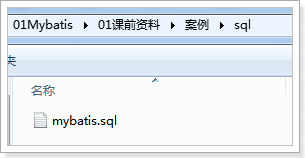

导入后效果如下图：

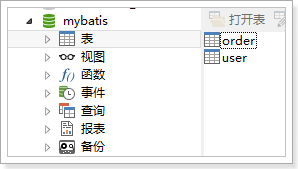

创建工程
--------

开发环境：

IDE：eclipse Mars2

JDK：1.7

1.  创建一个java工程。

按下图进行创建

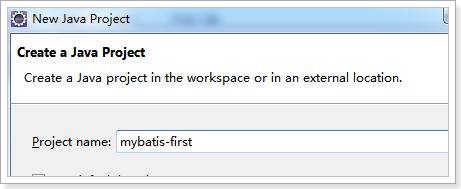

1.  需要mysql 的数据库驱动，如下图位置找到jar包。

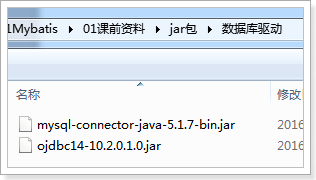

jdbc编程步骤：
--------------

1.  加载数据库驱动

2.  创建并获取数据库链接

3.  创建jdbc statement对象

4.  设置sql语句

5.  设置sql语句中的参数(使用preparedStatement)

6.  通过statement执行sql并获取结果

7.  对sql执行结果进行解析处理

8.  释放资源(resultSet、preparedstatement、connection)

jdbc程序
--------

**public static void** main(String[] args) {

Connection connection = **null**;

PreparedStatement preparedStatement = **null**;

ResultSet resultSet = **null**;

**try** {

// 加载数据库驱动

Class.*forName*("com.mysql.jdbc.Driver");

// 通过驱动管理类获取数据库链接

connection =
DriverManager.*getConnection*("jdbc:mysql://localhost:3306/mybatis?characterEncoding=utf-8",
"root", "root");

// 定义sql语句 ?表示占位符

String sql = "select \* from user where username = ?";

// 获取预处理statement

preparedStatement = connection.prepareStatement(sql);

//
设置参数，第一个参数为sql语句中参数的序号（从1开始），第二个参数为设置的参数值

preparedStatement.setString(1, "王五");

// 向数据库发出sql执行查询，查询出结果集

resultSet = preparedStatement.executeQuery();

// 遍历查询结果集

**while** (resultSet.next()) {

System.*out*.println(resultSet.getString("id") + " " +
resultSet.getString("username"));

}

} **catch** (Exception e) {

e.printStackTrace();

} **finally** {

// 释放资源

**if** (resultSet != **null**) {

**try** {

resultSet.close();

} **catch** (SQLException e) {

// **TODO** Auto-generated catch block

e.printStackTrace();

}

}

**if** (preparedStatement != **null**) {

**try** {

preparedStatement.close();

} **catch** (SQLException e) {

// **TODO** Auto-generated catch block

e.printStackTrace();

}

}

**if** (connection != **null**) {

**try** {

connection.close();

} **catch** (SQLException e) {

// **TODO** Auto-generated catch block

e.printStackTrace();

}

}

}

}

上边使用jdbc的原始方法（未经封装）实现了查询数据库表记录的操作。

jdbc问题总结如下：
------------------

1.  数据库连接创建、释放频繁造成系统资源浪费，从而影响系统性能。如果使用数据库连接池可解决此问题。

2.  Sql语句在代码中硬编码，造成代码不易维护，实际应用中sql变化的可能较大，sql变动需要改变java代码。

3.  使用preparedStatement向占有位符号传参数存在硬编码，因为sql语句的where条件不一定，可能多也可能少，修改sql还要修改代码，系统不易维护。

4.  对结果集解析存在硬编码（查询列名），sql变化导致解析代码变化，系统不易维护，如果能将数据库记录封装成pojo对象解析比较方便。

Mybatis架构
===========

1.  mybatis配置

SqlMapConfig.xml，此文件作为mybatis的全局配置文件，配置了mybatis的运行环境等信息。

mapper.xml文件即sql映射文件，文件中配置了操作数据库的sql语句。此文件需要在SqlMapConfig.xml中加载。

1.  通过mybatis环境等配置信息构造SqlSessionFactory即会话工厂

2.  由会话工厂创建sqlSession即会话，操作数据库需要通过sqlSession进行。

3.  mybatis底层自定义了Executor执行器接口操作数据库，Executor接口有两个实现，一个是基本执行器、一个是缓存执行器。

4.  Mapped
    Statement也是mybatis一个底层封装对象，它包装了mybatis配置信息及sql映射信息等。mapper.xml文件中一个sql对应一个Mapped
    Statement对象，sql的id即是Mapped statement的id。

5.  Mapped
    Statement对sql执行输入参数进行定义，包括HashMap、基本类型、pojo，Executor通过Mapped
    Statement在执行sql前将输入的java对象映射至sql中，输入参数映射就是jdbc编程中对preparedStatement设置参数。

6.  Mapped
    Statement对sql执行输出结果进行定义，包括HashMap、基本类型、pojo，Executor通过Mapped
    Statement在执行sql后将输出结果映射至java对象中，输出结果映射过程相当于jdbc编程中对结果的解析处理过程。

Mybatis入门程序
===============

mybatis下载
-----------

mybaits的代码由github.com管理

下载地址：https://github.com/mybatis/mybatis-3/releases

课前资料提供的mybatis如下：

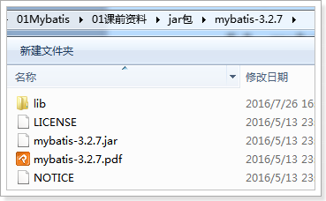

mybatis-3.2.7.jar mybatis的核心包

lib文件夹 mybatis的依赖包所在

mybatis-3.2.7.pdf mybatis使用手册

业务需求
--------

使用MyBatis实现以下功能：

根据用户id查询一个用户

根据用户名称模糊查询用户列表

添加用户

更新用户

删除用户

环境搭建
--------

### 创建java工程

如下图使用之前创建的mybatis-first工程

### 加入jar包

加入mybatis核心包、依赖包、数据驱动包。

mybatis核心包

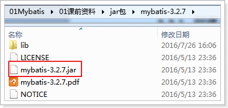

mybatis依赖包

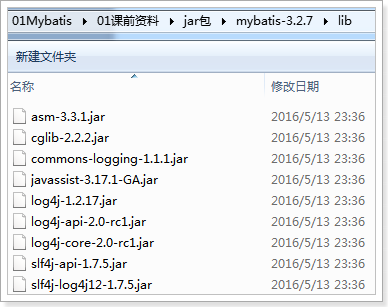

数据库驱动包（已添加）

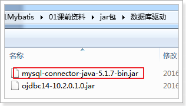

效果：

### 加入配置文件

如下图创建资源文件夹config，加入log4j.properties和SqlMapConfig.xml配置文件

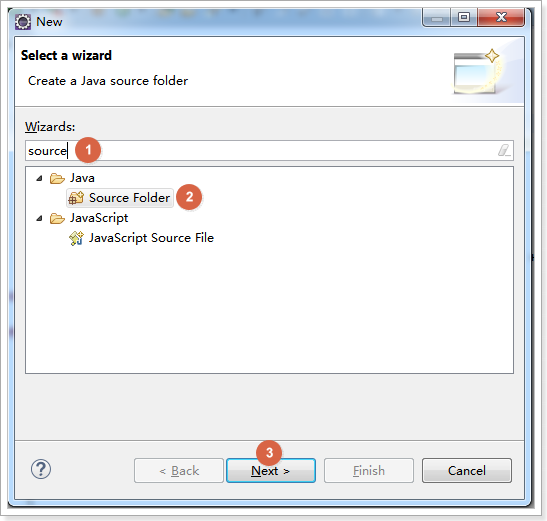

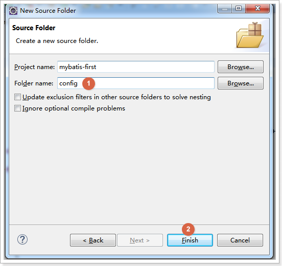

#### log4j.properties

在config下创建log4j.properties如下：

\# Global logging configuration

log4j.rootLogger=DEBUG, stdout

\# Console output...

log4j.appender.stdout=org.apache.log4j.ConsoleAppender

log4j.appender.stdout.layout=org.apache.log4j.PatternLayout

log4j.appender.stdout.layout.ConversionPattern=%5p [%t] - %m%n

mybatis默认使用log4j作为输出日志信息。

#### SqlMapConfig.xml

在config下创建SqlMapConfig.xml，如下：

\<?xml version=*"1.0"* encoding=*"UTF-8"* ?\>

\<!DOCTYPE configuration

PUBLIC "-//mybatis.org//DTD Config 3.0//EN"

"http://mybatis.org/dtd/mybatis-3-config.dtd"\>

\<configuration\>

\<!-- 和spring整合后 environments配置将废除 --\>

\<environments default=*"development"*\>

\<environment id=*"development"*\>

\<!-- 使用jdbc事务管理 --\>

\<transactionManager type=*"JDBC"* /\>

\<!-- 数据库连接池 --\>

\<dataSource type=*"POOLED"*\>

\<property name=*"driver"* value=*"com.mysql.jdbc.Driver"* /\>

\<property name=*"url"*

value=*"jdbc:mysql://localhost:3306/mybatis?characterEncoding=utf-8"* /\>

\<property name=*"username"* value=*"root"* /\>

\<property name=*"password"* value=*"root"* /\>

\</dataSource\>

\</environment\>

\</environments\>

\</configuration\>

SqlMapConfig.xml是mybatis核心配置文件，配置文件内容为数据源、事务管理。

#### 效果

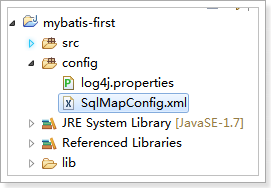

### 创建pojo

pojo类作为mybatis进行sql映射使用，po类通常与数据库表对应，

数据库user表如下图：

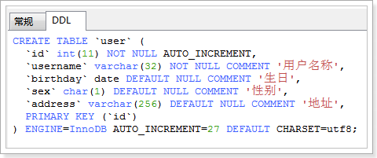

User.java如下：

**Public class** User {

**private int** id;

**private** String username;// 用户姓名

**private** String sex;// 性别

**private** Date birthday;// 生日

**private** String address;// 地址

get/set……

### 第六步：sql映射文件

在config下的sqlmap目录下创建sql映射文件User.xml：

\<?xml version=*"1.0"* encoding=*"UTF-8"* ?\>

\<!DOCTYPE mapper

PUBLIC "-//mybatis.org//DTD Mapper 3.0//EN"

"http://mybatis.org/dtd/mybatis-3-mapper.dtd"\>

\<!-- namespace：命名空间，用于隔离sql，还有一个很重要的作用，后面会讲 --\>

\<mapper namespace=*"test"*\>

\</mapper\>

### 第七步：加载映射文件

mybatis框架需要加载Mapper.xml映射文件

将users.xml添加在SqlMapConfig.xml，如下：

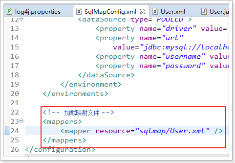

实现根据id查询用户
------------------

使用的sql:

SELECT \* FROM \`user\` WHERE id = 1

### 映射文件：

在user.xml中添加select标签，编写sql：

\<?xml version=*"1.0"* encoding=*"UTF-8"* ?\>

\<!DOCTYPE mapper

PUBLIC "-//mybatis.org//DTD Mapper 3.0//EN"

"http://mybatis.org/dtd/mybatis-3-mapper.dtd"\>

\<!-- namespace：命名空间，用于隔离sql，还有一个很重要的作用，后面会讲 --\>

\<mapper namespace=*"test"*\>

\<!-- id:statement的id 或者叫做sql的id--\>

\<!-- parameterType:声明输入参数的类型 --\>

\<!-- resultType:声明输出结果的类型，应该填写pojo的全路径 --\>//手动映射

\<!-- \#{}：输入参数的占位符，相当于jdbc的？ --\>

\<select id=*"queryUserById"* parameterType=*"int"*

resultType=*"cn.itcast.mybatis.pojo.User"*\>

SELECT \* FROM \`user\` WHERE id = \#{id}

\</select\>

\</mapper\>

### 测试程序：

测试程序步骤：

1. 创建SqlSessionFactoryBuilder对象

2. 加载SqlMapConfig.xml配置文件

3. 创建SqlSessionFactory对象

4. 创建SqlSession对象

5. 执行SqlSession对象执行查询，获取结果User

6. 打印结果

7. 释放资源

MybatisTest编写测试程序如下：

**public class** MybatisTest {

**private** SqlSessionFactory sqlSessionFactory = **null**;

\@Before

**public void** init() **throws** Exception {

// 1. 创建SqlSessionFactoryBuilder对象

SqlSessionFactoryBuilder sqlSessionFactoryBuilder = **new**
SqlSessionFactoryBuilder();

// 2. 加载SqlMapConfig.xml配置文件

InputStream inputStream = Resources.*getResourceAsStream*("SqlMapConfig.xml");

// 3. 创建SqlSessionFactory对象

**this**.sqlSessionFactory = sqlSessionFactoryBuilder.build(inputStream);

}

\@Test

**public void** testQueryUserById() **throws** Exception {

// 4. 创建SqlSession对象

SqlSession sqlSession = sqlSessionFactory.openSession();

// 5. 执行SqlSession对象执行查询，获取结果User

// 第一个参数是User.xml的statement的id，第二个参数是执行sql需要的参数；

Object user = sqlSession.selectOne("queryUserById", 1);

// 6. 打印结果

System.*out*.println(user);

// 7. 释放资源

sqlSession.close();

}

}

### 效果

测试结果如下图

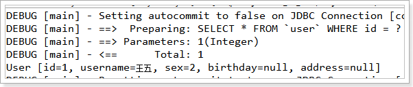

实现根据用户名模糊查询用户
--------------------------

查询sql：

SELECT \* FROM \`user\` WHERE username LIKE '%王%'

### 方法一

#### 映射文件

在User.xml配置文件中添加如下内容：

\<!-- 如果返回多个结果，mybatis会自动把返回的结果放在list容器中 --\>

\<!-- resultType的配置和返回一个结果的配置一样 --\>

\<select id=*"queryUserByUsername1"* parameterType=*"string"*

resultType=*"cn.itcast.mybatis.pojo.User"*\>

SELECT \* FROM \`user\` WHERE username LIKE \#{username}

\</select\>

#### 测试程序

MybatisTest中添加测试方法如下：

\@Test

**public void** testQueryUserByUsername1() **throws** Exception {

// 4. 创建SqlSession对象

SqlSession sqlSession = sqlSessionFactory.openSession();

// 5. 执行SqlSession对象执行查询，获取结果User

// 查询多条数据使用selectList方法

List\<Object\> list = sqlSession.selectList("queryUserByUsername1", "%王%");

// 6. 打印结果

**for** (Object user : list) {

System.*out*.println(user);

}

// 7. 释放资源

sqlSession.close();

}

#### 效果

测试效果如下图：

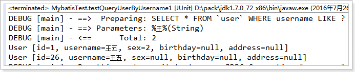

### 方法二

#### 映射文件：

在User.xml配置文件中添加如下内容：

\<!-- 如果传入的参数是简单数据类型，\${}里面必须写value --\>

\<select id=*"queryUserByUsername2"* parameterType=*"string"*

resultType=*"cn.itcast.mybatis.pojo.User"*\>

SELECT \* FROM \`user\` WHERE username LIKE '%\${value}%'

\</select\>

#### 测试程序：

MybatisTest中添加测试方法如下：

\@Test

**public void** testQueryUserByUsername2() **throws** Exception {

// 4. 创建SqlSession对象

SqlSession sqlSession = sqlSessionFactory.openSession();

// 5. 执行SqlSession对象执行查询，获取结果User

// 查询多条数据使用selectList方法

List\<Object\> list = sqlSession.selectList("queryUserByUsername2", "王");

// 6. 打印结果

**for** (Object user : list) {

System.*out*.println(user);

}

// 7. 释放资源

sqlSession.close();

}

#### 效果

测试结果如下图：

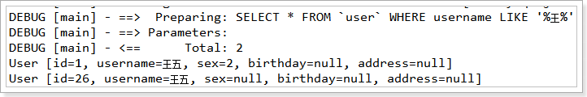

小结
----

### \#{}和\${}

\#{}表示一个占位符号，通过\#{}可以实现preparedStatement向占位符中设置值，自动进行java类型和jdbc类型转换。\#{}可以有效防止sql注入。
\#{}可以接收简单类型值或pojo属性值。
如果parameterType传输单个简单类型值，\#{}括号中可以是value或其它名称。

\${}表示拼接sql串，通过\${}可以将parameterType
传入的内容拼接在sql中且不进行jdbc类型转换，
\${}可以接收简单类型值或pojo属性值，如果parameterType传输单个简单类型值，\${}括号中只能是value。

### parameterType和resultType

parameterType：指定输入参数类型，mybatis通过ognl从输入对象中获取参数值拼接在sql中。

resultType：指定输出结果类型，mybatis将sql查询结果的一行记录数据映射为resultType指定类型的对象。如果有多条数据，则分别进行映射，并把对象放到容器List中

### selectOne和selectList

selectOne查询一条记录，如果使用selectOne查询多条记录则抛出异常：

*org.apache.ibatis.exceptions.TooManyResultsException*: Expected one result (or
null) to be returned by selectOne(), but found: 3

at
org.apache.ibatis.session.defaults.DefaultSqlSession.selectOne(*DefaultSqlSession.java:70*)

selectList可以查询一条或多条记录。

实现添加用户
------------

使用的sql：

INSERT INTO \`user\` (username,birthday,sex,address) VALUES

('黄忠','2016-07-26','1','三国')

### 映射文件：

在User.xml配置文件中添加如下内容：

\<!-- 保存用户 --\>

\<insert id=*"saveUser"* parameterType=*"cn.itcast.mybatis.pojo.User"*\>

INSERT INTO \`user\`

(username,birthday,sex,address) VALUES

(\#{username},\#{birthday},\#{sex},\#{address})

\</insert\>

### 测试程序

MybatisTest中添加测试方法如下：

\@Test

**public void** testSaveUser() {

// 4. 创建SqlSession对象

SqlSession sqlSession = sqlSessionFactory.openSession();

// 5. 执行SqlSession对象执行保存

// 创建需要保存的User

User user = **new** User();

user.setUsername("张飞");

user.setSex("1");

user.setBirthday(**new** Date());

user.setAddress("蜀国");

sqlSession.insert("saveUser", user);

System.*out*.println(user);

// 需要进行事务提交

sqlSession.commit();

// 7. 释放资源

sqlSession.close();

}

### 效果

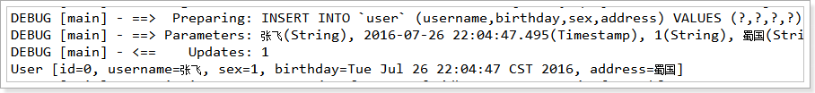

如上所示，保存成功，但是id=0，需要解决id返回不正常的问题。

### mysql自增主键返回

查询id的sql

SELECT LAST_INSERT_ID()

通过修改User.xml映射文件，可以将mysql自增主键返回：

如下添加selectKey 标签

\<!-- 保存用户 --\>

\<insert id=*"saveUser"* parameterType=*"cn.itcast.mybatis.pojo.User"*\>

\<!-- selectKey 标签实现主键返回 --\>

\<!-- keyColumn:主键对应的表中的哪一列 --\>

\<!-- keyProperty：主键对应的pojo中的哪一个属性 --\>

\<!--
order：设置在执行insert语句前执行查询id的sql，孩纸在执行insert语句之后执行查询id的sql
--\>

\<!-- resultType：设置返回的id的类型 --\>

\<selectKey keyColumn=*"id"* keyProperty=*"id"* order=*"AFTER"*

resultType=*"int"*\>

SELECT LAST_INSERT_ID()

\</selectKey\>

INSERT INTO \`user\`

(username,birthday,sex,address) VALUES

(\#{username},\#{birthday},\#{sex},\#{address})

\</insert\>

LAST_INSERT_ID():是mysql的函数，返回auto_increment自增列新记录id值。

效果如下图所示：

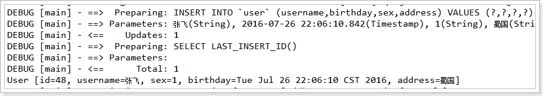

返回的id为48，能够正确的返回id了。

### Mysql使用 uuid实现主键

需要增加通过select uuid()得到uuid值

\<!-- 保存用户 --\>

\<insert id=*"saveUser"* parameterType=*"cn.itcast.mybatis.pojo.User"*\>

\<!-- selectKey 标签实现主键返回 --\>

\<!-- keyColumn:主键对应的表中的哪一列 --\>

\<!-- keyProperty：主键对应的pojo中的哪一个属性 --\>

\<!--
order：设置在执行insert语句前执行查询id的sql，孩纸在执行insert语句之后执行查询id的sql
--\>

\<!-- resultType：设置返回的id的类型 --\>

\<selectKey keyColumn=*"id"* keyProperty=*"id"* order=*"BEFORE"*

resultType=*"string"*\>

SELECT LAST_INSERT_ID()

\</selectKey\>

INSERT INTO \`user\`

(username,birthday,sex,address) VALUES

(\#{username},\#{birthday},\#{sex},\#{address})

\</insert\>

注意这里使用的order是“BEFORE”

修改用户
--------

根据用户id修改用户名

使用的sql：

UPDATE \`user\` SET username = '赵云' WHERE id = 26

### 映射文件

在User.xml配置文件中添加如下内容：

\<!-- 更新用户 --\>

\<update id=*"updateUserById"* parameterType=*"cn.itcast.mybatis.pojo.User"*\>

UPDATE \`user\` SET

username = \#{username} WHERE id = \#{id}

\</update\>

### 测试程序

MybatisTest中添加测试方法如下：

\@Test

**public void** testUpdateUserById() {

// 4. 创建SqlSession对象

SqlSession sqlSession = sqlSessionFactory.openSession();

// 5. 执行SqlSession对象执行更新

// 创建需要更新的User

User user = **new** User();

user.setId(26);

user.setUsername("关羽");

user.setSex("1");

user.setBirthday(**new** Date());

user.setAddress("蜀国");

sqlSession.update("updateUserById", user);

// 需要进行事务提交

sqlSession.commit();

// 7. 释放资源

sqlSession.close();

}

### 效果

测试效果如下图：

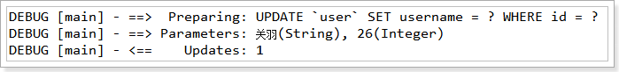

删除用户
--------

根据用户id删除用户

使用的sql  
DELETE FROM \`user\` WHERE id = 47

### 映射文件：

在User.xml配置文件中添加如下内容：

\<!-- 删除用户 --\>

\<delete id=*"deleteUserById"* parameterType=*"int"*\>

delete from user where

id=\#{id}

\</delete\>

### 测试程序：

MybatisTest中添加测试方法如下：

\@Test

**public void** testDeleteUserById() {

// 4. 创建SqlSession对象

SqlSession sqlSession = sqlSessionFactory.openSession();

// 5. 执行SqlSession对象执行删除

sqlSession.delete("deleteUserById", 48);

// 需要进行事务提交

sqlSession.commit();

// 7. 释放资源

sqlSession.close();

}

### 效果

测试效果如下图：

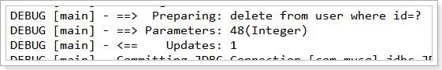

Mybatis解决jdbc编程的问题
-------------------------

1.  数据库连接创建、释放频繁造成系统资源浪费从而影响系统性能，如果使用数据库连接池可解决此问题。

>   解决：在SqlMapConfig.xml中配置数据连接池，使用连接池管理数据库链接。

1.  Sql语句写在代码中造成代码不易维护，实际应用sql变化的可能较大，sql变动需要改变java代码。

>   解决：将Sql语句配置在XXXXmapper.xml文件中与java代码分离。

1.  向sql语句传参数麻烦，因为sql语句的where条件不一定，可能多也可能少，占位符需要和参数一一对应。

>   解决：Mybatis自动将java对象映射至sql语句，通过statement中的parameterType定义输入参数的类型。

1.  对结果集解析麻烦，sql变化导致解析代码变化，且解析前需要遍历，如果能将数据库记录封装成pojo对象解析比较方便。

>   解决：Mybatis自动将sql执行结果映射至java对象，通过statement中的resultType定义输出结果的类型。

mybatis与hibernate不同
----------------------

Mybatis和hibernate不同，它不完全是一个ORM框架，因为MyBatis需要程序员自己编写Sql语句。mybatis可以通过XML或注解方式灵活配置要运行的sql语句，并将java对象和sql语句映射生成最终执行的sql，最后将sql执行的结果再映射生成java对象。

Mybatis学习门槛低，简单易学，程序员直接编写原生态sql，可严格控制sql执行性能，灵活度高，非常适合对关系数据模型要求不高的软件开发，例如互联网软件、企业运营类软件等，因为这类软件需求变化频繁，一但需求变化要求成果输出迅速。但是灵活的前提是mybatis无法做到数据库无关性，如果需要实现支持多种数据库的软件则需要自定义多套sql映射文件，工作量大。

Hibernate对象/关系映射能力强，数据库无关性好，对于关系模型要求高的软件（例如需求固定的定制化软件）如果用hibernate开发可以节省很多代码，提高效率。但是Hibernate的学习门槛高，要精通门槛更高，而且怎么设计O/R映射，在性能和对象模型之间如何权衡，以及怎样用好Hibernate需要具有很强的经验和能力才行。

总之，按照用户的需求在有限的资源环境下只要能做出维护性、扩展性良好的软件架构都是好架构，所以框架只有适合才是最好。 

Dao开发方法
===========

使用MyBatis开发Dao，通常有两个方法，即原始Dao开发方法和Mapper动态代理开发方法。

需求
----

使用MyBatis开发DAO实现以下的功能：

根据用户id查询一个用户信息

根据用户名称模糊查询用户信息列表

添加用户信息

SqlSession的使用范围
--------------------

SqlSession中封装了对数据库的操作，如：查询、插入、更新、删除等。

SqlSession通过SqlSessionFactory创建。

SqlSessionFactory是通过SqlSessionFactoryBuilder进行创建。

### SqlSessionFactoryBuilder

SqlSessionFactoryBuilder用于创建SqlSessionFacoty，SqlSessionFacoty一旦创建完成就不需要SqlSessionFactoryBuilder了，因为SqlSession是通过SqlSessionFactory创建的。所以可以将SqlSessionFactoryBuilder当成一个工具类使用，最佳使用范围是方法范围即方法体内局部变量。

### SqlSessionFactory

SqlSessionFactory是一个接口，接口中定义了openSession的不同重载方法，SqlSessionFactory的最佳使用范围是整个应用运行期间，一旦创建后可以重复使用，通常以单例模式管理SqlSessionFactory。

### SqlSession

SqlSession是一个面向用户的接口，sqlSession中定义了数据库操作方法。

每个线程都应该有它自己的SqlSession实例。SqlSession的实例不能共享使用，它也是线程不安全的。因此最佳的范围是请求或方法范围。绝对不能将SqlSession实例的引用放在一个类的静态字段或实例字段中。

打开一个 SqlSession；使用完毕就要关闭它。通常把这个关闭操作放到 finally
块中以确保每次都能执行关闭。如下：

SqlSession session = sqlSessionFactory.openSession();

**try** {

// do work

} **finally** {

session.close();

}

原始Dao开发方式
---------------

原始Dao开发方法需要程序员编写Dao接口和Dao实现类。

### 映射文件

编写映射文件如下：（也可以使用入门程序完成的映射文件）

\<?xml version=*"1.0"* encoding=*"UTF-8"* ?\>

\<!DOCTYPE mapper

PUBLIC "-//mybatis.org//DTD Mapper 3.0//EN"

"http://mybatis.org/dtd/mybatis-3-mapper.dtd"\>

\<!-- namespace：命名空间，用于隔离sql，还有一个很重要的作用，后面会讲 --\>

\<mapper namespace=*"test"*\>

\<!-- 根据id查询用户 --\>

\<select id=*"queryUserById"* parameterType=*"int"*

resultType=*"cn.itcast.mybatis.pojo.User"*\>

select \* from user where id = \#{id}

\</select\>

\<!-- 根据username模糊查询用户 --\>

\<select id=*"queryUserByUsername"* parameterType=*"string"*

resultType=*"cn.itcast.mybatis.pojo.User"*\>

select \* from user where username like '%\${value}%'

\</select\>

\<!-- 保存用户 --\>

\<insert id=*"saveUser"* parameterType=*"cn.itcast.mybatis.pojo.User"*\>

\<selectKey keyProperty=*"id"* keyColumn=*"id"* order=*"AFTER"*

resultType=*"int"*\>

SELECT LAST_INSERT_ID()

\</selectKey\>

insert into user(username,birthday,sex,address)

values(\#{username},\#{birthday},\#{sex},\#{address})

\</insert\>

\</mapper\>

### Dao接口

先进行DAO的接口开发，编码如下：

**public interface** UserDao {

/\*\*

\* 根据id查询用户

\*

\* **\@param** id

\* **\@return**

\*/

User queryUserById(**int** id);

/\*\*

\* 根据用户名模糊查询用户

\*

\* **\@param** username

\* **\@return**

\*/

List\<User\> queryUserByUsername(String username);

/\*\*

\* 保存用户

\*

\* **\@param** user

\*/

**void** saveUser(User user);

}

### Dao实现类

编写的Dao实现类如下

**public class** UserDaoImpl **implements** UserDao {

**private** SqlSessionFactory sqlSessionFactory;

**public** UserDaoImpl(SqlSessionFactory sqlSessionFactory) {

**super**();

**this**.sqlSessionFactory = sqlSessionFactory;

}

\@Override

**public** User queryUserById(**int** id) {

// 创建SqlSession

SqlSession sqlSession = **this**.sqlSessionFactory.openSession();

// 执行查询逻辑

User user = sqlSession.selectOne("queryUserById", id);

// 释放资源

sqlSession.close();

**return** user;

}

\@Override

**public** List\<User\> queryUserByUsername(String username) {

// 创建SqlSession

SqlSession sqlSession = **this**.sqlSessionFactory.openSession();

// 执行查询逻辑

List\<User\> list = sqlSession.selectList("queryUserByUsername", username);

// 释放资源

sqlSession.close();

**return** list;

}

\@Override

**public void** saveUser(User user) {

// 创建SqlSession

SqlSession sqlSession = **this**.sqlSessionFactory.openSession();

// 执行保存逻辑

sqlSession.insert("saveUser", user);

// 提交事务

sqlSession.commit();

// 释放资源

sqlSession.close();

}

}

### Dao测试

创建一个JUnit的测试类，对UserDao进行测试，测试代码如下：

**public class** UserDaoTest {

**private** SqlSessionFactory sqlSessionFactory;

\@Before

**public void** init() **throws** Exception {

// 创建SqlSessionFactoryBuilder

SqlSessionFactoryBuilder sqlSessionFactoryBuilder = **new**
SqlSessionFactoryBuilder();

// 加载SqlMapConfig.xml配置文件

InputStream inputStream = Resources.*getResourceAsStream*("SqlMapConfig.xml");

// 创建SqlsessionFactory

**this**.sqlSessionFactory = sqlSessionFactoryBuilder.build(inputStream);

}

\@Test

**public void** testQueryUserById() {

// 创建DAO

UserDao userDao = **new** UserDaoImpl(**this**.sqlSessionFactory);

// 执行查询

User user = userDao.queryUserById(1);

System.*out*.println(user);

}

\@Test

**public void** testQueryUserByUsername() {

// 创建DAO

UserDao userDao = **new** UserDaoImpl(**this**.sqlSessionFactory);

// 执行查询

List\<User\> list = userDao.queryUserByUsername("张");

**for** (User user : list) {

System.*out*.println(user);

}

}

\@Test

**public void** testSaveUser() {

// 创建DAO

UserDao userDao = **new** UserDaoImpl(**this**.sqlSessionFactory);

// 创建保存对象

User user = **new** User();

user.setUsername("刘备");

user.setBirthday(**new** Date());

user.setSex("1");

user.setAddress("蜀国");

// 执行保存

userDao.saveUser(user);

System.*out*.println(user);

}

}

### 问题

原始Dao开发中存在以下问题：

-   Dao方法体存在重复代码：通过SqlSessionFactory创建SqlSession，调用SqlSession的数据库操作方法

-   调用sqlSession的数据库操作方法需要指定statement的id，这里存在硬编码，不得于开发维护。

Mapper动态代理方式 
-------------------

### 开发规范

Mapper接口开发方法只需要程序员编写Mapper接口（相当于Dao接口），由Mybatis框架根据接口定义创建接口的动态代理对象，代理对象的方法体同上边Dao接口实现类方法。

Mapper接口开发需要遵循以下规范：

1.  Mapper.xml文件中的namespace与mapper接口的类路径相同。

2.  Mapper接口方法名和Mapper.xml中定义的每个statement的id相同

3.  Mapper接口方法的输入参数类型和mapper.xml中定义的每个sql
    的parameterType的类型相同

4.  Mapper接口方法的输出参数类型和mapper.xml中定义的每个sql的resultType的类型相同

### Mapper.xml(映射文件)

定义mapper映射文件UserMapper.xml

将UserMapper.xml放在config下mapper目录下，效果如下：

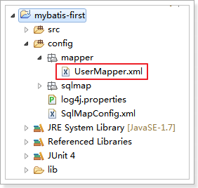

UserMapper.xml配置文件内容：

\<?xml version=*"1.0"* encoding=*"UTF-8"* ?\>

\<!DOCTYPE mapper

PUBLIC "-//mybatis.org//DTD Mapper 3.0//EN"

"http://mybatis.org/dtd/mybatis-3-mapper.dtd"\>

\<!-- namespace：命名空间，用于隔离sql --\>

\<!-- 还有一个很重要的作用，使用动态代理开发DAO，1.
namespace必须和Mapper接口类路径一致 --\>

\<mapper namespace=*"cn.itcast.mybatis.mapper.UserMapper"*\>

\<!-- 根据用户id查询用户 --\>

\<!-- 2. id必须和Mapper接口方法名一致 --\>

\<!-- 3. parameterType必须和接口方法参数类型一致 --\>

\<!-- 4. resultType必须和接口方法返回值类型一致 --\>

\<select id=*"queryUserById"* parameterType=*"int"*

resultType=*"cn.itcast.mybatis.pojo.User"*\>

select \* from user where id = \#{id}

\</select\>

\<!-- 根据用户名查询用户 --\>

\<select id=*"queryUserByUsername"* parameterType=*"string"*

resultType=*"cn.itcast.mybatis.pojo.User"*\>

select \* from user where username like '%\${value}%'

\</select\>

\<!-- 保存用户 --\>

\<insert id=*"saveUser"* parameterType=*"cn.itcast.mybatis.pojo.User"*\>

\<selectKey keyProperty=*"id"* keyColumn=*"id"* order=*"AFTER"*

resultType=*"int"*\>

select last_insert_id()

\</selectKey\>

insert into user(username,birthday,sex,address) values

(\#{username},\#{birthday},\#{sex},\#{address});

\</insert\>

\</mapper\>

### UserMapper(接口文件)

创建UserMapper接口代码如下：

**public interface** UserMapper {

/\*\*

\* 根据id查询

\*

\* **\@param** id

\* **\@return**

\*/

User queryUserById(**int** id);

/\*\*

\* 根据用户名查询用户

\*

\* **\@param** username

\* **\@return**

\*/

List\<User\> queryUserByUsername(String username);

/\*\*

\* 保存用户

\*

\* **\@param** user

\*/

**void** saveUser(User user);

}

### 加载UserMapper.xml文件

修改SqlMapConfig.xml文件，添加以下所示的内容：

\<!-- 加载映射文件 --\>

\<mappers\>

\<mapper resource=*"sqlmap/User.xml"* /\>

\<mapper resource=*"mapper/UserMapper.xml"* /\>

\</mappers\>

### 测试

编写的测试方法如下：

**public class** UserMapperTest {

**private** SqlSessionFactory sqlSessionFactory;

\@Before

**public void** init() **throws** Exception {

// 创建SqlSessionFactoryBuilder

SqlSessionFactoryBuilder sqlSessionFactoryBuilder = **new**
SqlSessionFactoryBuilder();

// 加载SqlMapConfig.xml配置文件

InputStream inputStream = Resources.*getResourceAsStream*("SqlMapConfig.xml");

// 创建SqlsessionFactory

**this**.sqlSessionFactory = sqlSessionFactoryBuilder.build(inputStream);

}

\@Test

**public void** testQueryUserById() {

// 获取sqlSession，和spring整合后由spring管理

SqlSession sqlSession = **this**.sqlSessionFactory.openSession();

// 从sqlSession中获取Mapper接口的代理对象

UserMapper userMapper = sqlSession.getMapper(UserMapper.**class**);

// 执行查询方法

User user = userMapper.queryUserById(1);

System.*out*.println(user);

// 和spring整合后由spring管理

sqlSession.close();

}

\@Test

**public void** testQueryUserByUsername() {

// 获取sqlSession，和spring整合后由spring管理

SqlSession sqlSession = **this**.sqlSessionFactory.openSession();

// 从sqlSession中获取Mapper接口的代理对象

UserMapper userMapper = sqlSession.getMapper(UserMapper.**class**);

// 执行查询方法

List\<User\> list = userMapper.queryUserByUsername("张");

**for** (User user : list) {

System.*out*.println(user);

}

// 和spring整合后由spring管理

sqlSession.close();

}

\@Test

**public void** testSaveUser() {

// 获取sqlSession，和spring整合后由spring管理

SqlSession sqlSession = **this**.sqlSessionFactory.openSession();

// 从sqlSession中获取Mapper接口的代理对象

UserMapper userMapper = sqlSession.getMapper(UserMapper.**class**);

// 创建保存对象

User user = **new** User();

user.setUsername("刘备");

user.setBirthday(**new** Date());

user.setSex("1");

user.setAddress("蜀国");

// 执行查询方法

userMapper.saveUser(user);

System.*out*.println(user);

// 和spring整合后由spring管理

sqlSession.commit();

sqlSession.close();

}

}

### 小结

-   selectOne和selectList

动态代理对象调用sqlSession.selectOne()和sqlSession.selectList()是根据mapper接口方法的返回值决定，如果返回list则调用selectList方法，如果返回单个对象则调用selectOne方法。

-   namespace

mybatis官方推荐使用mapper代理方法开发mapper接口，程序员不用编写mapper接口实现类，使用mapper代理方法时，输入参数可以使用pojo包装对象或map对象，保证dao的通用性。

SqlMapConfig.xml配置文件
========================

配置内容
--------

SqlMapConfig.xml中配置的内容和顺序如下：

**properties**（属性）

settings（全局配置参数）

**typeAliases**（类型别名）

typeHandlers（类型处理器）

objectFactory（对象工厂）

plugins（插件）

environments（环境集合属性对象）

environment（环境子属性对象）

>   transactionManager（事务管理）

>   dataSource（数据源）

**mappers**（映射器）

properties（属性）
------------------

SqlMapConfig.xml可以引用java属性文件中的配置信息如下：

在config下定义db.properties文件，如下所示：

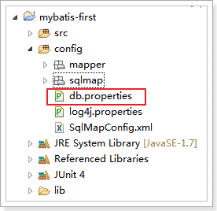

db.properties配置文件内容如下：

jdbc.driver=com.mysql.jdbc.Driver

jdbc.url=jdbc:mysql://localhost:3306/mybatis?characterEncoding=utf-8

jdbc.username=root

jdbc.password=root

SqlMapConfig.xml引用如下：

\<?xml version=*"1.0"* encoding=*"UTF-8"* ?\>

\<!DOCTYPE configuration

PUBLIC "-//mybatis.org//DTD Config 3.0//EN"

"http://mybatis.org/dtd/mybatis-3-config.dtd"\>

\<configuration\>

\<!-- 是用resource属性加载外部配置文件 --\>

\<properties resource=*"db.properties"*\>

\<!-- 在properties内部用property定义属性 --\>

\<!-- 如果外部配置文件有该属性，则内部定义属性被外部属性覆盖 --\>

\<property name=*"jdbc.username"* value=*"root123"* /\>

\<property name=*"jdbc.password"* value=*"root123"* /\>

\</properties\>

\<!-- 和spring整合后 environments配置将废除 --\>

\<environments default=*"development"*\>

\<environment id=*"development"*\>

\<!-- 使用jdbc事务管理 --\>

\<transactionManager type=*"JDBC"* /\>

\<!-- 数据库连接池 --\>

\<dataSource type=*"POOLED"*\>

\<property name=*"driver"* value=*"\${jdbc.driver}"* /\>

\<property name=*"url"* value=*"\${jdbc.url}"* /\>

\<property name=*"username"* value=*"\${jdbc.username}"* /\>

\<property name=*"password"* value=*"\${jdbc.password}"* /\>

\</dataSource\>

\</environment\>

\</environments\>

\<!-- 加载映射文件 --\>

\<mappers\>

\<mapper resource=*"sqlmap/User.xml"* /\>

\<mapper resource=*"mapper/UserMapper.xml"* /\>

\</mappers\>

\</configuration\>

注意： MyBatis 将按照下面的顺序来加载属性：

-   在 properties 元素体内定义的属性首先被读取。

-   然后会读取properties 元素中resource或 url
    加载的属性，它会覆盖已读取的同名属性。

typeAliases（类型别名）
-----------------------

### mybatis支持别名：

| 别名       | 映射的类型 |
|------------|------------|
| \_byte     | byte       |
| \_long     | long       |
| \_short    | short      |
| \_int      | int        |
| \_integer  | int        |
| \_double   | double     |
| \_float    | float      |
| \_boolean  | boolean    |
| string     | String     |
| byte       | Byte       |
| long       | Long       |
| short      | Short      |
| int        | Integer    |
| integer    | Integer    |
| double     | Double     |
| float      | Float      |
| boolean    | Boolean    |
| date       | Date       |
| decimal    | BigDecimal |
| bigdecimal | BigDecimal |
| map        | Map        |

### 自定义别名：

在SqlMapConfig.xml中配置如下：

\<?xml version=*"1.0"* encoding=*"UTF-8"* ?\>

\<!DOCTYPE configuration

PUBLIC "-//mybatis.org//DTD Config 3.0//EN"

"http://mybatis.org/dtd/mybatis-3-config.dtd"\>

\<configuration\>

\<!-- 是用resource属性加载外部配置文件 --\>

\<properties resource=*"db.properties"*\>

\<!-- 在properties内部用property定义属性 --\>

\<property name=*"jdbc.username"* value=*"root123"* /\>

\<property name=*"jdbc.password"* value=*"root123"* /\>

\</properties\>

\<typeAliases\>

\<!-- 单个别名定义 --\>

\<typeAlias alias=*"user"* type=*"cn.itcast.mybatis.pojo.User"* /\>

\<!-- 批量别名定义，扫描整个包下的类，别名为类名（大小写不敏感） --\>

\<package name=*"cn.itcast.mybatis.pojo"* /\>

\<package name=*"其它包"* /\>

\</typeAliases\>

\<!-- 和spring整合后 environments配置将废除 --\>

\<environments default=*"development"*\>

\<environment id=*"development"*\>

\<!-- 使用jdbc事务管理 --\>

\<transactionManager type=*"JDBC"* /\>

\<!-- 数据库连接池 --\>

\<dataSource type=*"POOLED"*\>

\<property name=*"driver"* value=*"\${jdbc.driver}"* /\>

\<property name=*"url"* value=*"\${jdbc.url}"* /\>

\<property name=*"username"* value=*"\${jdbc.username}"* /\>

\<property name=*"password"* value=*"\${jdbc.password}"* /\>

\</dataSource\>

\</environment\>

\</environments\>

\<!-- 加载映射文件 --\>

\<mappers\>

\<mapper resource=*"sqlmap/User.xml"* /\>

\<mapper resource=*"mapper/UserMapper.xml"* /\>

\</mappers\>

\</configuration\>

在mapper.xml配置文件中，就可以使用设置的别名了

别名大小写不敏感

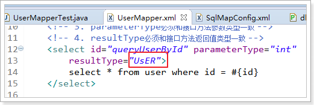

mappers（映射器）
-----------------

Mapper配置的几种方法：

### \<mapper resource=" " /\>

使用相对于类路径的资源（现在的使用方式）

如：\<mapper resource="sqlmap/User.xml" /\>

### \<mapper class=" " /\>

使用mapper接口类路径

如：\<mapper class="cn.itcast.mybatis.mapper.UserMapper"/\>

注意：此种方法要求mapper接口名称和mapper映射文件名称相同，且放在同一个目录中。

### \<package name=""/\>

注册指定包下的所有mapper接口

如：\<package name="cn.itcast.mybatis.mapper"/\>

注意：此种方法要求mapper接口名称和mapper映射文件名称相同，且放在同一个目录中。
