**Mybatis第二天**

**框架课程**

课程计划
========

1.  输入映射和输出映射

    1.  输入参数映射

    2.  返回值映射

2.  动态sql

    1.  If标签

    2.  Where标签

    3.  Sql片段

    4.  Foreach标签

3.  关联查询

    1.  一对一关联

    2.  一对多关联

4.  Mybatis整合spring

    1.  如何整合spring

    2.  使用原始的方式开发dao

    3.  使用Mapper接口动态代理

5.  Mybatis逆向工程（了解）

输入映射和输出映射
==================

Mapper.xml映射文件中定义了操作数据库的sql，每个sql是一个statement，映射文件是mybatis的核心。

环境准备
--------

1. 复制昨天的工程，按照下图进行

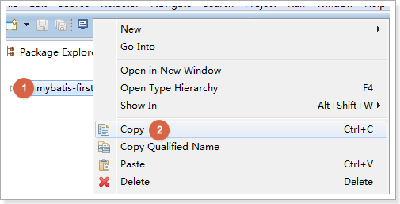

1.  如下图粘贴，并更名

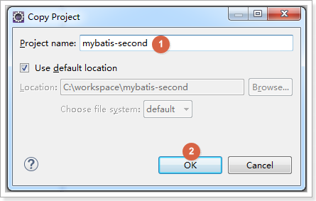

1.  只保留Mapper接口开发相关的文件，其他的删除

最终效果如下图：

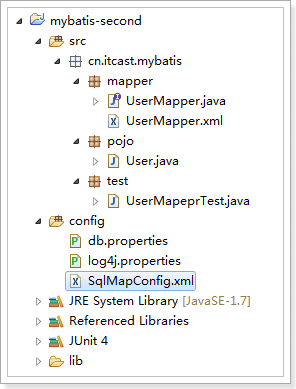

1.  如下图修改SqlMapConfig.xml配置文件。Mapper映射器只保留包扫描的方式

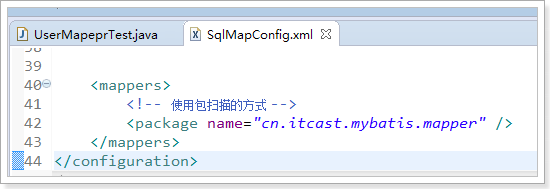

parameterType(输入类型)
-----------------------

### 传递简单类型

参考第一天内容。

使用\#{}占位符，或者\${}进行sql拼接。

### 传递pojo对象

参考第一天的内容。

Mybatis使用ognl表达式解析对象字段的值，\#{}或者\${}括号中的值为pojo属性名称。

### 传递pojo包装对象

开发中通过可以使用pojo传递查询条件。

查询条件可能是综合的查询条件，不仅包括用户查询条件还包括其它的查询条件（比如查询用户信息的时候，将用户购买商品信息也作为查询条件），这时可以使用包装对象传递输入参数。

包装对象：Pojo类中的一个属性是另外一个pojo。

需求：根据用户名模糊查询用户信息，查询条件放到QueryVo的user属性中。

#### 编写QueryVo

**public class** QueryVo {

// 包含其他的pojo

**private** User user;

**public** User getUser() {

**return** user;

}

**public void** setUser(User user) {

**this**.user = user;

}

}

#### Sql语句

SELECT \* FROM user WHERE username LIKE '%张%'

#### Mapper.xml文件

在UserMapper.xml中配置sql，如下图。

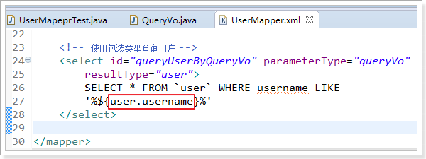

#### Mapper接口

在UserMapper接口中添加方法，如下图：

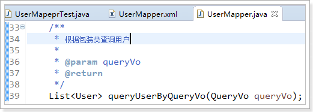

#### 测试方法

在UserMapeprTest增加测试方法，如下：

\@Test

**public void** testQueryUserByQueryVo() {

// mybatis和spring整合，整合之后，交给spring管理

SqlSession sqlSession = **this**.sqlSessionFactory.openSession();

// 创建Mapper接口的动态代理对象，整合之后，交给spring管理

UserMapper userMapper = sqlSession.getMapper(UserMapper.**class**);

// 使用userMapper执行查询，使用包装对象

QueryVo queryVo = **new** QueryVo();

// 设置user条件

User user = **new** User();

user.setUsername("张");

// 设置到包装对象中

queryVo.setUser(user);

// 执行查询

List\<User\> list = userMapper.queryUserByQueryVo(queryVo);

**for** (User u : list) {

System.*out*.println(u);

}

// mybatis和spring整合，整合之后，交给spring管理

sqlSession.close();

}

#### 效果

测试结果如下图：

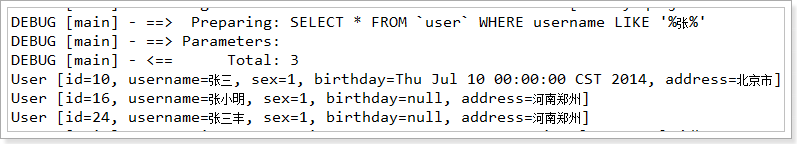

resultType(输出类型)
--------------------

### 输出简单类型

需求:查询用户表数据条数

sql：SELECT count(\*) FROM \`user\`

#### Mapper.xml文件

在UserMapper.xml中配置sql，如下图：

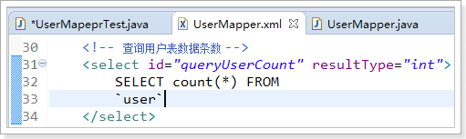

#### Mapper接口

在UserMapper添加方法，如下图：

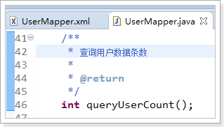

#### 测试方法

在UserMapeprTest增加测试方法，如下：

\@Test

**public void** testQueryUserCount() {

// mybatis和spring整合，整合之后，交给spring管理

SqlSession sqlSession = **this**.sqlSessionFactory.openSession();

// 创建Mapper接口的动态代理对象，整合之后，交给spring管理

UserMapper userMapper = sqlSession.getMapper(UserMapper.**class**);

// 使用userMapper执行查询用户数据条数

**int** count = userMapper.queryUserCount();

System.*out*.println(count);

// mybatis和spring整合，整合之后，交给spring管理

sqlSession.close();

}

#### 效果

测试结果如下图：

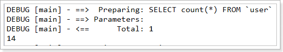

注意：输出简单类型必须查询出来的结果集有一条记录，最终将第一个字段的值转换为输出类型。

### 输出pojo对象

参考第一天内容

### 输出pojo列表

参考第一天内容。

resultMap
---------

resultType可以指定将查询结果映射为pojo，但需要pojo的属性名和sql查询的列名一致方可映射成功。

如果sql查询字段名和pojo的属性名不一致，可以通过resultMap将字段名和属性名作一个对应关系
，resultMap实质上还需要将查询结果映射到pojo对象中。

resultMap可以实现将查询结果映射为复杂类型的pojo，比如在查询结果映射对象中包括pojo和list实现一对一查询和一对多查询。

需求：查询订单表order的所有数据

sql：SELECT id, user_id, number, createtime, note FROM \`order\`

### 声明pojo对象

数据库表如下图：

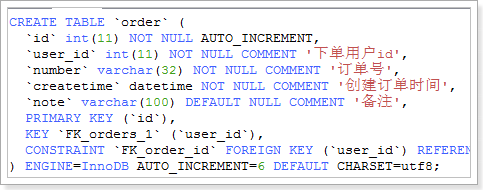

Order对象：

**public class** Order {

// 订单id

**private int** id;

// 用户id

**private** Integer userId;

// 订单号

**private** String number;

// 订单创建时间

**private** Date createtime;

// 备注

**private** String note;

get/set。。。

}

### Mapper.xml文件

创建OrderMapper.xml配置文件，如下：

\<?xml version=*"1.0"* encoding=*"UTF-8"* ?\>

\<!DOCTYPE mapper

PUBLIC "-//mybatis.org//DTD Mapper 3.0//EN"

"http://mybatis.org/dtd/mybatis-3-mapper.dtd"\>

\<!--
namespace：命名空间，用于隔离sql，还有一个很重要的作用，Mapper动态代理开发的时候使用，需要指定Mapper的类路径
--\>

\<mapper namespace=*"cn.itcast.mybatis.mapper.OrderMapper"*\>

\<!-- 查询所有的订单数据 --\>

\<select id=*"queryOrderAll"* resultType=*"order"*\>

SELECT id, user_id,

number,

createtime, note FROM \`order\`

\</select\>

\</mapper\>

### Mapper接口

编写接口如下：

**public interface** OrderMapper {

/\*\*

\* 查询所有订单

\*

\* **\@return**

\*/

List\<Order\> queryOrderAll();

}

### 测试方法

编写测试方法OrderMapperTest如下：

**public class** OrderMapperTest {

**private** SqlSessionFactory sqlSessionFactory;

\@Before

**public void** init() **throws** Exception {

InputStream inputStream = Resources.*getResourceAsStream*("SqlMapConfig.xml");

**this**.sqlSessionFactory = **new**
SqlSessionFactoryBuilder().build(inputStream);

}

\@Test

**public void** testQueryAll() {

// 获取sqlSession

SqlSession sqlSession = **this**.sqlSessionFactory.openSession();

// 获取OrderMapper

OrderMapper orderMapper = sqlSession.getMapper(OrderMapper.**class**);

// 执行查询

List\<Order\> list = orderMapper.queryOrderAll();

**for** (Order order : list) {

System.*out*.println(order);

}

}

}

### 效果 

测试效果如下图：

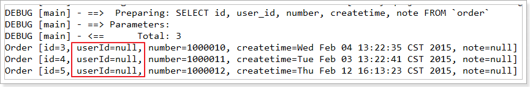

发现userId为null

解决方案：使用resultMap

### 使用resultMap

由于上边的mapper.xml中sql查询列(user_id)和Order类属性(userId)不一致，所以查询结果不能映射到pojo中。

需要定义resultMap，把orderResultMap将sql查询列(user_id)和Order类属性(userId)对应起来

改造OrderMapper.xml，如下：

\<?xml version=*"1.0"* encoding=*"UTF-8"* ?\>

\<!DOCTYPE mapper

PUBLIC "-//mybatis.org//DTD Mapper 3.0//EN"

"http://mybatis.org/dtd/mybatis-3-mapper.dtd"\>

\<!--
namespace：命名空间，用于隔离sql，还有一个很重要的作用，Mapper动态代理开发的时候使用，需要指定Mapper的类路径
--\>

\<mapper namespace=*"cn.itcast.mybatis.mapper.OrderMapper"*\>

\<!-- resultMap最终还是要将结果映射到pojo上，type就是指定映射到哪一个pojo --\>

\<!-- id：设置ResultMap的id --\>

\<resultMap type=*"order"* id=*"orderResultMap"*\>

\<!-- 定义主键 ,非常重要。如果是多个字段,则定义多个id --\>

\<!-- property：主键在pojo中的属性名 --\>

\<!-- column：主键在数据库中的列名 --\>

\<id property=*"id"* column=*"id"* /\>

\<!-- 定义普通属性 --\>

\<result property=*"userId"* column=*"user_id"* /\>

\<result property=*"number"* column=*"number"* /\>

\<result property=*"createtime"* column=*"createtime"* /\>

\<result property=*"note"* column=*"note"* /\>

\</resultMap\>

\<!-- 查询所有的订单数据 --\>

\<select id=*"queryOrderAll"* resultMap=*"orderResultMap"*\>

SELECT id, user_id,

number,

createtime, note FROM \`order\`

\</select\>

\</mapper\>

### 效果

只需要修改Mapper.xml就可以了，再次测试结果如下：

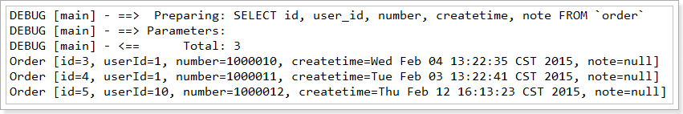

动态sql
=======

通过mybatis提供的各种标签方法实现动态拼接sql。

需求：根据性别和名字查询用户

查询sql：

SELECT id, username, birthday, sex, address FROM \`user\` WHERE sex = 1 AND
username LIKE '%张%'

If标签
------

### Mapper.xml文件

UserMapper.xml配置sql，如下：

\<!-- 根据条件查询用户 --\>

\<select id=*"queryUserByWhere"* parameterType=*"user"* resultType=*"user"*\>

SELECT id, username, birthday, sex, address FROM \`user\`

WHERE sex = \#{sex} AND username LIKE

'%\${username}%'

\</select\>

### Mapper接口

编写Mapper接口，如下图：

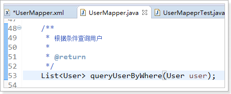

### 测试方法

在UserMapperTest添加测试方法，如下：

\@Test

**public void** testQueryUserByWhere() {

// mybatis和spring整合，整合之后，交给spring管理

SqlSession sqlSession = **this**.sqlSessionFactory.openSession();

// 创建Mapper接口的动态代理对象，整合之后，交给spring管理

UserMapper userMapper = sqlSession.getMapper(UserMapper.**class**);

// 使用userMapper执行根据条件查询用户

User user = **new** User();

user.setSex("1");

user.setUsername("张");

List\<User\> list = userMapper.queryUserByWhere(user);

**for** (User u : list) {

System.*out*.println(u);

}

// mybatis和spring整合，整合之后，交给spring管理

sqlSession.close();

}

### 效果

测试效果如下图：

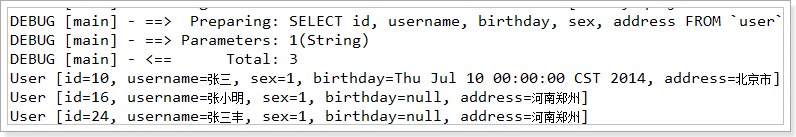

如果注释掉 user.setSex("1")，测试结果如下图：

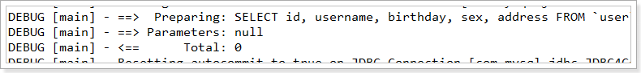

测试结果二很显然不合理。

按照之前所学的，要解决这个问题，需要编写多个sql，查询条件越多，需要编写的sql就更多了，显然这样是不靠谱的。

解决方案，使用动态sql的if标签

### 使用if标签

改造UserMapper.xml，如下：

\<!-- 根据条件查询用户 --\>

\<select id=*"queryUserByWhere"* parameterType=*"user"* resultType=*"user"*\>

SELECT id, username, birthday, sex, address FROM \`user\`

WHERE 1=1

\<if test=*"sex != null and sex != ''"*\>

AND sex = \#{sex}

\</if\>

\<if test=*"username != null and username != ''"*\>

AND username LIKE

'%\${username}%'

\</if\>

\</select\>

注意字符串类型的数据需要要做不等于空字符串校验。

### 效果

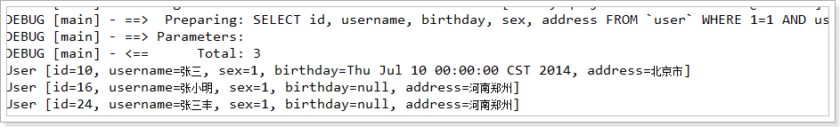

如上图所示，测试OK

Where标签
---------

上面的sql还有where 1=1 这样的语句，很麻烦

可以使用where标签进行改造

改造UserMapper.xml，如下

\<!-- 根据条件查询用户 --\>

\<select id=*"queryUserByWhere"* parameterType=*"user"* resultType=*"user"*\>

SELECT id, username, birthday, sex, address FROM \`user\`

\<!-- where标签可以自动添加where，同时处理sql语句中第一个and关键字 --\>

\<where\>

\<if test=*"sex != null"*\>

AND sex = \#{sex}

\</if\>

\<if test=*"username != null and username != ''"*\>

AND username LIKE

'%\${username}%'

\</if\>

\</where\>

\</select\>

### 效果

测试效果如下图：

Sql片段
-------

Sql中可将重复的sql提取出来，使用时用include引用即可，最终达到sql重用的目的。

把上面例子中的id, username, birthday, sex, address提取出来，作为sql片段，如下：

\<!-- 根据条件查询用户 --\>

\<select id=*"queryUserByWhere"* parameterType=*"user"* resultType=*"user"*\>

\<!-- SELECT id, username, birthday, sex, address FROM \`user\` --\>

\<!-- 使用include标签加载sql片段；refid是sql片段id --\>

SELECT \<include refid=*"userFields"* /\> FROM \`user\`

\<!-- where标签可以自动添加where关键字，同时处理sql语句中第一个and关键字 --\>

//可以去掉前and

\<where\>

\<if test=*"sex != null"*\>

AND sex = \#{sex}

\</if\>

\<if test=*"username != null and username != ''"*\>

AND username LIKE

'%\${username}%'

\</if\>

\</where\>

\</select\>

\<!-- 声明sql片段 --\>

\<sql id=*"userFields"*\>

id, username, birthday, sex, address

\</sql\>

如果要使用别的Mapper.xml配置的sql片段，可以在refid前面加上对应的Mapper.xml的namespace

例如下图

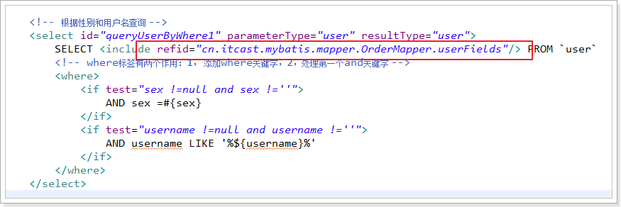

foreach标签
-----------

向sql传递数组或List，mybatis使用foreach解析，如下：

根据多个id查询用户信息

查询sql：

SELECT \* FROM user WHERE id IN (1,10,24)

### 改造QueryVo

如下图在pojo中定义list属性ids存储多个用户id，并添加getter/setter方法

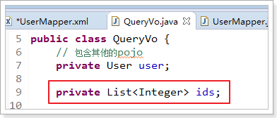

### Mapper.xml文件

UserMapper.xml添加sql，如下：

\<!-- 根据ids查询用户 --\>

\<select id=*"queryUserByIds"* parameterType=*"queryVo"* resultType=*"user"*\>

SELECT \* FROM \`user\`

\<where\>

\<!-- foreach标签，进行遍历 --\>

\<!-- collection：遍历的集合，这里是QueryVo的ids属性 --\>

\<!-- item：遍历的项目，可以随便写，，但是和后面的\#{}里面要一致 --\>

\<!-- open：在前面添加的sql片段 --\>

\<!-- close：在结尾处添加的sql片段 --\>

\<!-- separator：指定遍历的元素之间使用的分隔符 --\>

\<foreach collection=*"ids"* item=*"item"* open=*"id IN ("* close=*")"*

separator=*","*\>

\#{item}

\</foreach\>

\</where\>

\</select\>

测试方法如下图：

\@Test

**public void** testQueryUserByIds() {

// mybatis和spring整合，整合之后，交给spring管理

SqlSession sqlSession = **this**.sqlSessionFactory.openSession();

// 创建Mapper接口的动态代理对象，整合之后，交给spring管理

UserMapper userMapper = sqlSession.getMapper(UserMapper.**class**);

// 使用userMapper执行根据条件查询用户

QueryVo queryVo = **new** QueryVo();

List\<Integer\> ids = **new** ArrayList\<\>();

ids.add(1);

ids.add(10);

ids.add(24);

queryVo.setIds(ids);

List\<User\> list = userMapper.queryUserByIds(queryVo);

**for** (User u : list) {

System.*out*.println(u);

}

// mybatis和spring整合，整合之后，交给spring管理

sqlSession.close();

}

### 效果

测试效果如下图：

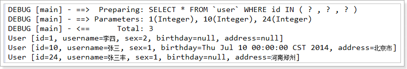

关联查询
========

商品订单数据模型
----------------

一对一查询
----------

需求：查询所有订单信息，关联查询下单用户信息。

注意：因为一个订单信息只会是一个人下的订单，所以从查询订单信息出发关联查询用户信息为一对一查询。如果从用户信息出发查询用户下的订单信息则为一对多查询，因为一个用户可以下多个订单。

sql语句：

SELECT

o.id,

o.user_id userId,

o.number,

o.createtime,

o.note,

u.username,

u.address

FROM

\`order\` o

LEFT JOIN \`user\` u ON o.user_id = u.id

### 方法一：使用resultType

使用resultType，改造订单pojo类，此pojo类中包括了订单信息和用户信息

这样返回对象的时候，mybatis自动把用户信息也注入进来了

#### 改造pojo类

OrderUser类继承Order类后OrderUser类包括了Order类的所有字段，只需要定义用户的信息字段即可，如下图：

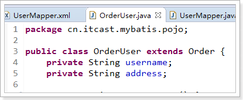

#### Mapper.xml

在UserMapper.xml添加sql，如下

\<!-- 查询订单，同时包含用户数据 --\>

\<select id=*"queryOrderUser"* resultType=*"orderUser"*\>

SELECT

o.id,

o.user_id

userId,

o.number,

o.createtime,

o.note,

u.username,

u.address

FROM

\`order\` o

LEFT JOIN \`user\` u ON o.user_id = u.id

\</select\>

#### Mapper接口

在UserMapper接口添加方法，如下图：

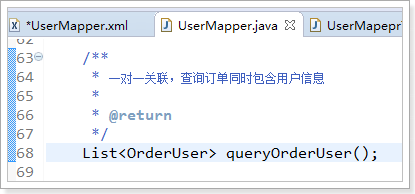

#### 测试方法：

在UserMapperTest添加测试方法，如下：

\@Test

**public void** testQueryOrderUser() {

// mybatis和spring整合，整合之后，交给spring管理

SqlSession sqlSession = **this**.sqlSessionFactory.openSession();

// 创建Mapper接口的动态代理对象，整合之后，交给spring管理

UserMapper userMapper = sqlSession.getMapper(UserMapper.**class**);

// 使用userMapper执行根据条件查询用户

List\<OrderUser\> list = userMapper.queryOrderUser();

**for** (OrderUser ou : list) {

System.*out*.println(ou);

}

// mybatis和spring整合，整合之后，交给spring管理

sqlSession.close();

}

#### 效果

测试结果如下图：

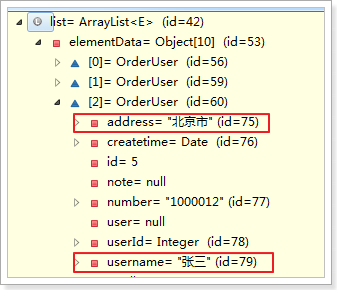

#### 小结

定义专门的pojo类作为输出类型，其中定义了sql查询结果集所有的字段。此方法较为简单，企业中使用普遍。

### 方法二：使用resultMap

使用resultMap，定义专门的resultMap用于映射一对一查询结果。

#### 改造pojo类

在Order类中加入User属性，user属性中用于存储关联查询的用户信息，因为订单关联查询用户是一对一关系，所以这里使用单个User对象存储关联查询的用户信息。

改造Order如下图：

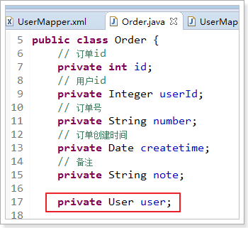

#### Mapper.xml

这里resultMap指定orderUserResultMap，如下：

\<resultMap type=*"order"* id=*"orderUserResultMap"*\>

\<id property=*"id"* column=*"id"* /\>

\<result property=*"userId"* column=*"user_id"* /\>

\<result property=*"number"* column=*"number"* /\>

\<result property=*"createtime"* column=*"createtime"* /\>

\<result property=*"note"* column=*"note"* /\>

\<!-- association ：配置一对一属性 --\>

\<!-- property:order里面的User属性名 --\>

\<!-- javaType:属性类型 --\>

\<association property=*"user"* javaType=*"user"*\>

\<!-- id:声明主键，表示user_id是关联查询对象的唯一标识--\>

\<id property=*"id"* column=*"user_id"* /\>

\<result property=*"username"* column=*"username"* /\>

\<result property=*"address"* column=*"address"* /\>

\</association\>

\</resultMap\>

\<!-- 一对一关联，查询订单，订单内部包含用户属性 --\>

\<select id=*"queryOrderUserResultMap"* resultMap=*"orderUserResultMap"*\>

SELECT

o.id,

o.user_id,

o.number,

o.createtime,

o.note,

u.username,

u.address

FROM

\`order\` o

LEFT JOIN \`user\` u ON o.user_id = u.id

\</select\>

#### Mapper接口

编写UserMapper如下图：

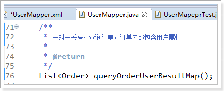

#### 测试方法

在UserMapperTest增加测试方法，如下：

\@Test

**public void** testQueryOrderUserResultMap() {

// mybatis和spring整合，整合之后，交给spring管理

SqlSession sqlSession = **this**.sqlSessionFactory.openSession();

// 创建Mapper接口的动态代理对象，整合之后，交给spring管理

UserMapper userMapper = sqlSession.getMapper(UserMapper.**class**);

// 使用userMapper执行根据条件查询用户

List\<Order\> list = userMapper.queryOrderUserResultMap();

**for** (Order o : list) {

System.*out*.println(o);

}

// mybatis和spring整合，整合之后，交给spring管理

sqlSession.close();

}

#### 效果

测试效果如下图：

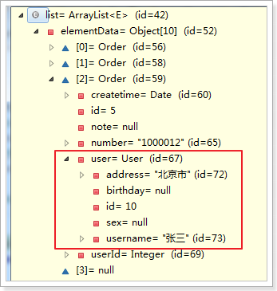

一对多查询
----------

案例：查询所有用户信息及用户关联的订单信息。

用户信息和订单信息为一对多关系。

sql语句：

SELECT

u.id,

u.username,

u.birthday,

u.sex,

u.address,

o.id oid,

o.number,

o.createtime,

o.note

FROM

\`user\` u

LEFT JOIN \`order\` o ON u.id = o.user_id

### 修改pojo类

在User类中加入List\<Order\> orders属性,如下图：

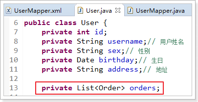

### Mapper.xml

在UserMapper.xml添加sql，如下：

\<resultMap type=*"user"* id=*"userOrderResultMap"*\>

\<id property=*"id"* column=*"id"* /\>

\<result property=*"username"* column=*"username"* /\>

\<result property=*"birthday"* column=*"birthday"* /\>

\<result property=*"sex"* column=*"sex"* /\>

\<result property=*"address"* column=*"address"* /\>

\<!-- 配置一对多的关系 --\>

\<collection property=*"orders"* javaType=*"list"* ofType=*"order"*\>

\<!-- 配置主键，是关联Order的唯一标识 --\>

\<id property=*"id"* column=*"oid"* /\>

\<result property=*"number"* column=*"number"* /\>

\<result property=*"createtime"* column=*"createtime"* /\>

\<result property=*"note"* column=*"note"* /\>

\</collection\>

\</resultMap\>

\<!-- 一对多关联，查询订单同时查询该用户下的订单 --\>

\<select id=*"queryUserOrder"* resultMap=*"userOrderResultMap"*\>

SELECT

u.id,

u.username,

u.birthday,

u.sex,

u.address,

o.id oid,

o.number,

o.createtime,

o.note

FROM

\`user\` u

LEFT JOIN \`order\` o ON u.id = o.user_id

\</select\>

### Mapper接口

编写UserMapper接口，如下图：

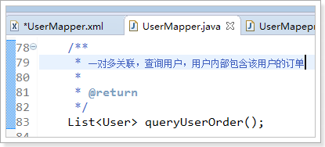

### 测试方法

在UserMapperTest增加测试方法，如下

\@Test

**public void** testQueryUserOrder() {

// mybatis和spring整合，整合之后，交给spring管理

SqlSession sqlSession = **this**.sqlSessionFactory.openSession();

// 创建Mapper接口的动态代理对象，整合之后，交给spring管理

UserMapper userMapper = sqlSession.getMapper(UserMapper.**class**);

// 使用userMapper执行根据条件查询用户

List\<User\> list = userMapper.queryUserOrder();

**for** (User u : list) {

System.*out*.println(u);

}

// mybatis和spring整合，整合之后，交给spring管理

sqlSession.close();

}

### 效果

测试效果如下图：

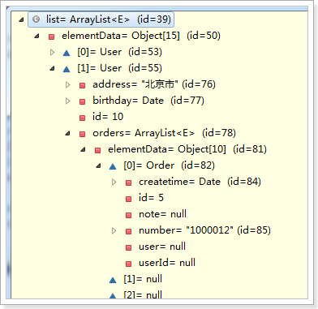

Mybatis整合spring
=================

整合思路
--------

1.  SqlSessionFactory对象应该放到spring容器中作为单例存在。

2.  传统dao的开发方式中，应该从spring容器中获得sqlsession对象。

3.  Mapper代理形式中，应该从spring容器中直接获得mapper的代理对象。

4.  数据库的连接以及数据库连接池事务管理都交给spring容器来完成。

整合需要的jar包
---------------

1.  spring的jar包

2.  Mybatis的jar包

3.  Spring+mybatis的整合包。

4.  Mysql的数据库驱动jar包。

5.  数据库连接池的jar包。

jar包位置如下所示：

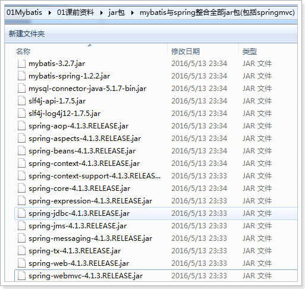

整合的步骤
----------

### 创建工程

如下图创建一个java工程：

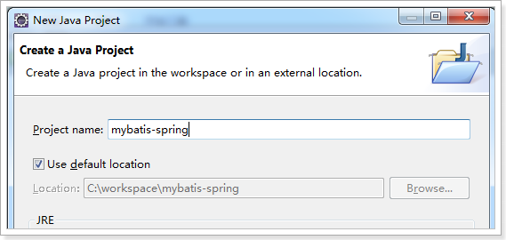

### 导入jar包

前面提到的jar包需要导入，如下图：

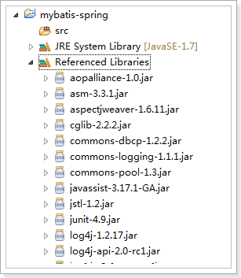

### 加入配置文件

1.  mybatisSpring的配置文件

2.  的配置文件sqlmapConfig.xml

    1.  数据库连接及连接池

    2.  事务管理（暂时可以不配置）

    3.  sqlsessionFactory对象，配置到spring容器中

    4.  mapeer代理对象或者是dao实现类配置到spring容器中。

创建资源文件夹config拷贝加入配置文件，如下图

#### SqlMapConfig.xml

配置文件是SqlMapConfig.xml，如下：

\<?xml version=*"1.0"* encoding=*"UTF-8"* ?\>

\<!DOCTYPE configuration

PUBLIC "-//mybatis.org//DTD Config 3.0//EN"

"http://mybatis.org/dtd/mybatis-3-config.dtd"\>

\<configuration\>

\<!-- 设置别名 --\>

\<typeAliases\>

\<!-- 2.
指定扫描包，会把包内所有的类都设置别名，别名的名称就是类名，大小写不敏感 --\>

\<package name=*"cn.itcast.mybatis.pojo"* /\>

\</typeAliases\>

\</configuration\>

#### applicationContext.xml

SqlSessionFactoryBean属于mybatis-spring这个jar包

对于spring来说，mybatis是另外一个架构，需要整合jar包。

在项目中加入mybatis-spring-1.2.2.jar的源码，如下图

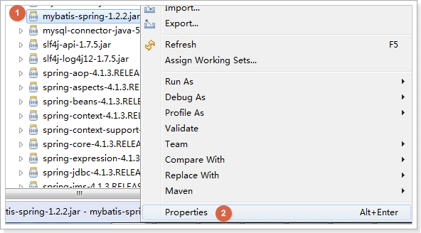

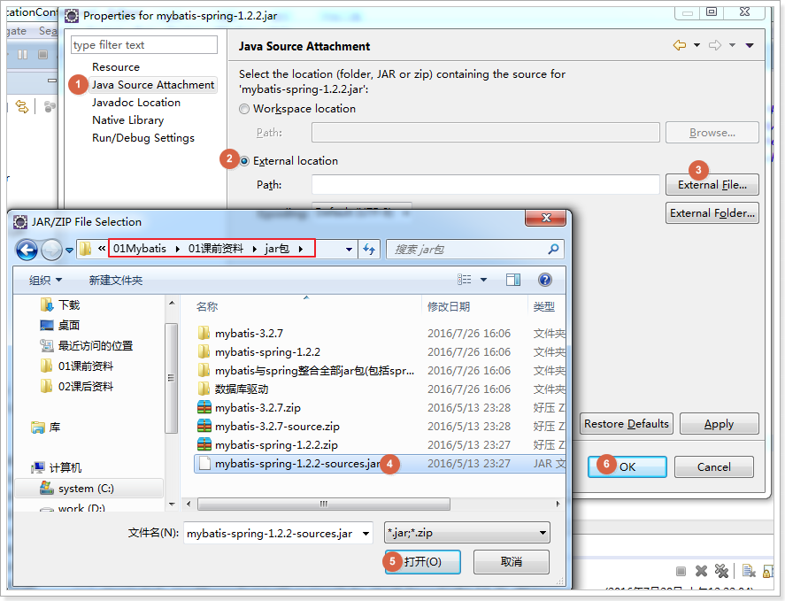

效果，如下图所示，图标变化，表示源码加载成功：

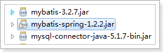

整合Mybatis需要的是SqlSessionFactoryBean，位置如下图：

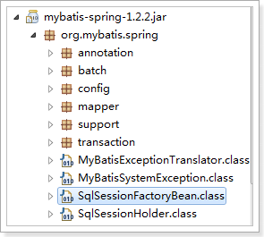

applicationContext.xml，配置内容如下

\<?xml version=*"1.0"* encoding=*"UTF-8"*?\>

\<beans xmlns=*"http://www.springframework.org/schema/beans"*

xmlns:context=*"http://www.springframework.org/schema/context"*
xmlns:p=*"http://www.springframework.org/schema/p"*

xmlns:aop=*"http://www.springframework.org/schema/aop"*
xmlns:tx=*"http://www.springframework.org/schema/tx"*

xmlns:xsi=*"http://www.w3.org/2001/XMLSchema-instance"*

xsi:schemaLocation=*"http://www.springframework.org/schema/beans
http://www.springframework.org/schema/beans/spring-beans-4.0.xsd*

*http://www.springframework.org/schema/context
http://www.springframework.org/schema/context/spring-context-4.0.xsd*

*http://www.springframework.org/schema/aop
http://www.springframework.org/schema/aop/spring-aop-4.0.xsd
http://www.springframework.org/schema/tx
http://www.springframework.org/schema/tx/spring-tx-4.0.xsd*

*http://www.springframework.org/schema/util
http://www.springframework.org/schema/util/spring-util-4.0.xsd"*\>

\<!-- 加载配置文件 --\>

\<context:property-placeholder location=*"classpath:db.properties"* /\>

\<!-- 数据库连接池 --\>

\<bean id=*"dataSource"* class=*"org.apache.commons.dbcp.BasicDataSource"*

destroy-method=*"close"*\>

\<property name=*"driverClassName"* value=*"\${jdbc.driver}"* /\>

\<property name=*"url"* value=*"\${jdbc.url}"* /\>

\<property name=*"username"* value=*"\${jdbc.username}"* /\>

\<property name=*"password"* value=*"\${jdbc.password}"* /\>

\<property name=*"maxActive"* value=*"10"* /\>

\<property name=*"maxIdle"* value=*"5"* /\>

\</bean\>

\<!-- 配置SqlSessionFactory --\>

\<bean id=*"sqlSessionFactory"*
class=*"org.mybatis.spring.SqlSessionFactoryBean"*\>

\<!-- 配置mybatis核心配置文件 --\>

\<property name=*"configLocation"* value=*"classpath:SqlMapConfig.xml"* /\>

\<!-- 配置数据源 --\>

\<property name=*"dataSource"* ref=*"dataSource"* /\>

\</bean\>

\</beans\>

#### db.properties

jdbc.driver=com.mysql.jdbc.Driver

jdbc.url=jdbc:mysql://localhost:3306/mybatis?characterEncoding=utf-8

jdbc.username=root

jdbc.password=root

#### log4j.properties

\# Global logging configuration

log4j.rootLogger=DEBUG, stdout

\# Console output...

log4j.appender.stdout=org.apache.log4j.ConsoleAppender

log4j.appender.stdout.layout=org.apache.log4j.PatternLayout

log4j.appender.stdout.layout.ConversionPattern=%5p [%t] - %m%n

#### 效果：

加入的配置文件最终效果如下：

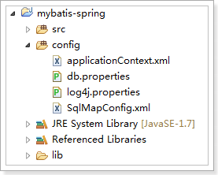

Dao的开发
---------

两种dao的实现方式：

1.  原始dao的开发方式

2.  使用Mapper代理形式开发方式

    1.  直接配置Mapper代理

    2.  使用扫描包配置Mapper代理

需求：

1.  实现根据用户id查询

2.  实现根据用户名模糊查询

3.  添加用户

### 创建pojo

**public class** User {

**private int** id;

**private** String username;// 用户姓名

**private** String sex;// 性别

**private** Date birthday;// 生日

**private** String address;// 地址

get/set。。。

}

### 传统dao的开发方式

原始的DAO开发接口+实现类来完成。

需要dao实现类需要继承SqlsessionDaoSupport类

#### 实现Mapper.xml

编写User.xml配置文件，如下：

\<?xml version=*"1.0"* encoding=*"UTF-8"* ?\>

\<!DOCTYPE mapper

PUBLIC "-//mybatis.org//DTD Mapper 3.0//EN"

"http://mybatis.org/dtd/mybatis-3-mapper.dtd"\>

\<mapper namespace=*"test"*\>

\<!-- 根据用户id查询 --\>

\<select id=*"queryUserById"* parameterType=*"int"* resultType=*"user"*\>

select \* from user where id = \#{id}

\</select\>

\<!-- 根据用户名模糊查询用户 --\>

\<select id=*"queryUserByUsername"* parameterType=*"string"*

resultType=*"user"*\>

select \* from user where username like '%\${value}%'

\</select\>

\<!-- 添加用户 --\>

\<insert id=*"saveUser"* parameterType=*"user"*\>

\<selectKey keyProperty=*"id"* keyColumn=*"id"* order=*"AFTER"*

resultType=*"int"*\>

select last_insert_id()

\</selectKey\>

insert into user

(username,birthday,sex,address)

values

(\#{username},\#{birthday},\#{sex},\#{address})

\</insert\>

\</mapper\>

#### 加载Mapper.xml

在SqlMapConfig如下图进行配置:

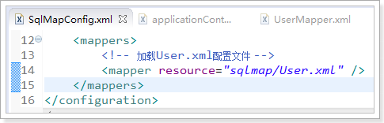

#### 实现UserDao接口

**public interface** UserDao {

/\*\*

\* 根据id查询用户

\*

\* **\@param** id

\* **\@return**

\*/

User queryUserById(**int** id);

/\*\*

\* 根据用户名模糊查询用户列表

\*

\* **\@param** username

\* **\@return**

\*/

List\<User\> queryUserByUsername(String username);

/\*\*

\* 保存

\*

\* **\@param** user

\*/

**void** saveUser(User user);

}

#### 实现UserDaoImpl实现类

编写DAO实现类，实现类必须集成SqlSessionDaoSupport

SqlSessionDaoSupport提供getSqlSession()方法来获取SqlSession

**public class** UserDaoImpl **extends** SqlSessionDaoSupport **implements**
UserDao {

\@Override

**public** User queryUserById(**int** id) {

// 获取SqlSession

SqlSession sqlSession = **super**.getSqlSession();

// 使用SqlSession执行操作

User user = sqlSession.selectOne("queryUserById", id);

// 不要关闭sqlSession

**return** user;

}

\@Override

**public** List\<User\> queryUserByUsername(String username) {

// 获取SqlSession

SqlSession sqlSession = **super**.getSqlSession();

// 使用SqlSession执行操作

List\<User\> list = sqlSession.selectList("queryUserByUsername", username);

// 不要关闭sqlSession

**return** list;

}

\@Override

**public void** saveUser(User user) {

// 获取SqlSession

SqlSession sqlSession = **super**.getSqlSession();

// 使用SqlSession执行操作

sqlSession.insert("saveUser", user);

// 不用提交,事务由spring进行管理

// 不要关闭sqlSession

}

}

#### 配置dao

把dao实现类配置到spring容器中，如下图

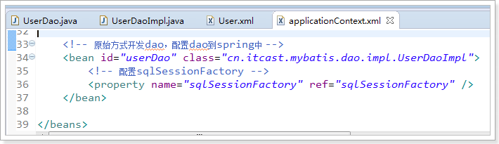

#### 测试方法

创建测试方法，可以直接创建测试Junit用例。

如下图所示进行创建。

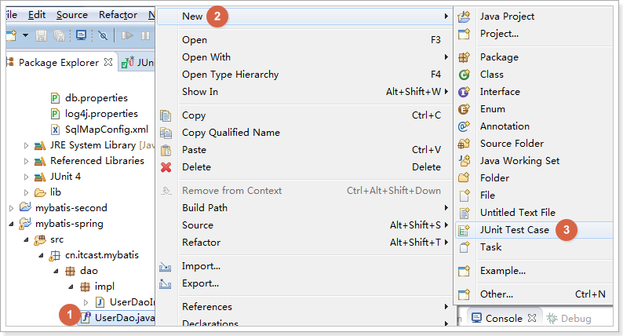

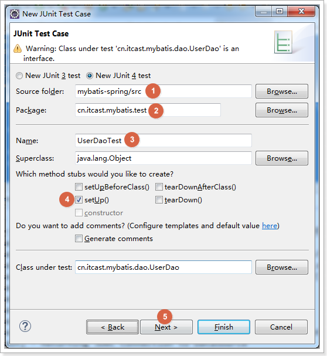

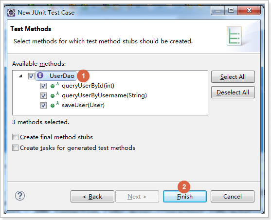

编写测试方法如下：

**public class** UserDaoTest {

**private** ApplicationContext context;

\@Before

**public void** setUp() **throws** Exception {

**this**.context = **new**
ClassPathXmlApplicationContext("classpath:applicationContext.xml");

}

\@Test

**public void** testQueryUserById() {

// 获取userDao

UserDao userDao = **this**.context.getBean(UserDao.**class**);

User user = userDao.queryUserById(1);

System.*out*.println(user);

}

\@Test

**public void** testQueryUserByUsername() {

// 获取userDao

UserDao userDao = **this**.context.getBean(UserDao.**class**);

List\<User\> list = userDao.queryUserByUsername("张");

**for** (User user : list) {

System.*out*.println(user);

}

}

\@Test

**public void** testSaveUser() {

// 获取userDao

UserDao userDao = **this**.context.getBean(UserDao.**class**);

User user = **new** User();

user.setUsername("曹操");

user.setSex("1");

user.setBirthday(**new** Date());

user.setAddress("三国");

userDao.saveUser(user);

System.*out*.println(user);

}

}

### Mapper代理形式开发dao

#### 实现Mapper.xml

编写UserMapper.xml配置文件，如下：

\<?xml version=*"1.0"* encoding=*"UTF-8"* ?\>

\<!DOCTYPE mapper

PUBLIC "-//mybatis.org//DTD Mapper 3.0//EN"

"http://mybatis.org/dtd/mybatis-3-mapper.dtd"\>

\<mapper namespace=*"cn.itcast.mybatis.mapper.UserMapper"*\>

\<!-- 根据用户id查询 --\>

\<select id=*"queryUserById"* parameterType=*"int"* resultType=*"user"*\>

select \* from user where id = \#{id}

\</select\>

\<!-- 根据用户名模糊查询用户 --\>

\<select id=*"queryUserByUsername"* parameterType=*"string"*

resultType=*"user"*\>

select \* from user where username like '%\${value}%'

\</select\>

\<!-- 添加用户 --\>

\<insert id=*"saveUser"* parameterType=*"user"*\>

\<selectKey keyProperty=*"id"* keyColumn=*"id"* order=*"AFTER"*

resultType=*"int"*\>

select last_insert_id()

\</selectKey\>

insert into user

(username,birthday,sex,address) values

(\#{username},\#{birthday},\#{sex},\#{address})

\</insert\>

\</mapper\>

#### 实现UserMapper接口

**public interface** UserMapper {

/\*\*

\* 根据用户id查询

\*

\* **\@param** id

\* **\@return**

\*/

User queryUserById(**int** id);

/\*\*

\* 根据用户名模糊查询用户

\*

\* **\@param** username

\* **\@return**

\*/

List\<User\> queryUserByUsername(String username);

/\*\*

\* 添加用户

\*

\* **\@param** user

\*/

**void** saveUser(User user);

}

#### 方式一：配置mapper代理

在applicationContext.xml添加配置

MapperFactoryBean也是属于mybatis-spring整合包

\<!-- Mapper代理的方式开发方式一，配置Mapper代理对象 --\>

\<bean id=*"userMapper"* class=*"org.mybatis.spring.mapper.MapperFactoryBean"*\>

\<!-- 配置Mapper接口 --\>

\<property name=*"mapperInterface"*
value=*"cn.itcast.mybatis.mapper.UserMapper"* /\>

\<!-- 配置sqlSessionFactory --\>

\<property name=*"sqlSessionFactory"* ref=*"sqlSessionFactory"* /\>

\</bean\>

#### 测试方法

**public class** UserMapperTest {

**private** ApplicationContext context;

\@Before

**public void** setUp() **throws** Exception {

**this**.context = **new**
ClassPathXmlApplicationContext("classpath:applicationContext.xml");

}

\@Test

**public void** testQueryUserById() {

// 获取Mapper

UserMapper userMapper = **this**.context.getBean(UserMapper.**class**);

User user = userMapper.queryUserById(1);

System.*out*.println(user);

}

\@Test

**public void** testQueryUserByUsername() {

// 获取Mapper

UserMapper userMapper = **this**.context.getBean(UserMapper.**class**);

List\<User\> list = userMapper.queryUserByUsername("张");

**for** (User user : list) {

System.*out*.println(user);

}

}

\@Test

**public void** testSaveUser() {

// 获取Mapper

UserMapper userMapper = **this**.context.getBean(UserMapper.**class**);

User user = **new** User();

user.setUsername("曹操");

user.setSex("1");

user.setBirthday(**new** Date());

user.setAddress("三国");

userMapper.saveUser(user);

System.*out*.println(user);

}

}

#### 方式二：扫描包形式配置mapper

\<!-- Mapper代理的方式开发方式二，扫描包方式配置代理 --\>

\<bean class=*"org.mybatis.spring.mapper.MapperScannerConfigurer"*\>

\<!-- 配置Mapper接口 --\>

\<property name=*"basePackage"* value=*"cn.itcast.mybatis.mapper"* /\>

\</bean\>

每个mapper代理对象的id就是类名，首字母小写

Mybatis逆向工程
===============

使用官方网站的Mapper自动生成工具mybatis-generator-core-1.3.2来生成po类和Mapper映射文件

导入逆向工程
------------

使用课前资料已有逆向工程，如下图：

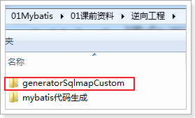

### 复制逆向工程到工作空间中

复制的效果如下图：

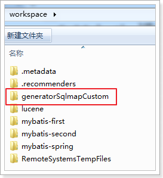

### 导入逆向工程到eclipse中

如下图方式进行导入：

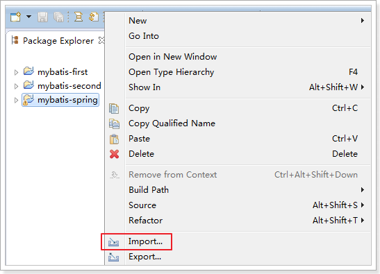

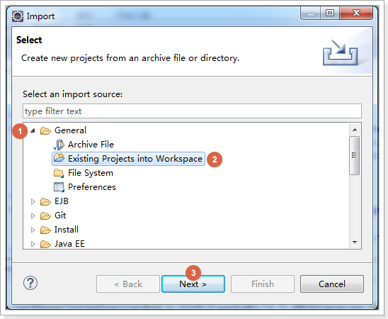

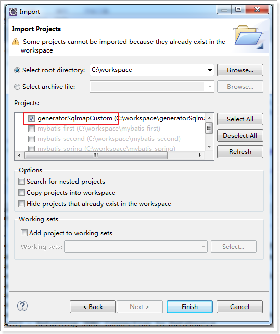

修改配置文件
------------

在generatorConfig.xml中配置Mapper生成的详细信息，如下图：

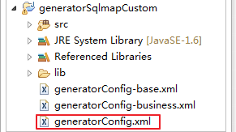

注意修改以下几点:

1.  修改要生成的数据库表

2.  pojo文件所在包路径

3.  Mapper所在的包路径

配置文件如下:

\<?xml version=*"1.0"* encoding=*"UTF-8"*?\>

\<!DOCTYPE generatorConfiguration

PUBLIC "-//mybatis.org//DTD MyBatis Generator Configuration 1.0//EN"

"http://mybatis.org/dtd/mybatis-generator-config_1_0.dtd"\>

\<generatorConfiguration\>

\<context id=*"testTables"* targetRuntime=*"MyBatis3"*\>

\<commentGenerator\>

\<!-- 是否去除自动生成的注释 true：是 ： false:否 --\>

\<property name=*"suppressAllComments"* value=*"true"* /\>

\</commentGenerator\>

\<!--数据库连接的信息：驱动类、连接地址、用户名、密码 --\>

\<jdbcConnection driverClass=*"com.mysql.jdbc.Driver"*

connectionURL=*"jdbc:mysql://localhost:3306/mybatis" userId="root"
password="root"*\>

\</jdbcConnection\>

\<!-- \<jdbcConnection driverClass="oracle.jdbc.OracleDriver"
connectionURL="jdbc:oracle:thin:\@127.0.0.1:1521:*yycg*"

userId="*yycg*" password="*yycg*"\> \</jdbcConnection\> --\>

\<!-- 默认false，把JDBC DECIMAL 和 NUMERIC 类型解析为 Integer，为 true时把JDBC
DECIMAL

和 NUMERIC 类型解析为java.math.BigDecimal --\>

\<javaTypeResolver\>

\<property name=*"forceBigDecimals"* value=*"false"* /\>

\</javaTypeResolver\>

\<!-- targetProject:生成PO类的位置 --\>

\<javaModelGenerator targetPackage=*"cn.itcast.ssm.po"*

targetProject=*".\\src"*\>

\<!-- enableSubPackages:是否让schema作为包的后缀 --\>

\<property name=*"enableSubPackages"* value=*"false"* /\>

\<!-- 从数据库返回的值被清理前后的空格 --\>

\<property name=*"trimStrings"* value=*"true"* /\>

\</javaModelGenerator\>

\<!-- targetProject:mapper映射文件生成的位置 --\>

\<sqlMapGenerator targetPackage=*"cn.itcast.ssm.mapper"*

targetProject=*".\\src"*\>

\<!-- enableSubPackages:是否让schema作为包的后缀 --\>

\<property name=*"enableSubPackages"* value=*"false"* /\>

\</sqlMapGenerator\>

\<!-- targetPackage：mapper接口生成的位置 --\>

\<javaClientGenerator type=*"XMLMAPPER"*

targetPackage=*"cn.itcast.ssm.mapper"* targetProject=*".\\src"*\>

\<!-- enableSubPackages:是否让schema作为包的后缀 --\>

\<property name=*"enableSubPackages"* value=*"false"* /\>

\</javaClientGenerator\>

\<!-- 指定数据库表 --\>

\<table schema=*""* tableName=*"user"*\>\</table\>

\<table schema=*""* tableName=*"order"*\>\</table\>

\</context\>

\</generatorConfiguration\>

生成逆向工程代码
----------------

找到下图所示的java文件，执行工程main主函数,

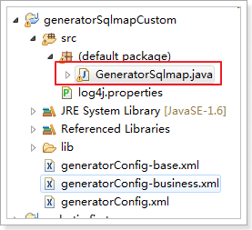

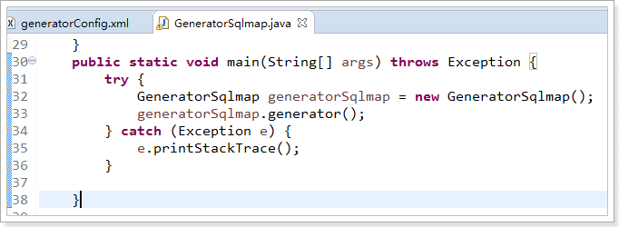

刷新工程，发现代码生成，如下图：

测试逆向工程代码
----------------

1. 复制生成的代码到mybatis-spring工程，如下图

2. 修改spring配置文件

在applicationContext.xml修改

\<!-- Mapper代理的方式开发，扫描包方式配置代理 --\>

\<bean class=*"org.mybatis.spring.mapper.MapperScannerConfigurer"*\>

\<!-- 配置Mapper接口，如果需要加载多个包，直接写进来，中间用，分隔 --\>

\<!-- \<property name="basePackage" value="cn.itcast.mybatis.mapper" /\> --\>

\<property name=*"basePackage"* value=*"cn.itcast.ssm.mapper"* /\>

\</bean\>

3. 编写测试方法：

**public class** UserMapperTest {

**private** ApplicationContext context;

\@Before

**public void** setUp() **throws** Exception {

**this**.context = **new**
ClassPathXmlApplicationContext("classpath:applicationContext.xml");

}

\@Test

**public void** testInsert() {

// 获取Mapper

UserMapper userMapper = **this**.context.getBean(UserMapper.**class**);

User user = **new** User();

user.setUsername("曹操");

user.setSex("1");

user.setBirthday(**new** Date());

user.setAddress("三国");

userMapper.insert(user);

}

\@Test

**public void** testSelectByExample() {

// 获取Mapper

UserMapper userMapper = **this**.context.getBean(UserMapper.**class**);

// 创建User对象扩展类，用户设置查询条件

UserExample example = **new** UserExample();

example.createCriteria().andUsernameLike("%张%");

// 查询数据

List\<User\> list = userMapper.selectByExample(example);

System.*out*.println(list.size());

}

\@Test

**public void** testSelectByPrimaryKey() {

// 获取Mapper

UserMapper userMapper = **this**.context.getBean(UserMapper.**class**);

User user = userMapper.selectByPrimaryKey(1);

System.*out*.println(user);

}

}

注意：

1.  逆向工程生成的代码只能做单表查询

2.  不能在生成的代码上进行扩展，因为如果数据库变更，需要重新使用逆向工程生成代码，原来编写的代码就被覆盖了。

3.  一张表会生成4个文件
