**SpringMVC第一天**

**框架课程**

课程计划
========

第一天

1.  SpringMVC介绍

2.  入门程序

3.  SpringMVC架构讲解

    1.  框架结构

    2.  组件说明

4.  SpringMVC整合MyBatis

5.  参数绑定

    1.  SpringMVC默认支持的类型

    2.  简单数据类型

    3.  Pojo类型

    4.  Pojo包装类型

    5.  自定义参数绑定

6.  SpringMVC和Struts2的区别

第二天

1.  高级参数绑定

    1.  数组类型的参数绑定

    2.  List类型的绑定

2.  \@RequestMapping注解的使用

3.  Controller方法返回值

4.  SpringMVC中异常处理

5.  图片上传处理

6.  Json数据交互

7.  SpringMVC实现RESTful

8、拦截器

Spring入门
==========

Springmvc是什么
---------------

Spring web
mvc和Struts2都属于表现层的框架,它是Spring框架的一部分,我们可以从Spring的整体结构中看得出来,如下图：

Springmvc处理流程
-----------------

如下图所示：

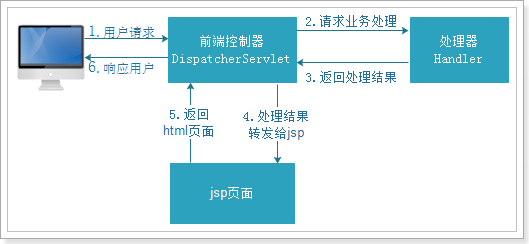

入门程序
--------

需求：使用浏览器显示商品列表

### 创建web工程

springMVC是表现层框架，需要搭建web工程开发。

如下图创建动态web工程：

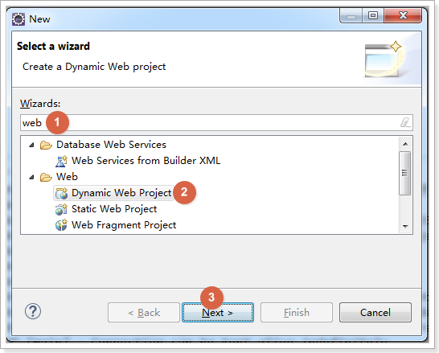

输入工程名，选择配置Tomcat（如果已有，则直接使用），如下图：

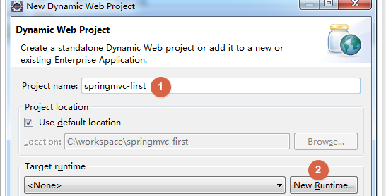

配置Tomcat，如下图：

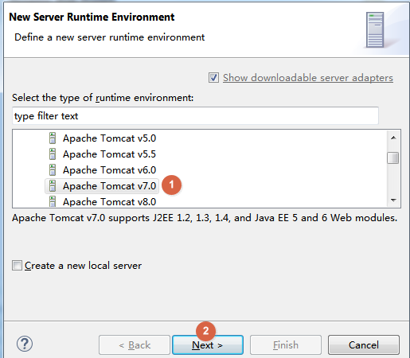

选择准备好的Tomcat，这里用的是Tomcat7，如下图：

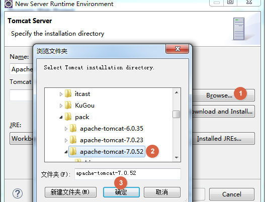

选择成功，点击Finish，如下图：

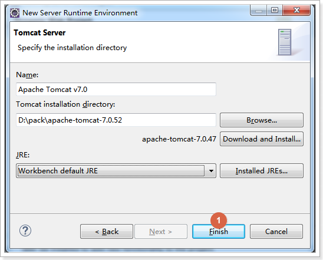

选择刚刚设置成功的Tomcat，如下图：

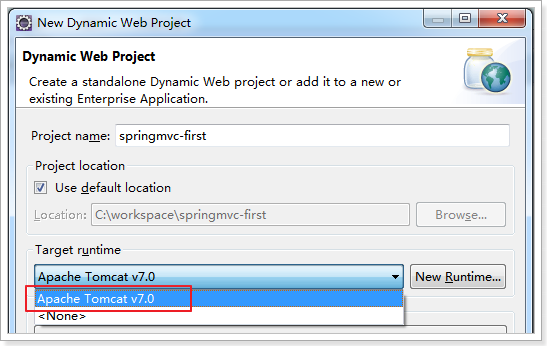

如下图选择web的版本是2.5，可以自动生成web.xml配置文件，

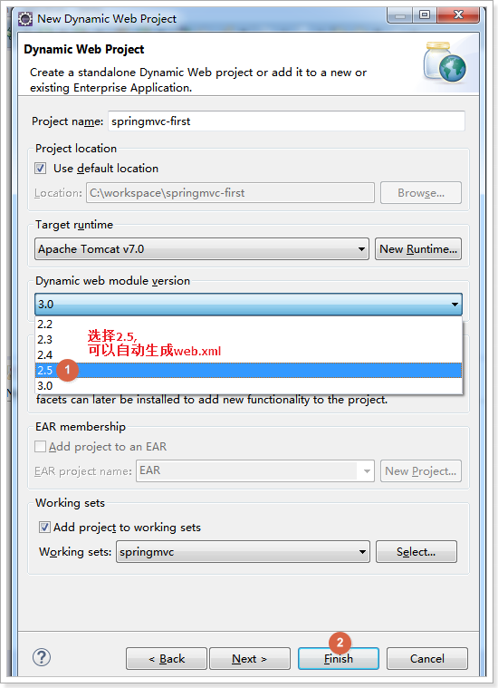

创建效果如下图：

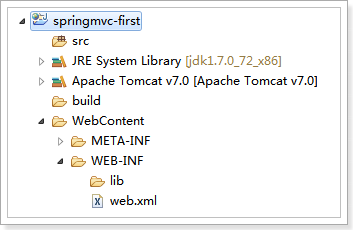

### 导入jar包

从课前资料中导入springMVC的jar包，位置如下图：

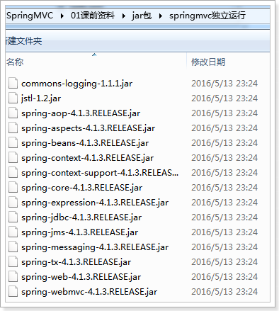

复制jar到lib目录，工程直接加载jar包，如下图：

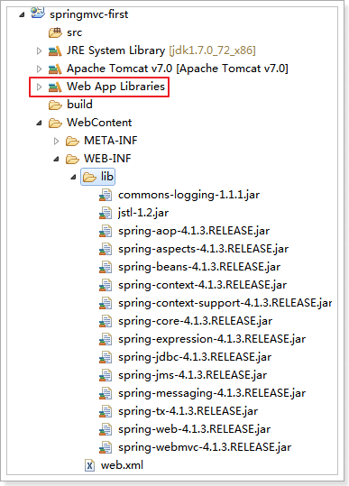

### 加入配置文件

创建config资源文件夹，存放配置文件，如下图：

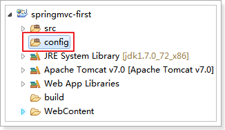

#### 创建springmvc.xml

创建SpringMVC的核心配置文件

SpringMVC本身就是Spring的子项目，对Spring兼容性很好，不需要做很多配置。

这里只配置一个Controller扫描就可以了，让Spring对页面控制层Controller进行管理。

创建springmvc.xml

\<?xml version=*"1.0"* encoding=*"UTF-8"*?\>

\<beans xmlns=*"http://www.springframework.org/schema/beans"*

xmlns:xsi=*"http://www.w3.org/2001/XMLSchema-instance"*
xmlns:p=*"http://www.springframework.org/schema/p"*

xmlns:context=*"http://www.springframework.org/schema/context"*

xmlns:mvc=*"http://www.springframework.org/schema/mvc"*

xsi:schemaLocation=*"http://www.springframework.org/schema/beans
http://www.springframework.org/schema/beans/spring-beans-4.0.xsd*

*http://www.springframework.org/schema/mvc
http://www.springframework.org/schema/mvc/spring-mvc-4.0.xsd*

*http://www.springframework.org/schema/context
http://www.springframework.org/schema/context/spring-context-4.0.xsd"*\>

\<!-- 配置controller扫描包 --\>

\<context:component-scan base-package=*"cn.itcast.springmvc.controller"* /\>

\</beans\>

配置文件需要的约束文件，位置如下图：

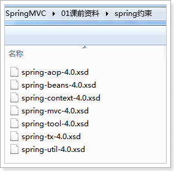

创建包cn.itcast.springmvc.controller

效果如下图：

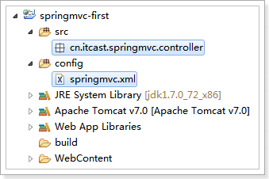

#### 配置前端控制器

配置SpringMVC的前端控制器DispatcherServlet

在web.xml中

\<?xml version=*"1.0"* encoding=*"UTF-8"*?\>

\<web-app xmlns:xsi=*"http://www.w3.org/2001/XMLSchema-instance"*

xmlns=*"http://java.sun.com/xml/ns/javaee"*

xsi:schemaLocation=*"http://java.sun.com/xml/ns/javaee
http://java.sun.com/xml/ns/javaee/web-app_2_5.xsd"*

id=*"WebApp_ID"* version=*"2.5"*\>

\<display-name\>springmvc-first\</display-name\>

\<welcome-file-list\>

\<welcome-file\>index.html\</welcome-file\>

\<welcome-file\>index.htm\</welcome-file\>

\<welcome-file\>index.jsp\</welcome-file\>

\<welcome-file\>default.html\</welcome-file\>

\<welcome-file\>default.htm\</welcome-file\>

\<welcome-file\>default.jsp\</welcome-file\>

\</welcome-file-list\>

\<!-- 配置SpringMVC前端控制器 --\>

\<servlet\>

\<servlet-name\>springmvc-first\</servlet-name\>

\<servlet-class\>org.springframework.web.servlet.DispatcherServlet\</servlet-class\>

\<!-- 指定SpringMVC配置文件 --\>

\<!-- SpringMVC的配置文件的默认路径是/WEB-INF/\${servlet-name}-servlet.xml --\>

\<init-param\>

\<param-name\>contextConfigLocation\</param-name\>

\<param-value\>classpath:springmvc.xml\</param-value\>

\</init-param\>

\</servlet\>

\<servlet-mapping\>

\<servlet-name\>springmvc-first\</servlet-name\>

\<!-- 设置所有以action结尾的请求进入SpringMVC --\>

\<!--

1. /\* 拦截所有 jsp js png .css 真的全拦截 建议不使用

2. \*.action \*.do 拦截以do action 结尾的请求 肯定能使用 用在后台上 （eg：ERP）

3. / 拦截所有 （不包括jsp) (包含.js .png.css) 强烈建议使用 前台 面向消费者
www.jd.com/search（京东的） /对静态资源放行

\--\>

\<url-pattern\>\*.action\</url-pattern\>

\</servlet-mapping\>

\</web-app\>

### 加入jsp页面

把参考资料中的itemList.jsp复制到工程的/WEB-INF/jsp目录下，如下图：

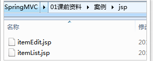

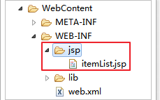

### 实现显示商品列表页

#### 创建pojo

分析页面，查看页面需要的数据，如下图：

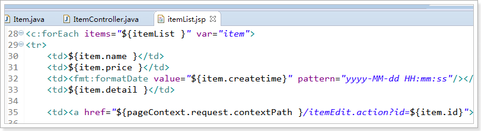

创建商品pojo

**public class** Item {

// 商品id

**private int** id;

// 商品名称

**private** String name;

// 商品价格

**private double** price;

// 商品创建时间

**private** Date createtime;

// 商品描述

**private** String detail;

创建带参数的构造器

set/get。。。

}

#### 创建ItemController

ItemController是一个普通的java类，不需要实现任何接口。

需要在类上添加\@Controller注解，把Controller交由Spring管理

在方法上面添加\@RequestMapping注解，里面指定请求的url。其中“.action”可以加也可以不加。

\@Controller

**public class** ItemController {

// \@RequestMapping：里面放的是请求的url，和用户请求的url进行匹配

// action可以写也可以不写

\@RequestMapping("/itemList.action")

**public** ModelAndView queryItemList() {

// 创建页面需要显示的商品数据

List\<Item\> list = **new** ArrayList\<Item\>();

list.add(**new** Item(1, "1华为 荣耀8", 2399f, **new** Date(), "质量好！1"));

list.add(**new** Item(2, "2华为 荣耀8", 2399f, **new** Date(), "质量好！2"));

list.add(**new** Item(3, "3华为 荣耀8", 2399f, **new** Date(), "质量好！3"));

list.add(**new** Item(4, "4华为 荣耀8", 2399f, **new** Date(), "质量好！4"));

list.add(**new** Item(5, "5华为 荣耀8", 2399f, **new** Date(), "质量好！5"));

list.add(**new** Item(6, "6华为 荣耀8", 2399f, **new** Date(), "质量好！6"));

// 创建ModelAndView，用来存放数据和视图

ModelAndView modelAndView = **new** ModelAndView();

// 设置数据到模型中

modelAndView.addObject("list", list);

// 设置视图jsp，需要设置视图的物理地址

modelAndView.setViewName("/WEB-INF/jsp/itemList.jsp");

**return** modelAndView;

}

}

### 启动项目测试

启动项目，浏览器访问地址

http://127.0.0.1:8080/springmvc-first/itemList.action

效果如下图：

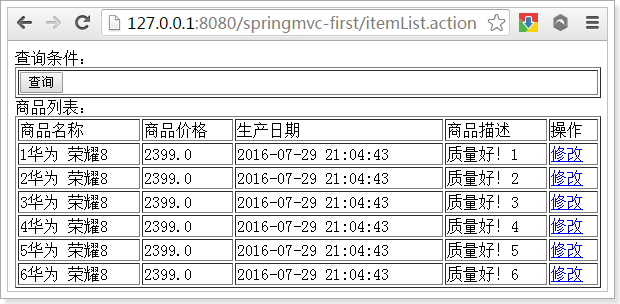

为什么可以用呢？我们需要分析一下springMVC的架构图。

Springmvc架构
=============

框架结构
--------

框架结构如下图：

架构流程
--------

1.  用户发送请求至前端控制器DispatcherServlet

2.  DispatcherServlet收到请求调用HandlerMapping处理器映射器。

3.  处理器映射器根据请求url找到具体的处理器，生成处理器对象及处理器拦截器(如果有则生成)一并返回给DispatcherServlet。

4.  DispatcherServlet通过HandlerAdapter处理器适配器调用处理器

5.  执行处理器(Controller，也叫后端控制器)。

6.  Controller执行完成返回ModelAndView

7.  HandlerAdapter将controller执行结果ModelAndView返回给DispatcherServlet

8.  DispatcherServlet将ModelAndView传给ViewReslover视图解析器

9.  ViewReslover解析后返回具体View

10. DispatcherServlet对View进行渲染视图（即将模型数据填充至视图中）。

11. DispatcherServlet响应用户

组件说明
--------

以下组件通常使用框架提供实现：

-   DispatcherServlet：前端控制器

用户请求到达前端控制器，它就相当于mvc模式中的c，dispatcherServlet是整个流程控制的中心，由它调用其它组件处理用户的请求，dispatcherServlet的存在降低了组件之间的耦合性。

-   HandlerMapping：处理器映射器

HandlerMapping负责根据用户请求url找到Handler即处理器，springmvc提供了不同的映射器实现不同的映射方式，例如：配置文件方式，实现接口方式，注解方式等。

-   Handler：处理器

Handler
是继DispatcherServlet前端控制器的后端控制器，在DispatcherServlet的控制下Handler对具体的用户请求进行处理。

由于Handler涉及到具体的用户业务请求，所以一般情况需要程序员根据业务需求开发Handler。

-   HandlAdapter：处理器适配器

通过HandlerAdapter对处理器进行执行，这是适配器模式的应用，通过扩展适配器可以对更多类型的处理器进行执行。

下图是许多不同的适配器，最终都可以使用usb接口连接

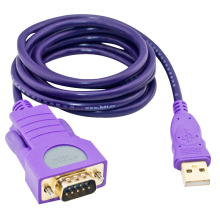

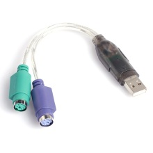

-   ViewResolver：视图解析器

View Resolver负责将处理结果生成View视图，View
Resolver首先根据逻辑视图名解析成物理视图名即具体的页面地址，再生成View视图对象，最后对View进行渲染将处理结果通过页面展示给用户。

-   View：视图

springmvc框架提供了很多的View视图类型的支持，包括：jstlView、freemarkerView、pdfView等。我们最常用的视图就是jsp。

一般情况下需要通过页面标签或页面模版技术将模型数据通过页面展示给用户，需要由程序员根据业务需求开发具体的页面。

| 说明：在springmvc的各个组件中，处理器映射器、处理器适配器、视图解析器称为springmvc的三大组件。 需要用户开发的组件有handler、view |
|----------------------------------------------------------------------------------------------------------------------------------|

默认加载的组件
--------------

我们没有做任何配置，就可以使用这些组件

因为框架已经默认加载这些组件了，配置文件位置如下图：

\# Default implementation classes for DispatcherServlet's strategy interfaces.

\# Used as fallback when no matching beans are found in the DispatcherServlet
context.

\# Not meant to be customized by application developers.

org.springframework.web.servlet.LocaleResolver=org.springframework.web.servlet.i18n.AcceptHeaderLocaleResolver

org.springframework.web.servlet.ThemeResolver=org.springframework.web.servlet.theme.FixedThemeResolver

org.springframework.web.servlet.HandlerMapping=org.springframework.web.servlet.handler.BeanNameUrlHandlerMapping,\\

org.springframework.web.servlet.mvc.annotation.DefaultAnnotationHandlerMapping

org.springframework.web.servlet.HandlerAdapter=org.springframework.web.servlet.mvc.HttpRequestHandlerAdapter,\\

org.springframework.web.servlet.mvc.SimpleControllerHandlerAdapter,\\

org.springframework.web.servlet.mvc.annotation.AnnotationMethodHandlerAdapter

org.springframework.web.servlet.HandlerExceptionResolver=org.springframework.web.servlet.mvc.annotation.AnnotationMethodHandlerExceptionResolver,\\

org.springframework.web.servlet.mvc.annotation.ResponseStatusExceptionResolver,\\

org.springframework.web.servlet.mvc.support.DefaultHandlerExceptionResolver

org.springframework.web.servlet.RequestToViewNameTranslator=org.springframework.web.servlet.view.DefaultRequestToViewNameTranslator

org.springframework.web.servlet.ViewResolver=org.springframework.web.servlet.view.InternalResourceViewResolver

org.springframework.web.servlet.FlashMapManager=org.springframework.web.servlet.support.SessionFlashMapManager

组件扫描器
----------

使用组件扫描器省去在spring容器配置每个Controller类的繁琐。

使用\<context:component-scan\>自动扫描标记\@Controller的控制器类，

在springmvc.xml配置文件中配置如下：

\<!-- 配置controller扫描包，多个包之间用,分隔 --\>

\<context:component-scan base-package=*"cn.itcast.springmvc.controller"* /\>

注解映射器和适配器
------------------

### 配置处理器映射器

注解式处理器映射器，对类中标记了\@ResquestMapping的方法进行映射。根据\@ResquestMapping定义的url匹配\@ResquestMapping标记的方法，匹配成功返回HandlerMethod对象给前端控制器。

HandlerMethod对象中封装url对应的方法Method。

从spring3.1版本开始，废除了DefaultAnnotationHandlerMapping的使用，推荐使用RequestMappingHandlerMapping完成注解式处理器映射。

在springmvc.xml配置文件中配置如下：

\<!-- 配置处理器映射器 --\>

\<bean

class=*"org.springframework.web.servlet.mvc.method.annotation.RequestMappingHandlerMapping"*
/\>

注解描述：

\@RequestMapping：定义请求url到处理器功能方法的映射

### 配置处理器适配器

注解式处理器适配器，对标记\@ResquestMapping的方法进行适配。

从spring3.1版本开始，废除了AnnotationMethodHandlerAdapter的使用，推荐使用RequestMappingHandlerAdapter完成注解式处理器适配。

在springmvc.xml配置文件中配置如下：

\<!-- 配置处理器适配器 --\>

\<bean

class=*"org.springframework.web.servlet.mvc.method.annotation.RequestMappingHandlerAdapter"*
/\>

### 注解驱动

直接配置处理器映射器和处理器适配器比较麻烦，可以使用注解驱动来加载。

SpringMVC使用\<mvc:annotation-driven\>自动加载RequestMappingHandlerMapping和RequestMappingHandlerAdapter

可以在springmvc.xml配置文件中使用\<mvc:annotation-driven\>替代注解处理器和适配器的配置。

\<!-- 注解驱动 --\>

\<mvc:annotation-driven /\>

视图解析器
----------

视图解析器使用SpringMVC框架默认的InternalResourceViewResolver，这个视图解析器支持JSP视图解析

在springmvc.xml配置文件中配置如下：

\<!-- Example: prefix="/WEB-INF/jsp/", suffix=".jsp", viewname="test" -\>

"/WEB-INF/jsp/test.jsp" --\>

\<!-- 配置视图解析器 --\>

\<!-- 将mav.setViewName("/WEB-INF/jsp/itemList.jsp");

改成 mav.setViewName("itemList");的方式

\--\>

\<bean

class=*"org.springframework.web.servlet.view.InternalResourceViewResolver"*\>

\<!-- 配置逻辑视图的前缀 --\>

\<property name=*"prefix"* value=*"/WEB-INF/jsp/"* /\>

\<!-- 配置逻辑视图的后缀 --\>

\<property name=*"suffix"* value=*".jsp"* /\>

\</bean\>

逻辑视图名需要在controller中返回ModelAndView指定，比如逻辑视图名为ItemList，则最终返回的jsp视图地址:

“WEB-INF/jsp/itemList.jsp”

最终jsp物理地址：前缀+**逻辑视图名**+后缀

### 修改ItemController

修改ItemController中设置视图的代码

// \@RequestMapping：里面放的是请求的url，和用户请求的url进行匹配

// action可以写也可以不写

\@RequestMapping("/itemList.action")

**public** ModelAndView queryItemList() {

// 创建页面需要显示的商品数据

List\<Item\> list = **new** ArrayList\<\>();

list.add(**new** Item(1, "1华为 荣耀8", 2399, **new** Date(), "质量好！1"));

list.add(**new** Item(2, "2华为 荣耀8", 2399, **new** Date(), "质量好！2"));

list.add(**new** Item(3, "3华为 荣耀8", 2399, **new** Date(), "质量好！3"));

list.add(**new** Item(4, "4华为 荣耀8", 2399, **new** Date(), "质量好！4"));

list.add(**new** Item(5, "5华为 荣耀8", 2399, **new** Date(), "质量好！5"));

list.add(**new** Item(6, "6华为 荣耀8", 2399, **new** Date(), "质量好！6"));

// 创建ModelAndView，用来存放数据和视图

ModelAndView modelAndView = **new** ModelAndView();

// 设置数据到模型中

modelAndView.addObject("itemList", list);

// 设置视图jsp，需要设置视图的物理地址

// modelAndView.setViewName("/WEB-INF/jsp/itemList.jsp");

// 配置好视图解析器前缀和后缀，这里只需要设置逻辑视图就可以了。

// 视图解析器根据前缀+逻辑视图名+后缀拼接出来物理路径

modelAndView.setViewName("itemList");

**return** modelAndView;

}

### 效果

效果和之前一样，如下图：

整合mybatis
===========

为了更好的学习
springmvc和mybatis整合开发的方法，需要将springmvc和mybatis进行整合。

整合目标：控制层采用springmvc、持久层使用mybatis实现。

创建数据库表
------------

sql脚本，位置如下图：

创建数据库表springmvc，导入到数据库中，如下图：

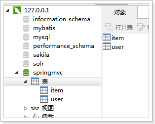

需要的jar包
-----------

1.  spring（包括springmvc）

2.  mybatis

3.  mybatis-spring整合包

4.  数据库驱动

5.  第三方连接池。

jar包位置如下图：

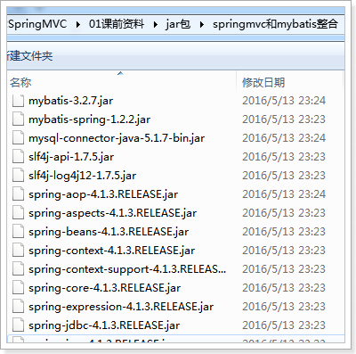

整合思路
--------

Dao层：

1.  SqlMapConfig.xml，空文件即可，但是需要文件头。

2.  applicationContext-dao.xml

    1.  数据库连接池

    2.  SqlSessionFactory对象，需要spring和mybatis整合包下的。

    3.  配置mapper文件扫描器。

Service层：

1.  applicationContext-service.xml包扫描器，扫描\@service注解的类。

2.  applicationContext-trans.xml配置事务。

Controller层：

1.  Springmvc.xml

    1.  包扫描器，扫描\@Controller注解的类。

    2.  配置注解驱动

    3.  配置视图解析器

Web.xml文件：

1.  配置spring

2.  配置前端控制器。

创建工程
--------

创建动态web工程springmvc-web，如下图：

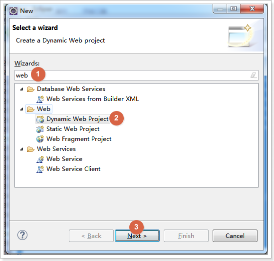

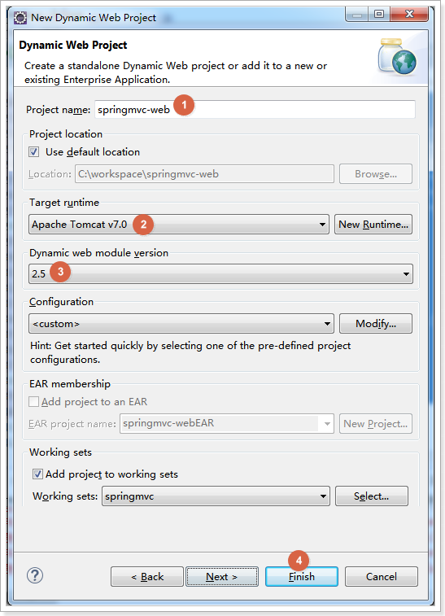

加入jar包
---------

复制jar包到/WEB-INF/lib中

工程自动加载jar包

加入配置文件
------------

创建资源文件夹config

在其下创建mybatis和spring文件夹，用来存放配置文件，如下图：

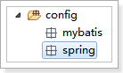

### sqlMapConfig.xml

使用逆向工程来生成Mapper相关代码，不需要配置别名。

在config/mybatis下创建SqlMapConfig.xml

\<?xml version=*"1.0"* encoding=*"UTF-8"*?\>

\<!DOCTYPE configuration

PUBLIC "-//mybatis.org//DTD Config 3.0//EN"

"http://mybatis.org/dtd/mybatis-3-config.dtd"\>

\<configuration\>

\</configuration\>

### applicationContext-dao.xml

配置数据源、配置SqlSessionFactory、mapper扫描器。

\<?xml version=*"1.0"* encoding=*"UTF-8"*?\>

\<beans xmlns=*"http://www.springframework.org/schema/beans"*

xmlns:context=*"http://www.springframework.org/schema/context"*
xmlns:p=*"http://www.springframework.org/schema/p"*

xmlns:aop=*"http://www.springframework.org/schema/aop"*
xmlns:tx=*"http://www.springframework.org/schema/tx"*

xmlns:xsi=*"http://www.w3.org/2001/XMLSchema-instance"*

xsi:schemaLocation=*"http://www.springframework.org/schema/beans
http://www.springframework.org/schema/beans/spring-beans-4.0.xsd*

*http://www.springframework.org/schema/context
http://www.springframework.org/schema/context/spring-context-4.0.xsd*

*http://www.springframework.org/schema/aop
http://www.springframework.org/schema/aop/spring-aop-4.0.xsd
http://www.springframework.org/schema/tx
http://www.springframework.org/schema/tx/spring-tx-4.0.xsd*

*http://www.springframework.org/schema/util
http://www.springframework.org/schema/util/spring-util-4.0.xsd"*\>

\<!-- 加载配置文件 --\>

\<context:property-placeholder location=*"classpath:db.properties"* /\>

\<!-- 数据库连接池 --\>

\<bean id=*"dataSource"* class=*"org.apache.commons.dbcp.BasicDataSource"*

destroy-method=*"close"*\>

\<property name=*"driverClassName"* value=*"\${jdbc.driver}"* /\>

\<property name=*"url"* value=*"\${jdbc.url}"* /\>

\<property name=*"username"* value=*"\${jdbc.username}"* /\>

\<property name=*"password"* value=*"\${jdbc.password}"* /\>

\<property name=*"maxActive"* value=*"10"* /\>

\<property name=*"maxIdle"* value=*"5"* /\>

\</bean\>

\<!-- 配置SqlSessionFactory --\>

\<bean id=*"sqlSessionFactory"*
class=*"org.mybatis.spring.SqlSessionFactoryBean"*\>

\<!-- 数据库连接池 --\>

\<property name=*"dataSource"* ref=*"dataSource"* /\>

\<!-- 加载mybatis的全局配置文件 --\>

\<property name=*"configLocation"* value=*"classpath:mybatis/SqlMapConfig.xml"*
/\>

\</bean\>

\<!-- 配置Mapper扫描 --\>

\<bean class=*"org.mybatis.spring.mapper.MapperScannerConfigurer"*\>

\<!-- 配置Mapper扫描包 --\>

\<property name=*"basePackage"* value=*"cn.itcast.ssm.mapper"* /\>

\</bean\>

\</beans\>

### db.properties

配置数据库相关信息

jdbc.driver=com.mysql.jdbc.Driver

jdbc.url=jdbc:mysql://localhost:3306/springmvc?characterEncoding=utf-8

jdbc.username=root

jdbc.password=root

### applicationContext-service.xml

\<?xml version=*"1.0"* encoding=*"UTF-8"*?\>

\<beans xmlns=*"http://www.springframework.org/schema/beans"*

xmlns:context=*"http://www.springframework.org/schema/context"*
xmlns:p=*"http://www.springframework.org/schema/p"*

xmlns:aop=*"http://www.springframework.org/schema/aop"*
xmlns:tx=*"http://www.springframework.org/schema/tx"*

xmlns:xsi=*"http://www.w3.org/2001/XMLSchema-instance"*

xsi:schemaLocation=*"http://www.springframework.org/schema/beans
http://www.springframework.org/schema/beans/spring-beans-4.0.xsd*

*http://www.springframework.org/schema/context
http://www.springframework.org/schema/context/spring-context-4.0.xsd*

*http://www.springframework.org/schema/aop
http://www.springframework.org/schema/aop/spring-aop-4.0.xsd
http://www.springframework.org/schema/tx
http://www.springframework.org/schema/tx/spring-tx-4.0.xsd*

*http://www.springframework.org/schema/util
http://www.springframework.org/schema/util/spring-util-4.0.xsd"*\>

\<!-- 配置service扫描 --\>

\<context:component-scan base-package=*"cn.itcast.ssm.service"* /\>

\</beans\>

### applicationContext-trans.xml

\<?xml version=*"1.0"* encoding=*"UTF-8"*?\>

\<beans xmlns=*"http://www.springframework.org/schema/beans"*

xmlns:context=*"http://www.springframework.org/schema/context"*
xmlns:p=*"http://www.springframework.org/schema/p"*

xmlns:aop=*"http://www.springframework.org/schema/aop"*
xmlns:tx=*"http://www.springframework.org/schema/tx"*

xmlns:xsi=*"http://www.w3.org/2001/XMLSchema-instance"*

xsi:schemaLocation=*"http://www.springframework.org/schema/beans
http://www.springframework.org/schema/beans/spring-beans-4.0.xsd*

*http://www.springframework.org/schema/context
http://www.springframework.org/schema/context/spring-context-4.0.xsd*

*http://www.springframework.org/schema/aop
http://www.springframework.org/schema/aop/spring-aop-4.0.xsd
http://www.springframework.org/schema/tx
http://www.springframework.org/schema/tx/spring-tx-4.0.xsd*

*http://www.springframework.org/schema/util
http://www.springframework.org/schema/util/spring-util-4.0.xsd"*\>

\<!-- 事务管理器 --\>

\<bean id=*"transactionManager"*

class=*"org.springframework.jdbc.datasource.DataSourceTransactionManager"*\>

\<!-- 数据源 --\>

\<property name=*"dataSource"* ref=*"dataSource"* /\>

\</bean\>

\<!-- 通知 --\>

\<tx:advice id=*"txAdvice"* transaction-manager=*"transactionManager"*\>

\<tx:attributes\>

\<!-- 传播行为 --\>

\<tx:method name=*"save\*"* propagation=*"REQUIRED"* /\>

\<tx:method name=*"insert\*"* propagation=*"REQUIRED"* /\>

\<tx:method name=*"delete\*"* propagation=*"REQUIRED"* /\>

\<tx:method name=*"update\*"* propagation=*"REQUIRED"* /\>

\<tx:method name=*"find\*"* propagation=*"SUPPORTS"* read-only=*"true"* /\>

\<tx:method name=*"get\*"* propagation=*"SUPPORTS"* read-only=*"true"* /\>

\<tx:method name=*"query\*"* propagation=*"SUPPORTS"* read-only=*"true"* /\>

\</tx:attributes\>

\</tx:advice\>

\<!-- 切面 --\>

\<aop:config\>

\<aop:advisor advice-ref=*"txAdvice"*

pointcut=*"execution(\* cn.itcast.ssm.service.\*.\*(..))"* /\>

\</aop:config\>

\</beans\>

### springmvc.xml

\<?xml version=*"1.0"* encoding=*"UTF-8"*?\>

\<beans xmlns=*"http://www.springframework.org/schema/beans"*

xmlns:xsi=*"http://www.w3.org/2001/XMLSchema-instance"*
xmlns:p=*"http://www.springframework.org/schema/p"*

xmlns:context=*"http://www.springframework.org/schema/context"*

xmlns:mvc=*"http://www.springframework.org/schema/mvc"*

xsi:schemaLocation=*"http://www.springframework.org/schema/beans
http://www.springframework.org/schema/beans/spring-beans-4.0.xsd*

*http://www.springframework.org/schema/mvc
http://www.springframework.org/schema/mvc/spring-mvc-4.0.xsd*

*http://www.springframework.org/schema/context
http://www.springframework.org/schema/context/spring-context-4.0.xsd"*\>

\<!-- 配置controller扫描包 --\>

\<context:component-scan base-package=*"cn.itcast.ssm.controller"* /\>

\<!-- 注解驱动 --\>

\<mvc:annotation-driven /\>

\<!-- Example: prefix="/WEB-INF/jsp/", suffix=".jsp", viewname="test" -\>

"/WEB-INF/jsp/test.jsp" --\>

\<!-- 配置视图解析器 --\>

\<bean

class=*"org.springframework.web.servlet.view.InternalResourceViewResolver"*\>

\<!-- 配置逻辑视图的前缀 --\>

\<property name=*"prefix"* value=*"/WEB-INF/jsp/"* /\>

\<!-- 配置逻辑视图的后缀 --\>

\<property name=*"suffix"* value=*".jsp"* /\>

\</bean\>

\</beans\>

### web.xml

\<?xml version=*"1.0"* encoding=*"UTF-8"*?\>

\<web-app xmlns:xsi=*"http://www.w3.org/2001/XMLSchema-instance"*

xmlns=*"http://java.sun.com/xml/ns/javaee"*

xsi:schemaLocation=*"http://java.sun.com/xml/ns/javaee
http://java.sun.com/xml/ns/javaee/web-app_2_5.xsd"*

id=*"WebApp_ID"* version=*"2.5"*\>

\<display-name\>springmvc-web\</display-name\>

\<welcome-file-list\>

\<welcome-file\>index.html\</welcome-file\>

\<welcome-file\>index.htm\</welcome-file\>

\<welcome-file\>index.jsp\</welcome-file\>

\<welcome-file\>default.html\</welcome-file\>

\<welcome-file\>default.htm\</welcome-file\>

\<welcome-file\>default.jsp\</welcome-file\>

\</welcome-file-list\>

\<!-- 配置spring --\>

\<context-param\>

\<param-name\>contextConfigLocation\</param-name\>

\<param-value\>classpath:spring/applicationContext\*.xml\</param-value\>

\</context-param\>

\<!-- 使用监听器加载Spring配置文件 --\>

\<listener\>

\<listener-class\>org.springframework.web.context.ContextLoaderListener\</listener-class\>

\</listener\>

\<!-- 配置SrpingMVC的前端控制器 --\>

\<servlet\>

\<servlet-name\>springmvc-web\</servlet-name\>

\<servlet-class\>org.springframework.web.servlet.DispatcherServlet\</servlet-class\>

\<init-param\>

\<param-name\>contextConfigLocation\</param-name\>

\<param-value\>classpath:spring/springmvc.xml\</param-value\>

\</init-param\>

\</servlet\>

\<servlet-mapping\>

\<servlet-name\>springmvc-web\</servlet-name\>

\<!-- 配置所有以action结尾的请求进入SpringMVC --\>

\<url-pattern\>\*.action\</url-pattern\>

\</servlet-mapping\>

\</web-app\>

加入jsp页面
-----------

复制课前资料的itemList.jsp和itemEdit.jsp到工程中

效果
----

配置完效果如下图：

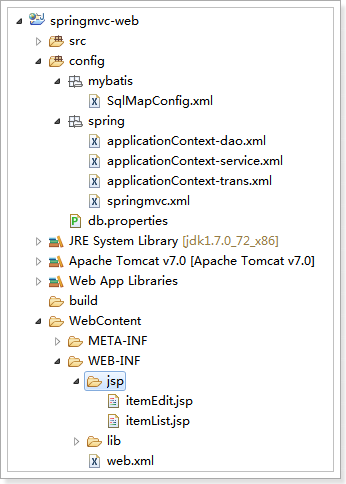

实现商品列表显示
================

需求
----

实现商品查询列表，从mysql数据库查询商品信息。

DAO开发
-------

使用逆向工程，生成代码

注意修改逆向工程的配置文件，参考MyBatis第二天

逆向工程生成代码如下图：

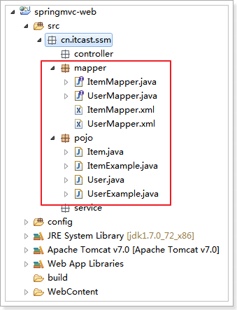

ItemService接口
---------------

**public interface** ItemService {

/\*\*

\* 查询商品列表

\*

\* **\@return**

\*/

List\<Item\> queryItemList();

}

ItemServiceImpl实现类
---------------------

\@Service

**public class** ItemServiceImpl **implements** ItemService {

\@Autowired

**private** ItemMapper itemMapper;

\@Override

**public** List\<Item\> queryItemList() {

// 从数据库查询商品数据

List\<Item\> list = **this**.itemMapper.selectByExample(**null**);

**return** list;

}

}

ItemController
--------------

\@Controller

**public class** ItemController {

\@Autowired

**private** ItemService itemService;

/\*\*

\* 显示商品列表

\*

\* **\@return**

\*/

\@RequestMapping("/itemList")

**public** ModelAndView queryItemList() {

// 获取商品数据

List\<Item\> list = **this**.itemService.queryItemList();

ModelAndView modelAndView = **new** ModelAndView();

// 把商品数据放到模型中

modelAndView.addObject("itemList", list);

// 设置逻辑视图

modelAndView.setViewName("itemList");

**return** modelAndView;

}

}

测试
----

访问url：

http://127.0.0.1:8080/springmvc-web/itemList.action

效果如下图：

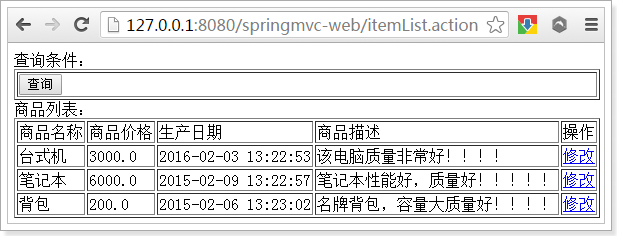

参数绑定
========

默认支持的参数类型
------------------

### 需求

打开商品编辑页面，展示商品信息。

### 需求分析

编辑商品信息，首先要显示商品详情

需要根据商品id查询商品信息，然后展示到页面。

请求的url：/itemEdit.action

参数：id（商品id）

响应结果：商品编辑页面，展示商品详细信息。

### ItemService接口

编写ItemService接口如下图：

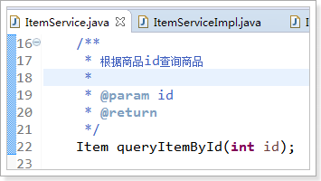

### ItemServiceImpl实现类

\@Override

**public** Item queryItemById(**int** id) {

Item item = **this**.itemMapper.selectByPrimaryKey(id);

**return** item;

}

### ItemController

页面点击修改按钮，发起请求

http://127.0.0.1:8080/springmvc-web/itemEdit.action?id=1

需要从请求的参数中把请求的id取出来。

Id包含在Request对象中。可以从Request对象中取id。

想获得Request对象只需要在Controller方法的形参中添加一个参数即可。Springmvc框架会自动把Request对象传递给方法。

代码实现

/\*\*

\* 根据id查询商品

\*

\* **\@param** request

\* **\@return**

\*/

\@RequestMapping("/itemEdit")

**public** ModelAndView queryItemById(HttpServletRequest request) {

// 从request中获取请求参数

String strId = request.getParameter("id");

Integer id = Integer.*valueOf*(strId);

// 根据id查询商品数据

Item item = **this**.itemService.queryItemById(id);

// 把结果传递给页面

ModelAndView modelAndView = **new** ModelAndView();

// 把商品数据放在模型中

modelAndView.addObject("item", item);

// 设置逻辑视图

modelAndView.setViewName("itemEdit");

**return** modelAndView;

}

### 默认支持的参数类型

处理器形参中添加如下类型的参数处理适配器会默认识别并进行赋值。

#### HttpServletRequest

通过request对象获取请求信息

#### HttpServletResponse

通过response处理响应信息

#### HttpSession

通过session对象得到session中存放的对象

### Model/ModelMap

#### Model

除了ModelAndView以外，还可以使用Model来向页面传递数据，

Model是一个接口，在参数里直接声明model即可。

如果使用Model则可以不使用ModelAndView对象，Model对象可以向页面传递数据，View对象则可以使用String返回值替代。

不管是Model还是ModelAndView，其本质都是使用Request对象向jsp传递数据。

代码实现：

/\*\*

\* 根据id查询商品,使用Model

\*

\* **\@param** request

\* **\@param** model

\* **\@return**

\*/

\@RequestMapping("/itemEdit")

**public** String queryItemById(HttpServletRequest request, Model model) {

// 从request中获取请求参数

String strId = request.getParameter("id");

Integer id = Integer.*valueOf*(strId);

// 根据id查询商品数据

Item item = **this**.itemService.queryItemById(id);

// 把结果传递给页面

// ModelAndView modelAndView = new ModelAndView();

// 把商品数据放在模型中

// modelAndView.addObject("item", item);

// 设置逻辑视图

// modelAndView.setViewName("itemEdit");

// 把商品数据放在模型中

model.addAttribute("item", item);

**return** "itemEdit";

}

#### ModelMap

ModelMap是Model接口的实现类，也可以通过ModelMap向页面传递数据

使用Model和ModelMap的效果一样，如果直接使用Model，springmvc会实例化ModelMap。

代码实现：

/\*\*

\* 根据id查询商品,使用ModelMap

\*

\* **\@param** request

\* **\@param** model

\* **\@return**

\*/

\@RequestMapping("/itemEdit")

**public** String queryItemById(HttpServletRequest request, ModelMap model) {

// 从request中获取请求参数

String strId = request.getParameter("id");

Integer id = Integer.*valueOf*(strId);

// 根据id查询商品数据

Item item = **this**.itemService.queryItemById(id);

// 把结果传递给页面

// ModelAndView modelAndView = new ModelAndView();

// 把商品数据放在模型中

// modelAndView.addObject("item", item);

// 设置逻辑视图

// modelAndView.setViewName("itemEdit");

// 把商品数据放在模型中

model.addAttribute("item", item);

**return** "itemEdit";

}

绑定简单类型
------------

当请求的参数名称和处理器形参名称一致时会将请求参数与形参进行绑定。

这样，从Request取参数的方法就可以进一步简化。

/\*\*

\* 根据id查询商品,绑定简单数据类型

\*

\* **\@param** id

\* **\@param** model

\* **\@return**

\*/

\@RequestMapping("/itemEdit")

**public** String queryItemById(**int** id, ModelMap model) {

// 根据id查询商品数据

Item item = **this**.itemService.queryItemById(id);

// 把商品数据放在模型中

model.addAttribute("item", item);

**return** "itemEdit";

}

### 支持的数据类型

参数类型推荐使用包装数据类型，因为基础数据类型不可以为null

整形：Integer、int

字符串：String

单精度：Float、float

双精度：Double、double

布尔型：Boolean、boolean

说明：对于布尔类型的参数，请求的参数值为true或false。或者1或0

请求url：

http://localhost:8080/xxx.action?id=2&status=false

处理器方法：

public String editItem(Model model,Integer id,Boolean status)

### \@RequestParam

使用\@RequestParam常用于处理简单类型的绑定。

value：参数名字，即入参的请求参数名字，如value=“itemId”表示请求的参数
区中的名字为itemId的参数的值将传入

required：是否必须，默认是true，表示请求中一定要有相应的参数，否则将报错

TTP Status 400 - Required Integer parameter 'XXXX' is not present

defaultValue：默认值，表示如果请求中没有同名参数时的默认值

定义如下：

\@RequestMapping("/itemEdit")

**public** String queryItemById(\@RequestParam(value = "itemId", required =
**true**, defaultValue = "1") Integer id,

ModelMap modelMap) {

// 根据id查询商品数据

Item item = **this**.itemService.queryItemById(id);

// 把商品数据放在模型中

modelMap.addAttribute("item", item);

**return** "itemEdit";

}

绑定pojo类型
------------

### 需求 

将页面修改后的商品信息保存到数据库中。

### 需求分析

请求的url：/updateItem.action

参数：表单中的数据。

响应内容：更新成功页面

### 使用pojo接收表单数据

如果提交的参数很多，或者提交的表单中的内容很多的时候,可以使用简单类型接受数据,也可以使用pojo接收数据。

要求：pojo对象中的属性名和表单中input的name属性一致。

页面定义如下图：

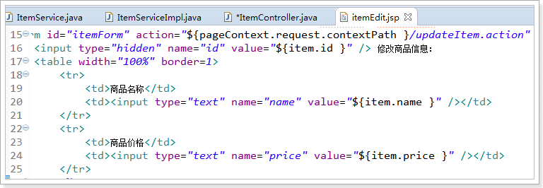

Pojo(逆向工程生成)如下图：

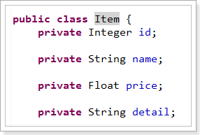

请求的参数名称和pojo的属性名称一致，会自动将请求参数赋值给pojo的属性。

### ItemService接口

ItemService里编写接口方法

/\*\*

\* 根据id更新商品

\*

\* **\@param** item

\*/

**void** updateItemById(Item item);

### ItemServiceImpl实现类

ItemServiceImpl里实现接口方法

使用updateByPrimaryKeySelective(item)方法，忽略空参数

\@Override

**public void** updateItemById(Item item) {

**this**.itemMapper.updateByPrimaryKeySelective(item);

}

### ItemController

/\*\*

\* 更新商品,绑定pojo类型

\*

\* **\@param** item

\* **\@param** model

\* **\@return**

\*/

\@RequestMapping("/updateItem")

**public** String updateItem(Item item) {

// 调用服务更新商品

**this**.itemService.updateItemById(item);

// 返回逻辑视图

**return** "success";

}

注意：

提交的表单中不要有日期类型的数据，否则会报400错误。如果想提交日期类型的数据需要用到后面的自定义参数绑定的内容。

### 编写success页面

如下图创建success.jsp页面

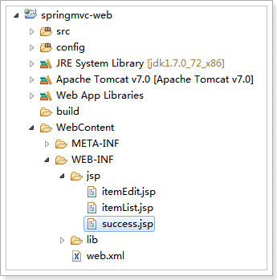

页面代码：

\<%\@ page language=*"java"* contentType=*"text/html; charset=UTF-8"*

pageEncoding=*"UTF-8"*%\>

\<!DOCTYPE html PUBLIC "-//W3C//DTD HTML 4.01 Transitional//EN"
"http://www.w3.org/TR/html4/loose.dtd"\>

\<html\>

\<head\>

\<meta http-equiv=*"Content-Type"* content=*"text/html; charset=UTF-8"*\>

\<title\>Insert title here\</title\>

\</head\>

\<body\>

\<h1\>商品修改成功！\</h1\>

\</body\>

\</html\>

### 解决post乱码问题

提交发现，保存成功，但是保存的是乱码

在web.xml中加入：

\<!-- 解决post乱码问题 --\>

\<filter\>

\<filter-name\>encoding\</filter-name\>

\<filter-class\>org.springframework.web.filter.CharacterEncodingFilter\</filter-class\>

\<!-- 设置编码参是UTF8 --\>

\<init-param\>

\<param-name\>encoding\</param-name\>

\<param-value\>UTF-8\</param-value\>

\</init-param\>

\</filter\>

\<filter-mapping\>

\<filter-name\>encoding\</filter-name\>

\<url-pattern\>/\*\</url-pattern\>

\</filter-mapping\>

以上可以解决post请求乱码问题。

对于get请求中文参数出现乱码解决方法有两个：

修改tomcat配置文件添加编码与工程编码一致，如下：

\<Connector URIEncoding="utf-8" connectionTimeout="20000" port="8080"
protocol="HTTP/1.1" redirectPort="8443"/\>

另外一种方法对参数进行重新编码：

String userName new

String(request.getParamter("userName").getBytes("ISO8859-1"),"utf-8")

ISO8859-1是tomcat默认编码，需要将tomcat编码后的内容按utf-8编码

绑定包装pojo
------------

### 需求

使用包装的pojo接收商品信息的查询条件。

### 需求分析

包装对象定义如下：

**public class** QueryVo {

**private** Item item;

set/get。。。

}

页面定义如下图：

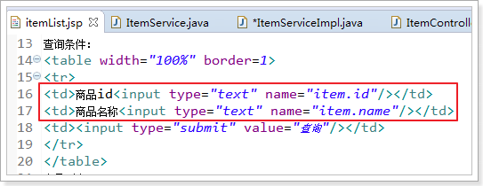

### 接收查询条件

// 绑定包装数据类型

\@RequestMapping("/queryItem")

**public** String queryItem(QueryVo queryVo) {

System.*out*.println(queryVo.getItem().getId());

System.*out*.println(queryVo.getItem().getName());

**return** "success";

}

自定义参数绑定
--------------

### 需求

在商品修改页面可以修改商品的生产日期，并且根据业务需求自定义日期格式。

### 需求分析

由于日期数据有很多种格式，springmvc没办法把字符串转换成日期类型。所以需要自定义参数绑定。

前端控制器接收到请求后，找到注解形式的处理器适配器，对RequestMapping标记的方法进行适配，并对方法中的形参进行参数绑定。可以在springmvc处理器适配器上自定义转换器Converter进行参数绑定。

一般使用\<mvc:annotation-driven/\>注解驱动加载处理器适配器，可以在此标签上进行配置。

### 修改jsp页面

如下图修改itemEdit.jsp页面，显示时间

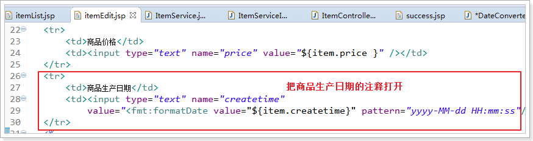

### 自定义Converter

//Converter\<S, T\>

//S:source,需要转换的源的类型

//T:target,需要转换的目标类型

**public class** DateConverter **implements** Converter\<String, Date\> {

\@Override

**public** Date convert(String source) {

**try** {

// 把字符串转换为日期类型

SimpleDateFormat simpleDateFormat = **new** SimpleDateFormat("yyy-MM-dd
HH:mm:ss");

Date date = simpleDateFormat.parse(source);

**return** date;

} **catch** (ParseException e) {

// **TODO** Auto-generated catch block

e.printStackTrace();

}

// 如果转换异常则返回空

**return null**;

}

}

### 配置Converter

我们同时可以配置多个的转换器。

类似下图的usb设备，可以接入多个usb设备

\<!-- 配置注解驱动 --\>

\<!-- 如果配置此标签,可以不用配置... --\>

\<mvc:annotation-driven conversion-service=*"conversionService"* /\>

\<!-- 转换器配置 --\>

\<bean id=*"conversionService"*
class=*"org.springframework.format.support.FormattingConversionServiceFactoryBean"*\>

\<property name=*"converters"*\>

\<set\>

\<bean class=*"cn.itcast.springmvc.converter.DateConverter"* /\>

\</set\>

\</property\>

\</bean\>

### 配置方式2（了解）

\<!--注解适配器 --\>

\<bean
class=*"org.springframework.web.servlet.mvc.method.annotation.RequestMappingHandlerAdapter"*\>

\<property name=*"webBindingInitializer"* ref=*"customBinder"*\>\</property\>

\</bean\>

\<!-- 自定义webBinder --\>

\<bean id=*"customBinder"*
class=*"org.springframework.web.bind.support.ConfigurableWebBindingInitializer"*\>

\<property name=*"conversionService"* ref=*"conversionService"* /\>

\</bean\>

\<!-- 转换器配置 --\>

\<bean id=*"conversionService"*
class=*"org.springframework.format.support.FormattingConversionServiceFactoryBean"*\>

\<property name=*"converters"*\>

\<set\>

\<bean class=*"cn.itcast.springmvc.convert.DateConverter"* /\>

\</set\>

\</property\>

\</bean\>

注意：此方法需要独立配置处理器映射器、适配器，

不再使用\<mvc:annotation-driven/\>

springmvc与struts2不同
======================

1.  springmvc的入口是一个servlet即前端控制器，而struts2入口是一个filter过滤器。

2.  springmvc是基于方法开发(一个url对应一个方法)，请求参数传递到方法的形参，可以设计为单例或多例(建议单例)，struts2是基于类开发，传递参数是通过类的属性，只能设计为多例。

3.  Struts采用值栈存储请求和响应的数据，通过OGNL存取数据，
    springmvc通过参数解析器是将request请求内容解析，并给方法形参赋值，将数据和视图封装成ModelAndView对象，最后又将ModelAndView中的模型数据通过request域传输到页面。Jsp视图解析器默认使用jstl。
