**SpringMVC第二天**

**框架课程**

课前回顾
========

1、Springmvc介绍？ Springmvc是Spring公司

2、Springmvc入门程序

第一步：Web工程

第二步：导Jar包

第三步：web.xml配置前端控制器 servlet Filtter

\*.do.action /拦截所有不包含jsp /\*拦截所有（真拦截）

第四步：配置上下文springmvc.xml 配置扫描\@Controller

第五步：Handler Controller 程序员自己写的
\@RequestMapping(value=”/item/queryItem.action)

Public ModelAndView quyerITem(){

跳转/WEB-INF/jsp/itemList.jsp

}

商品列表查询

3、 springmvc 原理图

用户请求到前端控制器、让处理器映射器去找相应的路径 对应的方法

返回找到的方法

前端控制器、让处理器适配器 去执行此方法（执行前绑定参数）

返回ModelAndView

前端控制器、让视图解析器 数据填充在.jsp的标签处、html

中心

三大组件

写的

Handler JSP

4、参数绑定 简单类型 queryItem(Integer id) jsp页面上input type=text name=id

POJO Item

修改商品提交 input type=text name = pojo里面要一致

包装POJO QueryVo（里面Item） name=item.id

自定义参数绑定

日期类型

Yyyy-MM_dd

课程计划
========

1.  高级参数绑定

    1.  数组类型的参数绑定

    2.  List类型的绑定

2.  \@RequestMapping注解的使用

3.  Controller方法返回值

4.  Springmvc中异常处理

5.  图片上传处理

6.  Json数据交互

7.  Springmvc实现RESTful

8.  拦截器

高级参数绑定
============

复制工程
--------

把昨天的springmvc-web工程复制一份，作为今天开发的工程

复制工程，如下图：

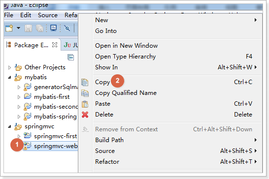

粘贴并修改工程名为web2，如下图：

工程右键点击，如下图：

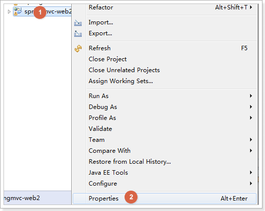

修改工程名，如下图：

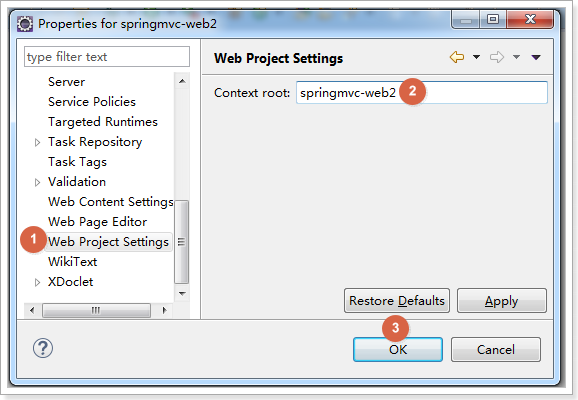

绑定数组
--------

### 需求

在商品列表页面选中多个商品，然后删除。

### 需求分析

功能要求商品列表页面中的每个商品前有一个checkbok，选中多个商品后点击删除按钮把商品id传递给Controller，根据商品id删除商品信息。

我们演示可以获取id的数组即可

### Jsp修改

修改itemList.jsp页面,增加多选框，提交url是queryItem.action

\<form action=*"*\${pageContext.request.contextPath }*/queryItem.action"*
method=*"post"*\>

查询条件：

\<table width=*"100%"* border=*1*\>

\<tr\>

\<td\>商品id\<input type=*"text"* name=*"item.id"* /\>\</td\>

\<td\>商品名称\<input type=*"text"* name=*"item.name"* /\>\</td\>

\<td\>\<input type=*"submit"* value=*"查询"*/\>\</td\>

\</tr\>

\</table\>

商品列表：

\<table width=*"100%"* border=*1*\>

\<tr\>

\<td\>选择\</td\>

\<td\>商品名称\</td\>

\<td\>商品价格\</td\>

\<td\>生产日期\</td\>

\<td\>商品描述\</td\>

\<td\>操作\</td\>

\</tr\>

\<c:forEach items=*"*\${itemList }*"* var=*"item"*\>

\<tr\>

\<td\>\<input type=*"checkbox"* name=*"ids"* value=*"*\${item.id}*"*/\>\</td\>

\<td\>\${item.name }\</td\>

\<td\>\${item.price }\</td\>

\<td\>\<fmt:formatDate value=*"*\${item.createtime}*"* pattern=*"yyyy-MM-dd
HH:mm:ss"*/\>\</td\>

\<td\>\${item.detail }\</td\>

\<td\>\<a href=*"*\${pageContext.request.contextPath
}*/itemEdit.action?id=*\${item.id}*"*\>修改\</a\>\</td\>

\</tr\>

\</c:forEach\>

\</table\>

\</form\>

页面选中多个checkbox向controller方法传递

本身属于一个form表单，提交url是queryItem.action

### Controller

Controller方法中可以用String[]接收，或者pojo的String[]属性接收。两种方式任选其一即可。

定义QueryVo，如下图：

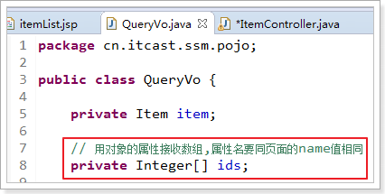

ItemController修改queryItem方法：

/\*\*

\* 包装类型 绑定数组类型，可以使用两种方式，pojo的属性接收，和直接接收

\*

\* **\@param** queryVo

\* **\@return**

\*/

\@RequestMapping("queryItem")

**public** String queryItem(QueryVo queryVo, Integer[] ids) {

System.*out*.println(queryVo.getItem().getId());

System.*out*.println(queryVo.getItem().getName());

System.*out*.println(queryVo.getIds().length);

System.*out*.println(ids.length);

**return** "success";

}

效果，如下图：

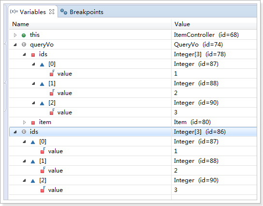

将表单的数据绑定到List
----------------------

### 需求

实现商品数据的批量修改。

### 开发分析

开发分析

1.  在商品列表页面中可以对商品信息进行修改。

2.  可以批量提交修改后的商品数据。

### 定义pojo

List中存放对象，并将定义的List放在包装类QueryVo中

使用包装pojo对象接收，如下图：

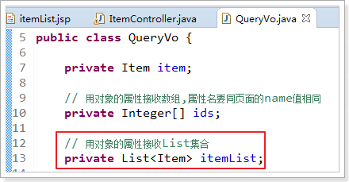

### Jsp改造

前端页面应该显示的html代码，如下图：

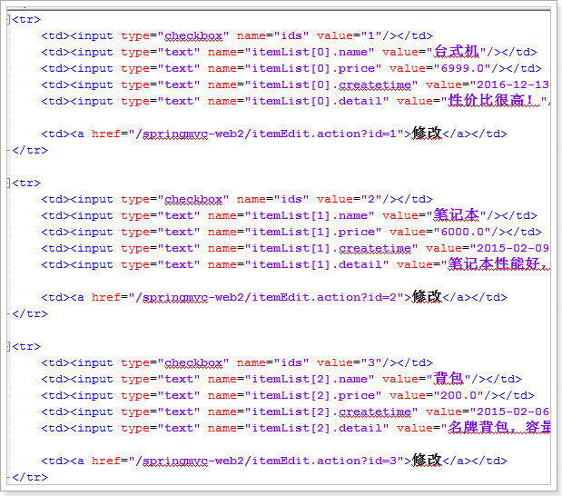

分析发现：name属性必须是list属性名+下标+元素属性。

Jsp做如下改造：

\<c:forEach items=*"*\${itemList }*"* var=*"item"* varStatus=*"s"*\>

\<tr\>

\<td\>\<input type=*"checkbox"* name=*"ids"* value=*"*\${item.id}*"*/\>\</td\>

\<td\>

\<input type=*"hidden"* name=*"itemList[*\${s.index}*].id"* value=*"*\${item.id
}*"*/\>

\<input type=*"text"* name=*"itemList[*\${s.index}*].name"*
value=*"*\${item.name }*"*/\>

\</td\>

\<td\>\<input type=*"text"* name=*"itemList[*\${s.index}*].price"*
value=*"*\${item.price }*"*/\>\</td\>

\<td\>\<input type=*"text"* name=*"itemList[*\${s.index}*].createtime"*
value=*"*\<fmt:formatDate value="\${item.createtime}" pattern=*"yyyy-MM-dd
HH:mm:ss"*/\>*"*/\>\</td\>

\<td\>\<input type=*"text"* name=*"itemList[*\${s.index}*].detail"*
value=*"*\${item.detail }*"*/\>\</td\>

\<td\>\<a href=*"*\${pageContext.request.contextPath
}*/itemEdit.action?id=*\${item.id}*"*\>修改\</a\>\</td\>

\</tr\>

\</c:forEach\>

\${current} 当前这次迭代的（集合中的）项

\${status.first} 判断当前项是否为集合中的第一项，返回值为true或false

\${status.last} 判断当前项是否为集合中的最

varStatus属性常用参数总结下：

\${status.index} 输出行号，从0开始。

\${status.count} 输出行号，从1开始。

\${status.后一项，返回值为true或false

begin、end、step分别表示：起始序号，结束序号，跳跃步伐。

### 效果

这里只演示List的绑定，能够接收到list数据。

可以拿到数据即可，不做数据库的操作。

测试效果如下图：

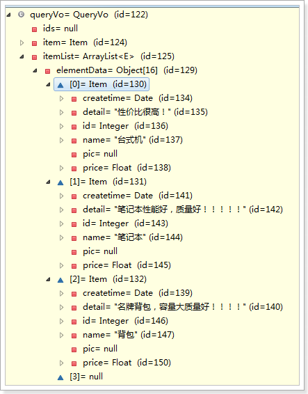

**注意：**接收List类型的数据必须是pojo的属性，如果方法的形参为ArrayList类型无法正确接收到数据。

\@RequestMapping
================

通过\@RequestMapping注解可以定义不同的处理器映射规则。

URL路径映射
-----------

\@RequestMapping(value="item")或\@RequestMapping("/item"）

value的值是数组，可以将多个url映射到同一个方法

/\*\*

\* 查询商品列表

\* **\@return**

\*/

\@RequestMapping(value = { "itemList", "itemListAll" })

**public** ModelAndView queryItemList() {

// 查询商品数据

List\<Item\> list = **this**.itemService.queryItemList();

// 创建ModelAndView,设置逻辑视图名

ModelAndView mv = **new** ModelAndView("itemList");

// 把商品数据放到模型中

mv.addObject("itemList", list);

**return** mv;

}

添加在类上面
------------

在class上添加\@RequestMapping(url)指定通用请求前缀，
限制此类下的所有方法请求url必须以请求前缀开头

可以使用此方法对url进行分类管理，如下图：

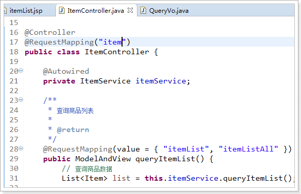

此时需要进入queryItemList()方法的请求url为：

http://127.0.0.1:8080/springmvc-web2/item/itemList.action

或者

http://127.0.0.1:8080/springmvc-web2/item/itemListAll.action

注意：学员练习此项后，把类上的\@RequestMapping注释掉，如下：

//\@RequestMapping("item")

**public class** ItemController {

以方便后面的练习

请求方法限定 
-------------

除了可以对url进行设置，还可以限定请求进来的方法

-   限定GET方法

\@RequestMapping(method = RequestMethod.*GET*)

如果通过POST访问则报错：

HTTP Status 405 - Request method 'POST' not supported

例如：

\@RequestMapping(value = "itemList",method = RequestMethod.*POST*)

-   限定POST方法

\@RequestMapping(method = RequestMethod.*POST*)

如果通过GET访问则报错：

HTTP Status 405 - Request method 'GET' not supported

-   GET和POST都可以

\@RequestMapping(method = {RequestMethod.*GET*,RequestMethod.*POST*})

Controller方法返回值
====================

返回ModelAndView
----------------

controller方法中定义ModelAndView对象并返回，对象中可添加model数据、指定view。

参考第一天的内容

返回void
--------

在Controller方法形参上可以定义request和response，使用request或response指定响应结果：

1、使用request转发页面，如下：

request.getRequestDispatcher("页面路径").forward(request, response);

request.getRequestDispatcher("/WEB-INF/jsp/success.jsp").forward(request,
response);

2、可以通过response页面重定向：

response.sendRedirect("url")

response.sendRedirect("/springmvc-web2/itemEdit.action");

1.  可以通过response指定响应结果，例如响应json数据如下：

response.getWriter().print("{\\"abc\\":123}");

### 代码演示

以下代码一次测试，演示上面的效果

/\*\*

\* 返回void测试

\*

\* **\@param** request

\* **\@param** response

\* **\@throws** Exception

\*/

\@RequestMapping("queryItem")

**public void** queryItem(HttpServletRequest request, HttpServletResponse
response) **throws** Exception {

// 1 使用request进行转发

// request.getRequestDispatcher("/WEB-INF/jsp/success.jsp").forward(request,

// response);

// 2 使用response进行重定向到编辑页面

// response.sendRedirect("/springmvc-web2/itemEdit.action");

// 3 使用response直接显示

response.getWriter().print("{\\"abc\\":123}");

}

返回字符串
----------

### 逻辑视图名

controller方法返回字符串可以指定逻辑视图名，通过视图解析器解析为物理视图地址。

//指定逻辑视图名，经过视图解析器解析为jsp物理路径：/WEB-INF/jsp/itemList.jsp

**return** "itemList";

参考第一天内容

### Redirect重定向

Contrller方法返回字符串可以重定向到一个url地址

如下商品修改提交后重定向到商品编辑页面。

/\*\*

\* 更新商品

\*

\* **\@param** item

\* **\@return**

\*/

\@RequestMapping("updateItem")

**public** String updateItemById(Item item) {

// 更新商品

**this**.itemService.updateItemById(item);

// 修改商品成功后，重定向到商品编辑页面

// 重定向后浏览器地址栏变更为重定向的地址，

// 重定向相当于执行了新的request和response，所以之前的请求参数都会丢失

// 如果要指定请求参数，需要在重定向的url后面添加 ?itemId=1 这样的请求参数

**return** "redirect:/itemEdit.action?itemId=" + item.getId();

}

### forward转发

Controller方法执行后继续执行另一个Controller方法

如下商品修改提交后转向到商品修改页面，修改商品的id参数可以带到商品修改方法中。

/\*\*

\* 更新商品

\*

\* **\@param** item

\* **\@return**

\*/

\@RequestMapping("updateItem")

**public** String updateItemById(Item item) {

// 更新商品

**this**.itemService.updateItemById(item);

// 修改商品成功后，重定向到商品编辑页面

// 重定向后浏览器地址栏变更为重定向的地址，

// 重定向相当于执行了新的request和response，所以之前的请求参数都会丢失

// 如果要指定请求参数，需要在重定向的url后面添加 ?itemId=1 这样的请求参数

// return "redirect:/itemEdit.action?itemId=" + item.getId();

// 修改商品成功后，继续执行另一个方法

// 使用转发的方式实现。转发后浏览器地址栏还是原来的请求地址，

// 转发并没有执行新的request和response，所以之前的请求参数都存在

**return** "forward:/itemEdit.action";

}

//结果转发到editItem.action，request可以带过去

**return** "forward: /itemEdit.action";

需要修改之前编写的根据id查询商品方法

因为请求进行修改商品时，请求参数里面只有id属性，没有itemId属性

修改，如下图：：

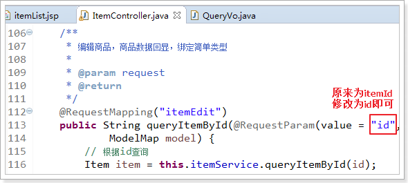

异常处理器
==========

springmvc在处理请求过程中出现异常信息交由异常处理器进行处理，自定义异常处理器可以实现一个系统的异常处理逻辑。

异常处理思路
------------

系统中异常包括两类：预期异常和运行时异常RuntimeException，前者通过捕获异常从而获取异常信息，后者主要通过规范代码开发、测试通过手段减少运行时异常的发生。

系统的dao、service、controller出现都通过throws
Exception向上抛出，最后由springmvc前端控制器交由异常处理器进行异常处理，如下图：

自定义异常类
------------

为了区别不同的异常,通常根据异常类型进行区分，这里我们创建一个自定义系统异常。

如果controller、service、dao抛出此类异常说明是系统预期处理的异常信息。

**public class** MyException **extends** Exception {

// 异常信息

**private** String message;

**public** MyException() {

**super**();

}

**public** MyException(String message) {

**super**();

**this**.message = message;

}

**public** String getMessage() {

**return** message;

}

**public void** setMessage(String message) {

**this**.message = message;

}

}

自定义异常处理器
----------------

**public class** CustomHandleException **implements** HandlerExceptionResolver {

\@Override

**public** ModelAndView resolveException(HttpServletRequest request,
HttpServletResponse response, Object handler,

Exception exception) {

// 定义异常信息

String msg;

// 判断异常类型

**if** (exception **instanceof** MyException) {

// 如果是自定义异常，读取异常信息

msg = exception.getMessage();

} **else** {

// 如果是运行时异常，则取错误堆栈，从堆栈中获取异常信息

Writer out = **new** StringWriter();

PrintWriter s = **new** PrintWriter(out);

exception.printStackTrace(s);

msg = out.toString();

}

// 把错误信息发给相关人员,邮件,短信等方式

// **TODO**

// 返回错误页面，给用户友好页面显示错误信息

ModelAndView modelAndView = **new** ModelAndView();

modelAndView.addObject("msg", msg);

modelAndView.setViewName("error");

**return** modelAndView;

}

}

异常处理器配置
--------------

在springmvc.xml中添加：

\<!-- 配置全局异常处理器 --\>

\<bean

id=*"customHandleException"*
class=*"cn.itcast.ssm.exception.CustomHandleException"*/\>

错误页面
--------

\<%\@ page language=*"java"* contentType=*"text/html; charset=UTF-8"*

pageEncoding=*"UTF-8"*%\>

\<!DOCTYPE html PUBLIC "-//W3C//DTD HTML 4.01 Transitional//EN"
"http://www.w3.org/TR/html4/loose.dtd"\>

\<html\>

\<head\>

\<meta http-equiv=*"Content-Type"* content=*"text/html; charset=UTF-8"*\>

\<title\>Insert title here\</title\>

\</head\>

\<body\>

\<h1\>系统发生异常了！\</h1\>

\ 

\<h1\>异常信息\</h1\>

\ 

\<h2\>\${msg }\</h2\>

\</body\>

\</html\>

异常测试
--------

修改ItemController方法“queryItemList”，抛出异常：

/\*\*

\* 查询商品列表

\*

\* **\@return**

\* **\@throws** Exception

\*/

\@RequestMapping(value = { "itemList", "itemListAll" })

**public** ModelAndView queryItemList() **throws** Exception {

// 自定义异常

**if** (**true**) {

**throw new** MyException("自定义异常出现了\~");

}

// 运行时异常

**int** a = 1 / 0;

// 查询商品数据

List\<Item\> list = **this**.itemService.queryItemList();

// 创建ModelAndView,设置逻辑视图名

ModelAndView mv = **new** ModelAndView("itemList");

// 把商品数据放到模型中

mv.addObject("itemList", list);

**return** mv;

}

上传图片
========

配置虚拟目录 
-------------

在tomcat上配置图片虚拟目录，在tomcat下conf/server.xml中添加：

\<Context docBase="D:\\develop\\upload\\temp" path="/pic" reloadable="false"/\>

访问http://localhost:8080/pic即可访问D:\\develop\\upload\\temp下的图片。

也可以通过eclipse配置，如下图：

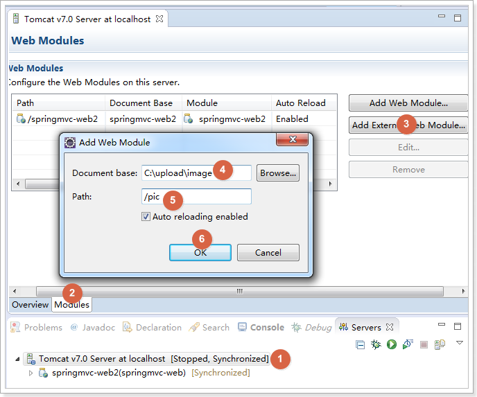

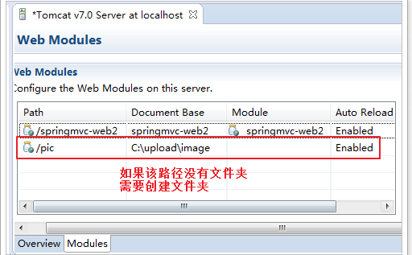

复制一张图片到存放图片的文件夹，使用浏览器访问

测试效果，如下图：

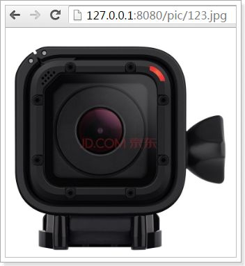

加入jar包
---------

实现图片上传需要加入的jar包，如下图：

把两个jar包放到工程的lib文件夹中

配置上传解析器
--------------

在springmvc.xml中配置文件上传解析器

\<!-- 文件上传,id必须设置为multipartResolver --\>

\<bean id=*"multipartResolver"*

class=*"org.springframework.web.multipart.commons.CommonsMultipartResolver"*\>

\<!-- 设置文件上传大小 --\>

\<property name=*"maxUploadSize"* value=*"5000000"* /\>

\</bean\>

jsp页面修改
-----------

在商品修改页面，打开图片上传功能，如下图：

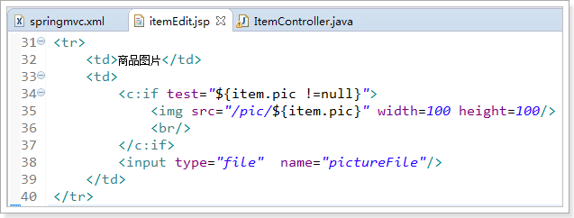

设置表单可以进行文件上传，如下图：

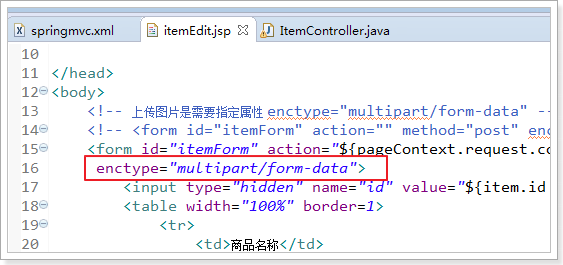

图片上传
--------

在更新商品方法中添加图片上传逻辑

/\*\*

\* 更新商品

\*

\* **\@param** item

\* **\@return**

\* **\@throws** Exception

\*/

\@RequestMapping("updateItem")

**public** String updateItemById(Item item, MultipartFile pictureFile)
**throws** Exception {

// 图片上传

// 设置图片名称，不能重复，可以使用uuid

String picName = UUID.*randomUUID*().toString();

// 获取文件名

String oriName = pictureFile.getOriginalFilename();

// 获取图片后缀

String extName = oriName.substring(oriName.lastIndexOf("."));

// 开始上传

pictureFile.transferTo(**new** File("C:/upload/image/" + picName + extName));

// 设置图片名到商品中

item.setPic(picName + extName);

// ---------------------------------------------

// 更新商品

**this**.itemService.updateItemById(item);

**return** "forward:/itemEdit.action";

}

效果，如下图：  

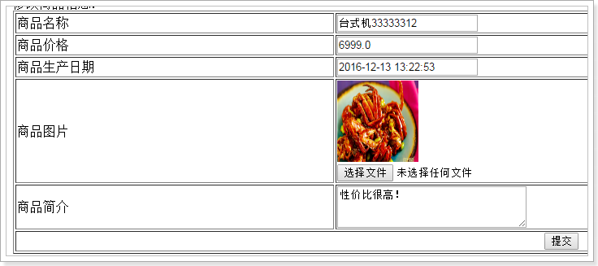

json数据交互
============

\@RequestBody
-------------

作用：

\@RequestBody注解用于读取http请求的内容(字符串)，通过springmvc提供的HttpMessageConverter接口将读到的内容（json数据）转换为java对象并绑定到Controller方法的参数上。

传统的请求参数：

itemEdit.action?id=1&name=zhangsan&age=12

现在的请求参数：

使用POST请求，在请求体里面加入json数据

{

"id": 1,

"name": "测试商品",

"price": 99.9,

"detail": "测试商品描述",

"pic": "123456.jpg"

}

本例子应用：

\@RequestBody注解实现接收http请求的json数据，将json数据转换为java对象进行绑定

\@ResponseBody
--------------

作用：

\@ResponseBody注解用于将Controller的方法返回的对象，通过springmvc提供的HttpMessageConverter接口转换为指定格式的数据如：json,xml等，通过Response响应给客户端

本例子应用：

\@ResponseBody注解实现将Controller方法返回java对象转换为json响应给客户端。

请求json，响应json实现：
------------------------

### 加入jar包

如果需要springMVC支持json，必须加入json的处理jar

我们使用Jackson这个jar，如下图：

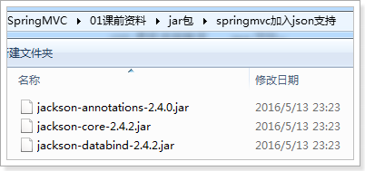

### ItemController编写

/\*\*

\* 测试json的交互

\* **\@param** item

\* **\@return**

\*/

\@RequestMapping("testJson")

// \@ResponseBody

**public** \@ResponseBody Item testJson(\@RequestBody Item item) {

**return** item;

}

### 安装谷歌浏览器测试工具

安装程序在课后资料

参考安装文档，如下图：

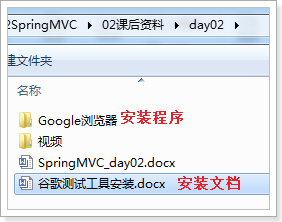

### 测试方法

测试方法，如下图：

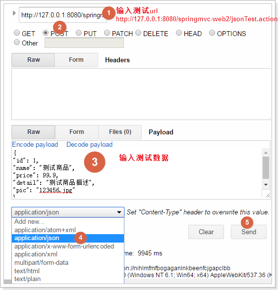

### 测试结果

如下图：

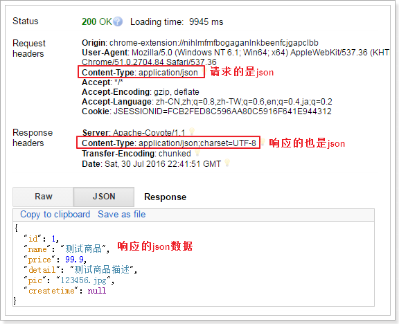

### 配置json转换器

如果不使用注解驱动\<mvc:annotation-driven
/\>，就需要给处理器适配器配置json转换器，参考之前学习的自定义参数绑定。

在springmvc.xml配置文件中，给处理器适配器加入json转换器：

\<!--处理器适配器 --\>

\<bean
class=*"org.springframework.web.servlet.mvc.method.annotation.RequestMappingHandlerAdapter"*\>

\<property name=*"messageConverters"*\>

\<list\>

\<bean
class=*"org.springframework.http.converter.json.MappingJacksonHttpMessageConverter"*\>\</bean\>

\</list\>

\</property\>

\</bean\>

RESTful支持
===========

什么是restful？
---------------

Restful就是一个资源定位及资源操作的风格。不是标准也不是协议，只是一种风格。基于这个风格设计的软件可以更简洁，更有层次，更易于实现缓存等机制。

资源：互联网所有的事物都可以被抽象为资源

资源操作：使用POST、DELETE、PUT、GET，使用不同方法对资源进行操作。

分别对应 添加、 删除、修改、查询。

传统方式操作资源

http://127.0.0.1/item/queryItem.action?id=1 查询,GET

http://127.0.0.1/item/saveItem.action 新增,POST

http://127.0.0.1/item/updateItem.action 更新,POST

http://127.0.0.1/item/deleteItem.action?id=1 删除,GET或POST

使用RESTful操作资源

http://127.0.0.1/item/1 查询,GET

http://127.0.0.1/item 新增,POST

http://127.0.0.1/item 更新,PUT

http://127.0.0.1/item/1 删除,DELETE

需求
----

RESTful方式实现商品信息查询，返回json数据

从URL上获取参数
---------------

使用RESTful风格开发的接口，根据id查询商品，接口地址是：

http://127.0.0.1/item/1

我们需要从url上获取商品id，步骤如下：

1.  使用注解\@RequestMapping("item/{id}")声明请求的url

{xxx}叫做占位符，请求的URL可以是“item /1”或“item/2”

1.  使用(\@PathVariable() Integer id)获取url上的数据

/\*\*

\* 使用RESTful风格开发接口，实现根据id查询商品

\*

\* **\@param** id

\* **\@return**

\*/

\@RequestMapping("item/{id}")

\@ResponseBody

**public** Item queryItemById(\@PathVariable() Integer id) {

Item item = **this**.itemService.queryItemById(id);

**return** item;

}

如果\@RequestMapping中表示为"item/{id}"，id和形参名称一致，\@PathVariable不用指定名称。如果不一致，例如"item/{ItemId}"则需要指定名称\@PathVariable("itemId")。

http://127.0.0.1/item/123?id=1

注意两个区别

1.  \@PathVariable是获取url上数据的。\@RequestParam获取请求参数的（包括post表单提交）

2.  如果加上\@ResponseBody注解，就不会走视图解析器，不会返回页面，目前返回的json数据。如果不加，就走视图解析器，返回页面

拦截器
======

定义
----

Spring Web MVC 的处理器拦截器类似于Servlet
开发中的过滤器Filter，用于对处理器进行预处理和后处理。

拦截器定义
----------

实现HandlerInterceptor接口，如下：

**public class** HandlerInterceptor1 **implements** HandlerInterceptor {

// controller执行后且视图返回后调用此方法

// 这里可得到执行controller时的异常信息

// 这里可记录操作日志

\@Override

**public void** afterCompletion(HttpServletRequest arg0, HttpServletResponse
arg1, Object arg2, Exception arg3)

**throws** Exception {

System.*out*.println("HandlerInterceptor1....afterCompletion");

}

// controller执行后但未返回视图前调用此方法

// 这里可在返回用户前对模型数据进行加工处理，比如这里加入公用信息以便页面显示

\@Override

**public void** postHandle(HttpServletRequest arg0, HttpServletResponse arg1,
Object arg2, ModelAndView arg3)

**throws** Exception {

System.*out*.println("HandlerInterceptor1....postHandle");

}

// Controller执行前调用此方法

// 返回true表示继续执行，返回false中止执行

// 这里可以加入登录校验、权限拦截等

\@Override

**public boolean** preHandle(HttpServletRequest arg0, HttpServletResponse arg1,
Object arg2) **throws** Exception {

System.*out*.println("HandlerInterceptor1....preHandle");

// 设置为true，测试使用

**return true**;

}

}

拦截器配置
----------

上面定义的拦截器再复制一份HandlerInterceptor2，注意新的拦截器修改代码：

System.*out*.println("HandlerInterceptor2....preHandle");

在springmvc.xml中配置拦截器

\<!-- 配置拦截器 --\>

\<mvc:interceptors\>

\<mvc:interceptor\>

\<!-- 所有的请求都进入拦截器 --\>

\<mvc:mapping path=*"/\*\*"* /\>

\<!-- 配置具体的拦截器 --\>

\<bean class=*"cn.itcast.ssm.interceptor.HandlerInterceptor1"* /\>

\</mvc:interceptor\>

\<mvc:interceptor\>

\<!-- 所有的请求都进入拦截器 --\>

\<mvc:mapping path=*"/\*\*"* /\>

\<!-- 配置具体的拦截器 --\>

\<bean class=*"cn.itcast.ssm.interceptor.HandlerInterceptor2"* /\>

\</mvc:interceptor\>

\</mvc:interceptors\>

正常流程测试
------------

浏览器访问地址

http://127.0.0.1:8080/springmvc-web2/itemList.action

### 运行流程

控制台打印：

HandlerInterceptor1..preHandle..

HandlerInterceptor2..preHandle..

HandlerInterceptor2..postHandle..

HandlerInterceptor1..postHandle..

HandlerInterceptor2..afterCompletion..

HandlerInterceptor1..afterCompletion..

中断流程测试
------------

浏览器访问地址

http://127.0.0.1:8080/springmvc-web2/itemList.action

### 运行流程

HandlerInterceptor1的preHandler方法返回false，HandlerInterceptor2返回true，运行流程如下：

HandlerInterceptor1..preHandle..

从日志看出第一个拦截器的preHandler方法返回false后第一个拦截器只执行了preHandler方法，其它两个方法没有执行，第二个拦截器的所有方法不执行，且Controller也不执行了。

HandlerInterceptor1的preHandler方法返回true，HandlerInterceptor2返回false，运行流程如下：

HandlerInterceptor1..preHandle..

HandlerInterceptor2..preHandle..

HandlerInterceptor1..afterCompletion..

从日志看出第二个拦截器的preHandler方法返回false后第一个拦截器的postHandler没有执行，第二个拦截器的postHandler和afterCompletion没有执行，且controller也不执行了。

总结：

preHandle按拦截器定义顺序调用

postHandler按拦截器定义逆序调用

afterCompletion按拦截器定义逆序调用

postHandler在拦截器链内所有拦截器返成功调用

afterCompletion只有preHandle返回true才调用

拦截器应用
----------

### 处理流程

1.  有一个登录页面，需要写一个Controller访问登录页面

2.  登录页面有一提交表单的动作。需要在Controller中处理。

    1.  判断用户名密码是否正确（在控制台打印）

    2.  如果正确,向session中写入用户信息（写入用户名username）

    3.  跳转到商品列表

3.  拦截器。

    1.  拦截用户请求，判断用户是否登录（登录请求不能拦截）

    2.  如果用户已经登录。放行

    3.  如果用户未登录，跳转到登录页面。

### 编写登录jsp

\<%\@ page language=*"java"* contentType=*"text/html; charset=UTF-8"*

pageEncoding=*"UTF-8"*%\>

\<!DOCTYPE html PUBLIC "-//W3C//DTD HTML 4.01 Transitional//EN"
"http://www.w3.org/TR/html4/loose.dtd"\>

\<html\>

\<head\>

\<meta http-equiv=*"Content-Type"* content=*"text/html; charset=UTF-8"*\>

\<title\>Insert title here\</title\>

\</head\>

\<body\>

\<form action=*"*\${pageContext.request.contextPath }*/user/login.action"*\>

\<label\>用户名：\</label\>

\<br\>

\<input type=*"text"* name=*"username"*\>

\<br\>

\<label\>密码：\</label\>

\<br\>

\<input type=*"password"* name=*"password"*\>

\<br\>

\<input type=*"submit"*\>

\</form\>

\</body\>

\</html\>

### 用户登陆Controller

\@Controller

\@RequestMapping("user")

**public class** UserController {

/\*\*

\* 跳转到登录页面

\*

\* **\@return**

\*/

\@RequestMapping("toLogin")

**public** String toLogin() {

**return** "login";

}

/\*\*

\* 用户登录

\*

\* **\@param** username

\* **\@param** password

\* **\@param** session

\* **\@return**

\*/

\@RequestMapping("login")

**public** String login(String username, String password, HttpSession session) {

// 校验用户登录

System.*out*.println(username);

System.*out*.println(password);

// 把用户名放到session中

session.setAttribute("username", username);

**return** "redirect:/item/itemList.action";

}

}

### 编写拦截器

\@Override

**public boolean** preHandle(HttpServletRequest request, HttpServletResponse
response, Object arg2) **throws** Exception {

// 从request中获取session

HttpSession session = request.getSession();

// 从session中获取username

Object username = session.getAttribute("username");

// 判断username是否为null

**if** (username != **null**) {

// 如果不为空则放行

**return true**;

} **else** {

// 如果为空则跳转到登录页面

response.sendRedirect(request.getContextPath() + "/user/toLogin.action");

}

**return false**;

}

### 配置拦截器

只能拦截商品的url，所以需要修改ItemController，让所有的请求都必须以item开头，如下图：

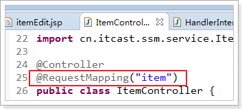

在springmvc.xml配置拦截器

\<mvc:interceptor\>

\<!-- 配置商品被拦截器拦截 --\>

\<mvc:mapping path=*"/item/\*\*"* /\>

\<!-- 配置具体的拦截器 --\>

\<bean class=*"cn.itcast.ssm.interceptor.LoginHandlerInterceptor"* /\>

\</mvc:interceptor\>
