**Mybatis、SpringMVC练习**

**CRM系统**

1.  课前回顾

    Springmvc 高级参数绑定 数组 List

    \<input type name=ids /\> 多个

    方法 (Integer[] ids) QueryVo (里面Integer[] ids)

    方法（QueryVo 里面List\<Items\> itemList

\<input type name=itemList[\${s.index}].name /\>

1.  REquestMapping 处理器映射器（找此标签 路径 ）

    Value = {多个路径,}

    Value = {/item/sfdsf.action} 类头上

    Method=RequestMethod.POST或GET

    3、 Controller方法返回值

    三个

    ModelAndView 建议不使用 不解偶

    String 返回视图的路径 （形参 绑定Model ）
    重定向redirect:另一个方法的映射路径 forward:内部转发

    Void 异步请求使用

2.  异常处理器

    预期、运行时

    自定义异常处理类 实现HandlerEexceptionResolver

    由Spring实现化 自定义的处理类

    未知异常

    CustomEexception 继承Eexception

    4、 上传图片

    1）Form 上传图片了 action上传路径

    2）input type=file name=picturePic

    3)接收此图片 形参上绑定 MultipartFile picturePic 接口

    4）配置此接口的实现类 Springmvc.xml配置CommonsMultipartFileResolver
    id=multipartFileResolver

    5、JSON数据交互

    应用场景：前端是各种 html Freemarker JSP一个Servlet 是Java代码 jstl C

    浏览器 Ajax 发送JSON字符串 报文

    6、拦截器

    拦截器 应用 （练习）

CRM项目外观
===========

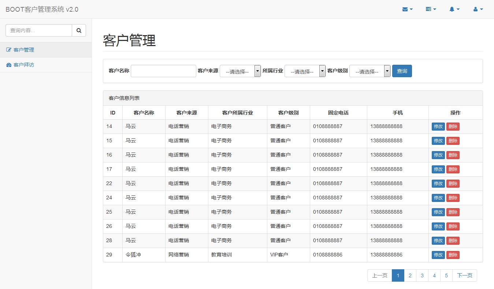

开发环境
========

IDE： Eclipse Mars2

Jdk: 1.7

数据库: MySQL

创建数据库
==========

数据库sql文件位置如下图：

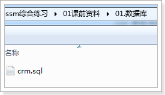

创建crm数据库，执行sql

效果如下图：

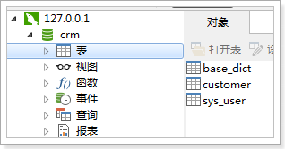

工程搭建
========

使用的Bootstrap前端框架,官方网站

http://www.bootcss.com/

工程使用Springmvc、spring、mybatis框架整合完成。

需要的jar包
-----------

1.  spring（包括springmvc）

2.  mybatis

3.  mybatis-spring整合包

4.  数据库驱动

5.  第三方连接池。

6.  Json依赖包Jackson

jar包位置如下图：

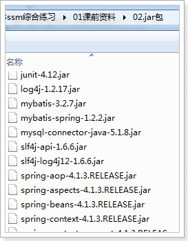

整合思路
--------

Dao层：

1.  SqlMapConfig.xml，空文件即可，但是需要文件头。

2.  applicationContext-dao.xml

    1.  数据库连接Druid

    2.  SqlSessionFactory对象，需要spring和mybatis整合包下的。

    3.  配置mapper文件扫描器。Mapper动态代理开发 增强版

Service层：

1.  applicationContext-service.xml包扫描器，扫描\@service注解的类。

2.  applicationContext-trans.xml配置事务。

Controller层：

1.  Springmvc.xml

    1.  包扫描器，扫描\@Controller注解的类。

    2.  配置注解驱动

    3.  配置视图解析器

Web.xml文件：

1.  配置spring监听器

2.  配置前端控制器。

创建工程
--------

创建动态web工程，步骤如下图：

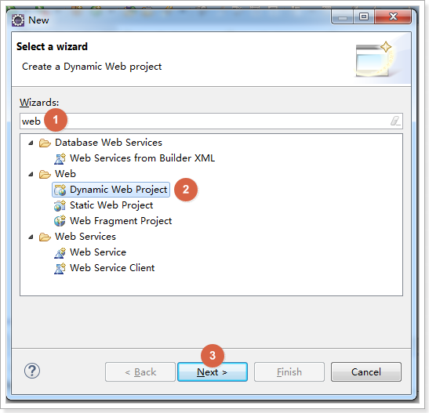

创建boot-crm，如下图

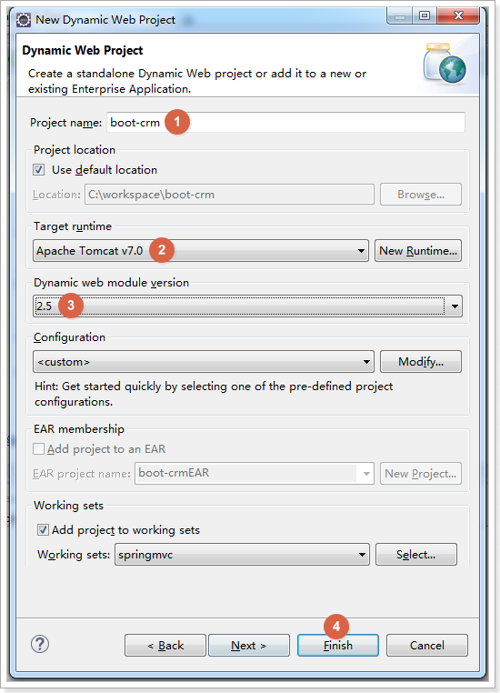

加入jar包
---------

加入课前资料中的jar包

加入配置文件
------------

创建config资源文件夹，在里面创建mybatis和spring文件夹

### SqlMapConfig.xml

空文件即可

\<?xml version=*"1.0"* encoding=*"UTF-8"* ?\>

\<!DOCTYPE configuration PUBLIC "-//mybatis.org//DTD Config 3.0//EN"

"http://mybatis.org/dtd/mybatis-3-config.dtd"\>

\<configuration\>

\</configuration\>

### applicationContext-dao.xml

需要配置：

加载properties文件，数据源，SqlSessionFactory，Mapper扫描

\<?xml version=*"1.0"* encoding=*"UTF-8"*?\>

\<beans xmlns=*"http://www.springframework.org/schema/beans"*

xmlns:context=*"http://www.springframework.org/schema/context"*
xmlns:p=*"http://www.springframework.org/schema/p"*

xmlns:aop=*"http://www.springframework.org/schema/aop"*
xmlns:tx=*"http://www.springframework.org/schema/tx"*

xmlns:xsi=*"http://www.w3.org/2001/XMLSchema-instance"*

xsi:schemaLocation=*"http://www.springframework.org/schema/beans
http://www.springframework.org/schema/beans/spring-beans-4.0.xsd*

*http://www.springframework.org/schema/context
http://www.springframework.org/schema/context/spring-context-4.0.xsd*

*http://www.springframework.org/schema/aop
http://www.springframework.org/schema/aop/spring-aop-4.0.xsd
http://www.springframework.org/schema/tx
http://www.springframework.org/schema/tx/spring-tx-4.0.xsd*

*http://www.springframework.org/schema/util
http://www.springframework.org/schema/util/spring-util-4.0.xsd"*\>

\<!-- 配置 读取properties文件 jdbc.properties --\>

\<context:property-placeholder location=*"classpath:jdbc.properties"* /\>

\<!-- 配置 数据源 --\>

\<bean id=*"dataSource"* class=*"com.alibaba.druid.pool.DruidDataSource"*\>

\<property name=*"driverClassName"* value=*"\${jdbc.driver}"* /\>

\<property name=*"url"* value=*"\${jdbc.url}"* /\>

\<property name=*"username"* value=*"\${jdbc.username}"* /\>

\<property name=*"password"* value=*"\${jdbc.password}"* /\>

\</bean\>

\<!-- 配置SqlSessionFactory --\>

\<bean class=*"org.mybatis.spring.SqlSessionFactoryBean"*\>

\<!-- 设置MyBatis核心配置文件 --\>

\<property name=*"configLocation"* value=*"classpath:mybatis/SqlMapConfig.xml"*
/\>

\<!-- 设置数据源 --\>

\<property name=*"dataSource"* ref=*"dataSource"* /\>

\</bean\>

\<!-- 配置Mapper扫描 --\>

\<bean class=*"org.mybatis.spring.mapper.MapperScannerConfigurer"*\>

\<!-- 设置Mapper扫描包 --\>

\<property name=*"basePackage"* value=*"cn.itcast.crm.mapper"* /\>

\</bean\>

\</beans\>

### jdbc.properties

配置数据库信息

jdbc.driver=com.mysql.jdbc.Driver

jdbc.url=jdbc:mysql://localhost:3306/crm?characterEncoding=utf-8

jdbc.username=root

jdbc.password=root

### log4j.properties

配置日志信息

\# Global logging configuration

log4j.rootLogger=DEBUG, stdout

\# Console output...

log4j.appender.stdout=org.apache.log4j.ConsoleAppender

log4j.appender.stdout.layout=org.apache.log4j.PatternLayout

log4j.appender.stdout.layout.ConversionPattern=%5p [%t] - %m%n

### applicationContext-service.xml

配置service扫描

\<?xml version=*"1.0"* encoding=*"UTF-8"*?\>

\<beans xmlns=*"http://www.springframework.org/schema/beans"*

xmlns:context=*"http://www.springframework.org/schema/context"*
xmlns:p=*"http://www.springframework.org/schema/p"*

xmlns:aop=*"http://www.springframework.org/schema/aop"*
xmlns:tx=*"http://www.springframework.org/schema/tx"*

xmlns:xsi=*"http://www.w3.org/2001/XMLSchema-instance"*

xsi:schemaLocation=*"http://www.springframework.org/schema/beans
http://www.springframework.org/schema/beans/spring-beans-4.0.xsd*

*http://www.springframework.org/schema/context
http://www.springframework.org/schema/context/spring-context-4.0.xsd*

*http://www.springframework.org/schema/aop
http://www.springframework.org/schema/aop/spring-aop-4.0.xsd
http://www.springframework.org/schema/tx
http://www.springframework.org/schema/tx/spring-tx-4.0.xsd*

*http://www.springframework.org/schema/util
http://www.springframework.org/schema/util/spring-util-4.0.xsd"*\>

\<!-- 配置Service扫描 --\>

\<context:component-scan base-package=*"cn.itcast.crm.service"* /\>

\</beans\>

### applicationContext-trans.xml

配置事务管理：事务管理器、通知、切面

\<?xml version=*"1.0"* encoding=*"UTF-8"*?\>

\<beans xmlns=*"http://www.springframework.org/schema/beans"*

xmlns:context=*"http://www.springframework.org/schema/context"*
xmlns:p=*"http://www.springframework.org/schema/p"*

xmlns:aop=*"http://www.springframework.org/schema/aop"*
xmlns:tx=*"http://www.springframework.org/schema/tx"*

xmlns:xsi=*"http://www.w3.org/2001/XMLSchema-instance"*

xsi:schemaLocation=*"http://www.springframework.org/schema/beans
http://www.springframework.org/schema/beans/spring-beans-4.0.xsd*

*http://www.springframework.org/schema/context
http://www.springframework.org/schema/context/spring-context-4.0.xsd*

*http://www.springframework.org/schema/aop
http://www.springframework.org/schema/aop/spring-aop-4.0.xsd
http://www.springframework.org/schema/tx
http://www.springframework.org/schema/tx/spring-tx-4.0.xsd*

*http://www.springframework.org/schema/util
http://www.springframework.org/schema/util/spring-util-4.0.xsd"*\>

\<!-- 事务管理器 --\>

\<bean id=*"transactionManager"*
class=*"org.springframework.jdbc.datasource.DataSourceTransactionManager"*\>

\<!-- 数据源 --\>

\<property name=*"dataSource"* ref=*"dataSource"* /\>

\</bean\>

\<!-- 通知 --\>

\<tx:advice id=*"txAdvice"* transaction-manager=*"transactionManager"*\>

\<tx:attributes\>

\<!-- 传播行为 --\>

\<tx:method name=*"save\*"* propagation=*"REQUIRED"* /\>

\<tx:method name=*"insert\*"* propagation=*"REQUIRED"* /\>

\<tx:method name=*"add\*"* propagation=*"REQUIRED"* /\>

\<tx:method name=*"create\*"* propagation=*"REQUIRED"* /\>

\<tx:method name=*"delete\*"* propagation=*"REQUIRED"* /\>

\<tx:method name=*"update\*"* propagation=*"REQUIRED"* /\>

\<tx:method name=*"find\*"* propagation=*"SUPPORTS"* read-only=*"true"* /\>

\<tx:method name=*"select\*"* propagation=*"SUPPORTS"* read-only=*"true"* /\>

\<tx:method name=*"get\*"* propagation=*"SUPPORTS"* read-only=*"true"* /\>

\<tx:method name=*"query\*"* propagation=*"SUPPORTS"* read-only=*"true"* /\>

\</tx:attributes\>

\</tx:advice\>

\<!-- 切面 --\>

\<aop:config\>

\<aop:advisor advice-ref=*"txAdvice"*

pointcut=*"execution(\* cn.itcast.crm.service.\*.\*(..))"* /\>

\</aop:config\>

\</beans\>

### Springmvc.xml

配置SpringMVC表现层：Controller扫描、注解驱动、视图解析器

\<?xml version=*"1.0"* encoding=*"UTF-8"*?\>

\<beans xmlns=*"http://www.springframework.org/schema/beans"*

xmlns:xsi=*"http://www.w3.org/2001/XMLSchema-instance"*
xmlns:p=*"http://www.springframework.org/schema/p"*

xmlns:context=*"http://www.springframework.org/schema/context"*

xmlns:mvc=*"http://www.springframework.org/schema/mvc"*

xsi:schemaLocation=*"http://www.springframework.org/schema/beans
http://www.springframework.org/schema/beans/spring-beans-4.0.xsd*

*http://www.springframework.org/schema/mvc
http://www.springframework.org/schema/mvc/spring-mvc-4.0.xsd*

*http://www.springframework.org/schema/context
http://www.springframework.org/schema/context/spring-context-4.0.xsd"*\>

\<!-- 配置Controller扫描 --\>

\<context:component-scan base-package=*"cn.itcast.crm.controller"* /\>

\<!-- 配置注解驱动 --\>

\<mvc:annotation-driven /\>

\<!-- 配置视图解析器 --\>

\<bean
class=*"org.springframework.web.servlet.view.InternalResourceViewResolver"*\>

\<!-- 前缀 --\>

\<property name=*"prefix"* value=*"/WEB-INF/jsp/"* /\>

\<!-- 后缀 --\>

\<property name=*"suffix"* value=*".jsp"* /\>

\</bean\>

\</beans\>

### Web.xml

配置Spring、SpringMVC、解决post乱码问题

\<?xml version=*"1.0"* encoding=*"UTF-8"*?\>

\<web-app xmlns:xsi=*"http://www.w3.org/2001/XMLSchema-instance"*

xmlns=*"http://java.sun.com/xml/ns/javaee"*

xsi:schemaLocation=*"http://java.sun.com/xml/ns/javaee
http://java.sun.com/xml/ns/javaee/web-app_2_5.xsd"*

id=*"WebApp_ID"* version=*"2.5"*\>

\<display-name\>boot-crm\</display-name\>

\<welcome-file-list\>

\<welcome-file\>index.jsp\</welcome-file\>

\</welcome-file-list\>

\<!-- 配置spring --\>

\<context-param\>

\<param-name\>contextConfigLocation\</param-name\>

\<param-value\>classpath:spring/applicationContext-\*.xml\</param-value\>

\</context-param\>

\<!-- 配置监听器加载spring --\>

\<listener\>

\<listener-class\>org.springframework.web.context.ContextLoaderListener\</listener-class\>

\</listener\>

\<!-- 配置过滤器，解决post的乱码问题 --\>

\<filter\>

\<filter-name\>encoding\</filter-name\>
\<filter-class\>org.springframework.web.filter.CharacterEncodingFilter\</filter-class\>

\</filter\>

\<filter-mapping\>

\<filter-name\>encoding\</filter-name\>

\<url-pattern\>/\*\</url-pattern\>

\</filter-mapping\>

\<!-- 配置SpringMVC --\>

\<servlet\>

\<servlet-name\>boot-crm\</servlet-name\>

\<servlet-class\>org.springframework.web.servlet.DispatcherServlet\</servlet-class\>

\<init-param\>

\<param-name\>contextConfigLocation\</param-name\>

\<param-value\>classpath:spring/springmvc.xml\</param-value\>

\</init-param\>

\<!-- 配置springmvc什么时候启动，参数必须为整数 --\>

\<!-- 如果为0或者大于0，则springMVC随着容器启动而启动 --\>

\<!-- 如果小于0，则在第一次请求进来的时候启动 --\>

\<load-on-startup\>1\</load-on-startup\>

\</servlet\>

\<servlet-mapping\>

\<servlet-name\>boot-crm\</servlet-name\>

\<!-- 所有的请求都进入springMVC --\>

\<url-pattern\>/\</url-pattern\>

\</servlet-mapping\>

\</web-app\>

加入静态资源
------------

最终效果如下图：

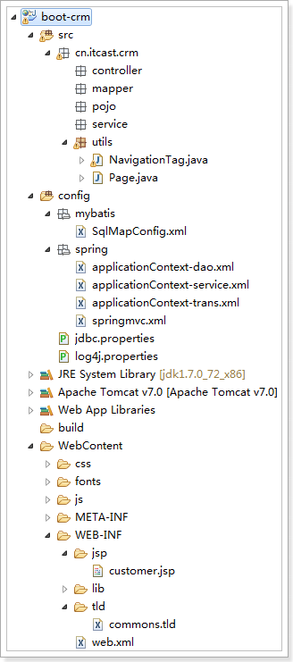

实现页面展示
============

代码实现
--------

编写CustomerController 显示用户列表

\@Controller

\@RequestMapping("customer")

**public class** CustomerController {

/\*\*

\* 显示用户列表

\*

\* **\@return**

\*/

\@RequestMapping("list")

**public** String queryCustomerList() {

**return** "customer";

}

}

页面显示问题
------------

访问页面，发现不能正常显示

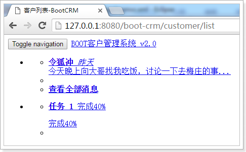

打开开发者工具，选择Network，

发现css、js等资源文件无法加载

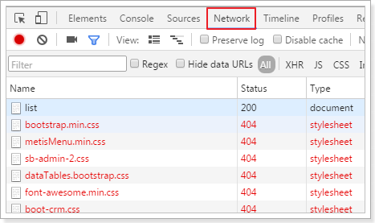

原因：web.xml配置时，是设置所有的请求都进入SpringMVC。但是SpringMVC
无法处理css、js等静态资源，所以无法正常显示

解决方案：

1.  在springmvc.xml中配置

\<!-- 解决静态资源无法被springMVC处理的问题 --\>

\<mvc:default-servlet-handler /\>

1.  修改web.xml，让所有以action结尾的请求都进入SpringMVC

\<servlet-mapping\>

\<servlet-name\>boot-crm\</servlet-name\>

\<!-- 所有的请求都进入springMVC --\>

\<url-pattern\>\*.action\</url-pattern\>

\</servlet-mapping\>

解决后的效果如下图，可以正常显示页面样式：

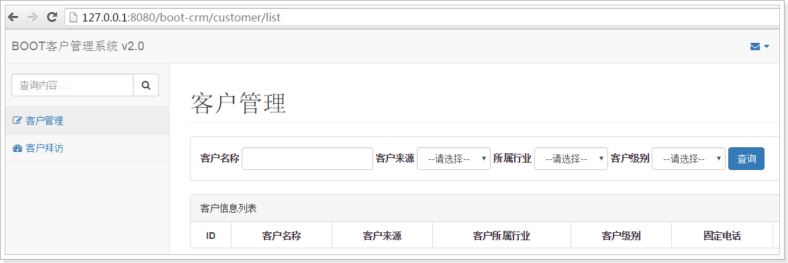

我们使用第二种方式解决，因为此项目中的页面的请求都是以action结尾的，所以使用第二种方式，在web.xml里面进行相应的配置

\<servlet-mapping\>

\<servlet-name\>boot-crm\</servlet-name\>

\<!-- 所有以action结尾的请求都进入springMVC --\>

\<url-pattern\>\*.action\</url-pattern\>

\</servlet-mapping\>

实现查询条件初始化
==================

需求分析
--------

页面效果如上图，在查询客户的时候，可以选择客户来源,所属行业,客户级别信息,页面加载时需要初始化查询条件下拉列表。

前端jsp逻辑

\<form class=*"form-inline"* action=*"*\${pageContext.request.contextPath
}*/customer/list.action"* method=*"get"*\>

\

\<label for=*"customerName"*\>客户名称\</label\>

\<input type=*"text"* class=*"form-control"* id=*"customerName"*
value=*"*\${custName }*"* name=*"custName"*\>

\</div\>

\

\<label for=*"customerFrom"*\>客户来源\</label\>

\<select class=*"form-control"* id=*"customerFrom"* placeholder=*"客户来源"*
name=*"custSource"*\>

\<option value=*""*\>--请选择--\</option\>

\<c:forEach items=*"*\${fromType}*"* var=*"item"*\>

\<option value=*"*\${item.dict_id}*"*\<c:if test="\${item.dict_id ==
custSource}"\> selected\</c:if\>\>\${item.dict_item_name }\</option\>

\</c:forEach\>

\</select\>

\</div\>

\

\<label for=*"custIndustry"*\>所属行业\</label\>

\<select class=*"form-control"* id=*"custIndustry"* name=*"custIndustry"*\>

\<option value=*""*\>--请选择--\</option\>

\<c:forEach items=*"*\${industryType}*"* var=*"item"*\>

\<option value=*"*\${item.dict_id}*"*\<c:if test="\${item.dict_id ==
custIndustry}"\> selected\</c:if\>\>\${item.dict_item_name }\</option\>

\</c:forEach\>

\</select\>

\</div\>

\

\<label for=*"custLevel"*\>客户级别\</label\>

\<select class=*"form-control"* id=*"custLevel"* name=*"custLevel"*\>

\<option value=*""*\>--请选择--\</option\>

\<c:forEach items=*"*\${levelType}*"* var=*"item"*\>

\<option value=*"*\${item.dict_id}*"*\<c:if test="\${item.dict_id ==
custLevel}"\> selected\</c:if\>\>\${item.dict_item_name }\</option\>

\</c:forEach\>

\</select\>

\</div\>

\<button type=*"submit"* class=*"btn btn-primary"*\>查询\</button\>

\</form\>

按照jsp的要求,把对应的数据查询出来,放到模型中。

数据存放在base_dict表，可以使用dict_type_code类别代码进行查询

使用需要获取的数据如下图：

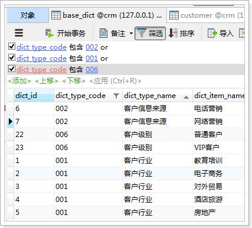

使用的sql:

SELECT \* FROM base_dict WHERE dict_type_code = '001'

实现DAO开发
-----------

### pojo

因为页面显示的名字是下划线方式，和数据库表列名一样，根据页面的样式，编写pojo

**public class** BaseDict {

**private** String dict_id;

**private** String dict_type_code;

**private** String dict_type_name;

**private** String dict_item_name;

**private** String dict_item_code;

**private** Integer dict_sort;

**private** String dict_enable;

**private** String dict_memo;

get/set。。。。。。

}

### Mapper

编写BaseDictMapper

**public interface** BaseDictMapper {

/\*\*

\* 根据类别代码查询数据

\*

\* **\@param** dictTypeCode

\* **\@return**

\*/

List\<BaseDict\> queryBaseDictByDictTypeCode(String dictTypeCode);

}

### Mapper.xml

编写BaseDictMapper.xml

\<?xml version=*"1.0"* encoding=*"UTF-8"* ?\>

\<!DOCTYPE mapper

PUBLIC "-//mybatis.org//DTD Mapper 3.0//EN"

"http://mybatis.org/dtd/mybatis-3-mapper.dtd"\>

\<mapper namespace=*"cn.itcast.crm.mapper.BaseDictMapper"*\>

\<!-- 根据类别代码查询数据 --\>

\<select id=*"queryBaseDictByDictTypeCode"* parameterType=*"String"*

resultType=*"cn.itcast.crm.pojo.BaseDict"*\>

SELECT \* FROM base_dict WHERE dict_type_code =

\#{dict_type_code}

\</select\>

\</mapper\>

实现Service开发
---------------

### BaseDictService 接口

**public interface** BaseDictService {

/\*\*

\* 根据类别代码查询

\*

\* **\@param** dictTypeCode

\* **\@return**

\*/

List\<BaseDict\> queryBaseDictByDictTypeCode(String dictTypeCode);

}

### BaseDictServiceImpl 实现类

\@Service

**public class** BaseDictServiceImpl **implements** BaseDictService {

\@Autowired

**private** BaseDictMapper baseDictMapper;

\@Override

**public** List\<BaseDict\> queryBaseDictByDictTypeCode(String dictTypeCode) {

List\<BaseDict\> list =
**this**.baseDictMapper.queryBaseDictByDictTypeCode(dictTypeCode);

**return** list;

}

}

实现Controller开发
------------------

### 修改之前编写的controller

\@Controller

\@RequestMapping("customer")

**public class** CustomerController {

\@Autowired

**private** BaseDictService baseDictService;

/\*\*

\* 显示客户列表

\*

\* **\@return**

\*/

\@RequestMapping("list")

**public** String queryCustomerList(Model model) {

// 客户来源

List\<BaseDict\> fromType =
**this**.baseDictService.queryBaseDictByDictTypeCode("002");

// 所属行业

List\<BaseDict\> industryType =
**this**.baseDictService.queryBaseDictByDictTypeCode("001");

// 客户级别

List\<BaseDict\> levelType =
**this**.baseDictService.queryBaseDictByDictTypeCode("006");

// 把前端页面需要显示的数据放到模型中

model.addAttribute("fromType", fromType);

model.addAttribute("industryType", industryType);

model.addAttribute("levelType", levelType);

**return** "customer";

}

}

### 效果

实现效果如下图：

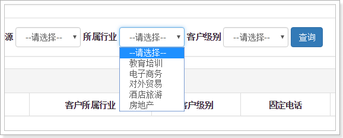

### 硬编码问题

这里是根据dict_type_code类别代码查询数据，这里的查询条件是写死的，有硬编码问题。可以把类别代码提取到配置文件中，再使用\@value注解进行加载。

#### 添加env.properties

添加env.properties配置文件

\#客户来源

CUSTOMER_FROM_TYPE=002

\#客户行业

CUSTOMER_INDUSTRY_TYPE=001

\#客户级别

CUSTOMER_LEVEL_TYPE=006

#### 修改springmvc.xml配置文件

在springmvc.xml中加载env.properties

\<!-- 加载controller需要的配置信息 --\>

\<context:property-placeholder location=*"classpath:env.properties"* /\>

注意:Controller需要的配置文件信息必须添加到springmvc的配置文件中

#### 修改Controller方法

\@Controller

\@RequestMapping("customer")

**public class** CustomerController {

// 客户来源

\@Value("\${CUSTOMER_FROM_TYPE}")

**private** String CUSTOMER_FROM_TYPE;

// 客户行业

\@Value("\${CUSTOMER_INDUSTRY_TYPE}")

**private** String CUSTOMER_INDUSTRY_TYPE;

// 客户级别

\@Value("\${CUSTOMER_LEVEL_TYPE}")

**private** String CUSTOMER_LEVEL_TYPE;

\@Autowired

**private** BaseDictService baseDictService;

/\*\*

\* 显示客户列表

\*

\* **\@return**

\*/

\@RequestMapping("list")

**public** String queryCustomerList(Model model) {

// 客户来源

List\<BaseDict\> fromType =
**this**.baseDictService.queryBaseDictByDictTypeCode(**this**.CUSTOMER_FROM_TYPE);

// 所属行业

List\<BaseDict\> industryType =
**this**.baseDictService.queryBaseDictByDictTypeCode(**this**.CUSTOMER_INDUSTRY_TYPE);

// 客户级别

List\<BaseDict\> levelType =
**this**.baseDictService.queryBaseDictByDictTypeCode(**this**.CUSTOMER_LEVEL_TYPE);

// 把前端页面需要显示的数据放到模型中

model.addAttribute("fromType", fromType);

model.addAttribute("industryType", industryType);

model.addAttribute("levelType", levelType);

**return** "customer";

}

}

客户列表展示
============

需求
----

展示客户列表，并且可以根据查询条件过滤查询结果，并且实现分页。

效果如下图：

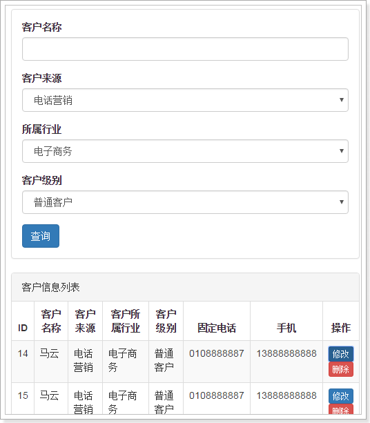

页面代码：

\
客户信息列表\</div\>

\<!-- /.panel-heading --\>

\<table class=*"table table-bordered table-striped"*\>

\<thead\>

\<tr\>

\<th\>ID\</th\>

\<th\>客户名称\</th\>

\<th\>客户来源\</th\>

\<th\>客户所属行业\</th\>

\<th\>客户级别\</th\>

\<th\>固定电话\</th\>

\<th\>手机\</th\>

\<th\>操作\</th\>

\</tr\>

\</thead\>

\<tbody\>

\<c:forEach items=*"*\${page.rows}*"* var=*"row"*\>

\<tr\>

\<td\>\${row.cust_id}\</td\>

\<td\>\${row.cust_name}\</td\>

\<td\>\${row.cust_source}\</td\>

\<td\>\${row.cust_industry}\</td\>

\<td\>\${row.cust_level}\</td\>

\<td\>\${row.cust_phone}\</td\>

\<td\>\${row.cust_mobile}\</td\>

\<td\>

\<a href=*"\#"* class=*"btn btn-primary btn-xs"* data-toggle=*"modal"*
data-target=*"\#customerEditDialog"*
onclick=*"editCustomer(*\${row.cust_id}*)"*\>修改\</a\>

\<a href=*"\#"* class=*"btn btn-danger btn-xs"*
onclick=*"deleteCustomer(*\${row.cust_id}*)"*\>删除\</a\>

\</td\>

\</tr\>

\</c:forEach\>

\</tbody\>

\</table\>

分析我们需要根据四个条件进行查询，返回数据是分页对象Page

Sql语句:

SELECT

a.cust_id,

a.cust_name,

a.cust_user_id,

a.cust_create_id,

b.dict_item_name cust_source,

c.dict_item_name cust_industry,

d.dict_item_name cust_level,

a.cust_linkman,

a.cust_phone,

a.cust_mobile,

a.cust_zipcode,

a.cust_address,

a.cust_createtime

FROM

customer a

LEFT JOIN base_dict b ON a.cust_source = b.dict_id

LEFT JOIN base_dict c ON a.cust_industry = c.dict_id

LEFT JOIN base_dict d ON a.cust_level = d.dict_id

WHERE

a.cust_name LIKE '%马%'

AND a.cust_source = '6'

AND a.cust_industry = '2'

AND a.cust_level = '22'

LIMIT 0, 10

创建pojo开发
------------

**public class** Customer {

**private** Long cust_id;

**private** String cust_name;

**private** Long cust_user_id;

**private** Long cust_create_id;

**private** String cust_source;

**private** String cust_industry;

**private** String cust_level;

**private** String cust_linkman;

**private** String cust_phone;

**private** String cust_mobile;

**private** String cust_zipcode;

**private** String cust_address;

**private** Date cust_createtime;

get/set。。。。。。

}

实现DAO
-------

分析：

1.  前台发起请求,需要接收请求过来的查询条件数据，可以使用pojo接收数据。需要依此编写查询逻辑。

2.  前台需要分页显示，根据准备好的分页实现，应该返回分页类Page，而创建Page分页类需要数据总条数，所以也需要查询数据总条数的逻辑。

根据分析，DAO需要编写两个方法:

1.  需要根据条件分页查询客户信息

2.  需要根据条件查询数据总条数

### 创建QueryVo

需要编写QueryVo，里面包含查询条件属性和分页数据。

创建接受请求参数的QueryVo：

**public class** QueryVo {

**private** String custName;

**private** String custSource;

**private** String custIndustry;

**private** String custLevel;

// 当前页码数

**private** Integer page = 1;

// 数据库从哪一条数据开始查

**private** Integer start;

// 每页显示数据条数

**private** Integer rows = 10;

get/set。。。。。。

}

### Mapper

创建CustomerMapper 接口

**public interface** CustomerMapper {

/\*\*

\* 根据queryVo分页查询数据

\*

\* **\@param** queryVo

\* **\@return**

\*/

List\<Customer\> queryCustomerByQueryVo(QueryVo queryVo);

/\*\*

\* 根据queryVo查询数据条数

\*

\* **\@param** queryVo

\* **\@return**

\*/

**int** queryCountByQueryVo(QueryVo queryVo);

}

### Mapper.xml

创建CustomerMapper.xml

\<?xml version=*"1.0"* encoding=*"UTF-8"* ?\>

\<!DOCTYPE mapper

PUBLIC "-//mybatis.org//DTD Mapper 3.0//EN"

"http://mybatis.org/dtd/mybatis-3-mapper.dtd"\>

\<mapper namespace=*"cn.itcast.crm.mapper.CustomerMapper"*\>

\<sql id=*"customerQueryVo"*\>

\<where\>

\<if test=*"custName != null and custName != ''"*\>

AND a.cust_name LIKE '%\${custName}%'

\</if\>

\<if test=*"custSource != null and custSource != ''"*\>

AND a.cust_source = \#{custSource}

\</if\>

\<if test=*"custIndustry != null and custIndustry != ''"*\>

AND a.cust_industry = \#{custIndustry}

\</if\>

\<if test=*"custLevel != null and custLevel != ''"*\>

AND a.cust_level = \#{custLevel}

\</if\>

\</where\>

\</sql\>

\<!-- 根据queryVo分页查询数据 --\>

\<select id=*"queryCustomerByQueryVo"*
parameterType=*"cn.itcast.crm.pojo.QueryVo"*

resultType=*"cn.itcast.crm.pojo.Customer"*\>

SELECT

a.cust_id,

a.cust_name,

a.cust_user_id,

a.cust_create_id,

b.dict_item_name cust_source,

c.dict_item_name cust_industry,

d.dict_item_name cust_level,

a.cust_linkman,

a.cust_phone,

a.cust_mobile,

a.cust_zipcode,

a.cust_address,

a.cust_createtime

FROM

customer a

LEFT JOIN base_dict b ON a.cust_source = b.dict_id

LEFT JOIN base_dict c ON a.cust_industry = c.dict_id

LEFT JOIN base_dict d ON a.cust_level = d.dict_id

\<include refid=*"customerQueryVo"* /\>

\<if test=*"start != null"*\>

LIMIT \#{start}, \#{rows}

\</if\>

\</select\>

\<!-- 根据queryVo查询数据条数 --\>

\<select id=*"queryCountByQueryVo"* parameterType=*"cn.itcast.crm.pojo.QueryVo"*

resultType=*"int"*\>

SELECT count(1) FROM customer a

\<include refid=*"customerQueryVo"* /\>

\</select\>

\</mapper\>

实现service
-----------

### 接口

编写接口CustomerService

**public interface** CustomerService {

/\*\*

\* 根据条件分页查询客户

\*

\* **\@param** queryVo

\* **\@return**

\*/

Page\<Customer\> queryCustomerByQueryVo(QueryVo queryVo);

}

### 实现类

编写接口实现类CustomerServiceImpl

\@Service

**public class** CustomerServiceImpl **implements** CustomerService {

\@Autowired

**private** CustomerMapper customerMapper;

\@Override

**public** Page\<Customer\> queryCustomerByQueryVo(QueryVo queryVo) {

// 设置查询条件,从哪一条数据开始查

queryVo.setStart((queryVo.getPage() - 1) \* queryVo.getRows());

// 查询数据结果集

List\<Customer\> list = **this**.customerMapper.queryCustomerByQueryVo(queryVo);

// 查询到的数据总条数

**int** total = **this**.customerMapper.queryCountByQueryVo(queryVo);

// 封装返回的page对象

Page\<Customer\> page = **new** Page\<\>(total, queryVo.getPage(),
queryVo.getRows(), list);

**return** page;

}

}

实现Controller
--------------

改造Controller的方法

\@RequestMapping("list")

**public** String queryCustomerList(QueryVo queryVo, Model model) {

**try** {

// 解决get请求乱码问题

**if** (StringUtils.*isNotBlank*(queryVo.getCustName())) {

queryVo.setCustName(**new** String(queryVo.getCustName().getBytes("ISO-8859-1"),
"UTF-8"));

}

} **catch** (Exception e) {

e.printStackTrace();

}

// 客户来源

List\<BaseDict\> fromType =
**this**.baseDictService.queryBaseDictByDictTypeCode(**this**.CUSTOMER_FROM_TYPE);

// 所属行业

List\<BaseDict\> industryType =
**this**.baseDictService.queryBaseDictByDictTypeCode(**this**.CUSTOMER_INDUSTRY_TYPE);

// 客户级别

List\<BaseDict\> levelType =
**this**.baseDictService.queryBaseDictByDictTypeCode(**this**.CUSTOMER_LEVEL_TYPE);

// 把前端页面需要显示的数据放到模型中

model.addAttribute("fromType", fromType);

model.addAttribute("industryType", industryType);

model.addAttribute("levelType", levelType);

// 分页查询数据

Page\<Customer\> page =
**this**.customerService.queryCustomerByQueryVo(queryVo);

// 把分页查询的结果放到模型中

model.addAttribute("page", page);

// 数据回显

model.addAttribute("custName", queryVo.getCustName());

model.addAttribute("custSource", queryVo.getCustSource());

model.addAttribute("custIndustry", queryVo.getCustIndustry());

model.addAttribute("custLevel", queryVo.getCustLevel());

**return** "customer";

}

修改客户信息
============

需求
----

页面效果如下图：

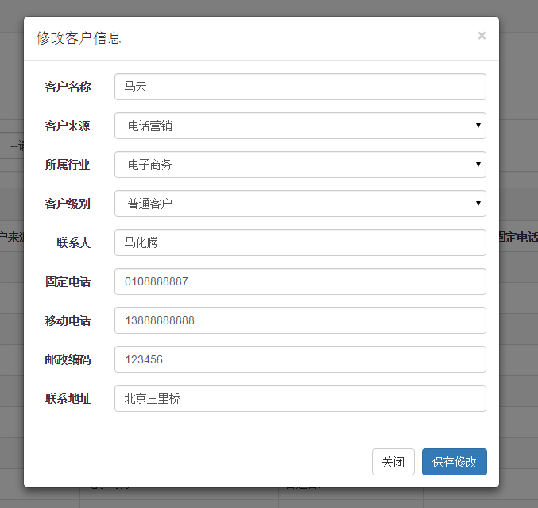

1.  客户列表中点击“修改”按钮弹出客户信息修改窗，并初始化客户信息

2.  点击“保存修改”按钮将修改后的结果保存到数据库中

实现编辑数据回显
----------------

在客户列表显示中，可以点击修改按钮，弹出修改界面，打开浏览器的开发者工具，发现当点击修改按钮，会发起一个请求

如下图方式进行查看

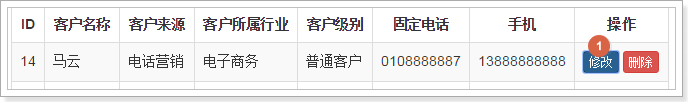

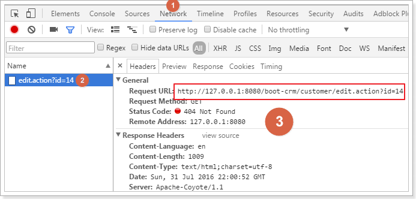

分析这里应该是发起请求到后台，获取该用户的详细信息，在页面上可以回显

复制请求路径中的edit.action，在customer.jsp页面中搜索，找到请求逻辑

找到的代码如下图：

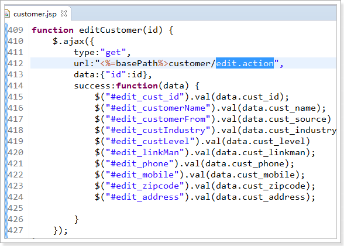

发现这里是一个Ajax请求，根据这个请求我们可以开发后台逻辑，提供给前端页面进行调用

回显功能实现
------------

### Mapper接口

在CustomerMapper添加方法

/\*\*

\* 根据id查询客户

\*

\* **\@param** id

\* **\@return**

\*/

Customer queryCustomerById(Long id);

### Mapper.xml

在CustomerMapper.xml编写sql

\<!-- 根据id查询用户 --\>

\<select id=*"queryCustomerById"* resultType=*"cn.itcast.crm.pojo.Customer"*\>

SELECT \* FROM customer WHERE cust_id = \#{id}

\</select\>

### Service接口

编写CustomerService.接口方法

/\*\*

\* 根据id查询数据

\*

\* **\@param** id

\* **\@return**

\*/

Customer queryCustomerById(Long id);

### Service接口实现类

在CustomerServiceImpl实现接口方法

\@Override

**public** Customer queryCustomerById(Long id) {

Customer customer = **this**.customerMapper.queryCustomerById(id);

**return** customer;

}

### Controller

在CustomerController编写方法

/\*\*

\* 根据id查询用户,返回json格式数据

\*

\* **\@param** id

\* **\@return**

\*/

\@RequestMapping("edit")

\@ResponseBody

**public** Customer queryCustomerById(Long id) {

Customer customer = **this**.customerService.queryCustomerById(id);

**return** customer;

}

实现编辑客户数据
----------------

在编辑框，点击保存修改按钮，应该进行数据保存，如下图所示：

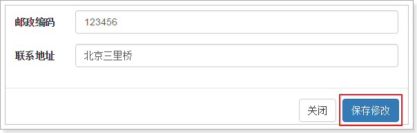

发起请求如下图：

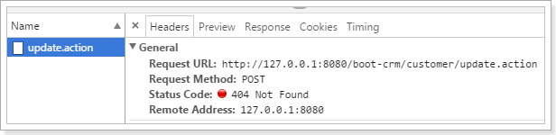

在页面找到的请求逻辑是：

**function** updateCustomer() {

\$.post("\<%=basePath%\>customer/update.action",\$("\#edit_customer_form").serialize(),function(data){

alert("客户信息更新成功！");

window.location.reload();

});

}

编辑功能实现
------------

### Mapper接口

在CustomerMapper添加方法

/\*\*

\* 根据id编辑客户

\*

\* **\@param** customer

\*/

**void** updateCustomerById(Customer customer);

### Mapper.xml

在CustomerMapper.xml编写sql

\<select id=*"updateCustomerById"*
parameterType=*"cn.itcast.crm.pojo.Customer"*\>

UPDATE \`customer\`

SET

\<if test=*"cust_name !=null and cust_name != ''"*\>

\`cust_name\` = \#{cust_name},

\</if\>

\<if test=*"cust_user_id !=null"*\>

\`cust_user_id\` = \#{cust_user_id},

\</if\>

\<if test=*"cust_create_id !=null"*\>

\`cust_create_id\` = \#{cust_create_id},

\</if\>

\<if test=*"cust_source !=null and cust_source != ''"*\>

\`cust_source\` = \#{cust_source},

\</if\>

\<if test=*"cust_industry !=null and cust_industry != ''"*\>

\`cust_industry\` = \#{cust_industry},

\</if\>

\<if test=*"cust_level !=null and cust_level != ''"*\>

\`cust_level\` = \#{cust_level},

\</if\>

\<if test=*"cust_linkman !=null and cust_linkman != ''"*\>

\`cust_linkman\` = \#{cust_linkman},

\</if\>

\<if test=*"cust_phone !=null and cust_phone != ''"*\>

\`cust_phone\` = \#{cust_phone},

\</if\>

\<if test=*"cust_mobile !=null and cust_mobile != ''"*\>

\`cust_mobile\` = \#{cust_mobile},

\</if\>

\<if test=*"cust_zipcode !=null and cust_zipcode != ''"*\>

\`cust_zipcode\` = \#{cust_zipcode},

\</if\>

\<if test=*"cust_address !=null and cust_address != ''"*\>

\`cust_address\` = \#{cust_address},

\</if\>

\`cust_createtime\` = NOW()

WHERE

(\`cust_id\` = \#{cust_id});

\</select\>

### Service接口

编写CustomerService.接口方法

/\*\*

\* 根据id编辑客户数据

\*

\* **\@param** customer

\*/

**void** updateCustomerById(Customer customer);

### Service接口实现类

在CustomerServiceImpl实现接口方法

\@Override

**public void** updateCustomerById(Customer customer) {

**this**.customerMapper.updateCustomerById(customer);

}

### Controller

在CustomerController编写方法

需要正确的响应，要告诉前端更新成功。返回值有没有都可以。

这里需要加\@ResponseBody注解，使其不走视图解析器。

/\*\*

\* 根据id查询用户,返回更新后客户的json格式数据

\*

\* **\@param** id

\* **\@return**

\*/

\@RequestMapping("update")

\@ResponseBody

**public** String updateCustomerById(Customer customer) {

Customer result = **this**.customerService.updateCustomerById(customer);

**return** "OK";

}

删除客户
========

需求分析
--------

点击客户列表中的删除按钮，提示“警告信息”，如下图

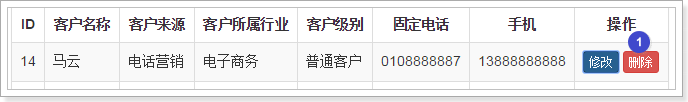

如下图，点击确定后删除用户信息，并刷新页面。

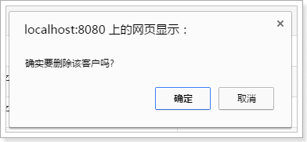

发起的请求如下图：

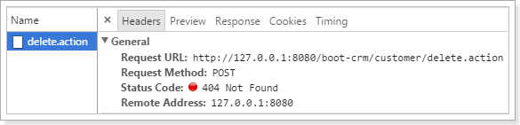

搜索前端jsp页面逻辑找到如下代码：

**function** deleteCustomer(id) {

**if**(confirm('确实要删除该客户吗?')) {

\$.post("\<%=basePath%\>customer/**delete**.action",{"id":id},**function**(data){

alert("客户删除更新成功！");

window.location.reload();

});

}

}

功能开发
--------

### Mapper接口

在CustomerMapper添加方法

/\*\*

\* 根据id删除用户

\*

\* **\@param** id

\*/

**void** deleteCustomerById(Long id);

### Mapper.xml

在CustomerMapper.xml编写sql

\<!-- 根据id删除客户 --\>

\<delete id=*"deleteCustomerById"* parameterType=*"long"*\>

DELETE FROM

customer WHERE cust_id = \#{id}

\</delete\>

### Service接口

在CustomerService编写接口方法

/\*\*

\* 根据id删除客户

\*

\* **\@param** id

\*/

**void** deleteCustomerById(Long id);

### Service实现类

在CustomerServiceImpl实现接口方法

\@Override

**public void** deleteCustomerById(Long id) {

**this**.customerMapper.deleteCustomerById(id);

}

### Controller

在CustomerController编写方法

/\*\*

\* 删除用户

\*

\* **\@param** id

\* **\@return**

\*/

\@RequestMapping("delete")

\@ResponseBody

**public** String deleteCustomerById(Long id) {

**this**.customerService.deleteCustomerById(id);

**return** "ok";

}
