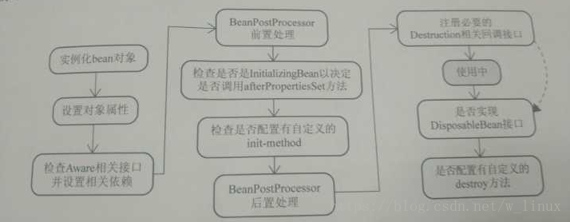

### rabbitmq面试题
**1.什么是rabbitmq**
采用AMQP高级消息队列协议的一种消息队列技术,最大的特点就是消费并不需要确保提供方存在,实现了服务之间的高度解耦

**2.为什么要使用rabbitmq**
1.在分布式系统下具备异步,削峰,负载均衡等一系列高级功能;
2.拥有持久化的机制，进程消息，队列中的信息也可以保存下来。
3.实现消费者和生产者之间的解耦。
4.对于高并发场景下，利用消息队列可以使得同步访问变为串行访问达到一定量的限流，利于数据库的操作。
5.可以使用消息队列达到异步下单的效果，排队中，后台进行逻辑下单。

**3.使用rabbitmq的场景**
1.服务间异步通信
2.顺序消费
3.定时任务
4.请求削峰

**4.如何确保消息正确地发送至RabbitMQ？ 如何确保消息接收方消费了消息？**
发送方确认模式：
将信道设置成confirm模式（发送方确认模式），则所有在信道上发布的消息都会被指派一个唯一的ID。
一旦消息被投递到目的队列后，或者消息被写入磁盘后（可持久化的消息），信道会发送一个确认给生产者（包含消息唯一ID）。
如果RabbitMQ发生内部错误从而导致消息丢失，会发送一条nack（not acknowledged，未确认）消息。
发送方确认模式是异步的，生产者应用程序在等待确认的同时，可以继续发送消息。当确认消息到达生产者应用程序，生产者应用程序的回调方法就会被触发来处理确认消息。

**接收方确认机制**
接收方消息确认机制：消费者接收每一条消息后都必须进行确认（消息接收和消息确认是两个不同操作）。只有消费者确认了消息，RabbitMQ才能安全地把消息从队列中删除。
这里并没有用到超时机制，RabbitMQ仅通过Consumer的连接中断来确认是否需要重新发送消息。也就是说，只要连接不中断，RabbitMQ给了Consumer足够长的时间来处理消息。保证数据的最终一致性；
下面罗列几种特殊情况：
如果消费者接收到消息，在确认之前断开了连接或取消订阅，RabbitMQ会认为消息没有被分发，然后重新分发给下一个订阅的消费者。（可能存在消息重复消费的隐患，需要去重）
如果消费者接收到消息却没有确认消息，连接也未断开，则RabbitMQ认为该消费者繁忙，将不会给该消费者分发更多的消息。

**5.如何避免消息重复投递或重复消费？**
在消息生产时，MQ内部针对每条生产者发送的消息生成一个inner-msg-id，作为去重的依据（消息投递失败并重传），避免重复的消息进入队列；
在消息消费时，要求消息体中必须要有一个bizId（对于同一业务全局唯一，如支付ID、订单ID、帖子ID等）作为去重的依据，避免同一条消息被重复消费。
**6.消息基于什么传输？**
由于TCP连接的创建和销毁开销较大，且并发数受系统资源限制，会造成性能瓶颈。RabbitMQ使用信道的方式来传输数据。信道是建立在真实的TCP连接内的虚拟连接，且每条TCP连接上的信道数量没有限制。

**7.消息如何分发？**
若该队列至少有一个消费者订阅，消息将以循环（round-robin）的方式发送给消费者。每条消息只会分发给一个订阅的消费者（前提是消费者能够正常处理消息并进行确认）。
通过路由可实现多消费的功能

**8.消息怎么路由？**
消息提供方->路由->一至多个队列
消息发布到交换器时，消息将拥有一个路由键（routing key），在消息创建时设定。
通过队列路由键，可以把队列绑定到交换器上。
消息到达交换器后，RabbitMQ会将消息的路由键与队列的路由键进行匹配（针对不同的交换器有不同的路由规则）；
常用的交换器主要分为一下三种：
fanout：如果交换器收到消息，将会广播到所有绑定的队列上
direct：如果路由键完全匹配，消息就被投递到相应的队列
topic：可以使来自不同源头的消息能够到达同一个队列。 使用topic交换器时，可以使用通配符

**9.如何确保消息不丢失？**
消息持久化，当然前提是队列必须持久化
RabbitMQ确保持久性消息能从服务器重启中恢复的方式是，将它们写入磁盘上的一个持久化日志文件，当发布一条持久性消息到持久交换器上时，Rabbit会在消息提交到日志文件后才发送响应。
一旦消费者从持久队列中消费了一条持久化消息，RabbitMQ会在持久化日志中把这条消息标记为等待垃圾收集。如果持久化消息在被消费之前RabbitMQ重启，那么Rabbit会自动重建交换器和队列（以及绑定），并重新发布持久化日志文件中的消息到合适的队列。

**10.使用RabbitMQ有什么好处？**
服务间高度解耦，
异步通信性能高，
流量削峰
…

**11.rabbitmq的集群**
镜像集群模式
你创建的queue，无论元数据还是queue里的消息都会存在于多个实例上，然后每次你写消息到queue的时候，都会自动把消息到多个实例的queue里进行消息同步。

好处在于，你任何一个机器宕机了，没事儿，别的机器都可以用。坏处在于，第一，这个性能开销也太大了吧，消息同步所有机器，导致网络带宽压力和消耗很重！第二，这么玩儿，就没有扩展性可言了，如果某个queue负载很重，你加机器，新增的机器也包含了这个queue的所有数据，并没有办法线性扩展你的queue

**12.mq的缺点**
系统可用性降低
系统引入的外部依赖越多，越容易挂掉，本来你就是A系统调用BCD三个系统的接口就好了，人ABCD四个系统好好的，没啥问题，你偏加个MQ进来，万一MQ挂了咋整？MQ挂了，整套系统崩溃了，你不就完了么。

系统复杂性提高：
硬生生加个MQ进来，你怎么保证消息没有重复消费？怎么处理消息丢失的情况？怎么保证消息传递的顺序性？头大头大，问题一大堆，痛苦不已

**一致性问题：**
A系统处理完了直接返回成功了，人都以为你这个请求就成功了；但是问题是，要是BCD三个系统那里，BD两个系统写库成功了，结果C系统写库失败了，咋整？你这数据就不一致了。
 

### 集合框架 
 
#### Arraylist 与 LinkedList 异同
1. **是否保证线程安全：** ArrayList 和 LinkedList 都是不同步的，也就是不保证线程安全；
2. **底层数据结构：** Arraylist 底层使用的是Object数组；LinkedList 底层使用的是双向循环链表数据结构；
3. **插入和删除是否受元素位置的影响：** **① ArrayList 采用数组存储，所以插入和删除元素的时间复杂度受元素位置的影响。**比如：执行add(E e)方法的时候， ArrayList 会默认在将指定的元素追加到此列表的末尾，这种情况时间复杂度就是O(1)。但是如果要在指定位置 i 插入和删除元素的话（add(int index, E element)）时间复杂度就为 O(n-i)。因为在进行上述操作的时候集合中第 i 和第 i 个元素之后的(n-i)个元素都要执行向后位/向前移一位的操作。**② LinkedList 采用链表存储，所以插入，删除元素时间复杂度不受元素位置的影响，都是近似 O（1）而数组为近似 O（n）。**
4. **是否支持快速随机访问：** LinkedList 不支持高效的随机元素访问，而ArrayList 实现了RandmoAccess 接口，所以有随机访问功能。快速随机访问就是通过元素的序号快速获取元素对象(对应于get(int index)方法)。
5. **内存空间占用：** ArrayList的空 间浪费主要体现在在list列表的结尾会预留一定的容量空间，而LinkedList的空间花费则体现在它的每一个元素都需要消耗比ArrayList更多的空间（因为要存放直接后继和直接前驱以及数据）。
#### 补充：数据结构基础之双向链表
双向链表也叫双链表，是链表的一种，它的每个数据结点中都有两个指针，分别指向直接后继和直接前驱。所以，从双向链表中的任意一个结点开始，都可以很方便地访问它的前驱结点和后继结点。一般我们都构造双向循环链表，如下图所示，同时下图也是LinkedList 底层使用的是双向循环链表数据结构。

#### ArrayList 与 Vector 区别
Vector类的所有方法都是同步的。可以由两个线程安全地访问一个Vector对象、但是一个线程访问Vector的话代码要在同步操作上耗费大量的时间。

Arraylist不是同步的，所以在不需要保证线程安全时时建议使用Arraylist。

#### HashMap的底层实现
JDK1.8之前
JDK1.8 之前 HashMap 由**数组+链表** 组成的（**“链表散列”** 即数组和链表的结合体），数组是 HashMap 的主体，链表则是主要为了解决哈希冲突而存在的（HashMap 采用 **“拉链法也就是链地址法”**解决冲突），如果定位到的数组位置不含链表（当前 entry 的 next 指向 null ）,那么对于查找，添加等操作很快，仅需一次寻址即可；如果定位到的数组包含链表，对于添加操作，其时间复杂度依然为 O(1)，因为最新的 Entry 会插入链表头部，急需要简单改变引用链即可，而对于查找操作来讲，此时就需要遍历链表，然后通过 key 对象的 equals 方法逐一比对查找.

*所谓 “拉链法” 就是将链表和数组相结合。也就是说创建一个链表数组，数组中每一格就是一个链表。若遇到哈希冲突，则将冲突的值加到链表中即可。
JDK1.8之后
相比于之前的版本， JDK1.8之后在解决哈希冲突时有了较大的变化，当链表长度大于阈值（默认为8）时，将链表转化为红黑树，以减少搜索时间。*

TreeMap、TreeSet以及JDK1.8之后的HashMap底层都用到了红黑树。红黑树就是为了解决二叉查找树的缺陷，因为二叉查找树在某些情况下会退化成一个线性结构。
推荐阅读：

《Java 8系列之重新认识HashMap》 ：https://zhuanlan.zhihu.com/p/21673805
#### HashMap 和 Hashtable 的区别
**1.线程是否安全：** HashMap 是非线程安全的，HashTable 是线程安全的；HashTable 内部的方法基本都经过 synchronized 修饰。（如果你要保证线程安全的话就使用 ConcurrentHashMap 吧！）；
**效率：** 因为线程安全的问题，HashMap 要比 HashTable 效率高一点。另外，HashTable 基本被淘汰，不要在代码中使用它；
**对Null key 和Null value的支持：** HashMap 中，null 可以作为键，这样的键只有一个，可以有一个或多个键所对应的值为 null。。但是在 HashTable 中 put 进的键值只要有一个 null，直接抛出 NullPointerException。
**初始容量大小和每次扩充容量大小的不同 ：** ①创建时如果不指定容量初始值，Hashtable 默认的初始大小为11，之后每次扩充，容量变为原来的2n+1。HashMap 默认的初始化大小为16。之后每次扩充，容量变为原来的2倍。②创建时如果给定了容量初始值，那么 Hashtable 会直接使用你给定的大小，而 HashMap 会将其扩充为2的幂次方大小。也就是说 HashMap 总是使用2的幂作为哈希表的大小,后面会介绍到为什么是2的幂次方。
**底层数据结构：** JDK1.8 以后的 HashMap 在解决哈希冲突时有了较大的变化，当链表长度大于阈值（默认为8）时，将链表转化为红黑树，以减少搜索时间。Hashtable 没有这样的机制。
#### HashMap 的长度为什么是2的幂次方
为了能让 HashMap 存取高效，尽量较少碰撞，也就是要尽量把数据分配均匀，每个链表/红黑树长度大致相同。这个实现就是把数据存到哪个链表/红黑树中的算法。

这个算法应该如何设计呢？

我们首先可能会想到采用%取余的操作来实现。但是，重点来了：“取余(%)操作中如果除数是2的幂次则等价于与其除数减一的与(&)操作（也就是说 hash%length==hash&(length-1)的前提是 length 是2的 n 次方；）。” 并且 采用二进制位操作 &，相对于%能够提高运算效率，这就解释了 HashMap 的长度为什么是2的幂次方。

#### HashSet 和 HashMap 区别

##### ConcurrentHashMap 和 Hashtable 的区别
ConcurrentHashMap 和 Hashtable 的区别主要体现在实现线程安全的方式上不同。

**1.底层数据结构：** JDK1.7的 ConcurrentHashMap 底层采用 分段的数组+链表 实现，JDK1.8 采用的数据结构跟HashMap1.8的结构一样，数组+链表/红黑二叉树。Hashtable 和 JDK1.8 之前的 HashMap 的底层数据结构类似都是采用 数组+链表 的形式，数组是 HashMap 的主体，链表则是主要为了解决哈希冲突而存在的；
**2.实现线程安全的方式（重要）：**  **① 在JDK1.7的时候，ConcurrentHashMap（分段锁）** 对整个桶数组进行了分割分段(Segment)，每一把锁只锁容器其中一部分数据，多线程访问容器里不同数据段的数据，就不会存在锁竞争，提高并发访问率。（默认分配16个Segment，比Hashtable效率提高16倍。） **到了 JDK1.8 的时候已经摒弃了Segment的概念，而是直接用 Node 数组+链表+红黑树的数据结构来实现，并发控制使用 synchronized 和 CAS 来操作。（JDK1.6以后 对 synchronized锁做了很多优化）** 整个看起来就像是优化过且线程安全的 HashMap，虽然在JDK1.8中还能看到 Segment 的数据结构，但是已经简化了属性，只是为了兼容旧版本；**② Hashtable(同一把锁):** 使用 synchronized 来保证线程安全，效率非常低下。当一个线程访问同步方法时，其他线程也访问同步方法，可能会进入阻塞或轮询状态，如使用 put 添加元素，另一个线程不能使用 put 添加元素，也不能使用 get，竞争会越来越激烈效率越低。
两者的对比图：

图片来源：http://www.cnblogs.com/chengxiao/p/6842045.html

HashTable:

JDK1.7的ConcurrentHashMap：

JDK1.8的ConcurrentHashMap（TreeBin: 红黑二叉树节点 Node: 链表节点）：

#### ConcurrentHashMap线程安全的具体实现方式/底层具体实现
#### JDK1.7（上面有示意图）
首先将数据分为一段一段的存储，然后给每一段数据配一把锁，当一个线程占用锁访问其中一个段数据时，其他段的数据也能被其他线程访问。

**ConcurrentHashMap 是由 Segment 数组结构和 HahEntry 数组结构组成。**

Segment 实现了 ReentrantLock,所以 Segment 是一种可重入锁，扮演锁的角色。HashEntry 用于存储键值对数据。

static class Segment<K,V> extends ReentrantLock implements Serializable {
}
一个 ConcurrentHashMap 里包含一个 Segment 数组。Segment 的结构和HashMap类似，是一种数组和链表结构，一个 Segment 包含一个 HashEntry 数组，每个 HashEntry 是一个链表结构的元素，每个 Segment 守护着一个HashEntry数组里的元素，当对 HashEntry 数组的数据进行修改时，必须首先获得对应的 Segment的锁。

**JDK1.8 （上面有示意图）**
ConcurrentHashMap取消了Segment分段锁，采用CAS和synchronized来保证并发安全。数据结构跟HashMap1.8的结构类似，数组+链表/红黑二叉树。

synchronized只锁定当前链表或红黑二叉树的首节点，这样只要hash不冲突，就不会产生并发，效率又提升N倍。

#### 集合框架底层数据结构总结
**一：Collection**
**1. List**
**Arraylist：** Object数组
**Vector：** Object数组
**LinkedList：** 双向循环链表
**2. Set**
**HashSet（无序，唯一）: **基于 HashMap 实现的，底层采用 HashMap 来保存元素
**LinkedHashSet：** LinkedHashSet 继承与 HashSet，并且其内部是通过 LinkedHashMap 来实现的。有点类似于我们之前说的LinkedHashMap 其内部是基于 Hashmap 实现一样，不过还是有一点点区别的。
**TreeSet（有序，唯一）：** 红黑树(自平衡的排序二叉树。)
#### 二：Map
**HashMap：** JDK1.8之前HashMap由数组+链表组成的，数组是HashMap的主体，链表则是主要为了解决哈希冲突而存在的（“拉链法”解决冲突）.JDK1.8以后在解决哈希冲突时有了较大的变化，当链表长度大于阈值（默认为8）时，将链表转化为红黑树，以减少搜索时间
**LinkedHashMap:** LinkedHashMap 继承自 HashMap，所以它的底层仍然是基于拉链式散列结构即由数组和链表或红黑树组成。另外，LinkedHashMap 在上面结构的基础上，增加了一条双向链表，使得上面的结构可以保持键值对的插入顺序。同时通过对链表进行相应的操作，实现了访问顺序相关逻辑。详细可以查看：《LinkedHashMap 源码详细分析（JDK1.8）》
**HashTable:** 数组+链表组成的，数组是 HashMap 的主体，链表则是主要为了解决哈希冲突而存在的
**TreeMap:** 红黑树（自平衡的排序二叉树）

### redis:

1 读写性能优异

2 支持数据持久化，支持AOF（以日志的形式记录服务器所处理的每一个写、删除操作，查询操作不会记录，以文本的方式记录，可以打开文件看到详细的操作记录）
和RDB（在指定的时间间隔内将内存中的数据集快照写入磁盘）两种持久化方式

3 支持主从复制，主机会自动将数据同步到从机，可以进行读写分离(让主数据库（master）处理事务性增、改、删操作（INSERT、UPDATE、DELETE），而从数据库（slave）处理SELECT查询操作。)。

4 数据结构丰富：除了支持string类型的value外还支持string、hash、set、sortedset、list等数据结构。

 
缺点：

1 Redis不具备自动容错和恢复功能，主机从机的宕机都会导致前端部分读写请求失败，需要等待机器重启或者手动切换前端的IP才能恢复。

2 主机宕机，宕机前有部分数据未能及时同步到从机，切换IP后还会引入数据不一致的问题，降低了系统的可用性。

3 Redis的主从复制采用全量复制，复制过程中主机会fork出一个子进程对内存做一份快照，并将子进程的内存快照保存为文件发送给从机，这一过程需要确保主机有足够多的空余内存。若快照文件较大，对集群的服务能力会产生较大的影响，而且复制过程是在从机新加入集群或者从机和主机网络断开重连时都会进行，也就是网络波动都会造成主机和从机间的一次全量的数据复制，这对实际的系统运营造成了不小的麻烦。

4 Redis较难支持在线扩容，在集群容量达到上限时在线扩容会变得很复杂。为避免这一问题，运维人员在系统上线时必须确保有足够的空间，这对资源造成了很大的浪费。

 

1. 使用redis有哪些好处？

(1) 速度快，因为数据存在内存中，类似于HashMap，HashMap的优势就是查找和操作的时间复杂度都是O(1)

(2) 支持丰富数据类型，支持string，list，set，sorted set，hash

(3) 支持事务，操作都是原子性，所谓的原子性就是对数据的更改要么全部执行，要么全部不执行

(4) 丰富的特性：可用于缓存，消息，按key设置过期时间，过期后将会自动删除

2. redis相比memcached有哪些优势？

(1) memcached所有的值均是简单的字符串，redis作为其替代者，支持更为丰富的数据类型

(2) redis的速度比memcached快很多

(3) redis可以持久化其数据

3. redis常见性能问题和解决方案：

(1) Master最好不要做任何持久化工作，如RDB内存快照和AOF日志文件

(2) 如果数据比较重要，某个Slave开启AOF备份数据，策略设置为每秒同步一次

(3) 为了主从复制的速度和连接的稳定性，Master和Slave最好在同一个局域网内

(4) 尽量避免在压力很大的主库上增加从库

(5) 主从复制不要用图状结构，用单向链表结构更为稳定，即：Master <- Slave1 <- Slave2 <- Slave3...

这样的结构方便解决单点故障问题，实现Slave对Master的替换。如果Master挂了，可以立刻启用Slave1做Master，其他不变。

### Sping

### 首先你需要知道的知识
在IoC容器启动之后，并不会马上就实例化相应的bean，此时容器仅仅拥有所有对象的BeanDefinition(BeanDefinition：是容器依赖某些工具加载的XML配置信息进行解析和分析，并将分析后的信息编组为相应的BeanDefinition)。只有当getBean()调用时才是有可能触发Bean实例化阶段的活动

#### 为什么说有可能触发Bean实例化阶段？

因为当对应某个bean定义的getBean()方法第一次被调用时，不管是显示的还是隐式的，Bean实例化阶段才会被触发，第二次被调用则会直接返回容器缓存的第一次实例化完的对象实例(因为默认是singleton单例，当然，这里的情况prototype类型的bean除外)

##该篇博客主要阐述
#### 1、Bean的一生过程
##### 2、Bean的后置处理器

### 一、Bean的一生过程
#### 先来看以下的图(Bean的一生)
 

#### 可以简述为以下九步

1.实例化bean对象(通过构造方法或者工厂方法)

2.设置对象属性(setter等)（依赖注入）

3.如果Bean实现了BeanNameAware接口，工厂调用Bean的setBeanName()方法传递Bean的ID。（和下面的一条均属于检查Aware接口）

4.如果Bean实现了BeanFactoryAware接口，工厂调用setBeanFactory()方法传入工厂自身

5.将Bean实例传递给Bean的前置处理器的postProcessBeforeInitialization(Object bean, String beanname)方法

6.调用Bean的初始化方法

7.将Bean实例传递给Bean的后置处理器的postProcessAfterInitialization(Object bean, String beanname)方法

8.使用Bean

9.容器关闭之前，调用Bean的销毁方法

### Spring的面试题：

1 Spring 框架有哪些主要模块？
Spring 框架至今已集成了 20 多个模块 。 这些模块主要被分如下图所示的核心容器 、 数据访问 / 集成 、Web、AOP （面向切面编程） 、 工具 、 消息和测试模块 。

2 什么是依赖注入？什么是控制反转(IOC)？ 在 Spring 中，有几种依赖注入方式？
依赖注入是在编译阶段尚未知所需的功能是来自哪个的类的情况下，将其他对象所依赖的功能对象实例化的模式。

在传统的编程方式中，业务逻辑的流程是由应用程序中的早已被设定好关联关系的对象来决定的。在使用控制反转的情况下，业务逻辑的流程是由对象关系图来决定的，该对象关系图由装配器负责实例化，这种实现方式还可以将对象之间的关联关系的定义抽象化。而绑定的过程是通过“依赖注入”实现的。

注入方式： 
* 构造器注入 
* Setter方法注入 
* 接口注入

3 在 Spring 中，有几种配置 Bean 的方式？
基于XML的配置
基于注解的配置
基于Java的配置
4 请解释一下 Spring Bean 的生命周期？
在一个 bean 实例被初始化时，需要执行一系列的初始化操作以达到可用的状态 。 同样的，当一个 bean 不在被调用时需要进行相关的析构操作，并从 bean 容器中移除 。 
Spring bean factory 负责管理在 spring 容器中被创建的 bean 的生命周期 。Bean 的生命周期由两组回调（call back）方法组成 。 
初始化之后调用的回调方法。 
销毁之前调用的回调方法。

Spring 框架提供了以下四种方式来管理 bean 的生命周期事件： 
* InitializingBean 和 DisposableBean 回调接口 
* 针对特殊行为的其他 Aware 接口 
* Bean 配置文件中的 Custom init() 方法和 destroy() 方法 
* @PostConstruct 和 @PreDestroy 注解方式

5 Spring Bean 有哪些作用域，它们之间有什么区别？
singleton ：这种 bean 范围是默认的，这种范围确保不管接受到多少个请求，每个容器中只有一个 bean 的实例，单例的模式由 bean factory 自身来维护 。
prototype ：原形范围与单例范围相反，为每一个 bean 请求提供一个实例 。
request ：在请求 bean 范围内会每一个来自客户端的网络请求创建一个实例，在请求完成以后， bean 会失效并被垃圾回收器回收 。
Session ：与请求范围类似，确保每个 session 中有一个 bean 的实例，在 session 过期后， bean 会随之失效 。
global-session ： global-session 和 Portlet 应用相关 。 当你的应用部署在 Portlet 容器中工作时，它包含很多 portlet。 如果你想要声明让所有的 portlet 共用全局的存储变量的话，那么这全局变量需要存储在 global-session 中 。
6 Spring 框架中的单例 Beans 是线程安全的么？
实际上，大部分的 Spring bean 并没有可变的状态 ( 比如 Service 类和 DAO 类 ) ，所以在某种程度上说 Spring 的单例 bean 是线程安全的 。 如果你的 bean 有多种状态的话（比如 View Model 对象），就需要自行保证线程安全 。

7 请解释一下，Spring 框架有哪些自动装配模式，它们之间有何区别？
no ：这是 Spring 框架的默认设置，在该设置下自动装配是关闭的，开发者需要自行在 bean 定义中用标签明确的设置依赖关系 。
byName ：该选项可以根据 bean 名称设置依赖关系 。 当向一个 bean 中自动装配一个属性时，容器将根据 bean 的名称自动在在配置文件中查询一个匹配的 bean。 如果找到的话，就装配这个属性，如果没找到的话就报错 。
byType ：该选项可以根据 bean 类型设置依赖关系 。 当向一个 bean 中自动装配一个属性时，容器将根据 bean 的类型自动在在配置文件中查询一个匹配的 bean。 如果找到的话，就装配这个属性，如果没找到的话就报错 。
constructor ：构造器的自动装配和 byType 模式类似，但是仅仅适用于与有构造器相同参数的 bean ，如果在容器中没有找到与构造器参数类型一致的 bean ，那么将会抛出异常 。
autodetect ：该模式自动探测使用构造器自动装配或者 byType 自动装配 。 首先，首先会尝试找合适的带参数的构造器，如果找到的话就是用构造器自动装配，如果在 bean 内部没有找到相应的构造器或者是无参构造器，容器就会自动选择 byTpe 的自动装配方式 。
8 Spring 框架中用到了哪些设计模式？请举例说明
Spring 框架中使用到了大量的设计模式，下面列举了比较有代表性的：

代理模式 — 在 AOP 和 remoting 中被用的比较多 。

单例模式 — 在 spring 配置文件中定义的 bean 默认为单例模式 。

模板方法 — 用来解决代码重复的问题 。 比如 RestTemplate,   JmsTemplate,   JpaTemplate。

前端控制器 —Spring 提供了 DispatcherServlet 来对请求进行分发 。

视图帮助 (View Helper   )—Spring 提供了一系列的 JSP 标签，高效宏来辅助将分散的代码整合在视图里 。

依赖注入 — 贯穿于 BeanFactory   /   ApplicationContext 接口的核心理念 。

工厂模式 —BeanFactory 用来创建对象的实例 。

9 说说 Springmvc 有哪些优点？
它是基于组件技术的 . 全部的应用对象 , 无论控制器和视图 , 还是业务对象之类的都是 java 组件 . 并且和 Spring 提供的其他基础结构紧密集成 .
不依赖于 Servlet API( 目标虽是如此 , 但是在实现时确实是依赖于 Servlet 的 )
可以任意使用各种视图技术 , 而不仅仅局限于 JSP
支持各种请求资源的映射策略
它应是易于扩展的
10 Spring 框架的事务管理有哪些优点？
它为不同的事务 API 如 JTA ， JDBC ， Hibernate ， JPA 和 JDO ，提供一个不变的编程模式 。
它为编程式事务管理提供了一套简单的 API 而不是一些复杂的事务 API。
它支持声明式事务管理 。
它和 Spring 各种数据访问抽象层很好的集成 。
11 AOP 的应用场景、原理 、AOP 好处？
AOP–Aspect Oriented Programming 面向切面编程；用来封装横切关注点，具体可以在下面的场景中使用:

Authentication 权限
Caching 缓存
Context passing 内容传递
Error handling 错误处理
Lazy loading 懒加载
Debugging 调试
logging, tracing, profiling and monitoring 记录跟踪优化校准
Performance optimization 　性能优化
Persistence 持久化
Resource pooling 　资源池
Synchronization 　同步
Transactions 事务
原理： AOP 是面向切面编程，是通过动态代理的方式为程序添加统一功能，集中解决一些公共问题 。

优点： 
* 各个步骤之间的良好隔离性耦合性大大降低 。 
* 源代码无关性，再扩展功能的同时不对源码进行修改操作。

12 Spring 中常见的创建对象的注解有哪些？

@Service用于标注业务层组件、   
@Controller用于标注控制层组件（如struts中的action）  
@Repository用于标注数据访问组件，即DAO组件。   
@Component泛指组件，当组件不好归类的时候，我们可以使用这个注解进行标注。  

@Autowired 默认按类型装配，如果我们想使用按名称装配，可以结合@Qualifier注解一起使用。如下：   
@Autowired @Qualifier("personDaoBean") 存在多个实例配合使用   
@Resource默认按名称装配，当找不到与名称匹配的bean才会按类型装配。

13 Spring 管理事务的方式有几种？  
1、编程式事务，在代码中硬编码。(不推荐使用)   

2、声明式事务，在配置文件中配置（推荐使用）

声明式事务又分为两种：

a、基于XML的声明式事务

b、基于注解的声明式事务

14 spring 中的核心类有那些，各有什么作用？
BeanFactory：产生一个新的实例，可以实现单例模式。

BeanWrapper：提供统一的 get 及 set 方法。

ApplicationContext：提供框架的实现，包括 BeanFactory 的所有功能。

15 spring 中有哪些代理方式？实现原理是什么？这些方式的优缺点是什么？
1、若目标对象实现了若干接口， spring 使用 JDK 的 java.lang.reflect.Proxy 类代理 。

优点：因为有接口，所以使系统更加松耦合

缺点：为每一个目标类创建接口
2、若目标对象没有实现任何接口， spring 则使用 CGLIB 库生成目标对象的子类 。

优点：因为代理类与目标类是继承关系，所以不需要有接口的存在 。

缺点：因为没有使用接口，所以系统的耦合性没有使用 JDK 的动态代理好 。

16 说说 IoC 容器的初始化过程？
Resource 定位：我们一般使用外部资源来描述 Bean 对象，所以 IOC 容器第一步就是需要定位 Resource 外部资源 。Resource 的定位其实就是 BeanDefinition 的资源定位，它是由 ResourceLoader 通过统一的 Resource 接口来完成的，这个 Resource 对各种形式的 BeanDefinition 的使用都提供了统一接口 。
载入：第二个过程就是 BeanDefinition 的载入 ,BeanDefinitionReader 读取 , 解析 Resource 定位的资源，也就是将用户定义好的 Bean 表示成 IOC 容器的内部数据结构也就是 BeanDefinition, 在 IOC 容器内部维护着一个 BeanDefinition Map 的数据结构，通过这样的数据结构， IOC 容器能够对 Bean 进行更好的管理 。 在配置文件中每一个都对应着一个 BeanDefinition 对象 。
注册：第三个过程则是注册，即向 IOC 容器注册这些 BeanDefinition ，这个过程是通过 BeanDefinitionRegistery 接口来实现的 。
17 说说 BeanFactory 和 ApplicationContext 的区别？ 什么是延迟实例化，它的优缺点是什么？
BeanFactory 是 Spring 里面最低层的接口，提供了最简单的容器的功能，只提供了实例化对象和获取对象的功能 。

两者装载 bean 的区别 
* BeanFactory ：在启动时不会去实例化 Bean ，只有从容器中获取 Bean 时才会去实例化。 
* ApplicationContext ：在启动的时候就把所有的 Bean 全部实例化了 。 它还可以为 Bean 配置 lazy-init=true 来让 Bean 延迟实例化。

延迟实例化 
优点： 应用启动时占用资源很少，对资源要求较高的应用，比较有优势。 
缺点：速度会相对来说慢一些 。 而且有可能会出现空指针异常的错误，而且通过 bean 工厂创建的 bean 生命周期会简单一些。 所有的 Bean 在启动的时候都加载，系统运行的速度快，而且可以尽早的发现系统中的配置问题 。

建议 web 应用，在启动的时候就把所有的 Bean 都加载了 。

18 说说 AOP 的实现原理？动态代理的方式有哪些？
Spring AOP 使用的是动态代理，所谓的动态代理就是说 AOP 框架不会去修改字节码，而是在内存中临时为方法生成一个 AOP 对象，这个 AOP 对象包含了目标对象的全部方法，并且在特定的切点做了增强处理，并回调原对象的方法 。

Spring AOP 中的动态代理主要有两种方式， JDK 动态代理和 CGLIB 动态代理 。 
* JDK 动态代理通过反射来接收被代理的类，并且要求被代理的类必须实现一个接口 。JDK 动态代理的核心是 InvocationHandler 接口和 Proxy 类 。 
* 如果目标类没有实现接口，那么 Spring AOP 会选择使用 CGLIB 来动态代理目标类 。CGLIB （ Code Generation Library ），是一个代码生成的类库，可以在运行时动态的生成某个类的子类，注意， CGLIB 是通过继承的方式做的动态代理，因此如果某个类被标记为 final ，那么它是无法使用 CGLIB 做动态代理的 。
 
### Linux20个常用命令

1.查找文件 
find / -name filename.txt 
根据名称查找/目录下的filename.txt文件。

2.查看一个程序是否运行 
ps –ef|grep tomcat 
查看所有有关tomcat的进程

3.终止线程 
kill -9 19979 
终止线程号位19979的线程

4.查看文件，包含隐藏文件 
ls -al

5.当前工作目录 
pwd

6.复制文件包括其子文件到自定目录 
cp -r sourceFolder targetFolder

7.创建目录 
mkdir newfolder

8.删除目录（此目录是空目录） 
rmdir deleteEmptyFolder

9.删除文件包括其子文件 
rm -rf deleteFile

10.移动文件 
mv /temp/movefile /targetFolder

扩展重命名 mv oldNameFile newNameFile

11.切换用户 
su -username

12.修改文件权限 
chmod 777 file.java 
//file.java的权限-rwxrwxrwx，r表示读、w表示写、x表示可执行

13.压缩文件 
tar -czf test.tar.gz /test1 /test2

14.列出压缩文件列表 
tar -tzf test.tar.gz

15.解压文件 
tar -xvzf test.tar.gz

16.查看文件头10行 
head -n 10 example.txt

17.查看文件尾10行 
tail -n 10 example.txt

18.查看日志文件 
tail -f exmaple.log 
//这个命令会自动显示新增内容，屏幕只显示10行内容的（可设置）。

19.启动Vi编辑器 
vi 
20.查看系统当前时间 
date 
命令会输出 周几 几月 几日 时间 和 时间显示格式 和年份 
Sat Jan 20 04:39:49 CST 2018 
date +”%Y-%m-%d” 
 
